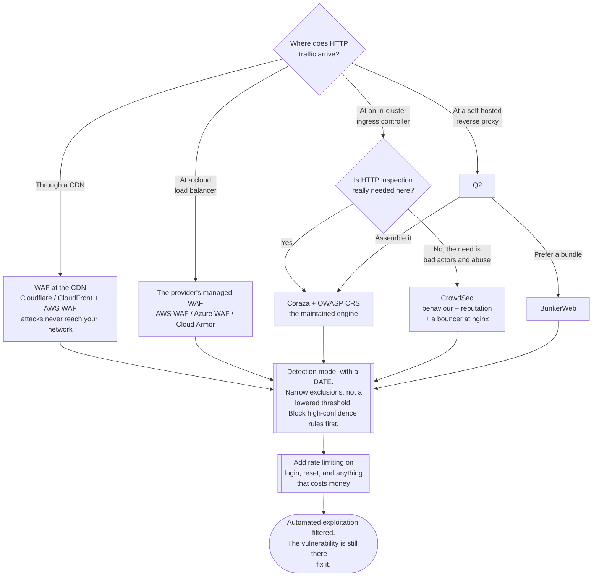

[← Cloud network](../README.md)

# WAF

Inspecting HTTP requests for attacks against the application behind them — the one control
in this folder that understands what a request means.

## Contents

1. [What a WAF is for](#1-what-a-waf-is-for)
   - [What it is not for](#what-it-is-not-for)
2. [Where it sits](#2-where-it-sits)
3. [Rules: the OWASP Core Rule Set](#3-rules-the-owasp-core-rule-set)
4. [The options](#4-the-options)
5. [Detection mode is where WAFs go to die](#5-detection-mode-is-where-wafs-go-to-die)
6. [Rate limiting and bots](#6-rate-limiting-and-bots)
7. [Decision tree](#7-decision-tree)
8. [Anti-patterns](#8-anti-patterns)
9. [Notes](#9-notes)
10. [How this applies to pikakube](#10-how-this-applies-to-pikakube)

---

## 1. What a WAF is for

A Web Application Firewall terminates or inspects HTTP and evaluates the **request itself**
— method, path, headers, query string, cookies, body — against rules describing attacks.
Everything else in [`../README.md`](../README.md) works on addresses, ports and packets. A
WAF is the only control here that can tell the difference between two requests to the same
port from the same address, one of which contains an SQL injection payload.

What it catches in practice:

| Class | Example |
|---|---|
| Injection | SQL, command, LDAP and template injection in parameters |
| Cross-site scripting | script payloads in query strings, form fields and headers |
| Path traversal | `../` sequences reaching outside the intended directory |
| Known exploit signatures | mass-scanned CVEs — the Log4Shell-shaped events where a virtual patch buys time |
| Protocol abuse | malformed requests, smuggling, oversized headers |
| Volumetric abuse | credential stuffing, scraping, brute force — via rate limiting |

The single most valuable property is **virtual patching**. When a CVE lands in a framework
you run, a WAF rule can block the exploit pattern within an hour, while the actual fix goes
through build, test and deploy. That is the argument that survives contact with people who
think a WAF is security theatre.

### What it is not for

Be precise, because overselling a WAF is how it ends up substituting for things it cannot
do:

- It does **not** fix the vulnerability. It filters known-shaped attempts to reach it.
- It is bypassable. Encoding tricks, protocol quirks and novel payloads get through; a
  determined, targeted attacker is not stopped by pattern matching.
- It does **not** understand your business logic. Authorisation flaws — a valid user reading
  another user's record through a perfectly well-formed request — are invisible to it.
- It does **not** make a public database acceptable. It is for what must be public.

A WAF is a filter that removes the internet's background radiation of automated exploitation
and buys time against new CVEs. That is genuinely worth having, and it is not a security
programme.

## 2. Where it sits

| Position | What it protects | Trade-off |
|---|---|---|
| **CDN / edge** — Cloudflare, CloudFront + AWS WAF, Front Door | everything, before it reaches your network | attack traffic never touches your infrastructure; requires TLS termination at the edge |
| **Cloud load balancer** — AWS WAF on ALB, Azure WAF on App Gateway, Cloud Armor | everything behind that load balancer | managed, scales with the LB, no instance to run |
| **Ingress controller** — ModSecurity or Coraza in ingress-nginx | everything entering the cluster | inside your control and your GitOps repo; costs CPU on the ingress pods and tuning effort |
| **Reverse proxy in front of the app** | one application | fine-grained, but one more thing per app to operate |
| **In the application** — a library or middleware | one application, with full context | the only position that knows what the request means; almost nobody does it |

Further out blocks earlier and cheaper. Further in has more context. The common shape is a
managed WAF at the edge for the internet's noise, and nothing else — which is usually the
right call.

## 3. Rules: the OWASP Core Rule Set

The **OWASP Core Rule Set (CRS)** is the open, generic rule set that most engines either use
directly or derive from. Understanding two of its concepts explains almost all WAF tuning:

- **Anomaly scoring.** Rules do not individually block. Each match adds to a score, and the
  request is blocked when the score crosses a threshold. This is what stops a single
  suspicious-looking character from rejecting a legitimate request.
- **Paranoia levels.** PL1 through PL4 trade false negatives for false positives. PL1 is the
  sane default; PL3 and PL4 will reject legitimate traffic in almost any real application
  without substantial per-endpoint exclusions.

Tuning means writing **exclusions** — this rule, on this path, on this parameter — rather
than lowering the threshold globally. The distinction matters: an exclusion is a documented,
narrow decision; a lowered threshold silently weakens everything.

<https://github.com/coreruleset/coreruleset>

## 4. The options

There are no tool subfolders here. The categories and the credible options:

| Option | What it is | Where it fits | Link |
|---|---|---|---|
| **OWASP Core Rule Set** | the rule set, not an engine — used by ModSecurity, Coraza and several managed WAFs | the rules behind everything self-hosted | <https://github.com/coreruleset/coreruleset> |
| **Coraza** | a WAF engine in Go, ModSecurity-compatible (SecLang), embeddable — this is the actively developed successor for new deployments | ingress controllers, Go proxies, Envoy | <https://github.com/corazawaf/coraza> |
| **ModSecurity** | the original engine; the nginx connector is no longer maintained by Trustwave, and ingress-nginx has deprecated its ModSecurity integration | existing deployments; check the maintenance story before starting a new one | <https://github.com/owasp-modsecurity/ModSecurity> |
| **CrowdSec** | behaviour and log-driven detection with a crowd-sourced blocklist; the **AppSec component** adds request inspection, and "bouncers" enforce at nginx, a firewall or a cloud edge | when reputation and behaviour matter as much as payload patterns | <https://github.com/crowdsecurity/crowdsec> |
| **BunkerWeb** | an nginx distribution with WAF, rate limiting, bot mitigation and TLS preconfigured | a self-hosted edge where an opinionated bundle beats assembling one | <https://github.com/bunkerity/bunkerweb> |
| **AWS WAF** | managed, on CloudFront, ALB, API Gateway and AppSync | AWS accounts — the default there | — |
| **Azure WAF** | managed, on Front Door and Application Gateway | Azure accounts | — |
| **Google Cloud Armor** | managed, on the global load balancer | GCP accounts | — |
| **Cloudflare WAF** | managed at the CDN edge | when traffic already passes through Cloudflare | — |

For a cloud account, use the provider's managed WAF. For an ingress-level WAF inside a
cluster, Coraza is the engine to look at first.

## 5. Detection mode is where WAFs go to die

Every WAF deployment starts in count/detection mode, because blocking on day one with an
untuned rule set breaks legitimate traffic. That is correct.

The failure is that it stays there. The dashboard fills with blocked-that-would-have-been
counts, the graph looks like protection, and nothing has ever been prevented. Months later
somebody discovers the WAF has been in detection mode since the day it was installed.

What makes the transition actually happen:

1. Run in detection for a **fixed, written-down period** — two to four weeks covers the
   monthly jobs and the weekend traffic shape.
2. Review every rule that fired on legitimate traffic and write **narrow exclusions**:
   specific rule, specific path, specific parameter.
3. Enable blocking on the **highest-confidence rules first**, not on everything at once.
4. Alert on blocks so a false positive surfaces as an alert rather than as a support ticket
   three days later.
5. Widen deliberately, with the same review each time.

Put a date on step 3 at the start. Without one, there is no moment at which anybody decides.

## 6. Rate limiting and bots

Often the highest-value part of a WAF deployment, and frequently overlooked next to the
injection rules.

Signature rules catch malformed requests. They do nothing about a hundred thousand perfectly
valid login attempts using credentials from a breach dump, which is a far more common way
accounts are actually taken over. Rate limiting per IP, per session and per endpoint —
tighter on `/login`, `/reset-password` and anything that sends email or costs money — plus
basic bot detection is often more useful than the entire CRS for a typical application.

## 7. Decision tree

## 8. Anti-patterns

| Anti-pattern | Why it is bad | What to do instead |
|---|---|---|
| Leaving the WAF in detection mode | it observes attacks and allows them; the dashboard implies a control that does not exist | fix a review period, then enable blocking on high-confidence rules |
| Enabling PL3/PL4 or full blocking on day one | legitimate traffic breaks, and the WAF is disabled entirely by the end of the week | PL1, detection first, exclusions, then block |
| Lowering the anomaly threshold to stop false positives | weakens every rule everywhere to fix one endpoint | a narrow exclusion: this rule, this path, this parameter |
| Treating the WAF as the fix for a CVE | it filters known exploit shapes; the vulnerability is still there and is still reachable by a variant | virtual patch to buy time, then actually patch |
| Exposing a database or admin panel and "protecting" it with a WAF | a WAF filters attack patterns in HTTP; it does not make an exposed service acceptable | make it private — see [`../README.md`](../README.md) section 5 |
| No rate limiting | credential stuffing and scraping are perfectly valid HTTP, so no signature rule touches them | per-IP, per-session and per-endpoint limits, tighter on authentication paths |
| Blocks that nobody is alerted on | false positives reach you as support tickets days later, if at all | alert on blocks and review them |
| Running a WAF while ignoring the application | it is a filter, not a substitute for input validation, parameterised queries and authorisation checks | fix the application; keep the WAF for the background noise |
| A new deployment on the nginx ModSecurity connector | maintenance has lapsed and ingress-nginx deprecated the integration | Coraza |

## 9. Notes

The original note in this folder recorded a single link:

- <https://github.com/crowdsecurity/crowdsec>

CrowdSec is recorded **twice** in this tree — here and in [`../ips/README.md`](../ips/README.md)
— and that is not a filing error. It is worth explaining, because it says something about
what the tool is.

CrowdSec's core is not a WAF. It is a **behaviour-based detection engine**: it parses logs
(nginx, SSH, application logs), applies *scenarios* that describe malicious behaviour over
time, and produces decisions about offending addresses. Enforcement is separate, done by
components called **bouncers** that sit in nginx, a firewall, a CDN or a cloud edge and act
on those decisions. That architecture is much closer to an IDS/IPS with a reputation layer
than to a request-inspecting WAF — which is why the same link appears under `ips/`.

Two things move it into this folder as well:

- **The AppSec component** does inline HTTP request inspection and can consume ModSecurity
  and CRS-style rules, which is a WAF function in the strict sense.
- **The crowd-sourced blocklist** is its actual differentiator. Signals from the whole user
  base produce a shared list of addresses already attacking other people. That blocks a
  scanner before it sends its first payload to you — something no rule set can do, because a
  rule set only ever sees the request it is looking at.

The honest comparison: against a targeted attack on your specific application, a tuned WAF
with the CRS does more. Against the constant automated background of scanners and botnets —
which is most of what actually hits an exposed service — reputation-based blocking does more,
and costs far less tuning.

## 10. How this applies to pikakube

This is the **one category in [`../README.md`](../README.md) with a direct in-cluster
path**, because pikakube does have an HTTP edge: **ingress-nginx**, with MetalLB in front of
it (`clusters/dev/kustomization/nginx.yaml`, `clusters/dev/kustomization/metallb.yaml`),
serving `*.127.0.0.1.nip.io` hostnames.

Nothing reaches that edge from the internet — the addresses resolve to `127.0.0.1` — so
there is no attack traffic to filter and no security need here today. What the setup does
offer is the right place to **learn the mechanics**: deploy Coraza with the OWASP CRS at the
ingress controller, send deliberately malicious requests at it, and watch the anomaly score
accumulate and the exclusions become necessary. The tuning workflow in section 5 is the part
that is hard to learn in production and easy to learn locally, and it transfers unchanged to
a managed WAF later.

CrowdSec is the less useful of the two options in a local cluster: with no real traffic there
is no behaviour to detect, and the crowd-sourced blocklist has nothing to protect against.
It belongs to the on-premises side of the lab, alongside the tools in
[`../ips/README.md`](../ips/README.md).

---

[← Cloud network](../README.md)
