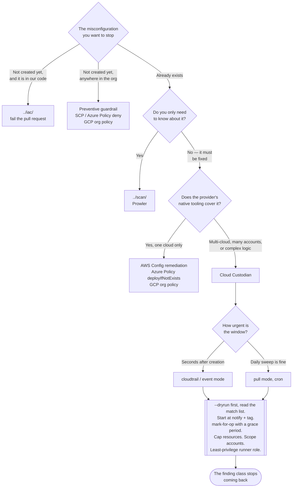

[← Cloud](../README.md)

# Cloud policies

Policy-as-code for cloud resources, with the ability to **act** on what it finds — not only
report it.

Tools covered: [`cloudcustodian`](cloudcustodian/README.md)

## Contents

1. [Detection is not remediation](#1-detection-is-not-remediation)
2. [Three ways to stop a misconfiguration](#2-three-ways-to-stop-a-misconfiguration)
3. [What policy-as-code means for cloud resources](#3-what-policy-as-code-means-for-cloud-resources)
   - [The non-security half: tags and cost](#the-non-security-half-tags-and-cost)
4. [The tool](#4-the-tool)
5. [Automated remediation is dangerous, and worth doing anyway](#5-automated-remediation-is-dangerous-and-worth-doing-anyway)
   - [The guardrails that make it safe](#the-guardrails-that-make-it-safe)
6. [Provider-native equivalents](#6-provider-native-equivalents)
7. [Where this overlaps with cluster policy engines](#7-where-this-overlaps-with-cluster-policy-engines)
8. [Decision tree](#8-decision-tree)
9. [Anti-patterns](#9-anti-patterns)
10. [How this applies to pikakube](#10-how-this-applies-to-pikakube)

---

## 1. Detection is not remediation

[`../scan/README.md`](../scan/README.md) tells you an EBS volume is unencrypted. It tells
you again next week. It will keep telling you, accurately, for as long as the volume exists,
and the finding will still be open a year from now — because reporting and fixing are
different jobs and only one of them was automated.

This folder is the other job.

| | [`../scan/`](../scan/README.md) | `policies/` (here) |
|---|---|---|
| Produces | a list of findings | a change to the account |
| On being wrong | a false positive, and a wasted afternoon | an action taken against real infrastructure |
| Credentials | read-only | **write** — that is the whole point, and the whole risk |
| Closes the loop? | no | yes |
| Runs | on a schedule | on a schedule **or** on a provider event, seconds after the resource is created |

The event-driven mode is what changes the character of the control. A bucket created with
public access can be corrected within seconds of the API call that created it — before
anything is written to it and before anyone finds it. That is a **guardrail**, not a report.

## 2. Three ways to stop a misconfiguration

Remediation is the third-best of three options, and it is worth being clear about the
ordering before reaching for it.

| Approach | Mechanism | When it fires | Residual risk |
|---|---|---|---|
| **Prevent in review** | [`../iac/README.md`](../iac/README.md) | before apply | anything created outside the repository |
| **Prevent at the API** | an AWS SCP, an Azure Policy `deny`, a GCP org policy | the create call fails | requires org-level control, and coarse rules break legitimate work |
| **Remediate after the fact** | this folder | seconds to hours after creation | **an exposure window that is never zero** |

Preventive controls are strictly better where they are available: nothing was ever
misconfigured, so there is no window. Remediation exists because prevention is never
complete — you do not control every principal, every pipeline, every vendor integration, or
every account created before the policy existed.

Use all three. Do not use remediation as a substitute for the first two, because a
remediation policy is an admission that the thing already happened.

## 3. What policy-as-code means for cloud resources

A policy is a declarative rule with three parts: **a resource type, filters that select
which instances of it match, and actions to take on the matches.** It lives in git, it is
reviewed in a pull request, and it runs on a schedule or on an event.

The action vocabulary is what distinguishes this from scanning:

| Action class | Examples | Risk |
|---|---|---|
| **Observe** | write a report, emit a metric | none |
| **Notify** | email, Slack, a queue, a ticket | none |
| **Tag** | mark the resource, record an owner, schedule a future action | very low, and reversible |
| **Configure** | enable encryption, turn on logging, remove a public ACL, restrict a security group rule | moderate — it changes behaviour |
| **Disrupt** | stop, snapshot-and-delete, terminate, detach | **high, and frequently irreversible** |

Nearly every successful deployment starts at the top of that table and moves down slowly,
one action class at a time.

### The non-security half: tags and cost

Worth naming because it is where most organisations actually get value first: policy-as-code
for cloud resources is used at least as much for **tag hygiene and cost cleanup** as for
security. Untagged resources, idle instances, unattached volumes, orphaned snapshots, old
AMIs, forgotten load balancers.

That is not a digression — it is the on-ramp. The tag-enforcement policy is how a team
learns the tool's filter semantics, its dry-run behaviour and its blast radius on resources
where being wrong costs a Slack message rather than an outage. By the time a policy touches
encryption or public access, the mechanics are familiar.

## 4. The tool

| Tool | What it is | Where it shines | Detail |
|---|---|---|---|
| **Cloud Custodian** | YAML policy engine for cloud resources, with filters and actions; runs by cron, by provider event, or as a serverless function | recurring findings that nobody fixes; tag and cost governance; correcting a misconfiguration at creation time across many accounts | [→](cloudcustodian/README.md) |

It is a CNCF project, AWS-first with Azure and GCP support at lesser depth, and it ships
companion tooling that matters at scale: `c7n-org` to run a policy suite across an entire
organisation, and `c7n-mailer` to deliver notifications.

## 5. Automated remediation is dangerous, and worth doing anyway

Both halves of this are true at once, and softening either one produces bad advice.

**Why it is worth doing.** Findings lists grow without bound. Manual remediation does not
scale past the first hundred, and the same class of misconfiguration reappears every time
someone new gets access. A policy that fixes the class — rather than the instance — is the
only mechanism that ever makes the number go down and keeps it down. And in event mode, the
exposure window shrinks from "until the next scan plus however long the ticket sits" to
seconds.

**Why it is the most dangerous thing in this folder.** The tool has write credentials and no
judgement. A filter that matches more than intended executes against every match, at API
speed, in every account it is pointed at, and finishes before anyone notices. The canonical
incident is not exotic: *delete unattached volumes* runs during a maintenance window in
which volumes are legitimately detached. The policy did exactly what it said. The data is
gone.

The asymmetry is the point. The upside of a correct policy accrues quietly over months; the
downside of an incorrect one arrives all at once and is often irreversible.

### The guardrails that make it safe

These are not optional extras. They are the practice.

| Guardrail | What it prevents |
|---|---|
| **`--dryrun` first, always** — and read the matched resource **list**, not the count | the filter matching more than you think |
| **Start with `notify` and `tag`** | learning the filter semantics on actions that cannot hurt |
| **`mark-for-op` with a grace period** | the resource is tagged and visible for days before anything happens to it; owners get a chance to object |
| **Resource limits** — cap a policy at a maximum count or percentage of matches | turns a catastrophic run into a failed run |
| **Explicit account and region scope** | a sandbox policy executed with production credentials |
| **Least-privilege role for the runner** | a policy suite that only tags and notifies has no business holding `ec2:TerminateInstances`; the IAM role is the last backstop when a filter is wrong |
| **Git, review, and a named owner** | these are programs with delete permissions, reviewed like configuration |
| **Log every action taken** | "what changed this resource" must have an answer, and the answer must not be "something" |

The `mark-for-op` pattern deserves the emphasis it gets in the tool's own documentation: it
converts an immediate irreversible action into a scheduled, visible, cancellable one. It is
the single design choice that makes automated remediation acceptable to the people who own
the resources.

## 6. Provider-native equivalents

Custodian is not the only way to do this, and sometimes it is not the right one:

| Provider | Detection | Remediation | Prevention |
|---|---|---|---|
| **AWS** | Config rules, Security Hub | Config remediation via SSM Automation, EventBridge + Lambda | **Service Control Policies** — the create call itself fails |
| **Azure** | Azure Policy `audit` | Azure Policy `deployIfNotExists` / `modify` | Azure Policy `deny` |
| **GCP** | Security Command Center | Cloud Functions on asset feeds | **Organization Policy constraints** |

Where the native option covers the case, prefer it: it is inside the provider's own control
plane, it is evaluated on the provider's schedule, and it needs no runner to operate. Azure
Policy in particular is strong enough that Custodian's Azure support is rarely the better
choice.

Custodian earns its place when policies must be **the same across providers or across a
large number of accounts**, when the logic is more complex than a native rule expresses, or
when the desired action is disruptive in a way the native tooling does not offer.

## 7. Where this overlaps with cluster policy engines

Kyverno and Gatekeeper (`security/2-cluster/policies/`) are the same idea one layer up:
declarative policy, evaluated against objects, capable of mutating or rejecting them. The
boundary is clean and worth stating so nobody tries to make one tool do both jobs:

| | Cloud policies (here) | Cluster policies |
|---|---|---|
| Objects | buckets, volumes, instances, roles, security groups | Pods, Deployments, Namespaces, RBAC |
| Enforcement point | provider API, after or on creation | the Kubernetes API server, at admission |
| Can it block? | only via provider-native preventive controls | yes — that is its default mode |
| Engine | Cloud Custodian, AWS Config, Azure Policy | Kyverno, Gatekeeper |

Custodian does have a Kubernetes provider. Ignore it — that is not where the ecosystem, the
documentation or the community is.

## 8. Decision tree

## 9. Anti-patterns

| Anti-pattern | Why it is bad | What to do instead |
|---|---|---|
| A destructive action on the first run of a new policy | the filter has never been validated against real resources, and `terminate` does not have an undo | `--dryrun`, read the matched list, then `notify`, then `tag`, then act |
| Skipping `mark-for-op` and acting immediately | resource owners get no warning and no chance to object, so the first incident ends the programme | tag, wait days, then act — visibly |
| No resource cap on the policy | a wrong filter executes against every match in the account before anyone can react | set a maximum count or percentage; a failed run is recoverable, a completed one is not |
| Running policies with an admin role | when a filter is wrong, the role decides how bad it gets | grant only the actions the policy suite actually performs |
| Policies edited in place, outside git | nobody can answer "who changed this and why", and there is no review | git, pull requests, a named owner |
| Sandbox policies run with production credentials | the classic way a safe policy becomes an outage | pin account and region explicitly in the invocation |
| Using remediation where prevention is available | every remediation leaves an exposure window; a `deny` leaves none | an SCP, an Azure Policy `deny`, or a GCP org policy constraint |
| Remediation without scanning | you fix the classes you thought of and never learn about the rest | [`../scan/README.md`](../scan/README.md) finds them; policies close them |
| Remediation without IaC scanning | the code recreates the misconfiguration on the next apply, and the policy fixes it again, forever | fix the source in [`../iac/README.md`](../iac/README.md) — otherwise the two fight |
| A policy repository nobody owns | automation with write credentials and no maintainer is worse than no automation | a named owner, or turn it off |
| Silent remediation with no notification | resources change and nobody knows why; trust in the platform erodes fast | always notify on action, even when the action is correct |

## 10. How this applies to pikakube

**There is no cloud account here, so nothing in this folder runs today.** pikakube is a Kind
cluster on a laptop; Cloud Custodian has no buckets, volumes or IAM roles to act on, and
`cloud-computing/aws/localstack/` is an emulator whose value is application development, not
governance.

What does transfer is the shape of the argument, and it is already instantiated one layer
up. **Kyverno** is deployed in this repository (`clusters/dev/kustomization/kyverno.yaml`),
and it is the same idea applied to Kubernetes objects: declarative rules in git, evaluated
automatically, capable of *audit*, *mutate* and *enforce*. The progression Kyverno users are
told to follow — run in `Audit` mode first, look at the policy reports, only then switch to
`Enforce` — is exactly the `--dryrun` → `notify` → `tag` → act progression argued for above.
The lesson is identical and the failure mode is identical: policy that enforces before it
has been observed breaks something legitimate and gets switched off.

| Layer | Engine | Status here |
|---|---|---|
| Cloud resources | Cloud Custodian | documented; nothing to act on |
| Kubernetes objects | Kyverno | deployed |

When a real account appears, the ordering to follow is the one in section 2: preventive
guardrails first, IaC scanning in the pull request, posture scanning for what slips through,
and Custodian only for the classes that keep coming back.

---

[← Cloud](../README.md)
