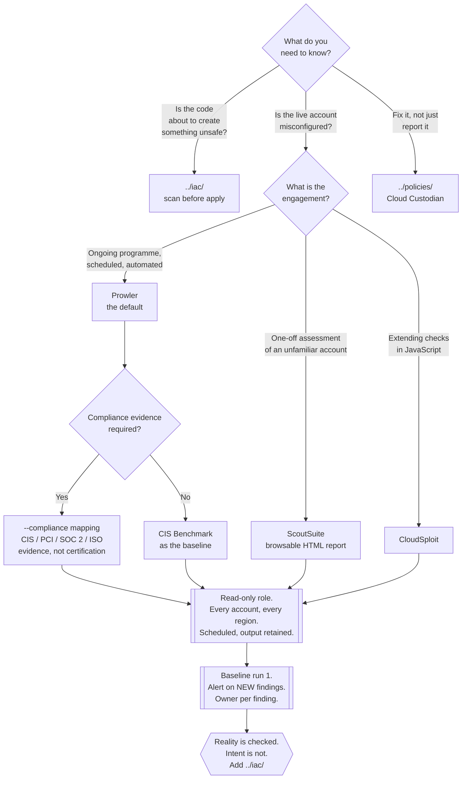

[← Cloud](../README.md)

# Cloud posture scanning

Assessing the **deployed** cloud account against benchmarks and compliance frameworks —
what is actually running, not what the code says.

Tools covered: [`prowler`](prowler/README.md) · [`scoutsuite`](scoutsuite/README.md) ·
[`cloudsploit`](cloudsploit/README.md)

## Contents

1. [Intent versus reality](#1-intent-versus-reality)
   - [Where drift comes from](#where-drift-comes-from)
2. [What a benchmark actually is](#2-what-a-benchmark-actually-is)
   - [Compliance frameworks, honestly](#compliance-frameworks-honestly)
3. [The tools](#3-the-tools)
   - [Choosing one](#choosing-one)
4. [Running it: credentials and cadence](#4-running-it-credentials-and-cadence)
5. [Findings management, or why most of these end up ignored](#5-findings-management-or-why-most-of-these-end-up-ignored)
6. [Where this stops and other capabilities start](#6-where-this-stops-and-other-capabilities-start)
7. [Decision tree](#7-decision-tree)
8. [Anti-patterns](#8-anti-patterns)
9. [How this applies to pikakube](#9-how-this-applies-to-pikakube)

---

## 1. Intent versus reality

[`../iac/README.md`](../iac/README.md) reads code and tells you what you **meant** to
create. The tools here call the cloud provider's APIs and tell you what **exists**. The two
answers are not the same, and the difference has a name.

| | [`../iac/`](../iac/README.md) | `scan/` (here) |
|---|---|---|
| Input | files in a repository | live provider APIs |
| Answers | "is this definition safe?" | "is this account safe?" |
| Credentials | none | read-only, in every account |
| Runs | on every pull request | on a schedule, per account, per region |
| Catches | a mistake before it exists | a mistake that already exists — including one nobody wrote down |
| Misses | anything created outside the repository | nothing that exists; everything that has not been created yet |

> **The gap between intent and reality is drift, and drift is where the incidents live.**

A repository can be perfectly clean while the account is not, because a scanner of code can
only see resources someone put in code.

### Where drift comes from

None of these is unusual. Together they are the normal condition of a cloud account:

| Cause | Why the IaC scan never sees it |
|---|---|
| A console change during an incident | the fix went in by hand at 03:00 and was never back-ported |
| Resources created before IaC existed | they were never in the repository to begin with |
| A partially failed `apply` | state and reality diverged and nobody reconciled them |
| Another team, another pipeline | your repository is not the only writer to the account |
| A vendor or SaaS integration | it created a role and a trust policy you did not review |
| A provider default that changed | the resource predates the change |
| Someone with `AdministratorAccess` and a deadline | the most common one, and the least documented |

## 2. What a benchmark actually is

A **CIS Benchmark** is a consensus configuration baseline published by the Center for
Internet Security, one per platform — CIS AWS Foundations Benchmark, CIS Azure, CIS GCP,
CIS Kubernetes. It is a numbered list of concrete, checkable settings: root account has no
access keys, MFA is enabled on privileged users, CloudTrail is on in every region, S3 Block
Public Access is enabled at the account level, no security group permits ingress from
`0.0.0.0/0` on port 22.

Two properties make it the right starting point:

- **It is specific.** Every item is a yes/no about a setting, which is what makes automated
  checking possible at all.
- **It is not yours.** Arguing with a published baseline is a much better conversation than
  arguing about someone's opinion, and it is a defensible answer to "why does this matter".

Its limits are equally real. A benchmark encodes the general case, so a meaningful fraction
of findings will be legitimately non-applicable to a given account — and it says nothing at
all about the thing most likely to hurt you, which is your own application's blast radius.

### Compliance frameworks, honestly

The scanners map their checks onto PCI DSS, HIPAA, SOC 2, ISO 27001, NIST 800-53, GDPR,
FedRAMP and others. That mapping is a **reporting convenience**: it groups the same
technical checks under the control identifiers an auditor recognises.

Be precise about what it is not:

- It is **not certification**. No tool certifies anything; auditors do.
- It is **not complete coverage** of the framework. Most controls in any of these standards
  are organisational — training, access reviews, vendor management, incident process — and
  no scanner can evaluate them.
- It **is** genuinely useful for evidence gathering and for finding the technical controls
  you are failing before someone else does.

## 3. The tools

| Tool | Language | Providers | Output | Detail |
|---|---|---|---|---|
| **Prowler** | Python | AWS, Azure, GCP, **Kubernetes**, M365 | CSV, JSON, OCSF, HTML | [→](prowler/README.md) |
| **ScoutSuite** | Python | AWS, Azure, GCP, Alibaba, Oracle | a browsable static HTML report | [→](scoutsuite/README.md) |
| **CloudSploit** | Node.js | AWS, Azure, GCP, Oracle | console, JSON, JUnit | [→](cloudsploit/README.md) |

### Choosing one

- **Prowler is the default.** It is the most actively developed of the three, has the
  broadest compliance mappings, and is the only one that also assesses a **Kubernetes**
  cluster with the same binary. If a continuous posture programme is the goal, this is the
  one to build it on.
- **ScoutSuite is for the artifact.** Its self-contained HTML report is the better
  deliverable for a one-off assessment of an account you have just inherited, or for handing
  to someone who will not run a CLI. Its check set has not moved in a long time — see its
  page — so it is a starting picture, not a programme.
- **CloudSploit is Aqua's**, and it is the easiest of the three to extend if the team writes
  JavaScript. Its companion remediation-guide repository is useful independently of the
  scanner. Activity is low; check before adopting.

## 4. Running it: credentials and cadence

| Decision | The answer, and why |
|---|---|
| **Permissions** | strictly read-only — `ReadOnlyAccess` + `SecurityAudit` on AWS, `Reader` + `Security Reader` on Azure. A scanner never needs write. Granting it any creates precisely the over-privileged role that [`../iam/README.md`](../iam/README.md) exists to argue against |
| **Where it runs** | a job in a dedicated security or audit account, assuming a read-only role into each member account. Not from a laptop, and not with a human's admin credentials |
| **Scope** | **every** account and **every** region. Findings concentrate in the regions nobody uses, because nobody is watching them |
| **Cadence** | daily or weekly on a schedule. A scan run once for an audit is an audit artifact, not a control |
| **Duration** | a full organisation scan takes real time and makes a large number of API calls; rate limiting is the usual first surprise |
| **Storage** | keep the raw output. The trend over time is more useful than any single run |

## 5. Findings management, or why most of these end up ignored

The first scan of a real account returns hundreds to thousands of findings. What happens
next decides whether the tool becomes a control or a PDF.

The failure mode is uniform: everything is reported, nothing is owned, the volume makes
triage impossible, and within two months the scheduled job is still running and nobody
opens the output.

What works:

| Move | Why |
|---|---|
| **Snapshot a baseline on the first run** | after that, alert only on **new** findings — the delta is small enough to act on |
| **Scope the first pass hard** | one severity, or one service family (IAM and public exposure first). Fix that, then widen |
| **Give every finding an owner** | a finding with no owner is a statistic |
| **Track the trend, not the total** | "new findings per week" and "time to close" are the numbers that indicate whether anything is improving |
| **Suppress deliberately, with a reason and a date** | accepted risk is legitimate; undocumented accepted risk is indistinguishable from neglect |
| **Route by severity** | critical to a channel someone answers; the rest to a dashboard |

Prioritise on exposure rather than on the tool's severity label. Public reachability, then
identity and privilege escalation paths, then encryption and logging. A public bucket and a
missing tag both arrive as "findings", and only one of them is why anyone is reading the
report.

## 6. Where this stops and other capabilities start

| Question | Not here |
|---|---|
| "Stop this from being created" | [`../iac/README.md`](../iac/README.md) at review time; a preventive guardrail — an SCP, an Azure Policy `deny`, a GCP org policy — at apply time |
| "Fix it automatically" | [`../policies/README.md`](../policies/README.md) — scanners report, Cloud Custodian acts |
| "Who has access to what" | [`../iam/README.md`](../iam/README.md) — posture scanners flag obvious IAM findings but do not analyse access paths |
| "What is happening right now" | detection and response — GuardDuty, Defender for Cloud, a SIEM. These tools are point-in-time snapshots however often you run them |
| "Is the cluster configured well" | `security/2-cluster/posture/` — although Prowler's Kubernetes provider overlaps here |

## 7. Decision tree

## 8. Anti-patterns

| Anti-pattern | Why it is bad | What to do instead |
|---|---|---|
| Scanning the deployed account but never the code | every misconfiguration is caught after it exists, at the most expensive point on the curve | pair it with [`../iac/README.md`](../iac/README.md) |
| Running the scan once, for an audit | the account changes daily; a snapshot from March proves nothing in June | schedule it, retain the output, watch the trend |
| Giving the scanner write permissions | it never needs them, and the role becomes a high-value target that also has read access to everything | `ReadOnlyAccess` + `SecurityAudit`, nothing more |
| Running it with a human's admin credentials from a laptop | unauditable, unrepeatable, and it stops the day that person is on holiday | a dedicated role assumed by a scheduled job |
| No baseline, so every run reports everything | a thousand findings every week; the alert gets muted with the ones that mattered | baseline run one, alert on the delta |
| Scanning only production, only the main region | the forgotten sandbox in an unused region is where the open security group is | every account, every region |
| Treating a framework mapping as certification | it maps technical checks to control IDs; most controls in any framework are organisational | use it as evidence, not as a claim |
| Findings with no owner | nobody is accountable, so nothing closes | assign on arrival, track time to close |
| Prioritising by the tool's severity label alone | a missing tag and a public database can both arrive as "high" | rank by exposure: public reach, then privilege, then everything else |
| Sending every finding to Slack | the channel is muted within a fortnight | critical to a channel, the rest to a dashboard |
| Assuming a clean report means a secure account | the tool checks the settings it knows about, on the services it supports | it is a floor, not a ceiling |

## 9. How this applies to pikakube

**There is no cloud account in this repository, so the cloud half of this capability is
documentation rather than practice.** That is worth stating plainly instead of pretending
otherwise: pikakube runs on Kind, locally, and `cloud-computing/aws/localstack/` is an
emulator. Pointing a posture scanner at LocalStack produces partial results at best — its
API coverage is aimed at application development, not at the account-level security settings
these tools read, so the exercise teaches the CLI and nothing about the findings.

One thing here **is** directly usable: **`prowler kubernetes`**. Prowler's Kubernetes
provider assesses a cluster against the CIS Kubernetes Benchmark from the current
kubecontext, which works exactly as well against a Kind cluster as against a managed one.
That covers control-plane flags, kubelet configuration, RBAC and workload settings, and it
overlaps deliberately with `security/2-cluster/posture/`.

The realistic reading for this repository:

| Capability | Status here |
|---|---|
| IaC scanning of manifests | applicable today — see [`../iac/README.md`](../iac/README.md) |
| Cluster benchmark assessment | applicable today — `prowler kubernetes` |
| Cloud account posture scanning | documented for when there is an account; nothing to scan now |
| Compliance framework mapping | not applicable to a local lab |

The value of writing it down anyway is that the reasoning transfers unchanged the moment a
real account exists, and the pairing rule — intent **and** reality, or neither is
trustworthy — is the part people skip.

---

[← Cloud](../README.md)
