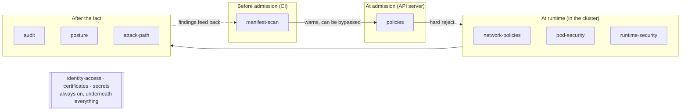
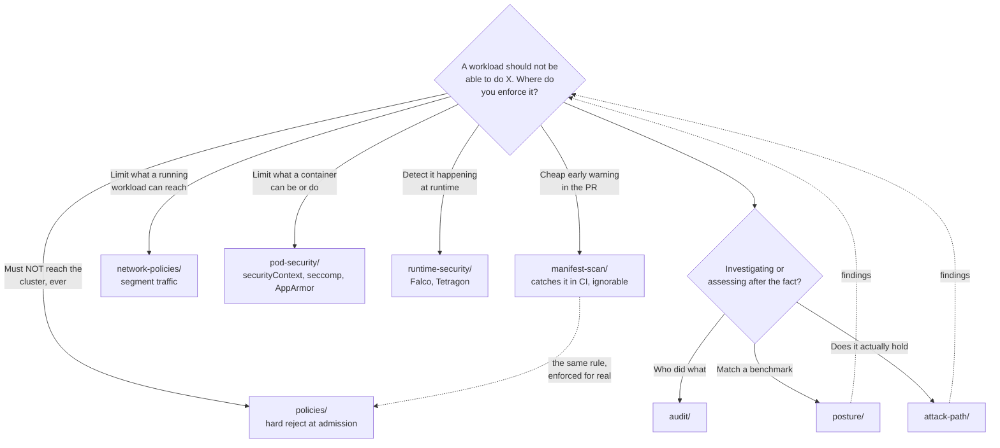

[← Security](../README.md)

# Cluster security — securing Kubernetes itself

The Kubernetes layer: the controls that decide what may enter the cluster, what a workload
may do once running, and how you find out what happened afterwards. Organised by **when each
control acts** — the only framing that makes the eleven capabilities cohere.

Capabilities: [`manifest-scan`](manifest-scan/README.md) · [`policies`](policies/README.md) · [`identity-access`](identity-access/README.md) · [`certificates`](certificates/README.md) · [`secrets`](secrets/README.md) · [`network-policies`](network-policies/README.md) · [`pod-security`](pod-security/README.md) · [`runtime-security`](runtime-security/README.md) · [`audit`](audit/README.md) · [`posture`](posture/README.md) · [`attack-path`](attack-path/README.md)

## Contents

1. [The organising idea: when a control acts](#1-the-organising-idea-when-a-control-acts)
2. [Before admission — catch it in CI](#2-before-admission--catch-it-in-ci)
3. [At admission — the gate](#3-at-admission--the-gate)
4. [At runtime — while the workload runs](#4-at-runtime--while-the-workload-runs)
5. [After the fact — record, assess, attack](#5-after-the-fact--record-assess-attack)
6. [The always-on capabilities: identity, certificates, secrets](#6-the-always-on-capabilities-identity-certificates-secrets)
7. [The full map](#7-the-full-map)
8. [Decision tree](#8-decision-tree)
9. [Anti-patterns](#9-anti-patterns)
10. [How this applies to pikakube](#10-how-this-applies-to-pikakube)

---

## 1. The organising idea: when a control acts

There are eleven capabilities here, and listing them by name explains nothing. The useful
frame is **time** — where in the life of a request or a workload each control sits. A single
misconfiguration (say, a container asking to run privileged) is caught at different points by
different tools, and knowing which tool acts *when* is how you decide what to rely on:

The order is also a hierarchy of trust. A control that acts **earlier** is cheaper and
friendlier but **bypassable**; a control that acts **later** is harder to avoid but more
expensive. That is why the same rule often appears twice — as a cheap CI warning and again as
an unbypassable admission gate.

## 2. Before admission — catch it in CI

**[`manifest-scan/`](manifest-scan/README.md)** — kubesec, kube-linter and checkov read
manifests and IaC in the pipeline and flag problems before merge. Feedback in seconds, in the
PR. The catch, stated in full in that folder: it acts on *files*, so anything reaching the
cluster outside CI never sees it, and every finding is a warning a human can ignore. It is a
filter, not a boundary.

## 3. At admission — the gate

**[`policies/`](policies/README.md)** — Kyverno, Gatekeeper, Kubewarden. This is the one
control every write must pass: the admission controllers built into the API server reject
(or mutate) requests at the moment of `apply`, and **nothing bypasses them**. This is where
the rules that genuinely must hold live — the same rules manifest-scan checked cheaply,
re-expressed as hard gates. Pod Security Admission (a built-in, three-standard subset,
documented under [`pod-security/`](pod-security/README.md#2-pod-security-standards-and-pod-security-admission))
is the fixed-function floor; the policy engines are the general tool above it.

## 4. At runtime — while the workload runs

Three capabilities confine and watch a workload that is already running:

- **[`network-policies/`](network-policies/README.md)** — segments pod-to-pod traffic;
  default-deny plus allow-listing. The load-bearing caveat: `NetworkPolicy` is an API, and
  the CNI must enforce it — some (Flannel) do not.
- **[`pod-security/`](pod-security/README.md)** — confines the container itself:
  `securityContext` (identity, capabilities), seccomp (syscalls), AppArmor/SELinux (file
  access), and the security-profiles-operator that records those profiles instead of making
  you write them.
- **[`runtime-security/`](runtime-security/README.md)** — Falco, Tetragon and friends watch
  syscalls and behaviour live and alert (or block) on anomalies. This is the only layer that
  sees what a workload *actually does*, as opposed to what it was *allowed* to do.

The distinction between the last two is worth holding: pod-security sets the *rules* of
confinement before the fact; runtime-security *observes the behaviour* against them as it
happens.

## 5. After the fact — record, assess, attack

Three capabilities operate on a cluster that already exists:

- **[`audit/`](audit/README.md)** — the API server's audit log: the only record of who did
  what to the API. An audit policy decides verbosity across four levels; get it wrong and you
  either fill the disk or log Secret contents in plaintext.
- **[`posture/`](posture/README.md)** — kube-bench, kubescape, kubeeye: benchmark the cluster
  against CIS and best-practice baselines. "Does this match the standard?"
- **[`attack-path/`](attack-path/README.md)** — kubehound, kube-hunter, kubesploit: the
  adversarial check. "Do the defences above actually hold when someone attacks them?" This
  folder validates all the others.

## 6. The always-on capabilities: identity, certificates, secrets

Three capabilities do not sit at a single point in time — they run *underneath* everything
above, at every stage:

- **[`identity-access/`](identity-access/README.md)** — authentication and authorisation
  (who you are, what you may do). RBAC is the substrate every other control assumes.
- **[`certificates/`](certificates/README.md)** — PKI and TLS trust across the cluster.
- **[`secrets/`](secrets/README.md)** — how sensitive values are stored, encrypted and
  delivered to workloads.

> **[`certificates/`](certificates/README.md) is the reference example of depth in this
> repository.** When in doubt about how thorough a capability README should be — how it
> classifies tools by where they shine, states trade-offs plainly, and works through a real
> decision — read it first. It is the standard the rest of this folder is written against.

## 7. The full map

| When | Capability | The question it answers | Bypassable? |
|---|---|---|---|
| Before admission | [`manifest-scan/`](manifest-scan/README.md) | is this manifest obviously wrong, cheaply, in CI? | yes — CI only |
| At admission | [`policies/`](policies/README.md) | should this request be allowed into the cluster at all? | **no — every write passes through** |
| At runtime | [`network-policies/`](network-policies/README.md) | may these pods talk to each other? | enforced by the CNI |
| At runtime | [`pod-security/`](pod-security/README.md) | what is this container allowed to be and do? | enforced at admission + kernel |
| At runtime | [`runtime-security/`](runtime-security/README.md) | what is this workload *actually* doing right now? | observed live |
| After the fact | [`audit/`](audit/README.md) | who did what to the API? | the record itself |
| After the fact | [`posture/`](posture/README.md) | does the cluster match the benchmark? | assessment |
| After the fact | [`attack-path/`](attack-path/README.md) | do the defences hold against a real attack? | validation |
| Always on | [`identity-access/`](identity-access/README.md) | who are you and what may you do? | the substrate |
| Always on | [`certificates/`](certificates/README.md) | can this connection be trusted? | the substrate |
| Always on | [`secrets/`](secrets/README.md) | how are sensitive values stored and delivered? | the substrate |

## 8. Decision tree

## 9. Anti-patterns

| Anti-pattern | Why it is bad | What to do instead |
|---|---|---|
| Relying on manifest-scan as the enforcement point | it runs in CI and is bypassed by anything applied outside the pipeline | enforce non-negotiable rules at admission in `policies/` |
| Writing NetworkPolicies without checking the CNI enforces them | on Flannel they do nothing and give a false sense of segmentation | verify enforcement; use Cilium or Calico if segmentation is required |
| Treating pod-security and runtime-security as interchangeable | one sets the rules before the fact, the other observes behaviour live — you need both | confine with `pod-security/`, watch with `runtime-security/` |
| Auditing everything at `RequestResponse` | fills the disk and logs Secret contents in plaintext | `Metadata` by default; raise only high-value resources |
| Running attack-path tooling with no authorisation | active scanning and exploitation against infrastructure you do not own is a serious offence | only on clusters you own or are explicitly scoped to test |
| Securing workloads but leaving RBAC wide | the always-on substrate is the thing an attacker actually escalates through | treat `identity-access/` as the foundation, not an afterthought |
| Assuming a green posture scan means you are safe | it checks conformance, not reachability — a compliant cluster can still have a clear path to admin | validate with `attack-path/` |

## 10. How this applies to pikakube

pikakube is a single local Kind cluster, so most of these capabilities are catalogued for
comparison rather than all deployed at once — but several are wired in for real, and they map
onto the timeline above:

- **at admission / runtime** — [`pod-security/`](pod-security/README.md) ships the
  Kubernetes tutorial's worked examples (securityContext, seccomp profiles, AppArmor) and
  installs the security-profiles-operator via Flux; the examples teach the fields that Pod
  Security Admission and `policies/` then enforce.
- **after the fact** — [`audit/`](audit/README.md) has a real, minimal `audit-policy.yaml`
  (`level: Metadata` for everything) mounted into the control-plane node by the Kind config
  at [`clusters/kind-configs/core.yaml`](../../../clusters/kind-configs/core.yaml); and
  [`attack-path/`](attack-path/README.md) ships a kube-hunter `Job` that shows, concretely,
  what a compromised pod sees on a default cluster.
- **before admission** — [`manifest-scan/`](manifest-scan/README.md) additionally carries a
  checkov in-cluster `Job` with least-privilege RBAC that scans the live cluster.

The honest reading for a laptop cluster: this folder is mostly a *teaching map* of how the
eleven capabilities relate in time, with a handful of live examples. When you want to see how
deep a single capability can be taken, [`certificates/`](certificates/README.md) is the model
to follow.

---

[← Security](../README.md)
