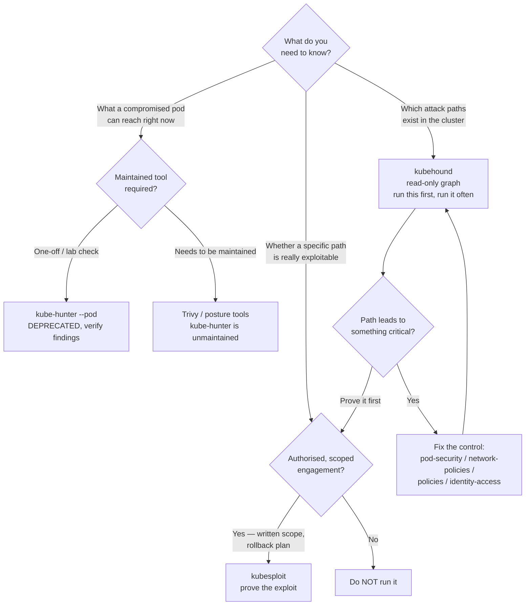

[← Cluster security](../README.md)

# Attack path — validating that the defences actually work

Offensive tooling that thinks like an attacker: mapping how a compromise spreads, probing
for reachable weaknesses, and proving an exploit is real. The adversarial check on every
other folder here.

Tools covered: [`kubehound`](kubehound/README.md) · [`kube-hunter`](kube-hunter/README.md) · [`kubesploit`](kubesploit/README.md)

## Contents

1. [Why an offensive folder exists](#1-why-an-offensive-folder-exists)
2. [The three tools, by what they answer](#2-the-three-tools-by-what-they-answer)
   - [kubehound — does the path exist?](#kubehound--does-the-path-exist)
   - [kube-hunter — what is reachable from here?](#kube-hunter--what-is-reachable-from-here)
   - [kubesploit — can the path be walked?](#kubesploit--can-the-path-be-walked)
3. [Authorisation: read this before running anything](#3-authorisation-read-this-before-running-anything)
4. [Decision tree](#4-decision-tree)
5. [Anti-patterns](#5-anti-patterns)
6. [How this applies to pikakube](#6-how-this-applies-to-pikakube)

---

## 1. Why an offensive folder exists

Every other folder under `2-cluster/` builds a defence: `pod-security/` confines containers,
`network-policies/` segments traffic, `policies/` blocks bad admission, `identity-access/`
scopes permissions. The question none of them answers on its own is whether those defences,
combined, actually hold against someone trying to break them.

That is what this folder is for. It is the adversarial complement to everything else here —
tooling that assumes an attacker's position and checks that the controls you deployed cut
the paths you assumed they cut. A finding from a posture scanner ("this pod is privileged")
becomes actionable only when you know whether that pod can actually reach anything worth
reaching. These tools answer that.

They form a natural progression, from cheapest and safest to most intrusive:

| | Tool | What it does | Touches the cluster? |
|---|---|---|---|
| Map | kubehound | builds an attack-path graph from the API server's view | read-only |
| Probe | kube-hunter | probes for reachable known weaknesses | active probing |
| Exploit | kubesploit | actually executes exploits and establishes C2 | full exploitation |

## 2. The three tools, by what they answer

### kubehound — does the path exist?

Reads the cluster read-only and models every asset and every known escalation technique as a
graph, so you can ask reachability questions directly: which containers are within N hops of
cluster-admin, which path leads from a namespace a developer can deploy into to the control
plane. It is modelled on BloodHound and comes from Datadog. This is the safe, repeatable one
— run it often. [→](kubehound/README.md)

### kube-hunter — what is reachable from here?

Probes for known weaknesses from a chosen vantage point — most usefully `--pod` mode, which
shows the cluster the way a compromised workload sees it: reachable kubelet, a
ServiceAccount token with real permissions, the metadata endpoint. **It is no longer under
active development** (upstream points to Trivy), so treat it as a teaching and one-off tool,
not a maintained control. [→](kube-hunter/README.md)

### kubesploit — can the path be walked?

A post-exploitation C2 framework with container-specific modules (CGroup escape, kernel
module load, kubeletctl). It answers the question that ends the argument: not "could this be
exploited" but "here it is, exploited." Powerful, and correspondingly dangerous — this is
real offensive tooling. [→](kubesploit/README.md)

## 3. Authorisation: read this before running anything

The tools in this folder are not linters. kube-hunter actively scans ports and endpoints;
kubesploit executes real exploits and establishes command-and-control. Run against
infrastructure you do not own, or outside an explicitly agreed scope, this is at best a
serious professional failure and at worst a crime.

The rules, non-negotiable:

- **Only run offensive tooling on clusters you own, or have explicit written authorisation
  and a defined scope to test.** "I was just checking" is not a defence.
- **kubehound is read-only** and the least fraught, but building its graph needs broad read
  access across the cluster — a sensitive credential in its own right. Guard the kubeconfig.
- **kube-hunter and kubesploit are active** and will be seen as an attack by anyone watching
  the cluster. Coordinate with whoever runs detection and response first.
- **Have a rollback plan** for anything kubesploit touches, and never leave a C2 agent
  running after an exercise.
- **These are not GitOps components.** They are tools you pick up for an exercise and put
  down again. Nothing here belongs in a reconcile loop.

## 4. Decision tree

## 5. Anti-patterns

| Anti-pattern | Why it is bad | What to do instead |
|---|---|---|
| Running kube-hunter or kubesploit without written authorisation | active scanning and real exploitation against infrastructure you do not own is a fireable offence or a crime | only run offensive tooling on clusters you own or have explicit, scoped permission to test |
| Building kubehound around kube-hunter as a maintained pipeline | kube-hunter is no longer developed; its check list drifts and gives false coverage | use maintained tools (Trivy, `posture/`) for continuous checks; kubehound for graphs |
| Treating these as your only security tools | they validate defences; they do not create them | deploy the controls in the other folders first, then use these to check them |
| Leaving a kubesploit C2 agent running after an exercise | you have installed persistent malware in your own cluster | tear it down; have a rollback plan before you start |
| Using attack-path findings to prioritise without fixing the control | a demonstrated path you do not close is worse than one you never found — you now know and did nothing | feed findings straight back into pod-security, network-policies, policies, RBAC |
| Running the broad-access collector with a shared admin kubeconfig | that credential is exactly what an attacker wants; a leak hands them the map | scope and guard the read-only credential kubehound uses |

## 6. How this applies to pikakube

Only kube-hunter ships manifests here — a namespace and a one-shot `Job` running
`aquasec/kube-hunter:0.6.8` in `--pod` mode, which reports what the *default* ServiceAccount
of its namespace can reach (`kubectl logs -n kube-hunter job/kube-hunter`). That is a useful
teaching artifact: it shows, concretely, what a compromised pod sees on a default cluster —
and the output maps directly onto the controls in `network-policies/`, `pod-security/` and
`identity-access/` that would shrink it. Note the deprecation, though; do not build anything
lasting on it.

kubehound and kubesploit are catalogued rather than deployed, correctly. kubehound is a
binary plus a Docker Compose backend you point at a cluster; kubesploit is an interactive
exploitation session. Neither is something you reconcile into a cluster, and for a local
Kind cluster the honest use of this whole folder is educational: run kubehound to *see* the
paths a default cluster contains, understand why each exists, and then read across to the
folder that closes it. On a real cluster, this folder is the periodic adversarial audit that
confirms the defences elsewhere are doing what you think they are.

---

[← Cluster security](../README.md)
