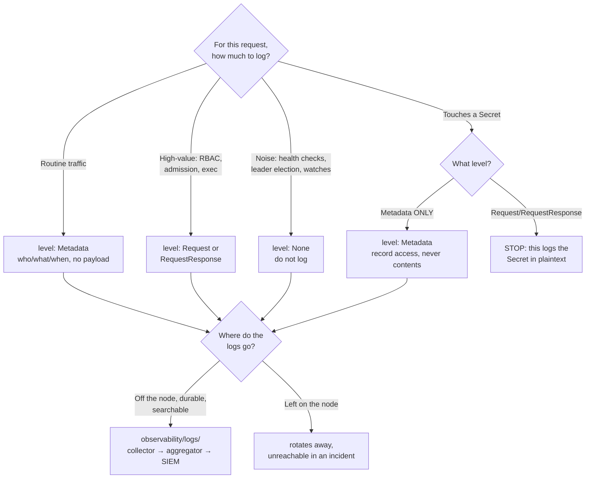

[← Cluster security](../README.md)

# Audit — the record of who did what to the API

The Kubernetes API server's audit log: what it records, the policy file that decides how
much, and why it is the only forensic record you get after the fact.

## Contents

1. [What the audit log is](#1-what-the-audit-log-is)
2. [The audit policy file decides verbosity](#2-the-audit-policy-file-decides-verbosity)
   - [The four levels](#the-four-levels)
   - [The two traps: disk and Secrets](#the-two-traps-disk-and-secrets)
3. [Enabling it: an API-server flag, set at cluster creation](#3-enabling-it-an-api-server-flag-set-at-cluster-creation)
4. [Shipping the logs: the link to observability](#4-shipping-the-logs-the-link-to-observability)
5. [Decision tree](#5-decision-tree)
6. [Anti-patterns](#6-anti-patterns)
7. [How this applies to pikakube](#7-how-this-applies-to-pikakube)

---

## 1. What the audit log is

Every meaningful action in a Kubernetes cluster is a request to the API server: create a
pod, read a Secret, delete a Deployment, list nodes. The **audit log** is the record of
those requests — who made each one, what they asked for, against which resource, and what
the server answered.

Its importance is singular: **it is the only record of who did what to the API.** When you
need to answer "who deleted that namespace", "which ServiceAccount read that Secret", or
"how did this workload get created" — during an incident, a compliance review, or a
forensic investigation — the audit log is the one place the answer exists. Nothing else in
the cluster keeps that history. If auditing was off when it happened, the answer is
unrecoverable.

Kubernetes does **not** enable audit logging by default. That is the gap this folder closes.

An audit event records, among other fields:

| Field | What it tells you |
|---|---|
| `user` / `impersonatedUser` | who made the request (and who they acted as) |
| `verb` | what they did — `get`, `create`, `delete`, `patch`, `watch` |
| `objectRef` | which resource, in which namespace |
| `sourceIPs` | where the request came from |
| `responseStatus` | whether it succeeded, and the code |
| `stage` | the point in request handling the event was emitted |

## 2. The audit policy file decides verbosity

Logging every field of every request would bury the signal and fill the disk. The **audit
policy** is a YAML file of rules that decides, per request, how much to record — matched by
resource, verb, user, namespace, or as a catch-all. The first matching rule wins.

### The four levels

Each rule assigns one of four levels, from least to most verbose:

| Level | What is recorded | Cost |
|---|---|---|
| `None` | nothing — the request is not logged at all | zero; used to filter out noise (health checks, leader-election) |
| `Metadata` | request metadata: who, what verb, which object, when, response code — **but not the payload** | low; the sensible default for most traffic |
| `Request` | metadata **plus the request body** | higher; the object being sent is logged |
| `RequestResponse` | metadata plus **both the request and response bodies** | highest; the full object in and out |

The craft of an audit policy is matching the level to the sensitivity of the resource: `None`
for chatty health checks, `Metadata` for routine traffic, and `Request`/`RequestResponse`
only for high-value objects (RBAC changes, Secret access, admission webhooks) where you
genuinely need the payload.

### The two traps: disk and Secrets

Two mistakes are so common and so damaging they belong at the top of any discussion:

- **A policy that logs everything at `RequestResponse` will fill the disk.** A busy API
  server handles a torrent of requests; recording both bodies for all of them produces an
  enormous volume of logs, and when the audit volume fills, the node — and with it the
  control plane — is in trouble. Verbosity is not free.
- **`Request`/`RequestResponse` on Secrets logs the Secret contents in plaintext.** The
  request body for creating a Secret *contains the Secret*. Log it at that level and you have
  copied every credential in the cluster into a log file — which is then shipped to your log
  aggregator, indexed, and retained. The audit log becomes the largest credential leak in
  the platform. Log Secrets at `Metadata` only: record *that* a Secret was accessed, never
  *what was in it*.

## 3. Enabling it: an API-server flag, set at cluster creation

Audit logging is turned on by passing two flags to the `kube-apiserver`:

- `--audit-policy-file=<path>` — the policy from §2
- `--audit-log-path=<path>` — where events are written

Because these are API-server flags, on a self-managed cluster they are set as part of the
control-plane configuration — which means, on Kind, at cluster-creation time in the cluster
config. You cannot bolt this on to a running Kind API server without recreating it; the
policy file must be mounted into the control-plane node and the flags set before the API
server starts. (Managed offerings — EKS, GKE, AKS — expose audit logging as a provider
setting instead, streaming to the cloud's log service.)

## 4. Shipping the logs: the link to observability

A file on the control-plane node is not a durable, searchable audit trail. Left there it
rotates away, and it is unreachable during exactly the incident when you need it. The audit
log only becomes useful once it is **shipped off the node** to durable, queryable storage.

That is a logging-pipeline concern, and it belongs to
[`observability/logs/`](../../../observability/logs/README.md): a collector (Fluent Bit,
Vector, Promtail) tails the audit log file and forwards it to an aggregator (Loki,
Elasticsearch/OpenSearch) and, in a security context, on to a SIEM for alerting and
correlation. The division of responsibility is clean: **this folder decides what gets
recorded and at what level; `observability/logs/` moves it somewhere it survives and can be
searched.**

## 5. Decision tree

## 6. Anti-patterns

| Anti-pattern | Why it is bad | What to do instead |
|---|---|---|
| Logging everything at `RequestResponse` | fills the disk on a busy API server and can take the control plane down | `Metadata` by default; `Request`/`RequestResponse` only for specific high-value resources |
| `Request`/`RequestResponse` on Secrets | logs every Secret's contents in plaintext into the audit trail, then ships it to the aggregator | log Secrets at `Metadata` — record access, never contents |
| Running with audit logging off | the only record of who did what to the API does not exist; incidents are unanswerable | enable it; Kubernetes does not by default |
| Leaving audit logs on the control-plane node | they rotate away and are unreachable during the incident that needs them | ship them via `observability/logs/` to durable storage and a SIEM |
| No `None` rules for noise | health checks and watches drown the signal and inflate volume | filter obvious noise to `None` at the top of the policy |
| Committing an audit policy nobody reads | verbosity and cost drift silently; a bad rule is discovered when the disk fills | review the policy like code; know what each rule logs and why |

## 7. How this applies to pikakube

This folder holds a **real, working** audit configuration — not a catalogue.

[`audit-policy.yaml`](audit-policy.yaml) is deliberately minimal: a single rule,
`level: Metadata`, applied to everything. That is the conservative starting point — it
records who did what to which object across the whole API, at low volume, and with **no risk
of logging Secret contents**, because `Metadata` never includes a payload. It is the right
first policy: capture the trail cheaply and safely, then tighten selectively (add `None`
rules for noise, raise specific high-value resources to `Request`) once you know the traffic.

The policy is wired into the cluster through the Kind config at
[`clusters/kind-configs/core.yaml`](../../../../clusters/kind-configs/core.yaml), which:

- sets the API-server flags via `kubeadmConfigPatches` —
  `audit-log-path: /var/log/kubernetes/kube-apiserver-audit.log` and
  `audit-policy-file: /etc/kubernetes/policies/audit-policy.yaml`
- mounts the log directory (`/var/log/kubernetes`) and policy directory
  (`/etc/kubernetes/policies`) into the control-plane node as `extraVolumes`
- `extraMounts` the policy file from the host into the node

One thing to fix when adopting this: the `extraMounts` `hostPath` in `core.yaml` still points
at an old absolute path (`/home/andreyolv/projects/mount-of-olives-platform/...`), and
`clusters/kind-configs/audit-logs.yaml` carries a different stale path
(`/home/andreyolv/projects/big-data-platform-on-k8s/...`). These are host-specific and must
be repointed at this repository's actual audit-policy location before the cluster will come
up with auditing wired correctly. The mechanism is right; the absolute path is a leftover.

Shipping these logs somewhere durable is the natural next step, and it lives in
[`observability/logs/`](../../../observability/logs/README.md) — this folder produces the
record, that one makes it survive.

## Notes

The original notes in this folder:

- **`doc.md`** held a single link: <https://github.com/RichardoC/kube-audit-rest> —
  **kube-audit-rest**, a third-party tool that captures audit-style records via an admission
  webhook rather than the API server's built-in audit log. It is an alternative capture
  mechanism worth knowing about: where the native audit log needs API-server flags (and so,
  on Kind, a cluster recreate), an admission-webhook approach can be deployed into a running
  cluster as an ordinary workload. It sees only what passes through admission (mutating/
  validating requests), not the full read traffic the native log covers — so it is a
  narrower, more deployable complement, not a replacement for native auditing.

- **`p-doc.md`** was a project write-up, in English, on enabling Kubernetes audit logging.
  Its substance, preserved and folded into the sections above:
  - *The problem* — without audit logs there is no visibility or traceability of user
    activity and API interactions, which makes incident investigation and compliance
    impossible; and many standards (GDPR, HIPAA, SOC 2) require an audit trail that
    Kubernetes does not provide by default.
  - *The solution* — enable audit logging via `audit-policy.yaml` to capture authentication
    attempts, resource modifications and access to sensitive objects; stream the logs to
    centralised persistent storage (a secure volume, a Fluent Bit pipeline, or an aggregator
    like Elasticsearch/Loki) for retention and search; use fine-grained rules to capture
    high-value events (changes to roles, secrets, deployments) while filtering noise; and
    forward to a SIEM for alerting, correlation and dashboards. The stated skills were
    Security and DevOps; the tool was Kubernetes. Every one of those points is reflected in
    §2, §3 and §4 above.

---

[← Cluster security](../README.md)
