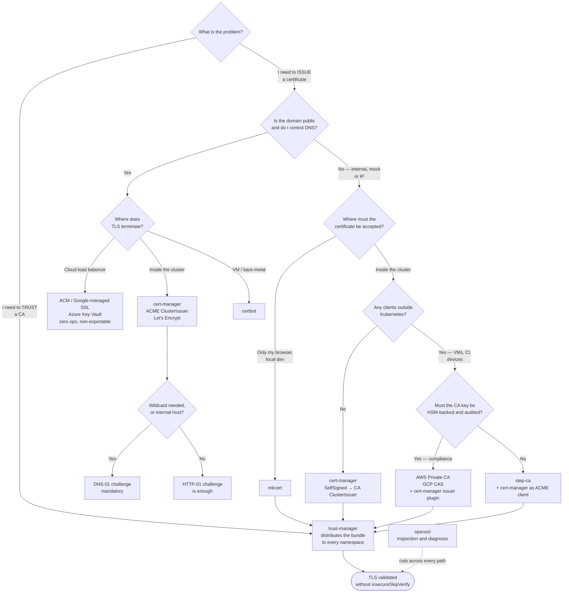

# Certificates and PKI on Kubernetes

Conceptual reference for the `certificates/` folder. Explains what a certificate is, how
the chain of trust works, and which tool in this folder solves which problem.

Tools covered: [`openssl`](openssl/README.md) · [`certbot`](certbot/README.md) ·
[`mkcert`](mkcert/README.md) · [`step-ca`](step-ca/README.md) ·
[`cert-manager`](cert-manager/README.md) · [`trust-manager`](trust-manager/README.md)

## Contents

1. [Types of certificate — which one are we talking about](#1-types-of-certificate--which-one-are-we-talking-about)
   - [Axis 1 — the family (which standard)](#axis-1--the-family-which-standard)
   - [Axis 2 — the purpose (what the certificate is allowed to do)](#axis-2--the-purpose-what-the-certificate-is-allowed-to-do)
   - [Axis 3 — position in the chain](#axis-3--position-in-the-chain)
   - [Do not confuse: type ≠ format](#do-not-confuse-type--format)
   - [So which one is this folder about?](#so-which-one-is-this-folder-about)
2. [Fundamentals](#2-fundamentals)
   - [What a certificate is](#what-a-certificate-is)
   - [What a CA is](#what-a-ca-is)
   - [Chain of trust](#chain-of-trust)
   - [Trust store](#trust-store)
   - [Why certificates get concatenated into one file](#why-certificates-get-concatenated-into-one-file)
   - [The idea that unlocks everything](#the-idea-that-unlocks-everything)
3. [Public CA vs private CA](#3-public-ca-vs-private-ca)
   - [Why no public certificate exists for an internal domain](#why-no-public-certificate-exists-for-an-internal-domain)
4. [The two problems everyone conflates](#4-the-two-problems-everyone-conflates)
   - [Practical consequence: never replicate a private key](#practical-consequence-never-replicate-a-private-key)
5. [cert-manager concepts](#5-cert-manager-concepts)
   - [Issuer vs ClusterIssuer](#issuer-vs-clusterissuer)
   - [Issuer types](#issuer-types)
   - [Certificate → Secret](#certificate--secret)
   - [ACME: HTTP-01 vs DNS-01](#acme-http-01-vs-dns-01)
6. [The tools in this folder](#6-the-tools-in-this-folder)
   - [How they combine](#how-they-combine)
   - [One trap worth naming here](#one-trap-worth-naming-here)
7. [Managed certificate services in the cloud](#7-managed-certificate-services-in-the-cloud)
   - [AWS](#aws)
   - [Azure](#azure)
   - [GCP](#gcp)
   - [When cloud beats self-managed](#when-cloud-beats-self-managed)
   - [When self-managed beats cloud](#when-self-managed-beats-cloud)
   - [The hybrid pattern, which is what most platforms actually run](#the-hybrid-pattern-which-is-what-most-platforms-actually-run)
8. [Domains: where they come from and who owns them](#8-domains-where-they-come-from-and-who-owns-them)
   - [Do managed certificate services include the domain?](#do-managed-certificate-services-include-the-domain)
   - [In a corporate environment](#in-a-corporate-environment)
   - [Naming convention: how to split subdomains](#naming-convention-how-to-split-subdomains)
   - [Who owns what — the split worth agreeing up front](#who-owns-what--the-split-worth-agreeing-up-front)
   - [For a local cluster: nip.io, and nothing is purchased](#for-a-local-cluster-nipio-and-nothing-is-purchased)
9. [Decision tree](#9-decision-tree)
   - [One line each](#one-line-each)
10. [Anti-patterns](#10-anti-patterns)
11. [How this applies to pikakube](#11-how-this-applies-to-pikakube)
12. [References](#references)

---

## 1. Types of certificate — which one are we talking about

"Certificate" is an overloaded word. Before anything else, three **independent** axes that
are routinely confused with one another.

### Axis 1 — the family (which standard)

| Family | What it is | Trust model |
|---|---|---|
| **X.509** | the TLS/PKI standard — **this folder is about this one** | **hierarchical**: a root signs downward |
| OpenSSH certificate | OpenSSH's own format, **not** X.509 | hierarchical, with a separate SSH CA |
| PGP/GPG key | email and artifact signing | **web of trust**: peers sign peers, no central authority |
| JWT | a signed *token* — not a certificate | trust comes from holding the issuer's public key / JWKS |

The distinction that matters theoretically: X.509 and SSH are **hierarchical** — trust
descends from a root. PGP is a **web of trust** — trust accumulates laterally, with no
root. Kubernetes is hierarchical end to end.

A classic confusion inside the cluster itself: **a ServiceAccount token is a JWT, not a
certificate**, while `kubectl` authenticates with an **X.509 client certificate**. Two
different identity mechanisms living side by side.

### Axis 2 — the purpose (what the certificate is allowed to do)

Purpose is recorded **inside** the certificate, in the `keyUsage`, `extendedKeyUsage` and
`basicConstraints` extensions. A server certificate cannot act as a CA even if its key is
perfectly valid — the field says it may not.

| Purpose | Extension | What it is for | Present on Kubernetes? |
|---|---|---|---|
| **Server auth** | `serverAuth` | the server proves who it is | **yes — the subject of this folder** (Ingress, endpoints) |
| **Client auth** | `clientAuth` | the client proves who it is | yes — mTLS, kubelet, `kubectl` |
| **CA** | `basicConstraints: CA:TRUE` + `keyCertSign` | sign other certificates | yes — cluster CA, your private CA |
| Code signing | `codeSigning` | sign a binary or artifact | tangential — Cosign/Sigstore |
| Email (S/MIME) | `emailProtection` | sign and encrypt email | no |
| Timestamping | `timeStamping` | trusted timestamps | tangential — supply chain |

A single certificate can carry both `serverAuth` **and** `clientAuth` — the common case in mTLS.

### Axis 3 — position in the chain

| Position | Self-signed? | Can sign others? | Typical lifetime |
|---|---|---|---|
| **Root CA** | yes | yes | 10–20 years, ideally offline |
| **Intermediate** | no | yes | 1–5 years |
| **Leaf** (end-entity) | no | **no** | 90 days (ACME) to 1 year |

### Do not confuse: type ≠ format

Format is how the certificate is **encoded on disk** — an axis entirely independent of the
three above. The same certificate becomes any of these without ceasing to be the same
certificate:

| Format | Extension | Contains | Where it shows up |
|---|---|---|---|
| **PEM** | `.pem` `.crt` `.key` | base64 with `-----BEGIN...-----` | the default on Linux and Kubernetes |
| DER | `.der` `.cer` | the same content, binary | Windows, older Java |
| **PKCS#12** | `.p12` `.pfx` | container with cert + key + chain | Windows, JVM |
| **JKS** | `.jks` | Java keystore/truststore | **Kafka, Spark, Trino, Airflow-JDBC** |

Worth recording: a large share of TLS incidents are **format conversion** problems, not
cryptography. That is exactly why automatic conversion to JKS/PKCS#12 carries real weight
on a data platform — see [trust-manager/README.md](trust-manager/README.md).

### So which one is this folder about?

**X.509, `serverAuth` purpose, leaf position** — the certificate the Ingress presents when
someone opens `https://...`. Plus the **CAs** that sign those leaves, and the **trust
bundle** that makes clients accept them.

These appear nearby but are **not** the focus of this folder:

- **`clientAuth`** — service mesh mTLS (`network/service-mesh/`) and workload identity (`identity-access/`)
- **Control-plane PKI** — `kubeadm` creates its own CAs (`kubernetes-ca`, `etcd-ca`, `front-proxy-ca`) plus client certificates for the kubelet and for `admin.conf`. This is owned by the cluster lifecycle, **not** by cert-manager
- **The `CertificateSigningRequest` API** (`certificates.k8s.io/v1`) — a native Kubernetes API with built-in signers such as `kubernetes.io/kubelet-serving` and `kubernetes.io/kube-apiserver-client`. Not to be confused with cert-manager's `CertificateRequest`, which is a CRD and a different thing
- **Artifact signing** — Cosign/Sigstore, under `security/0-governance/supply-chain/signing-artifacts`

---

## 2. Fundamentals

### What a certificate is

An X.509 certificate is, at bottom, four things:

| Field | What it is |
|---|---|
| Public key | the public half of the server's key pair |
| Identity | the name (`CN` / `SAN`) — `airflow.pikakube.test`, `*.example.com`, an IP |
| Validity | `notBefore` / `notAfter` |
| **Signature** | the proof that someone vouches for the three fields above |

The signature is the only thing that gives the bundle any value. Without it, it is a text
file anyone can forge in two minutes.

### What a CA is

The **CA (Certificate Authority)** is who signs. It has its own key pair, and *its* own
certificate — the **root** — is **self-signed**: it vouches for itself.

This is the bootstrap problem of every PKI: trust does not come from mathematics, it comes
from a **decision**. Someone, at some point, put that root on a list.

### Chain of trust

```
root CA (self-signed, offline, long-lived)
   └── intermediate CA (signed by the root, does the daily work)
         └── leaf / end-entity (your server's certificate)
```

The intermediate exists to protect the root: if the intermediate leaks, you revoke it
without having to replace the root on billions of devices.

### Trust store

The **trust store** is the list of roots a client accepts. Everyone has their own:

- the OS — `/etc/ssl/certs/ca-certificates.crt` on Debian/Ubuntu
- the browser — usually the OS store; Firefox ships its own
- **every container image** — normally the Mozilla bundle from the `ca-certificates` package
- the JVM — a `cacerts` file in **JKS** format, separate from the system store

Validating a certificate means walking the chain (leaf → intermediate → root) until you hit
something already in the trust store. Reach the top without a match and you get the
"certificate not trusted" error.

### Why certificates get concatenated into one file

Because **the server must send the intermediates, and the trust store only has the root.**

On connection the client holds roots, the server holds its leaf, and the intermediates that
link the two are held by neither. TLS resolves this by making the *server* present the
whole path: leaf first, then every intermediate above it. The root is deliberately left out
— the client already has it, and sending it would waste bytes.

That concatenated file is the **chain**, usually named `fullchain.pem`:

```bash
# order matters: leaf first, then upward. Stop before the root.
cat leaf.pem intermediate.pem > fullchain.pem
```

> **Footgun:** if a file lacks a trailing newline you end up with
> `-----END CERTIFICATE----------BEGIN CERTIFICATE-----` on a single line and the whole file
> fails to parse. Check with `grep -c BEGIN fullchain.pem` — the count must match the number
> of certificates you expect.

#### Why the symptom is confusing

An incomplete chain **usually still works in a browser**. Browsers cache intermediates from
earlier visits, and most implement AIA fetching — downloading the missing intermediate on
the fly from the URL inside the certificate.

Almost nothing else does. `curl`, `openssl s_client`, Java, Go and Python all fail instead.
Hence the classic report: *"it works in Chrome but the application cannot connect."* That is
an incomplete chain until proven otherwise.

```bash
# how many certificates is the server actually sending?
openssl s_client -connect host:443 -servername host -showcerts </dev/null 2>/dev/null \
  | grep -c 'BEGIN CERTIFICATE'

# does the leaf verify when the intermediates are supplied separately?
openssl verify -untrusted chain.pem leaf.pem
```

#### What certbot hands you, and the mistake it invites

| File | Contents |
|---|---|
| `cert.pem` | the leaf **only** |
| `chain.pem` | the intermediates **only** |
| `fullchain.pem` | leaf + intermediates — **this is what a server wants** |
| `privkey.pem` | the private key |

Pointing nginx at `cert.pem` instead of `fullchain.pem` is the single most common way to
ship a broken chain.

#### Two different things get concatenated — do not confuse them

| | Chain (`fullchain.pem`) | CA bundle (truststore) |
|---|---|---|
| What is inside | one leaf plus its intermediates | many unrelated root CAs |
| Does order matter? | **yes** — leaf first, upward | no, it is a set |
| Who uses it | the **server**, to present identity | the **client**, to decide what to trust |
| Which problem (§4) | issuance | trust |
| Produced by | cert-manager, certbot | `ca-certificates`, trust-manager |

Same file format, opposite purposes. `/etc/ssl/certs/ca-certificates.crt` is just hundreds
of roots concatenated — and a trust-manager `Bundle` is exactly that operation made
declarative.

#### In Kubernetes

In a `kubernetes.io/tls` Secret, **`tls.crt` should hold the fullchain**, not just the leaf.
cert-manager writes it correctly on its own; hand-built Secrets are where this breaks.

```bash
# count the certificates inside a TLS Secret — 1 usually means a missing intermediate
kubectl get secret <name> -n <ns> -o jsonpath="{.data['tls\.crt']}" \
  | base64 -d | grep -c 'BEGIN CERTIFICATE'
```

Note that `ca.crt` in the same Secret is a different thing entirely: it is the root, present
so that *clients* can verify — the trust side, not the chain.

### The idea that unlocks everything

> **A certificate is not "valid" or "invalid" in absolute terms.**
> **It is valid *relative to a trust store*.**

The same certificate is accepted on one machine and rejected on another with nothing about
it having changed. That explains why this folder holds two families of tool: some act on
the certificate, one acts on the list.

---

## 3. Public CA vs private CA

The difference is not technical — the algorithm is identical. The difference is **who
already trusts it**.

| | Public CA | Private CA |
|---|---|---|
| Examples | Let's Encrypt, DigiCert, ZeroSSL | `mkcert`, `step-ca`, cert-manager CA issuer, corporate PKI |
| Root already in the world's trust stores? | **Yes** — that is literally the product | **No** — only where you install it |
| Issues for any name? | **No** — only for domains you prove you own | **Yes** — any name, IP, made-up domain |
| How ownership is proven | ACME challenge: HTTP-01 or DNS-01 | not proven; you own the CA |
| Cost | free (Let's Encrypt) to expensive | free, but you operate the CA |
| The actual work | renewing before expiry | **distributing the root to every client** |

The symmetry is worth memorising:

> **Public CA: trust is free, issuance is restricted.**
> **Private CA: issuance is free, trust is the work.**

### Why no public certificate exists for an internal domain

This is not a Let's Encrypt policy quirk. `airflow.pikakube.test` **does not exist in
public DNS**, so ownership is logically unprovable and no public CA can issue for it. Any
environment with a made-up domain, an internal IP, or a closed network **necessarily** uses
a private CA. There is no third option.

---

## 4. The two problems everyone conflates

This is the most important distinction in the folder:

| Problem | The question | Solved by |
|---|---|---|
| **Issuance** | "How do I prove I am who I claim to be?" | cert-manager, certbot, step-ca, mkcert |
| **Trust** | "How do I decide who to believe?" | **trust-manager** |

They are opposite sides of the same TLS handshake. `cert-manager` and `trust-manager` have
similar names and solve complementary problems, not competing ones.

### Practical consequence: never replicate a private key

This distinction kills two common mistakes:

**Mistake 1 — copying the TLS Secret across namespaces.** If every namespace needs the
server certificate, the answer is **not** to replicate it (with reflector, replicator,
Kyverno generate, or `kubectl` by hand). It is to **re-issue**: each namespace requests a
`Certificate` and cert-manager creates the Secret there, and rotates it. Private keys
should not travel.

**Mistake 2 — `insecureSkipVerify: true`.** It shows up because distributing the CA was too
annoying, not because anyone decided to give up validation. That is the problem
trust-manager solves.

---

## 5. cert-manager concepts

cert-manager is the de facto standard for issuance inside Kubernetes. Its resources:

### Issuer vs ClusterIssuer

| | Scope | When to use |
|---|---|---|
| `Issuer` | namespaced — serves only its own namespace | per-team / per-tenant isolation |
| `ClusterIssuer` | cluster-wide | a shared platform CA |

A `Certificate` in namespace `X` may reference an `Issuer` in `X` or **any** `ClusterIssuer`.

### Issuer types

| Type | What it does | Typical use |
|---|---|---|
| `selfSigned` | signs with the certificate's own key | **bootstrap**: creating your private CA root |
| `ca` | signs using a key pair stored in a Secret | the platform's private CA, day to day |
| `acme` | speaks ACME to a public CA or to step-ca | Let's Encrypt, public domain |
| `vault` | delegates to HashiCorp Vault / OpenBao | teams already running Vault as PKI |
| external | Venafi, AWS PCA, Google CAS, etc. | existing corporate PKI |

The standard private-CA pattern chains them: `selfSigned` → issue a `Certificate` with
`isCA: true` → that Secret becomes the source for a `ca` issuer.

### Certificate → Secret

A `Certificate` declares what you want. cert-manager reconciles it and produces a Secret of
type `kubernetes.io/tls`:

| Secret key | Contents |
|---|---|
| `tls.crt` | the certificate (leaf + intermediates) |
| `tls.key` | the private key |
| `ca.crt` | the root, when the issuer is of type `ca` |

Renewal is automatic — by default at 2/3 of the lifetime, tunable via `renewBefore`. This
is the core gain over generating by hand: an expired certificate in production stops being
a category of incident.

### ACME: HTTP-01 vs DNS-01

| | HTTP-01 | DNS-01 |
|---|---|---|
| How it proves | serves a token at `http://domain/.well-known/acme-challenge/` | creates a `_acme-challenge.domain` TXT record |
| Requires | port 80 reachable **from the internet** | DNS provider API credentials |
| Wildcard (`*.domain`) | **not supported** | **supported** |
| Internal host / behind VPN | does not work | works |

Rule of thumb: **wildcard or internal network ⇒ DNS-01**. There is no alternative.

---

## 6. The tools in this folder

Each tool has its own folder with the detail — commands, caveats, requirements and
examples. This section is the **map**, classified by where each one shines rather than by
everything it is capable of.

| Tool | Role | Shines when | Do not use when | Detail |
|---|---|---|---|---|
| **openssl** | inspection and diagnosis | debugging anything TLS — what a server really serves, why a chain fails, whether a key matches a certificate | used as a *process*; hand-generated certificates have no renewal | [→](openssl/README.md) |
| **certbot** | ACME client, outside Kubernetes | a VM or bare-metal host with nginx/Apache and a public domain | inside Kubernetes — cert-manager does it declaratively | [→](certbot/README.md) |
| **mkcert** | local CA for development | you want a green padlock in the laptop browser, immediately | production or any shared cluster — the CA lives in `~`, unrotatable and unauditable | [→](mkcert/README.md) |
| **step-ca** | private CA as a service | on-prem/air-gapped, or clients beyond Kubernetes (VMs, CI, devices), or very short-lived certificates | the cluster is the only consumer — a cert-manager `ca` ClusterIssuer does the same with less to operate | [→](step-ca/README.md) |
| **cert-manager** | declarative issuance in-cluster | any issuance inside Kubernetes, public (ACME) or private (SelfSigned → CA) | outside the cluster — it does not manage VMs or appliances | [→](cert-manager/README.md) |
| **trust-manager** | trust bundle distribution | a private CA is in use, especially with JVM workloads needing JKS/PKCS#12 | the cluster only consumes public certificates — the Mozilla bundle already covers it | [→](trust-manager/README.md) |

### How they combine

They are not six alternatives to pick one from. The common shapes:

- **step-ca as the CA + cert-manager as its ACME client** — when the CA must serve clients beyond Kubernetes
- **cert-manager issuing + trust-manager distributing** — the required pair whenever a private CA exists: one proves identity, the other makes it accepted
- **mkcert on the host + cert-manager in the cluster** — mkcert makes *your browser* trust; cert-manager handles what runs inside
- **openssl across all of them** — it is how you diagnose any of the above

### One trap worth naming here

`cainjector` ships inside the cert-manager chart and is **not** a trust distributor for your
workloads. It injects CA data into `ValidatingWebhookConfiguration`,
`MutatingWebhookConfiguration` and CRD conversion — that is **control-plane** trust. Not a
substitute for trust-manager.

---

## 7. Managed certificate services in the cloud

Every major provider ships certificate services. They split along the same two problems
from §4: issuing public certificates, and running a private CA.

### AWS

| Service | What it is | Decisive constraint |
|---|---|---|
| **AWS Certificate Manager (ACM)** | free public certificates, auto-renewed | **the private key cannot be exported** — usable only by integrated services (ALB/NLB, CloudFront, API Gateway, AppSync). It can never be mounted into a pod |
| **AWS Private CA** (formerly ACM PCA) | managed private CA, HSM-backed keys | expensive: a monthly fee per CA **plus** a per-certificate charge |
| Route 53 | not a certificate service, but the DNS backend for DNS-01 | the usual route to wildcard certificates on EKS |

cert-manager integration: `aws-privateca-issuer` for AWS Private CA; the built-in ACME
issuer with a Route 53 solver for Let's Encrypt.

### Azure

| Service | What it is | Decisive constraint |
|---|---|---|
| **Azure Key Vault Certificates** | certificate lifecycle in Key Vault; auto-renewal through integrated public CAs (DigiCert, GlobalSign) or self-signed issuance | **exportable** — unlike ACM, the key can be pulled into the cluster |
| **App Service Managed Certificates** | free certificates, App Service only | tied to that service |
| Front Door / Application Gateway managed certs | certificates managed at the edge | terminate at the edge |
| Azure DNS | DNS-01 backend for cert-manager | wildcards on AKS |

Azure has no direct equivalent to AWS Private CA or GCP CAS as a general-purpose managed
private CA. Key Vault plus a self-signed issuer is the usual substitute.

Because Key Vault certificates *are* exportable, the common AKS pattern is Key Vault as the
store with **External Secrets Operator** or the **Secrets Store CSI Driver** pulling them
into the cluster — both already mapped under `security/2-cluster/secrets/`.

### GCP

| Service | What it is | Decisive constraint |
|---|---|---|
| **Google-managed SSL certificates** | free public certificates attached to Load Balancers | non-exportable, load balancer only |
| **Certificate Manager** | certificates at scale for load balancers; wildcard and DNS authorisation | load-balancer oriented |
| **Certificate Authority Service (CAS)** | managed private CA, HSM-backed | per-CA and per-certificate pricing |
| Cloud DNS | DNS-01 backend for cert-manager | wildcards on GKE |

cert-manager integration: `google-cas-issuer` for CAS.

### When cloud beats self-managed

The decisive question is not which cloud. It is **where TLS terminates**.

| Situation | Use | Why |
|---|---|---|
| TLS terminates at a cloud load balancer (ALB, Application Gateway, Cloud LB, CloudFront) | **the provider's managed certificate** | free, zero operations, automatic renewal, and no certificate ever enters the cluster. Non-exportability stops being a limitation, because nothing else needs the key |
| The CA key must be HSM-backed with an audit trail for compliance | **AWS Private CA / GCP CAS** | FIPS-validated key custody, and every issuance logged to CloudTrail / Cloud Audit Logs. Reproducing that with step-ca means owning key custody, backup, DR and the audit story yourself |
| Certificates for VMs, devices or CI outside Kubernetes, inside one cloud | **the managed private CA** | it already speaks the provider's identity and logging |
| Public domain, few certificates, cloud-native ingress | **ACM / Google-managed / Key Vault** | operationally cheaper than anything self-hosted |

### When self-managed beats cloud

| Situation | Use | Why |
|---|---|---|
| TLS terminates **inside** the cluster (Ingress controller, service mesh) | **cert-manager** | ACM and Google-managed certificates cannot be exported — structurally unusable here |
| Pod-to-pod mTLS | **cert-manager + private CA** | managed CAs charge per certificate, so short-lived certificates — the good practice — become the expensive one. Issuing from your own CA is free |
| Multi-cloud, or portability matters | **cert-manager / step-ca** | a cloud CA ties the trust root to one provider; migrating means re-rooting every client |
| Local, dev or on-prem | **cert-manager, mkcert, step-ca** | no cloud in the path |
| High certificate volume | **cert-manager** | per-certificate pricing punishes exactly the pattern you want |

### The hybrid pattern, which is what most platforms actually run

1. **Managed public certificate at the edge** — ACM / Google-managed / Key Vault on the external load balancer. Public traffic, public CA, zero operations.
2. **cert-manager with a private CA inside the cluster** — east-west traffic, mTLS, and internal hostnames no public CA could ever issue for.
3. **trust-manager** distributing that internal CA so workloads actually validate it.

The two worlds do not compete — they terminate at different points. The cloud service owns
the boundary; cert-manager owns everything behind it.

---

## 8. Domains: where they come from and who owns them

A CA does not sell domains. This trips people up constantly, so state it plainly:

> **A domain and a certificate are two separate acquisitions.** The CA only *validates* that
> you control a domain you already own. It never provides one.

Three distinct things, frequently from three distinct vendors:

| # | What | Who provides it | Examples |
|---|---|---|---|
| 1 | **Domain registration** | a registrar | Registro.br, Cloudflare Registrar, Namecheap, Route 53 Domains |
| 2 | **DNS hosting** — the zone where records live | a DNS provider | Route 53, Azure DNS, Cloud DNS, Cloudflare |
| 3 | **Certificate** | a CA | Let's Encrypt, DigiCert, ACM |

One vendor can cover all three, but they remain three products with three lifecycles and
three renewal dates.

### Do managed certificate services include the domain?

**No.** All of them assume you already own one. What the clouds offer is a *separate*
registrar product:

| Cloud | Registrar product | Certificate product | Same service? |
|---|---|---|---|
| AWS | Route 53 Domains | ACM / Private CA | **No** — two services, two bills |
| Azure | App Service Domains | Key Vault Certificates | **No** |
| GCP | registration through an external registrar | Certificate Manager / CAS | **No** |

The practical consequence: "ACM is free" is true and irrelevant if no domain has been
bought. The certificate is free; the name is not.

### In a corporate environment

You almost never buy a domain. The company already owns `company.com`, and it belongs to
IT, Corporate Infrastructure or Marketing — not to the platform team. What you actually do:

**1. Ask for a delegated subzone, not for individual records.**

This is the single most important move, and it is a platform decision rather than a
networking one:

- **Ticket per hostname** — every new service means asking IT to create an A record. Weeks of lead time, and it does not scale.
- **Zone delegation** — IT creates `NS` records pointing `k8s.company.com` (or `data.company.com`) at *your* Route 53 / Azure DNS zone. From then on the platform team self-serves every record inside it, and `external-dns` automates it entirely.

Delegation also unlocks DNS-01, because cert-manager can then write `_acme-challenge` TXT
records itself with no human in the loop.

**2. Understand split-horizon DNS.**

Corporations typically resolve the same name differently inside and outside the network:
`app.company.com` returns a private IP over the VPN and nothing (or a public IP) from
outside. The consequences for certificates are direct:

| Challenge | Works under split-horizon? |
|---|---|
| HTTP-01 | **No** for internal-only names — Let's Encrypt cannot reach them |
| DNS-01 | **Yes**, as long as the zone is publicly resolvable — the TXT record is checked publicly even when the A record is private |

This is why **DNS-01 is effectively the default in corporate environments**.

**3. Watch for internal-only TLDs.**

Some companies use `.corp`, `.lan` or `.internal`. These do not exist in public DNS, so **no
public CA can ever issue for them** — the same logic as §3. You are forced onto corporate
PKI or your own private CA. ICANN reserved `.internal` in 2024 for exactly this purpose.

**4. Corporate PKI probably already exists.**

Large organisations usually run Active Directory Certificate Services (AD CS) or Venafi,
with the root already pushed to every laptop through GPO, Intune or MDM. That is a
significant advantage: trust distribution *to employees* is already solved. The job narrows
to two things:

- pointing cert-manager at it — a Venafi issuer, or an ACME/EST endpoint if one is exposed
- using trust-manager for the *cluster* side, which corporate MDM does not reach

**5. Wildcards are often banned.**

Security teams frequently forbid `*.company.com`, because a single leaked key compromises
every host. Per-host certificates are the answer, and they are only practical when issuance
is automated — which is itself the argument for cert-manager.

### Naming convention: how to split subdomains

Naming looks cosmetic and is not — the layout decides what can be **delegated**, what a
**wildcard certificate** can cover, and how large a blast radius each key has.

**The rule that drives everything:**

> Labels run from most specific (left) to most general (right), and **every boundary you may
> want to delegate or wildcard must be a real dot, not a hyphen.**

Hyphens cannot be delegated and cannot be wildcarded. Dots can be both.

#### The three common layouts

| Layout | Example | Verdict |
|---|---|---|
| **Environment as a subdomain** | `api.company.com` (prod)<br>`api.staging.company.com` | **The default.** Production carries no environment label — it is what customers see |
| **Separate root per environment** | `company.com` / `company-staging.com` | Use when hard isolation is required: separate cookie scope, separate WAF, no chance of cross-environment cookie or CORS leakage. Costs another domain and another certificate chain |
| **Environment as a hyphen** | `api-prod.company.com` | **Avoid.** No wildcard covers it cleanly, no delegation boundary exists, and grouping/sorting breaks |

#### The constraint everyone forgets

**A wildcard certificate covers exactly one label.**

`*.company.com` matches `api.company.com` but **does not** match `api.data.company.com`.

Every extra level therefore means either another wildcard certificate or per-host issuance.
That is the real cost of a deep hierarchy, and it is why **three to four labels total** is
the sweet spot.

| Hostname pattern | Covered by a wildcard? | Can the boundary be delegated? |
|---|---|---|
| `svc.company.com` | `*.company.com` — yes | at `company.com` |
| `svc.data.company.com` | `*.data.company.com` — yes (**not** `*.company.com`) | at `data.company.com` — yes |
| `svc-prod.company.com` | `*.company.com` — yes | **no** — a hyphen is not a boundary |

#### Separate internal from external

A strong and widely used practice is a dedicated zone for internal-only names:

```
company.com          → public, customer-facing
int.company.com      → internal only (split-horizon or a private zone)
```

Why it pays off:

- **blast radius** — a `*.int.company.com` wildcard never touches customer-facing names
- **different policy per zone** — WAF, auth proxy and exposure rules differ legitimately
- **clean delegation** — the platform team can own `int.company.com` end to end

#### Splitting by area and environment

Combine the axes right to left, from most general to most specific:

```
<service>.<environment>.<area>.int.company.com

airflow.dev.data.int.company.com
trino.data.int.company.com            ← production, no environment label
grafana.platform.int.company.com
```

Pick the order deliberately, because the **delegation boundary should match team ownership**:

- `data.int.company.com` delegated to the data platform team
- `platform.int.company.com` delegated to the platform team

Putting *area* to the right of *environment* means one delegation per team covering all of
that team's environments — usually what you want. Reversing it (`data.dev.int.company.com`)
means delegating per environment instead, which fits organisations where environments are
owned by different groups.

#### Rules worth codifying as policy

- lowercase only; **hyphens, never underscores** — underscores are invalid in hostnames per RFC 1123 and break TLS SNI and certificate validation
- **no environment label in production** — `api.company.com`, not `api.prod.company.com`
- no internal codenames in public-facing names; they leak org structure
- reserve `_`-prefixed labels for protocol records only (`_acme-challenge`, `_dmarc`, SRV)
- cap at roughly four labels — beyond that, wildcard and certificate management gets painful
- **avoid a single `*.company.com` wildcard for everything** — one leaked key compromises every host, which is exactly why security teams ban it

#### What not to use

| Avoid | Why |
|---|---|
| `.local` | collides with mDNS/Avahi — intermittent, hard-to-debug failures |
| `.corp`, `.home`, `.mail` | unregistered TLDs with real ICANN name-collision risk |
| a made-up public-looking TLD | it may become a real TLD later and break silently |

For internal-only names use **`.internal`**, which ICANN reserved in 2024 for exactly this,
or a subdomain of a domain you actually own — which is the better option, because it keeps
DNS-01 available.

### Who owns what — the split worth agreeing up front

| Item | Typical owner |
|---|---|
| Domain registration and renewal | IT / Corporate Infrastructure |
| Root DNS zone | IT |
| **Delegated subzone** (`k8s.company.com`) | **Platform team — negotiate this** |
| Public certificates | Platform (cert-manager + ACME), or the cloud load balancer |
| Internal certificates | Platform (cert-manager + corporate PKI or private CA) |
| Trust on employee laptops | Endpoint management (GPO / Intune / MDM) |
| Trust inside the cluster | **Platform — trust-manager** |

### For a local cluster: nip.io, and nothing is purchased

**In pikakube the domain is `nip.io`, and that is a deliberate choice.**

`nip.io` is a public wildcard DNS service: `<anything>.<ip>.nip.io` resolves to `<ip>`, with
no registration, no configuration and no cost.

| Hostname | Resolves to |
|---|---|
| `airflow.127.0.0.1.nip.io` | `127.0.0.1` |
| `grafana.127.0.0.1.nip.io` | `127.0.0.1` |
| `anything.192.168.1.50.nip.io` | `192.168.1.50` |

What that buys:

- **no domain purchase**, and no DNS zone to operate
- **no `/etc/hosts` editing**, so no per-developer drift
- **every subdomain works automatically** — adding a service requires no DNS step at all
- one wildcard certificate for `*.127.0.0.1.nip.io` covers the entire cluster, which is exactly what [mkcert/README.md](mkcert/README.md) already generates

The catch closes the loop back to §3: the names resolve publicly but point at `127.0.0.1`,
so nothing is exposed — and **no public CA can issue for them**. HTTP-01 cannot reach the
host, and DNS-01 is impossible because you do not control the `nip.io` zone. A local cluster
is therefore **always** a private-CA scenario. There is no shortcut around it.

Alternatives with the same shape: `sslip.io` (same mechanism, different operator),
`localtest.me`, or `.test` names with manual `/etc/hosts` entries.

---

## 9. Decision tree



### One line each

| I need to… | Tool |
|---|---|
| understand or debug any certificate | **openssl** |
| get a public certificate on a VM | **certbot** |
| get a public certificate on Kubernetes | **cert-manager** + ACME issuer |
| terminate public TLS at a cloud load balancer | **ACM** / **Google-managed SSL** / **Azure Key Vault** |
| get a green padlock in my browser during dev | **mkcert** |
| run a private CA for the cluster only | **cert-manager** (SelfSigned → CA) |
| run a private CA for the cluster **and** beyond it | **step-ca** (+ cert-manager as client) |
| run a private CA with HSM custody and audit | **AWS Private CA** / **GCP CAS** |
| make workloads trust the private CA | **trust-manager** |

---

## 10. Anti-patterns

| Anti-pattern | Why it is bad | What to do instead |
|---|---|---|
| `insecureSkipVerify: true` | disables validation entirely; TLS becomes encryption without authentication, open to MITM | distribute the CA with trust-manager |
| Replicating TLS Secrets across namespaces | private keys travelling; blast radius grows with every copy | re-issue per namespace with cert-manager |
| Baking the CA into the base image | rotating the CA forces a rebuild of everything | trust-manager |
| Generating a certificate with `openssl` and committing it | no renewal — it expires and takes production down | cert-manager |
| Using `mkcert` outside a dev machine | CA sitting in someone's `~`, no rotation, no audit | step-ca or a cert-manager CA issuer |
| Mounting **only** the internal CA in the truststore | breaks TLS to every public endpoint | a bundle with `useDefaultCAs` + the internal CA |
| Test domains under `.local` | collides with mDNS/Avahi; intermittent, hard-to-debug failures | `.test` (RFC 6761) or `nip.io` |
| Trying to use an ACM certificate on an in-cluster Ingress | the private key is not exportable — no amount of configuration fixes it | terminate at the ALB, or issue with cert-manager |
| A managed private CA for pod-to-pod mTLS | per-certificate pricing turns short-lived certificates into the expensive choice | cert-manager with a private CA |

---

## 11. How this applies to pikakube

The cluster is local (Kind) with a mock domain — which means a **private CA, necessarily**.
There is no public-CA path here.

The current state uses `mkcert` to generate a static pair that becomes the
`mkcert-tls-secret` Secret in the `ingress-nginx` namespace (see [mkcert/README.md](mkcert/README.md)).
That covers the host browser, and the `*.127.0.0.1.nip.io` wildcard covers every exposed
service with a single certificate.

The full design, layer by layer:

| Layer | Tool | Role |
|---|---|---|
| Trust on the host | `mkcert -install` | the laptop browser accepts without warnings |
| Issuance in the cluster | cert-manager, `SelfSigned` → `ca` ClusterIssuer | each namespace issues its own, with rotation |
| Trust in the cluster | trust-manager | a Bundle with public CAs + the pikakube CA, in every namespace |
| JVM format | trust-manager, JKS target | Kafka, Spark, Trino and Airflow validate without a `keytool` initContainer |
| Diagnosis | openssl | check what the ingress actually serves |

One shortcut worth knowing: ingress-nginx accepts
`--default-ssl-certificate=<ns>/<secret>`, pointing at **one** Secret in the controller's
namespace and serving it as the fallback for any host. Because TLS terminates at the
controller, this removes replication entirely without adding a single component — the
simplest thing that works for a development cluster.

---

## References

- [How a TLS handshake works (Cloudflare)](https://www.cloudflare.com/learning/ssl/what-happens-in-a-tls-handshake/)
- [Let's Encrypt — challenge types](https://letsencrypt.org/docs/challenge-types/)
- [cert-manager — concepts](https://cert-manager.io/docs/concepts/)
- [trust-manager — documentation](https://cert-manager.io/docs/trust/trust-manager/)
- [RFC 6761 — special-use domain names (`.test`)](https://datatracker.ietf.org/doc/html/rfc6761)
