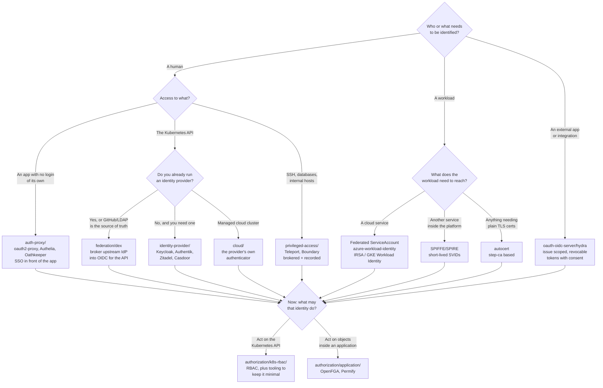

[← Cluster security](../README.md)

# Identity and access

Who you are, and what you may do — two different systems, two different failure modes, and
the folder that keeps them apart.

Children: [`authentication/`](authentication/README.md) — proving identity ·
[`authorization/`](authorization/README.md) — deciding what that identity may do

## Contents

1. [The split that runs through everything](#1-the-split-that-runs-through-everything)
   - [Why conflating them is expensive](#why-conflating-them-is-expensive)
   - [The third thing nobody names: accounting](#the-third-thing-nobody-names-accounting)
2. [Three subjects, three mechanisms](#2-three-subjects-three-mechanisms)
   - [Humans](#humans)
   - [Workloads](#workloads)
   - [External clients](#external-clients)
   - [The rule that follows](#the-rule-that-follows)
3. [Where the decision is enforced](#3-where-the-decision-is-enforced)
4. [What Kubernetes gives you, and what it does not](#4-what-kubernetes-gives-you-and-what-it-does-not)
5. [Decision tree](#5-decision-tree)
6. [Anti-patterns](#6-anti-patterns)
7. [How this applies to pikakube](#7-how-this-applies-to-pikakube)

---

## 1. The split that runs through everything

> **Authentication answers "who are you?". Authorization answers "what may you do?".**

They are routinely spoken of as one thing ("auth"), and they are not. They run in sequence,
they are usually implemented by different components, and they fail in opposite directions.

| | Authentication | Authorization |
|---|---|---|
| The question | who is this? | may this identity do X to Y? |
| Input | a credential — password, token, certificate, assertion | an already-established identity, plus an action and a resource |
| Output | a **subject** (a username, a set of groups, a claim set) | **allow** or **deny** |
| Typical component | an identity provider, an auth proxy, the API server's token reviewer | RBAC, an admission policy engine, an application policy service |
| Failure mode when broken open | **impersonation** — anyone becomes anyone | **privilege escalation** — a legitimate identity does more than it should |
| Failure mode when broken shut | nobody can log in — loud, obvious, fixed in minutes | someone is silently denied — reported as "the tool is broken" |

The asymmetry in that last row is why the two need different operational treatment.
A broken login is an incident that pages you. A wrong authorization decision either lets an
attacker move laterally without a single alarm, or produces a support ticket that a hurried
engineer closes by granting `cluster-admin`.

### Why conflating them is expensive

Three concrete consequences of treating "auth" as one system:

- **You cannot rotate the identity provider without touching every policy.** If group names
  from the IdP are hardcoded into a hundred RoleBindings, changing IdP means rewriting
  policy. Keeping the layers separate means the IdP emits claims and the policy layer maps
  claims to permissions — two independently replaceable halves.
- **You cannot answer "who can delete production?"** Authentication logs tell you who logged
  in. Only the authorization model tells you what that login could reach, and it is the
  question every audit asks.
- **You over-grant to unblock a login problem.** A user who authenticated successfully but
  gets `Forbidden` looks identical, from the help desk's side, to a user who failed to log
  in. The fastest fix for both is more permissions. That is how clusters accumulate
  `cluster-admin`.

### The third thing nobody names: accounting

The classic framing is **AAA — Authentication, Authorization, Accounting**. The third A is
the audit trail: *what actually happened*. It matters because the first two are preventive
controls and the third is the only detective one. Without it, a compromised but valid
credential is invisible by construction — every request it makes is correctly authenticated
and correctly authorized.

Accounting for the Kubernetes API lives in `security/2-cluster/audit/`, not here. This
folder covers the first two As. The privileged-access tools
([`privileged-access/`](authentication/privileged-access/README.md)) are the one place where
all three collapse into a single product, because session recording *is* accounting.

---

## 2. Three subjects, three mechanisms

The most useful decomposition of this folder is not by tool. It is by **who or what is being
authenticated**, because the three have almost nothing in common.

### Humans

A human has a browser, can be redirected, can type a password, can approve a push
notification. That is what makes interactive protocols — OIDC's authorization-code flow,
SAML's redirect binding — possible at all.

| Property | Consequence |
|---|---|
| Has a browser | redirect-based flows work; MFA is possible |
| Sessions are long (hours) | a cookie or refresh token is the artifact |
| Joins and leaves the company | **lifecycle is the hard part** — offboarding must actually revoke |
| Small population, high value | worth central management in an IdP |

Covered by [`identity-provider/`](authentication/identity-provider/README.md),
[`federation/`](authentication/federation/README.md),
[`auth-proxy/`](authentication/auth-proxy/README.md) and
[`privileged-access/`](authentication/privileged-access/README.md).

### Workloads

A pod has no browser, cannot be redirected, and cannot type anything. Whatever proves its
identity has to be delivered to it by the platform, without a human in the loop, and it has
to be replaced automatically before it expires.

| Property | Consequence |
|---|---|
| No browser, no human | redirect flows are impossible; the platform must inject identity |
| Restarts constantly | credentials must be obtained at startup, not baked in |
| Population is large and churns | manual issuance does not scale at all |
| Identity is *attested*, not claimed | the platform vouches: "this is the pod running under ServiceAccount X in namespace Y" |

This is [`workload-identity/`](authentication/workload-identity/README.md), and it is the
most consequential section in this folder.

### External clients

A third-party application, a CI job, a partner integration, a mobile app. It is not a person
and not a pod, it lives outside the trust boundary, and it acts *on behalf of* someone.

| Property | Consequence |
|---|---|
| Acts for a user, or for itself | OAuth2 exists precisely for the "on behalf of" case |
| Outside your control | credentials must be scoped, revocable and short-lived |
| Consent matters | the user should be able to see and revoke what an app can do |

This is what an OAuth2 authorization server is for —
[`oauth-oidc-server/`](authentication/oauth-oidc-server/README.md).

### The rule that follows

> **Never solve one subject's problem with another subject's mechanism.**

The two mistakes this rule prevents are both extremely common:

- **Giving a workload a human's credential.** A service account in the IdP with a password
  that never expires, shared by three pipelines, and known to four people. It cannot be
  attributed, cannot be rotated without breakage, and outlives everyone who set it up.
- **Giving a human a workload's credential.** Handing an engineer a Kubernetes
  ServiceAccount token so they can use `kubectl`. It never expires, carries no MFA, is not
  tied to a person, and survives their offboarding intact.

---

## 3. Where the decision is enforced

The same request can be checked at several points, and each point sees different
information. Knowing which layer owns which decision is what stops policy from being
duplicated in three places and enforced in none.

| Layer | Sees | Can decide | Cannot decide |
|---|---|---|---|
| **Ingress / auth proxy** | the HTTP request, the session cookie | is there a valid session? does the user belong to a permitted group? | anything about the object being touched — it has not been parsed yet |
| **Kubernetes API server** | the authenticated subject, verb, resource, namespace | RBAC: may this subject `get` `pods` in `ns`? | anything about *field values* — RBAC does not read the object body |
| **Admission control** | the full object | is this manifest allowed? (policy engines) | nothing about application data |
| **The application itself** | the user and the specific record | may Alice open document 42? | nothing about the cluster |

Two things fall out of this table:

- **RBAC cannot express "may not set `privileged: true`".** RBAC operates on verbs and
  resource types, never on field values. That is why policy engines exist as a separate
  layer (`security/2-cluster/policies/`), and why "just use RBAC" is not an answer to
  workload hardening.
- **The API server cannot express "may Alice open document 42".** Per-object, per-user
  application permissions are not a cluster concern at all. That is
  [`authorization/application/`](authorization/application/README.md).

---

## 4. What Kubernetes gives you, and what it does not

Worth being blunt about, because the gap is where most of this folder lives.

| | Built in? | Reality |
|---|---|---|
| Authorization for the API | **yes** — RBAC | genuinely good, and the tools in [`k8s-rbac/`](authorization/k8s-rbac/README.md) exist to make it usable, not to replace it |
| Authentication of workloads to the API | **yes** — ServiceAccount tokens | since v1.21 they are projected, audience-bound and short-lived. Use them; do not create `kubernetes.io/service-account-token` Secrets |
| Authentication of humans to the API | **no** | there is no user database in Kubernetes. `User` and `Group` are strings that an authenticator produces, and nothing more |
| A user API | **no** | you cannot `kubectl create user`. This surprises people constantly |
| Authentication for your applications | **no** | the cluster authenticates calls to *its own API*. It does nothing for the dashboard you exposed through an Ingress |

> **Kubernetes has no users.** It has *authenticators* that turn a credential into a username
> and a list of groups. Everything human-facing in this folder exists because of that single
> design decision.

The practical shapes for human access to the API are exactly three: an OIDC issuer the API
server trusts (see [`federation/dex/`](authentication/federation/dex/README.md)), a cloud
provider's own authenticator (see [`cloud/`](authentication/cloud/README.md)), or a broker
that mints short-lived credentials on demand
([`privileged-access/`](authentication/privileged-access/README.md)). X.509 client
certificates are a fourth, and the reason to avoid them is that Kubernetes has no revocation
mechanism for them — a leaked client certificate is valid until it expires, full stop.

---

## 5. Decision tree

## 6. Anti-patterns

| Anti-pattern | Why it is bad | What to do instead |
|---|---|---|
| Treating authentication and authorization as one system | you cannot replace the IdP without rewriting policy, and you cannot audit permissions independently of logins | IdP emits claims; the policy layer maps claims to permissions |
| Distributing X.509 client certificates for `kubectl` | Kubernetes has **no revocation** for them — a leaked certificate is valid until expiry, and offboarding does not touch it | OIDC through Dex or the cloud authenticator, or a broker that mints short-lived credentials |
| A shared "service account" in the IdP, used by pipelines | not attributable, never rotated, outlives the people who created it | workload identity, or a per-workload OAuth2 client |
| A long-lived ServiceAccount token handed to a human | no MFA, no expiry, not tied to a person, survives offboarding | OIDC for humans; ServiceAccounts are for pods |
| Authorization enforced only in the UI | the API is still open; every serious attack path goes around the UI | enforce at the API, and let the UI merely reflect it |
| Granting `cluster-admin` to resolve a `Forbidden` | the fastest fix for the wrong problem; it is permanent, and nobody revisits it | derive the minimal Role from what the workload actually did — see [`audit2rbac/`](authorization/k8s-rbac/audit2rbac/README.md) |
| No audit trail | a stolen but valid credential produces perfectly legitimate-looking traffic; there is nothing to detect | API audit logging, plus session recording for privileged access |
| Group names from the IdP hardcoded across policy | rebinding to a new IdP means editing every binding | one mapping layer from claims to platform roles |

## 7. How this applies to pikakube

Everything in this folder is a **catalogue of options with manifests staged**, not a
deployed identity platform. Nothing here is wired into a Flux Kustomization, and the
credentials that appear in the staged values (`secret`, `password`,
`PleaseGenerateASecureKey`, `ThisIsNotASecurePassword`) are chart placeholders that would
have to be replaced by real secret references before any of it ran.

The one piece with real history is `oauth2-proxy`: it was used to put GitHub authentication
in front of MLflow, which is exactly the auth-proxy pattern and exactly the situation it
suits — see
[`auth-proxy/oauth2/oauth2-proxy/`](authentication/auth-proxy/oauth2/oauth2-proxy/README.md).

For a local single-node cluster the honest ordering is:

| Priority | Why |
|---|---|
| 1. An auth proxy in front of the exposed dashboards | the platform already exposes Grafana, MLflow and similar through Ingress with no authentication in front of them. This is the only gap with real exposure today |
| 2. One identity provider, or Dex against GitHub | a single place that says who you are. Dex is cheaper if GitHub is already the source of truth |
| 3. RBAC hygiene tooling | `kubiscan` and `audit2rbac` are read-only CLIs — they cost nothing to run and tell you what the cluster currently permits |
| 4. Workload identity | with no cloud provider in the picture, SPIRE is a large amount of machinery for a local cluster. It is the right answer on a real platform and the wrong first move here |

The layer this connects to most directly is certificate issuance — every identity mechanism
here ultimately rests on TLS, and the private-CA story is already worked out in
[`certificates/README.md`](../certificates/README.md).

---

[← Cluster security](../README.md)
