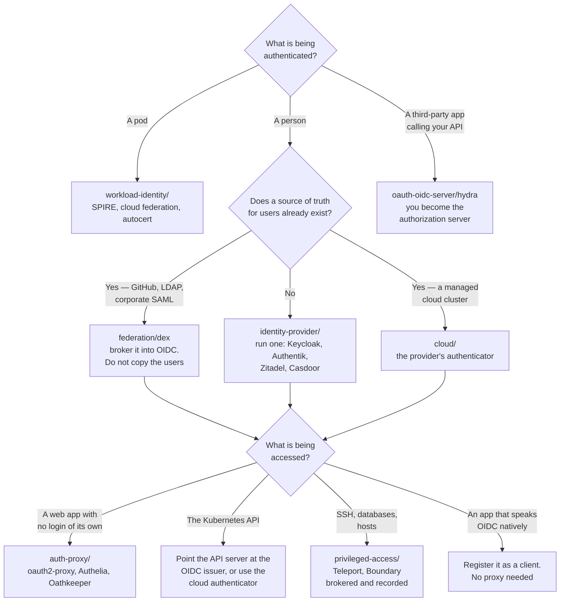

[← Identity and access](../README.md)

# Authentication

Proving who — or what — is making a request, before anything decides whether to allow it.

Children: [`identity-provider/`](identity-provider/README.md) ·
[`federation/`](federation/README.md) ·
[`auth-proxy/`](auth-proxy/README.md) ·
[`oauth-oidc-server/`](oauth-oidc-server/README.md) ·
[`workload-identity/`](workload-identity/README.md) ·
[`privileged-access/`](privileged-access/README.md) ·
[`cloud/`](cloud/README.md)

## Contents

1. [What a credential actually is](#1-what-a-credential-actually-is)
   - [The three families](#the-three-families)
   - [The property that separates good from bad](#the-property-that-separates-good-from-bad)
2. [The protocols](#2-the-protocols)
   - [OIDC](#oidc)
   - [SAML](#saml)
   - [LDAP](#ldap)
   - [Which one you actually meet, and where](#which-one-you-actually-meet-and-where)
3. [OAuth2 is not authentication](#3-oauth2-is-not-authentication)
4. [How a token is validated](#4-how-a-token-is-validated)
   - [Revocation, the unsolved half](#revocation-the-unsolved-half)
5. [The subfolders, and what each one is for](#5-the-subfolders-and-what-each-one-is-for)
   - [How they compose](#how-they-compose)
6. [Decision tree](#6-decision-tree)
7. [Anti-patterns](#7-anti-patterns)
8. [How this applies to pikakube](#8-how-this-applies-to-pikakube)

---

## 1. What a credential actually is

Every authentication mechanism reduces to the same shape: the subject presents something,
and the verifier checks it against something it already trusts. What differs is *what* is
presented, and that difference decides almost everything else.

### The three families

| Family | What is presented | What the verifier holds | Examples |
|---|---|---|---|
| **Something you know** | a shared secret, sent in full | the same secret, or a hash of it | password, API key, database credential |
| **Something you have** | a proof derived from a secret that is **never sent** | a public key, or a trusted issuer's public key | X.509 client certificate, signed JWT, WebAuthn, SVID |
| **Something you are** | a biometric measurement | a local template | fingerprint, face — always local to a device, never over the wire |

The middle family is the one that matters for infrastructure, and the parenthetical is the
whole point: **the secret never leaves the holder**. A password is transmitted on every use,
so every endpoint that receives it is a place it can leak. A signed token proves possession
of a key without exposing the key, so a compromised verifier learns nothing reusable.

### The property that separates good from bad

Not "how strong is the secret". This:

> **How long is the credential valid, and what has to happen for it to stop being valid?**

| Credential | Lifetime | Revocation |
|---|---|---|
| Password in a Secret | until someone remembers to change it | requires finding every consumer |
| Static cloud access key | years, typically | manual, and usually discovered during an incident |
| X.509 client cert for `kubectl` | months to years | **none in Kubernetes** — no CRL, no OCSP check |
| OIDC ID token | 5–60 minutes | expiry *is* the revocation |
| Projected ServiceAccount token | 1 hour, audience-bound | expiry, plus the ServiceAccount can be deleted |
| SPIFFE SVID | minutes to an hour | expiry, plus the registration entry can be removed |

Everything in the bottom half of that table shares one property: **nothing has to be
remembered**. The credential expires by default, and staying valid is what requires ongoing
effort. That inversion is the single most useful idea in this folder.

---

## 2. The protocols

Three protocols carry essentially all human authentication. They are not interchangeable and
they are not generations of the same idea, despite being frequently described that way.

### OIDC

**OpenID Connect** — a thin identity layer on top of OAuth2. The user is redirected to an
identity provider, authenticates there, and comes back with an **ID token**: a JWT with
claims about who they are, signed by the provider.

| | |
|---|---|
| Transport | HTTP redirects, JSON, JWT |
| The artifact | an ID token (identity) and usually an access token (authorization) |
| Discovery | `/.well-known/openid-configuration` — the endpoint that makes integration nearly automatic |
| Key distribution | JWKS: the provider publishes its public keys at a URL, clients fetch and cache them |
| Kubernetes support | **native** — the API server accepts OIDC tokens directly |

This is the default for anything new. Both its reach and its cost are low: the discovery
document plus JWKS means a client needs an issuer URL and a client ID and very little else.

### SAML

**Security Assertion Markup Language** — XML assertions, posted through the browser, signed
with XML Digital Signature.

| | |
|---|---|
| Transport | HTTP redirect and HTTP POST bindings, XML |
| The artifact | a signed XML assertion |
| Key distribution | metadata XML exchanged out of band, usually by hand |
| Kubernetes support | **none** — the API server does not speak SAML |

SAML is not dead and will not be. It is what enterprise SaaS and corporate IdPs
(ADFS, Okta, Entra ID in legacy configurations) already have configured and audited. When a
company says "use our SSO", SAML is a common answer, and the practical response is to put
something in front of it that speaks SAML upstream and OIDC downstream — which is exactly
what [Dex](federation/dex/README.md) and the full identity providers do.

XML signature validation is genuinely hard to implement correctly; SAML has a long history
of signature-wrapping vulnerabilities. That is an argument for using a mature implementation,
not for writing your own.

### LDAP

**Lightweight Directory Access Protocol** — not an SSO protocol at all. It is a *directory*:
a hierarchical database of users, groups and attributes, queried over its own binary
protocol.

| | |
|---|---|
| Transport | LDAP/LDAPS, its own protocol |
| The artifact | a successful `bind`, plus attributes read from the directory |
| Where it lives | Active Directory, OpenLDAP, FreeIPA |
| Kubernetes support | none directly |

The distinction that matters: LDAP authenticates by **sending the password to the
directory**, which is why it is a first-family credential and why LDAP-based access to
modern applications is a downgrade. But LDAP is frequently the **source of truth** for who
exists and which groups they are in, even where login happens over OIDC. Reading groups from
LDAP while authenticating over OIDC is a completely normal architecture.

### Which one you actually meet, and where

| Situation | Protocol |
|---|---|
| Anything new, any cloud-native tool | **OIDC** |
| Kubernetes API server | **OIDC** — the only federated option it speaks |
| Corporate SSO in a large enterprise | **SAML**, often, with OIDC available on newer tenants |
| Legacy on-prem apps, group membership, `sudo` rules | **LDAP** |
| A tool that supports "SSO" on its paid tier only | usually SAML — the classic SSO tax |

---

## 3. OAuth2 is not authentication

This confusion is universal and worth stating flatly.

> **OAuth2 is a delegated authorization protocol.** It answers "may this application call
> that API on the user's behalf?". It says nothing about who the user is.

An OAuth2 access token is a bearer token for an API. It has no defined format, no required
claims about the user, and the resource server is not supposed to care who the user is — only
what the token permits. Deriving identity from it is guesswork.

OIDC exists precisely to fix this: it adds an **ID token** with a defined format and defined
identity claims (`sub`, `iss`, `aud`, `email`), plus the discovery and JWKS machinery. The
practical rules:

| Do | Do not |
|---|---|
| Validate the **ID token** to establish identity | Treat an **access token** as proof of identity |
| Use `sub` as the stable user identifier | Use `email` as the primary key — it changes, and it can be re-assigned |
| Check `iss` and `aud` on every token | Accept a token because the signature verified |

That last row is the most common real vulnerability: a signature-valid token issued by the
right provider for a *different application* will verify perfectly. Checking `aud` is what
stops one application's token from being replayed against another.

---

## 4. How a token is validated

Two models, and the operational difference between them is large.

| | Local validation (JWT) | Introspection |
|---|---|---|
| How | verify the signature against the JWKS, check `exp`, `iss`, `aud` | call the provider's `/introspect` endpoint for every request |
| Network cost | none per request; JWKS fetched and cached | one round trip per request |
| The provider is a hard dependency | no — validation survives an IdP outage | **yes** — the IdP going down takes everything with it |
| Revocation before expiry | **impossible** | possible |
| Token size | large; all claims travel in the token | small, opaque |

The trade is exactly revocation against availability, and there is no clever way out of it.
The standard compromise: short-lived access tokens validated locally, plus a long-lived
refresh token that *is* checked against the provider when it is exchanged. Revocation then
takes effect within one access-token lifetime rather than instantly, which is nearly always
acceptable and dramatically cheaper.

### Revocation, the unsolved half

Worth being honest that the following do not have good answers in most deployments:

- **A stolen JWT cannot be recalled.** Until it expires, it is valid everywhere it is
  accepted. Short lifetimes are the mitigation, not a fix.
- **Kubernetes X.509 client certificates cannot be revoked at all.** There is no CRL or OCSP
  path in the API server. The only remedy is rotating the cluster CA, which invalidates every
  certificate at once.
- **Offboarding must reach every layer.** Disabling the IdP account stops new logins. It does
  not invalidate an issued token, a cached kubeconfig, or a personal access token held
  somewhere else.

---

## 5. The subfolders, and what each one is for

| Folder | Answers | Use when | Detail |
|---|---|---|---|
| **identity-provider** | "where do users live?" | you need to *own* the user database, or you need to be the SSO for several apps | [→](identity-provider/README.md) |
| **federation** | "how do I reuse an existing IdP?" | GitHub, LDAP or a corporate SAML IdP is already the source of truth | [→](federation/README.md) |
| **auth-proxy** | "how do I put a login in front of an app that has none?" | exposing a dashboard, a UI, an internal tool | [→](auth-proxy/README.md) |
| **oauth-oidc-server** | "how do I issue tokens to third-party clients?" | you are the API being called, and clients act on users' behalf | [→](oauth-oidc-server/README.md) |
| **workload-identity** | "how does a pod prove what it is, without a stored secret?" | any pod calling a cloud service or another service | [→](workload-identity/README.md) |
| **privileged-access** | "how do humans reach infrastructure, with a record?" | SSH, database and cluster access by people | [→](privileged-access/README.md) |
| **cloud** | "how does the cloud's own identity map into the cluster?" | managed clusters on a cloud provider | [→](cloud/README.md) |

### How they compose

These are layers, not alternatives, and the common stacks are worth naming:

- **Dex + oauth2-proxy** — Dex federates GitHub upstream and speaks OIDC downstream;
  oauth2-proxy sits at the ingress and turns that into a session cookie for apps that have no
  login. Two small components, and the cheapest complete SSO story available.
- **Keycloak alone** — Keycloak is both the IdP *and* an OAuth2/OIDC server, so it replaces
  the federation and oauth-oidc-server layers at once. Heavier to operate, and one thing
  instead of three.
- **Hydra + your own login UI** — Hydra is the token machinery only. It delegates the actual
  login to something else, which may be Keycloak, Dex, or an application you already own.
- **SPIRE beneath all of it** — workload identity is orthogonal to every human-facing layer
  above. It runs in parallel and solves a different problem.

---

## 6. Decision tree

## 7. Anti-patterns

| Anti-pattern | Why it is bad | What to do instead |
|---|---|---|
| Treating an OAuth2 access token as proof of identity | it is an API capability, not an identity assertion; its format and claims are undefined | validate the OIDC **ID token** |
| Verifying a JWT's signature without checking `iss` and `aud` | a valid token minted for another application passes | check issuer and audience on every token |
| Using `email` as the user primary key | emails change and can be reassigned to a new person | use `sub` |
| Copying users out of the corporate directory into a new IdP | two user databases immediately diverge, and offboarding only reaches one | federate — Dex or an IdP connector |
| Long-lived access tokens to avoid refresh complexity | revocation stops existing; a leaked token is valid for its whole lifetime | short access tokens plus a refresh token |
| Introspection on every request without a fallback | the IdP becomes a synchronous dependency of every request in the platform | local JWT validation, short lifetimes |
| Rolling your own SAML or JWT validation | signature-wrapping and `alg: none` are old bugs that keep being reintroduced | use a mature library or an existing proxy |
| Assuming disabling the IdP account revokes access | issued tokens, cached kubeconfigs and personal access tokens all survive it | short lifetimes, plus an explicit offboarding checklist per layer |
| One OAuth2 client shared by every application | a leaked secret compromises all of them, and per-app scope becomes impossible | one client per application |

## 8. How this applies to pikakube

Nothing here is running. Every subfolder holds staged manifests, and none is referenced by a
Flux Kustomization.

The concrete state, folder by folder:

| Folder | Staged | Notes |
|---|---|---|
| `auth-proxy` | oauth2-proxy (raw manifests **and** a HelmRelease), Authelia, Oathkeeper | oauth2-proxy is the only thing here with real usage history — GitHub org/team gating in front of MLflow |
| `identity-provider` | Keycloak, Authentik, Zitadel — all with a Postgres alongside | Keycloak's chart situation is recorded as a genuine problem; see its Notes |
| `federation` | Dex, with Postgres storage and a GitHub connector, plus an `AuthenticationConfiguration` example for the API server | the closest thing to a finished design in this folder |
| `oauth-oidc-server` | Hydra, with `dev: true` | development mode only |
| `workload-identity` | SPIRE, azure-workload-identity; athenz and autocert are links only | no cloud provider in play locally, so this is aspirational |
| `privileged-access` | Teleport; Boundary is a link only | |
| `cloud` | aws-iam-authenticator — a link only, and the link points at kube2iam | see its Notes; the two are different things |

If one thing were to be finished first, Dex plus oauth2-proxy against GitHub is the obvious
candidate: GitHub is already the identity of record for this repository, both components are
small, and together they cover both the Kubernetes API and every exposed dashboard.

---

[← Identity and access](../README.md)
