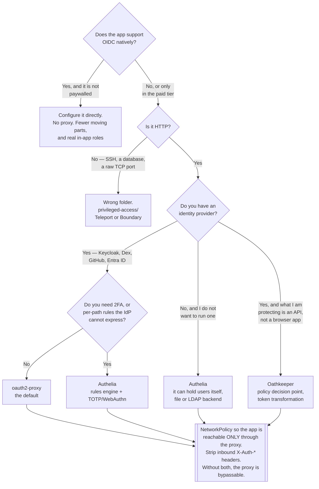

[← Authentication](../README.md)

# Auth proxy

How you put SSO in front of an application that has no login of its own — without touching
the application.

Children: [`oauth2/`](oauth2/README.md) — oauth2-proxy, the standard ·
[`authelia/`](authelia/README.md) — policy and 2FA ·
[`oathkeeper/`](oathkeeper/README.md) — Ory's policy decision point

## Contents

1. [The problem, precisely](#1-the-problem-precisely)
2. [Forward-auth, in ingress terms](#2-forward-auth-in-ingress-terms)
   - [The request flow](#the-request-flow)
   - [The first request, in full](#the-first-request-in-full)
   - [The two deployment shapes](#the-two-deployment-shapes)
3. [What the application receives](#3-what-the-application-receives)
   - [The header-trust problem](#the-header-trust-problem)
4. [The three tools compared](#4-the-three-tools-compared)
5. [What an auth proxy cannot do](#5-what-an-auth-proxy-cannot-do)
6. [Decision tree](#6-decision-tree)
7. [Anti-patterns](#7-anti-patterns)
8. [How this applies to pikakube](#8-how-this-applies-to-pikakube)

---

## 1. The problem, precisely

A platform accumulates web UIs at an alarming rate: Grafana, MLflow, Airflow, Spark History
Server, Kafka UI, Prometheus, Alertmanager, an operator dashboard, a one-off internal tool
someone wrote. Each one gets an Ingress. And the authentication situation across them is
always some mixture of:

| Situation | Frequency | The real risk |
|---|---|---|
| No authentication at all | common — Prometheus, Alertmanager, most operator dashboards | anyone who reaches the Ingress has full access |
| A local user database, one admin password | common | a shared password nobody rotates, and no link to offboarding |
| Real OIDC support, but only in the paid tier | very common — the "SSO tax" | you have the money or you do not |
| Real OIDC support, free | the minority | configure it directly; you do not need this folder |

The auth proxy is the answer to the first three. It is a reverse proxy placed in the request
path that **completes the OIDC flow itself** and only forwards requests it has already
authenticated. The application behind it is unmodified and, importantly, unaware.

> The proxy converts a hard problem — "make N applications support SSO" — into a solved one:
> "make one component support SSO, and put it in front of all N."

That is the whole value proposition, and it is a large one. The cost is stated in §5, and it
is real.

## 2. Forward-auth, in ingress terms

There are two ways to place the proxy, and the one that matters on Kubernetes is
**forward-auth**, because it needs no change to how the application is routed.

### The request flow

In forward-auth the ingress controller keeps handling the traffic. Before proxying a request
upstream, it makes a **subrequest** to the auth service and acts on the status code:

| Auth service returns | Ingress controller does |
|---|---|
| `2xx` | forwards the original request upstream, optionally copying response headers onto it |
| `401` | redirects the browser to the configured sign-in URL |
| `403` | denies — authenticated, but not permitted |

On ingress-nginx this is two annotations: `auth-url` (where to send the subrequest) and
`auth-signin` (where to redirect on `401`). Traefik calls the same thing a `ForwardAuth`
middleware; Envoy Gateway and Istio call it external authorization. The mechanism is
identical.

The distinction worth internalising: **the auth proxy is not in the data path**. Only a small
subrequest goes to it, per request. The response body never passes through it. That keeps the
proxy small and stops it becoming a bandwidth bottleneck.

### The first request, in full

Worth walking once, because every confusing symptom in this area is explained by one of these
steps:

1. Browser requests `https://grafana.example.com/`, with no session cookie.
2. Ingress makes the subrequest to the auth service. No cookie, so it answers `401`.
3. Ingress redirects the browser to the sign-in URL, carrying the original URL as a parameter
   (`rd` for oauth2-proxy).
4. The proxy redirects the browser to the identity provider's authorization endpoint.
5. The user authenticates at the IdP — and here MFA, the corporate password policy and every
   other IdP control apply.
6. The IdP redirects back to the proxy's callback path with an authorization code.
7. The proxy exchanges the code for tokens **server to server**, validates the ID token, and
   sets an **encrypted session cookie**.
8. The proxy redirects the browser to the original URL.
9. This time the subrequest carries the cookie, the auth service returns `2xx` plus identity
   headers, and the request reaches Grafana.

Three practical consequences fall directly out of that list:

- **The callback path must be routed to the proxy.** `/oauth2/*` for oauth2-proxy. Forgetting
  this produces an infinite redirect loop — the single most common failure in this folder.
- **The cookie domain decides the blast radius.** A cookie on `.example.com` is one session
  across every subdomain. That is convenient and it is also a lateral-movement path: any app
  under that domain can read it.
- **The IdP redirect URI must match exactly.** Scheme, host, port and path. Mismatches produce
  an error at the IdP, not at the proxy, which sends people debugging in the wrong place.

### The two deployment shapes

| Shape | How | Trade-off |
|---|---|---|
| **Central, forward-auth** | one proxy deployment; every Ingress points its `auth-url` at it | one component to run and configure. **The usual answer.** Requires an ingress controller that supports the subrequest |
| **Sidecar / in-path** | the proxy sits in front of one application and proxies to it (`--upstream`) | no ingress-controller support needed, and works for a single app. N applications means N proxies, N clients, N configurations |

The in-path shape is also what you use when the proxy must rewrite the request body or
terminate a non-HTTP protocol — but on Kubernetes with a modern ingress controller, central
forward-auth is nearly always correct.

## 3. What the application receives

Once authenticated, the proxy passes identity to the application as **HTTP headers**:

| Header | Contains |
|---|---|
| `X-Auth-Request-User` | the username |
| `X-Auth-Request-Email` | the email |
| `X-Auth-Request-Groups` | group membership |
| `X-Auth-Request-Access-Token` | the raw token, if explicitly enabled |
| `Authorization: Bearer …` | optional, for applications that only understand bearer tokens |

Applications that support "proxy authentication", "trusted header auth" or "auth proxy mode"
read exactly these. Grafana's `auth.proxy` and Kibana's equivalent are the well-known cases.

### The header-trust problem

This is the failure mode that turns an auth proxy into a vulnerability, and it deserves its
own heading.

> **If the application trusts `X-Auth-Request-User`, then anyone who can reach the application
> directly can set that header and become anyone.**

The proxy is only a control if it is the *only* path to the application. Two things must
therefore be true, and both are easy to get wrong:

- **Network isolation.** A NetworkPolicy that only permits the ingress controller (or the
  proxy) to reach the application's pods. Without it, any pod in the cluster can `curl` the
  Service directly with a forged header. This is not a hypothetical — it is the standard
  lateral-movement move once one pod is compromised.
- **Header stripping at the edge.** The ingress must delete any inbound `X-Auth-Request-*`
  header arriving from a client before the subrequest, so a client cannot inject one from
  outside.

The tools that pass a signed JWT instead of a plain header (Oathkeeper's ID token mutator,
oauth2-proxy forwarding the access token) reduce this risk, because the application can verify
the signature rather than trusting the network. That only helps if the application actually
validates it.

## 4. The three tools compared

| | [oauth2-proxy](oauth2/README.md) | [Authelia](authelia/README.md) | [Oathkeeper](oathkeeper/README.md) |
|---|---|---|---|
| Written in | Go | Go | Go |
| Primary job | complete the OIDC flow, hold the session | **authentication portal** with its own policy engine | **policy decision point** for APIs |
| Own user database | no — always delegates to an IdP | **yes** — a YAML file or LDAP | no |
| MFA / 2FA | no | **yes** — TOTP, WebAuthn, push | no |
| Per-path authorization rules | coarse — groups, emails, domains | **yes** — a rich rules engine, by domain, path, subject, network | **yes** — access rules per route |
| Session storage | cookie, or Redis | file, or Redis | stateless by design |
| Handles browser login flows | yes | yes, with its own portal UI | **poorly** — it is built for API traffic |
| Reason to pick it | the default; smallest thing that works | you need 2FA or per-path policy without an IdP | you already run Ory, and you are protecting APIs |

The honest summary: **oauth2-proxy is the answer unless you can name why it is not.** Authelia
earns its place when you need 2FA and per-path rules and do not want to stand up a full IdP.
Oathkeeper is a different category of tool that happens to be reachable through the same
ingress mechanism.

## 5. What an auth proxy cannot do

The limitation is structural, and pretending otherwise is how these deployments become
theatre.

**The proxy authenticates. It barely authorizes, and it never authorizes *inside* the
application.**

| The proxy can decide | The proxy cannot decide |
|---|---|
| is there a valid session? | is this user an admin *in Grafana*? |
| is the user in group `platform`? | may this user edit *this specific* dashboard? |
| may this group reach `/admin/*`? | may this user see rows for tenant B? |

It sees a URL and a set of claims. It has not parsed the request body, it does not know the
application's object model, and it has no idea what the response will contain. Everything
per-object is the application's own authorization problem — which is
[`authorization/application/`](../../authorization/application/README.md).

The good pattern is the split: the proxy authenticates and passes groups, and the application
maps those groups to its own roles. Grafana's `auto_assign_org_role` and role mapping from
headers is a well-worn example. Where the application has no such mapping, everyone who gets
through the proxy is equal inside it — which is often acceptable for an internal tool, and
must be a decision rather than an accident.

One further limit: an auth proxy protects **HTTP**. It does nothing for a database port, a
Kafka listener, or SSH. That is [`privileged-access/`](../privileged-access/README.md).

## 6. Decision tree

## 7. Anti-patterns

| Anti-pattern | Why it is bad | What to do instead |
|---|---|---|
| An auth proxy with no NetworkPolicy behind it | any pod in the cluster reaches the app directly and forges the identity header; the proxy becomes decoration | restrict the app's ingress to the proxy or the ingress controller |
| Not stripping inbound `X-Auth-Request-*` headers | an external client injects its own identity | delete those headers at the edge, always |
| Using a proxy for an app that speaks OIDC natively | an extra hop, a second session, and you lose real in-app roles | configure the app's own OIDC |
| One cookie domain across every application | a single session is valid everywhere; one compromised app can lift it | scope cookies per application where the apps differ in trust |
| Forgetting to route the callback path to the proxy | infinite redirect loop, and the error appears to come from the app | route `/oauth2/*` (or the tool's equivalent) to the proxy |
| Treating "is authenticated" as "is authorized" | every user who can log in becomes an admin of the tool | map groups to in-app roles, or accept it explicitly |
| Session cookie without `Secure` and `HttpOnly` | the session is readable by JavaScript and sendable in clear | set both; use TLS end to end |
| A shared OAuth2 client for every protected app | one leaked secret compromises all of them, and per-app scope is impossible | one client per application |
| Very long cookie lifetimes to avoid re-login | offboarding does not take effect until the cookie expires | short sessions with refresh, not long sessions |

## 8. How this applies to pikakube

This is the **highest-value gap in the whole identity folder** for this platform, because the
exposure is already real: services are exposed through ingress-nginx on `nip.io` hostnames
with nothing in front of them.

The staged state:

| Tool | What is staged | Notes |
|---|---|---|
| oauth2-proxy | raw manifests **and** a Flux HelmRelease | the raw manifests are the historical MLflow deployment, gated on a GitHub org and team |
| Authelia | a HelmRelease using the OCI chart, with a file authentication backend, local storage and a `foobar.nip.io` cookie domain | placeholder values; the ingress block is explicitly marked as unfinished |
| Oathkeeper | HelmReleases for Oathkeeper and Oathkeeper Maester | values are empty |

ingress-nginx is already the ingress controller, so `auth-url` / `auth-signin` forward-auth is
available with no new component. Combined with
[Dex](../federation/dex/README.md) against GitHub, that is the shortest path from "everything
is open" to "everything requires a GitHub login in the right org".

The step that must not be skipped afterwards is the NetworkPolicy behind the proxy. A local
cluster makes that easy to forget precisely because nothing bad appears to happen without it.

---

[← Authentication](../README.md)
