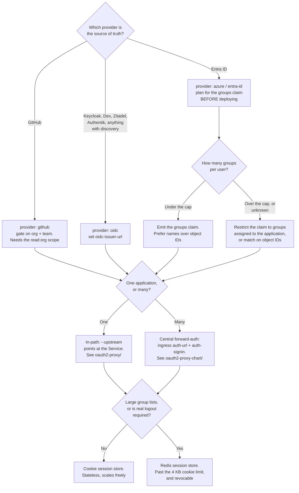

[← Auth proxy](../README.md)

# OAuth2 Proxy

The default auth proxy — and two ways of deploying it that are both kept here.

Children: [`oauth2-proxy/`](oauth2-proxy/README.md) — the original raw manifests ·
[`oauth2-proxy-chart/`](oauth2-proxy-chart/README.md) — the Helm chart, managed by Flux

## Contents

1. [Why oauth2-proxy is the default](#1-why-oauth2-proxy-is-the-default)
2. [Providers, and what changes between them](#2-providers-and-what-changes-between-them)
   - [The group problem](#the-group-problem)
3. [The configuration that actually matters](#3-the-configuration-that-actually-matters)
   - [Sessions: cookie or Redis](#sessions-cookie-or-redis)
4. [Why there are two folders](#4-why-there-are-two-folders)
5. [Decision tree](#5-decision-tree)
6. [Anti-patterns](#6-anti-patterns)
7. [Notes](#7-notes)
8. [How this applies to pikakube](#8-how-this-applies-to-pikakube)

---

## 1. Why oauth2-proxy is the default

Because it does one thing, and the thing it does is the whole job for most platforms:
complete the OAuth2/OIDC authorization-code flow, hold the resulting session in an encrypted
cookie, and answer the ingress controller's forward-auth subrequest.

| Property | Consequence |
|---|---|
| No user database | it cannot be a source of truth, which means it cannot drift from one |
| No policy engine | coarse allow-lists only: email domains, specific emails, groups |
| Stateless by default | session lives in the cookie; scaling to N replicas needs no shared state |
| One binary, small config | the failure surface is small enough to reason about |
| Works as forward-auth **or** in-path | fits either deployment shape from [../README.md](../README.md) |

The absence of features is the argument. Everything it does not do — MFA, user management,
per-path rules — is done better by a component that specialises in it, and delegating those
keeps this component boring. Boring is the correct property for something in the request path
of every internal tool you own.

Its CNCF-adjacent history helps too: it is the component that appears in nearly every
"expose Grafana/Prometheus/Alertmanager with SSO" guide, so the failure modes are
well-documented and the annotations are copy-pasteable.

## 2. Providers, and what changes between them

oauth2-proxy ships explicit support for a list of providers plus a generic `oidc` provider.
The generic one works with anything that publishes a discovery document, which is most things.

| Provider | Notable behaviour |
|---|---|
| `github` | filters by **org and team** rather than by group claim; uses GitHub's API, not OIDC |
| `oidc` | generic; needs `--oidc-issuer-url`, discovery does the rest. The right choice for Keycloak, Dex, Zitadel, Authentik |
| `azure` / `entra-id` | Entra ID; group claims are the hard part — see below |
| `google` | supports restricting to a Workspace domain, and can read groups via the Admin SDK |
| `keycloak-oidc` | a specialised variant that understands Keycloak's roles and groups claims |

The choice of provider changes three things and nothing else: how the login URL is built, how
the token is exchanged, and **how group membership is discovered**. That third one is where
the time goes.

### The group problem

Authenticating a user is easy. Answering "which groups is this user in?" is where every
provider differs, and it matters because group membership is the only authorization signal
oauth2-proxy has.

| Provider | Where groups come from | The catch |
|---|---|---|
| GitHub | org and team membership via the API | needs the `read:org` scope; teams must be requested explicitly |
| Generic OIDC | a `groups` claim in the ID token | the IdP must be configured to emit it — it is not there by default |
| Entra ID | a `groups` claim, or a Microsoft Graph call | **the claim is omitted once a user is in too many groups**, and by default it contains object IDs, not names |

That Entra ID row is the recorded pain in this folder, and it is worth stating precisely.
Entra ID caps the `groups` claim; past the limit, the token instead carries an *overage*
indication and the consumer is expected to call Microsoft Graph to enumerate groups. A proxy
that only reads the claim therefore sees no groups at all for exactly the users who are in the
most of them — which is usually the administrators. It fails open or closed depending on the
allow-list, and either way it fails confusingly.

The workable configurations are: emit group **names** rather than IDs where the tenant allows
it, restrict the emitted groups to those actually assigned to the application, or match on
object IDs directly and accept that the configuration is unreadable.

## 3. The configuration that actually matters

Everything else is defaults. These are the settings that decide whether it works and whether
it is safe:

| Setting | Why it matters |
|---|---|
| `--cookie-secret` | the key that encrypts the session cookie. Must be exactly 16, 24 or 32 bytes — a wrong length is a startup failure with an unhelpful message |
| `--cookie-domain` | decides how far the session reaches. Broad means one login for everything, and one cookie worth stealing |
| `--cookie-secure` / `--cookie-httponly` | on, always. Off means the session travels in clear or is readable by JavaScript |
| `--email-domain` | `*` allows **every** authenticated account at the provider. On a public IdP like GitHub or Google that is effectively "anyone on the internet with an account" |
| `--redirect-url` | must match what is registered at the IdP, exactly |
| `--whitelist-domain` | which redirect targets are permitted after login; without it, open-redirect is a real risk |
| `--set-xauthrequest` | emit the `X-Auth-Request-*` headers the upstream reads |
| `--skip-auth-route` | paths that bypass authentication — health checks, webhooks. Every entry is a hole, so keep the list short and explicit |

The `--email-domain=*` row deserves emphasis. Combined with the `github` provider it is
harmless *only* because the org and team filters do the actual gating. Combined with the
`google` or generic `oidc` provider and no other restriction, it authenticates the world.

### Sessions: cookie or Redis

| | Cookie store | Redis store |
|---|---|---|
| State | none; the whole session is in the cookie | server-side, cookie holds a ticket |
| Scaling | trivial — any replica can serve any request | needs Redis to be available |
| Size limit | **4 KB per cookie**; large group lists overflow and the cookie is split or dropped | no practical limit |
| Logout | cannot truly revoke — the cookie stays valid until expiry | can delete the session server-side |

The 4 KB limit is the usual reason people move to Redis: a user in fifty groups produces a
token that does not fit. The symptom is a login loop for *some* users only, which is a
miserable thing to debug from first principles.

## 4. Why there are two folders

The same tool, two deployment generations, kept side by side because they document different
things.

| Folder | What it is | Why it is still here |
|---|---|---|
| [`oauth2-proxy/`](oauth2-proxy/README.md) | plain `Deployment` + `Service`, pinned to an old image, configured entirely through environment variables, deployed into the `mlflow` namespace | the **worked example** — a real integration in front of a real application, with the GitHub org/team gating visible in full |
| [`oauth2-proxy-chart/`](oauth2-proxy-chart/README.md) | a Flux `HelmRelease` against the official chart | the **current shape** — the way anything new should be deployed here |

The first is in-path (it proxies straight to MLflow's Service). The second is the general
component, deployable centrally as forward-auth. That is not just packaging: it is the two
deployment shapes from [../README.md](../README.md), one per folder.

## 5. Decision tree

## 6. Anti-patterns

| Anti-pattern | Why it is bad | What to do instead |
|---|---|---|
| `--email-domain=*` with a public IdP and no other filter | any Google or GitHub account on the internet authenticates successfully | restrict by domain, org/team, or group |
| Cookie secret in plain text in the manifest | it decrypts every session cookie; anyone with repo read access can forge one | a Secret reference, sourced from the platform's secret management |
| Reusing one OAuth2 client across every protected app | one leaked secret compromises all of them; per-app scoping becomes impossible | one client per application |
| Assuming the `groups` claim is present | most IdPs omit it unless configured, and Entra ID drops it past a cap | verify the claim in a real token before writing allow-lists against it |
| Cookie store with users in many groups | the 4 KB limit is exceeded and login loops for those users only | Redis session store |
| Running an unpinned or very old image | oauth2-proxy has had real CVEs, and it sits in the request path of everything | pin a current version and update it deliberately |
| Long `--cookie-expire` to avoid re-login | revocation and offboarding do not take effect until it expires | short sessions plus refresh |
| Broad `--skip-auth-route` patterns | a regex that matches more than intended silently unauthenticates paths | narrow, explicit, reviewed entries |
| No `--whitelist-domain` | the post-login redirect becomes an open redirect | list the permitted redirect targets |

## 7. Notes

The recorded note for this folder was a link plus a short status list, in Portuguese:

**`https://github.com/oauth2-proxy/oauth2-proxy`** — the project. Originally Bitly's
`oauth2_proxy`, then Pusher's fork (`quay.io/pusher/oauth2_proxy`, which is what the raw
manifests still use), now community-maintained under the `oauth2-proxy` organisation. That
lineage matters practically: the old Pusher images are **abandoned and unpatched**, and the
current images live at `quay.io/oauth2-proxy/oauth2-proxy`.

**`DONE`** — a completion list, translated:

- *"Integrate authentication with GitHub"* — done, and the artifact is the raw deployment in
  [`oauth2-proxy/`](oauth2-proxy/README.md): the `github` provider gating on an org and a
  team.
- *"Integrate authentication with Entra ID"* — done, and the artifacts are the reference links
  preserved in [`oauth2-proxy/`](oauth2-proxy/README.md), which are specifically about the
  Entra ID group-claim problem described in §2. The fact that the two recorded GitHub issues
  are both about groups is itself the finding: authentication against Entra ID was
  straightforward, and **group mapping was the part that took the work**.

## 8. How this applies to pikakube

This is the only tool in the whole identity folder with a real deployment history in this
repository, and the shape of that history is instructive.

The raw manifests protected **MLflow**, which is a textbook fit: MLflow has no
authentication of its own, it was exposed through an Ingress, and the entire access-control
requirement was "people in my GitHub org's `mlflow` team". Two objects and an environment
block solved it, with no identity provider deployed anywhere.

The HelmRelease is the successor and the direction of travel: Flux-managed, current chart
(`7.7.12`), its own namespace, and deployable once as central forward-auth rather than once
per protected application. Its `values` are empty as staged, so it is a placeholder rather
than a configuration.

Because ingress-nginx is already the ingress controller, moving from the first shape to the
second costs two annotations per Ingress. That, plus a provider — GitHub directly, or
[Dex](../../federation/dex/README.md) if the Kubernetes API needs the same identity — is a
complete SSO story for the platform's exposed dashboards.

---

[← Auth proxy](../README.md)
