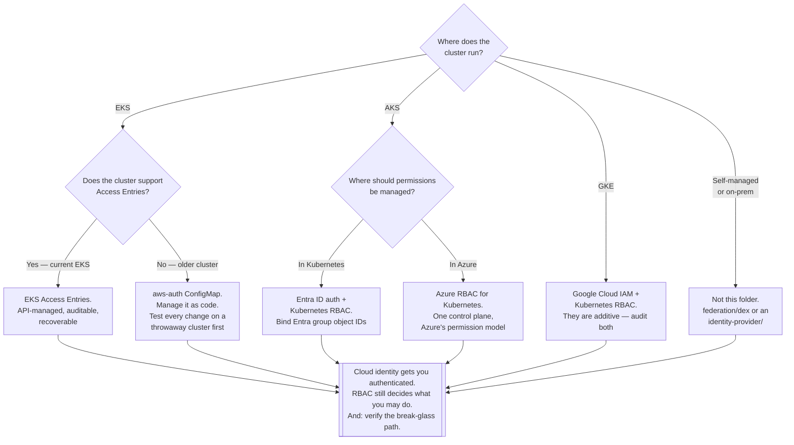

[← Authentication](../README.md)

# Cloud

How a cloud provider's own identity system becomes a Kubernetes identity — and why every
managed cluster does this differently.

Children: [`aws-iam-authenticator/`](aws-iam-authenticator/README.md)

## Contents

1. [The problem this layer exists to solve](#1-the-problem-this-layer-exists-to-solve)
2. [How each provider does it](#2-how-each-provider-does-it)
   - [AWS](#aws)
   - [Azure](#azure)
   - [GCP](#gcp)
3. [The direction people confuse](#3-the-direction-people-confuse)
4. [What you actually configure](#4-what-you-actually-configure)
5. [Decision tree](#5-decision-tree)
6. [Anti-patterns](#6-anti-patterns)
7. [How this applies to pikakube](#7-how-this-applies-to-pikakube)

---

## 1. The problem this layer exists to solve

A managed Kubernetes cluster arrives inside an account that already has an identity system —
IAM, Entra ID, Google Cloud IAM — with users, roles, MFA and an audit trail already in place.
Meanwhile Kubernetes, as established in [`../../README.md`](../../README.md), **has no users
at all**: only authenticators that turn a credential into a username and a list of groups.

Without a bridge you would end up maintaining two identity systems for the same people, with
two offboarding processes, of which one would inevitably be forgotten. So every managed
Kubernetes offering ships a bridge, and the bridge is what this folder is about.

The shape is always the same:

```
cloud credential  →  [provider's authenticator]  →  Kubernetes username + groups  →  RBAC
```

The important consequence: **the cloud handles authentication, and Kubernetes RBAC still
handles authorization.** Signing in with a powerful IAM role does not make you
`cluster-admin`; it makes you a username that RBAC has to have been told about. Both halves
have to be configured, and forgetting the second is the usual reason a new engineer can
authenticate and then do nothing.

## 2. How each provider does it

### AWS

Two generations, and knowing which one a cluster uses changes everything about how access is
granted.

| | `aws-iam-authenticator` era | EKS Access Entries (2023 onwards) |
|---|---|---|
| Where the mapping lives | the `aws-auth` ConfigMap in `kube-system` | the EKS API — a first-class `AccessEntry` resource |
| Managed by | editing a ConfigMap, by hand or by Terraform | the AWS API, IAM policy, CloudTrail |
| Failure mode | **a malformed edit locks everyone out of the cluster, irreversibly** | API-level validation; access is recoverable through IAM |
| Auditable | no — a ConfigMap edit | yes — CloudTrail |

The mechanism underneath is the same and is worth understanding, because it is genuinely
clever: the client generates a **pre-signed AWS STS `GetCallerIdentity` request** and sends
that as the bearer token. The server-side authenticator replays it against STS, and STS
answers with the caller's ARN. No AWS credential is ever transmitted, and the token is
naturally short-lived.

The `aws-auth` ConfigMap is the single most notorious lockout in EKS operations. Access
Entries exist because of it. See [`aws-iam-authenticator/`](aws-iam-authenticator/README.md).

### Azure

AKS integrates with **Entra ID** using ordinary OIDC — the API server is configured with
Entra ID as its OIDC issuer, and `kubelogin` performs the browser login and caches the token.

Two modes, and the difference is not cosmetic:

| Mode | Authorization decided by |
|---|---|
| **Entra ID authentication + Kubernetes RBAC** | Kubernetes RBAC, bound to Entra **group object IDs** |
| **Azure RBAC for Kubernetes** | Azure role assignments — permissions are managed entirely in Azure, and Kubernetes RBAC is bypassed for those principals |

The first binds `Group` subjects whose names are Entra object IDs, which makes RoleBindings
unreadable and is the price of the integration. The second puts everything in one place at the
cost of expressing Kubernetes-shaped permissions in Azure's model.

### GCP

GKE uses Google Cloud IAM directly. `gcloud container clusters get-credentials` writes a
kubeconfig whose credential plugin fetches a Google OAuth2 token, and the API server validates
it against Google.

Google IAM roles (`container.viewer`, `container.developer`, `container.admin`) grant broad,
cluster-wide capability; Kubernetes RBAC then refines within that. The two are **additive**,
which trips people up: removing a RoleBinding does not remove access granted by a project-level
IAM role, and the IAM role is usually the one that was forgotten.

## 3. The direction people confuse

This folder is one direction only, and the opposite direction lives in a different folder.

| Direction | Question | Where it lives |
|---|---|---|
| **Cloud identity → Kubernetes** | "how does my IAM user run `kubectl`?" | **here** |
| **Kubernetes identity → cloud** | "how does my pod call S3 without a stored access key?" | [`workload-identity/`](../workload-identity/README.md) |

They sound symmetric and are not. The first authenticates **humans** into the cluster and is
solved by the provider's authenticator plugin. The second authenticates **workloads** out to
the cloud, and is solved by federating a Kubernetes ServiceAccount to a cloud identity over
OIDC — IRSA on EKS, Workload Identity Federation on GKE, and
[azure-workload-identity](../workload-identity/azure-workload-identity/README.md) on AKS.

The confusion is understandable because the older tools blurred it. It is worth keeping
straight, because the second direction is where the large security win is.

## 4. What you actually configure

For any provider, the checklist is the same four items:

| Item | Detail |
|---|---|
| **Which cloud principals may reach the API at all** | an IAM policy, an Entra group assignment, or a GCP IAM role. This is the outer gate |
| **How they map to Kubernetes subjects** | Access Entries, `aws-auth`, or a `Group` subject naming an Entra object ID |
| **RBAC for those subjects** | still required; the cloud only performs authentication (except Azure RBAC mode) |
| **A break-glass path** | a credential that works when the identity integration is broken |

The last one is not optional and it is regularly skipped. If the cluster only accepts cloud
identities and the integration breaks — a tenant misconfiguration, a deleted role, a mangled
ConfigMap — there is no way back in. Every provider offers something: EKS keeps the cluster
creator's IAM principal as an implicit admin, AKS can keep local accounts enabled, GKE has
project-owner access. Decide deliberately which one you rely on, and verify it works *before*
you need it.

## 5. Decision tree



## 6. Anti-patterns

| Anti-pattern | Why it is bad | What to do instead |
|---|---|---|
| Editing `aws-auth` by hand on a live cluster | one malformed entry locks every principal out, permanently | Access Entries, or manage the ConfigMap as reviewed code |
| Assuming cloud admin implies `cluster-admin` | authentication succeeds and every command returns `Forbidden`, which looks like a broken cluster | configure RBAC as a separate, deliberate step |
| No break-glass credential | when the identity integration breaks there is no path back in | keep and periodically **test** one recovery route |
| Binding individual cloud users in RBAC | every joiner and leaver becomes a cluster change | bind groups; manage membership in the cloud directory |
| Long-lived static cloud keys in a kubeconfig | a permanent credential in a file that gets copied around | the provider's credential plugin, which fetches short-lived tokens |
| Using this layer for pods | a human authentication path is the wrong tool for a workload, and it means storing a credential | [`workload-identity/`](../workload-identity/README.md) |
| Relying on GKE project-level IAM for day-to-day access | it is additive to RBAC and invisible from inside the cluster; removing a RoleBinding changes nothing | grant the minimum IAM role and do the rest in RBAC |
| Entra object IDs in RoleBindings with no comment | nobody can tell what a binding grants six months later | keep a documented mapping from object ID to group name |

## 7. How this applies to pikakube

**Directly: not at all.** pikakube runs locally on Kind. There is no cloud account, no IAM, and
no managed control plane whose authenticator could be configured.

The folder is here as a map, and it earns its place for two reasons.

First, it names the boundary. Human access to the API on a local or self-managed cluster is not
a cloud problem at all — it is [`federation/dex`](../federation/dex/README.md) or a full
[`identity-provider/`](../identity-provider/README.md). Knowing that this folder does not apply
is itself the useful conclusion.

Second, it holds the distinction in §3 that the rest of the folder depends on. The
cloud-identity-to-cluster direction documented here is the one that does not transfer to a
local cluster; the cluster-identity-to-cloud direction, in
[`workload-identity/`](../workload-identity/README.md), is the one that matters everywhere and
is the largest available security improvement on any real platform.

The only artifact in the folder is [`aws-iam-authenticator/`](aws-iam-authenticator/README.md),
and it is a link with a recorded confusion worth keeping — see its Notes.

---

[← Authentication](../README.md)
