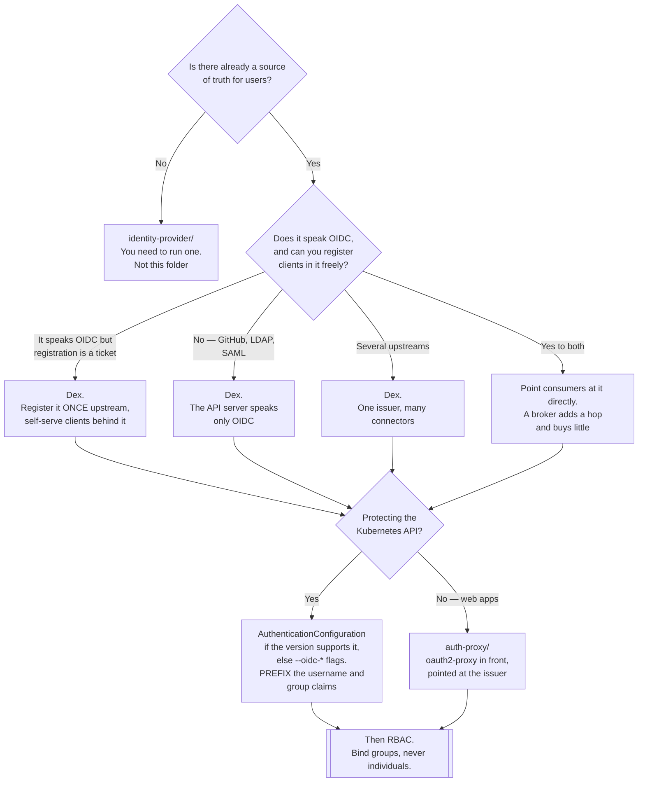

[← Authentication](../README.md)

# Federation

Reusing an identity provider you already have, instead of building a second one.

Children: [`dex/`](dex/README.md)

## Contents

1. [Federation, in one sentence](#1-federation-in-one-sentence)
2. [The broker pattern](#2-the-broker-pattern)
   - [Why a broker rather than direct integration](#why-a-broker-rather-than-direct-integration)
3. [The classic case: Kubernetes API authentication](#3-the-classic-case-kubernetes-api-authentication)
   - [Structured authentication configuration](#structured-authentication-configuration)
4. [Broker or full identity provider](#4-broker-or-full-identity-provider)
5. [Decision tree](#5-decision-tree)
6. [Anti-patterns](#6-anti-patterns)
7. [How this applies to pikakube](#7-how-this-applies-to-pikakube)

---

## 1. Federation, in one sentence

> **Federation is trusting an identity assertion made by somebody else.**

You do not hold the user's password, you do not run their MFA, and you do not manage their
account lifecycle. You trust a signed statement from a provider that does, and you map its
claims onto your own subjects.

The alternative — copying users into a system you own — is worse in a specific and predictable
way: **two user databases diverge immediately.** Someone leaves the company, the corporate
directory is updated, and the copy is not. The account that keeps working is the one nobody
remembers exists. Every synchronisation mechanism ever built for this problem is a mitigation
of a self-inflicted wound.

## 2. The broker pattern

A broker sits between consumers and providers, speaking one protocol downstream and many
upstream:

```
GitHub  ─┐
LDAP    ─┤
SAML IdP ┼──►  broker  ──►  OIDC  ──►  Kubernetes API
Google  ─┤                        └─►  oauth2-proxy
Entra ID ┘                        └─►  ArgoCD, Grafana, …
```

It stores no users. It authenticates against an upstream connector, translates the result into
an OIDC ID token signed by itself, and forgets. Its only persistent state is refresh tokens
and auth-request bookkeeping.

### Why a broker rather than direct integration

If the upstream already speaks OIDC — Google, Entra ID, Okta — you can often point consumers
straight at it. The broker earns its place when one of these is true:

| Reason | Detail |
|---|---|
| **The upstream does not speak OIDC** | GitHub's API, LDAP and SAML are all common, and the Kubernetes API server speaks none of them |
| **More than one upstream** | employees on SAML, contractors on GitHub, service users in LDAP — consumers should not know or care |
| **The upstream cannot be reconfigured** | a corporate IdP where every new client application is a ticket with a security review. Register the broker once and self-serve behind it |
| **You want one issuer to be replaceable** | consumers trust the broker's issuer URL; swapping the upstream changes one component instead of every client |
| **Claims need reshaping** | mapping upstream groups to platform-meaningful names in one place, rather than in each consumer |

That fourth row is the strategic one. Trust in the broker's issuer is the abstraction; without
it, "we are moving from Okta to Entra ID" means touching every application.

## 3. The classic case: Kubernetes API authentication

This is the reason Dex exists and the reason this folder does.

The Kubernetes API server can authenticate humans in exactly one federated way: **OIDC**. It
has no SAML support, no LDAP support and no GitHub support, and it never will. So when GitHub
or a corporate SAML IdP is the source of truth, something has to translate — and that something
is a broker.

Configured with OIDC, the API server:

- fetches the issuer's JWKS and validates the ID token signature locally
- takes a username from a configured claim, optionally with a prefix
- takes groups from a configured claim, optionally with a prefix
- hands the resulting `User` and `Group` subjects to RBAC

The prefixes exist for a real reason. Without them, an upstream group called `system:masters`
would grant cluster-admin to whoever can create it upstream. Prefixing (`oidc:`) makes upstream
names unable to collide with Kubernetes' built-in ones. Configure it.

Two limitations to plan around, because they surprise people:

- **The API server never redirects.** It only validates a token it is handed. Obtaining that
  token is entirely the client's job — `kubectl oidc-login` (the `kubelogin` plugin), or a
  helper that runs the browser flow and caches the result.
- **Token lifetime is the session.** ID tokens are short by design; the client must hold a
  refresh token and renew, or the user re-authenticates constantly.

### Structured authentication configuration

Newer Kubernetes versions accept an `AuthenticationConfiguration` file instead of the older
`--oidc-*` flags, and it is a meaningful improvement:

| | `--oidc-*` flags | `AuthenticationConfiguration` |
|---|---|---|
| Number of issuers | **one** | several |
| Claim mapping | one claim, one prefix | CEL expressions over the claim set |
| Validation rules | none | CEL rules that reject tokens or users |
| Changing it | restart the API server | reloadable on supported versions |

The CEL rules are the part worth using. A rule like
`!user.username.startsWith('system:')` blocks the entire class of attack where an upstream
identity claims a reserved Kubernetes name — and it is exactly the rule present in the example
staged in [`dex/`](dex/README.md).

## 4. Broker or full identity provider

The overlap with [`identity-provider/`](../identity-provider/README.md) is real, since Keycloak
and Authentik both do brokering too. The distinction that matters in practice:

| | Broker (Dex) | Full IdP (Keycloak, Authentik, Zitadel) |
|---|---|---|
| Stores users | **no** | yes |
| Login UI | minimal — a connector chooser | full: registration, password reset, account console |
| MFA | delegated upstream | built in |
| Admin UI | **none** — configuration is a file | yes |
| Operational weight | one small Go process | an application plus a database, with real upgrade paths |
| Fails when the upstream is down | yes, completely | only for federated users |

> **If you have a source of truth, broker it. If you need to *be* the source of truth, run an
> identity provider.**

The common mistake is running Keycloak purely to federate GitHub. That is a database, a JVM,
realm configuration and an upgrade treadmill, in place of one stateless binary — for
functionality Dex covers in a config file.

The opposite mistake is choosing Dex and then wanting local users, password reset, MFA
enrolment and an admin UI. Dex has none of those and is not going to grow them; that is a
deliberate scope decision, not a gap.

## 5. Decision tree



## 6. Anti-patterns

| Anti-pattern | Why it is bad | What to do instead |
|---|---|---|
| Copying users out of the corporate directory | the copy diverges the day it is made, and offboarding only reaches one of them | federate; store no users |
| OIDC groups with no prefix | an upstream group named `system:masters` becomes cluster-admin | set `--oidc-groups-prefix`, or a CEL mapping that prefixes |
| Using `email` as the username claim | emails change and get reassigned; RBAC bindings silently follow the wrong person | use `sub`, prefixed |
| Running a full IdP purely to broker GitHub | a database and a JVM in place of one stateless binary | Dex |
| Choosing Dex and then needing local users and MFA | Dex has neither by design and will not gain them | an [`identity-provider/`](../identity-provider/README.md) |
| No high availability for the broker | it is on the login path for the whole platform; one pod means one restart logs everyone out | more than one replica, with shared storage |
| SQLite or in-memory storage in production | refresh tokens vanish on restart, so every user re-authenticates | Postgres, or the CRD storage backend |
| Binding individual users in RBAC | every joiner and leaver becomes a cluster change | bind groups from the upstream |
| Trusting an issuer over plain HTTP | the JWKS can be swapped and any token forged | TLS, with a CA the API server actually trusts |

## 7. How this applies to pikakube

Federation is the **right answer for this platform**, and it is the closest thing in this whole
folder to a finished design.

The reasoning is short: GitHub is already the identity of record for this repository. There is
no corporate directory, no requirement to own a user database, and no appetite for operating
Keycloak on a local single-node cluster. Dex against GitHub gives the platform an OIDC issuer
in one small process.

What is staged in [`dex/`](dex/README.md) reflects that — a GitHub connector scoped to an
organisation and team, Postgres storage rather than in-memory, and an example
`AuthenticationConfiguration` for the API server complete with the `system:` prefix guard.

Two things stand between that and working:

- **The API server must be told about the issuer.** On Kind that means extra flags or an
  `AuthenticationConfiguration` file on the control-plane node — a cluster-creation concern,
  not something a manifest in this folder can do.
- **The issuer must be reachable over TLS at a name the API server trusts.** The staged issuer
  is a placeholder hostname; the real one would be a `nip.io` name with a certificate from the
  platform's private CA, and the API server would need that CA. The mechanics are already
  worked out in [`certificates/README.md`](../../../certificates/README.md).

Paired with [oauth2-proxy](../auth-proxy/oauth2/README.md) at the ingress, the same Dex
issuer covers both halves of human access — the API and every exposed dashboard — from one
GitHub login. That is the cheapest complete identity story available here.

---

[← Authentication](../README.md)
