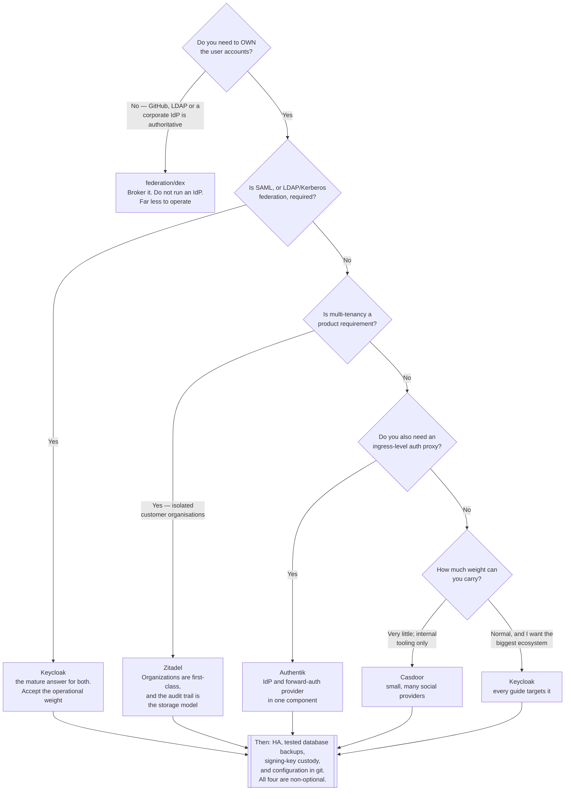

[← Authentication](../README.md)

# Identity providers

Running the system that *owns* the users — and choosing which one, which is a decade-long
commitment.

Children: [`keycloak/`](keycloak/README.md) — the heavyweight default ·
[`authentik/`](authentik/README.md) — modern, good UX ·
[`zitadel/`](zitadel/README.md) — Go, multi-tenant, event-sourced ·
[`casdoor/`](casdoor/README.md) — Go, lighter ·
[`aaa/`](aaa/README.md) — an empty placeholder

## Contents

1. [What an identity provider actually is](#1-what-an-identity-provider-actually-is)
   - [The parts you are buying](#the-parts-you-are-buying)
2. [The protocols it must speak](#2-the-protocols-it-must-speak)
   - [OIDC](#oidc)
   - [SAML](#saml)
   - [LDAP](#ldap)
   - [Which still appear, and where](#which-still-appear-and-where)
3. [The four tools](#3-the-four-tools)
   - [Keycloak](#keycloak)
   - [Authentik](#authentik)
   - [Zitadel](#zitadel)
   - [Casdoor](#casdoor)
   - [Side by side](#side-by-side)
4. [What running one actually costs](#4-what-running-one-actually-costs)
5. [Decision tree](#5-decision-tree)
6. [Anti-patterns](#6-anti-patterns)
7. [How this applies to pikakube](#7-how-this-applies-to-pikakube)

---

## 1. What an identity provider actually is

A broker ([`federation/`](../federation/README.md)) trusts somebody else's assertion. An
identity provider **makes** the assertion. It is the source of truth: it holds the accounts, it
verifies the credentials, it enforces the policy, and everything downstream believes it.

That is a much bigger commitment than it first appears, and the reason is not technical:

> **An identity provider is the hardest component in a platform to replace.** Every application
> holds a client registration pointing at it, every RBAC binding names its groups, every user
> has enrolled a second factor in it, and every audit report cites it. Migrating means touching
> all of that at once, with a hard cutover, because two identity providers cannot both be
> authoritative.

So the choice deserves more care than most infrastructure choices, and "we can swap it later"
is not true in the way it is true of, say, an ingress controller.

### The parts you are buying

An identity provider is not one feature. It is a bundle, and different products are strong in
different parts of it:

| Part | What it means | Why it is hard |
|---|---|---|
| **User store** | accounts, credentials, attributes | password hashing, lockout, breach-list checks |
| **Authentication flows** | password, MFA, passwordless, social login, step-up | every branch is a security decision |
| **Protocol endpoints** | OIDC, OAuth2, SAML, sometimes LDAP | specification compliance is genuinely difficult |
| **Federation** | brokering upstream IdPs, and mapping their claims | claim mapping is where the bugs live |
| **Lifecycle** | provisioning, SCIM, joiner/mover/leaver | integrating with HR systems |
| **Multi-tenancy** | isolation between realms/organisations | the largest architectural difference between these products |
| **Admin experience** | a UI, an API, configuration as code | decides whether it is operable by anyone but you |

The last row is where most of the difference in day-to-day pain lies, and it is the one least
represented in feature comparisons.

## 2. The protocols it must speak

### OIDC

Identity on top of OAuth2. The user is redirected, authenticates, and returns with a signed
**ID token** — a JWT with defined identity claims. Discovery
(`/.well-known/openid-configuration`) and JWKS mean a client needs an issuer URL and a client
ID and very little else.

**This is the default for anything new**, and it is the only federated protocol the Kubernetes
API server speaks.

### SAML

XML assertions posted through the browser, signed with XML Digital Signature. Metadata is
exchanged out of band, usually by hand.

SAML is not a legacy protocol in the sense of being obsolete — it is a legacy protocol in the
sense of being *already deployed and already audited* across enterprise SaaS. Any IdP that
needs to serve an enterprise will need it. Two practical notes: XML signature validation is
notoriously hard to implement correctly (signature-wrapping attacks have a long history), and
there is no discovery mechanism, so every integration is manual metadata exchange.

### LDAP

Not an SSO protocol at all — a *directory*. A hierarchical database of users, groups and
attributes, queried over a binary protocol, where authentication means a `bind` operation that
**sends the password to the directory**.

Its role today is usually as a **source**, not a destination: Active Directory or OpenLDAP is
where the org chart lives, and the IdP reads from it while login itself happens over OIDC. Some
IdPs also *expose* an LDAP endpoint, which exists for one reason — old applications that can
speak nothing else.

### Which still appear, and where

| Situation | Protocol |
|---|---|
| Anything cloud-native, any new integration | **OIDC** |
| Kubernetes API server | **OIDC**, exclusively |
| Enterprise SaaS "SSO" tier | **SAML**, very often |
| Corporate directory, group membership, `sudo` rules | **LDAP** as the source |
| Legacy internal apps, network appliances, old Java | **LDAP**, sometimes RADIUS |

An IdP that speaks only OIDC is fine for a platform team and insufficient for a company.

## 3. The four tools

### Keycloak

The heavyweight default. Red Hat, Java, an enormous feature set, and by far the largest
installed base of any open-source IdP.

| | |
|---|---|
| Strengths | complete protocol coverage (OIDC, OAuth2, SAML, and an LDAP/Kerberos federation provider); a genuinely powerful **authentication flow** builder; fine-grained authorization services; **realms** for multi-tenancy; every integration guide on the internet already targets it |
| Weaknesses | operationally heavy — JVM memory tuning, Infinispan clustering, a database, and upgrades that have historically been disruptive. The admin UI is large and not self-explanatory. Configuration as code means realm JSON import/export, which is verbose and awkward to diff |
| Pick it when | you need SAML, or LDAP/Kerberos federation, or fine-grained authorization services, or you need the option to buy support (Red Hat build of Keycloak) |

Keycloak is the answer when the requirement list is long. It is over-specified for "put a login
in front of three dashboards", and its operational weight is a real recurring cost rather than
a one-off setup cost.

### Authentik

Modern, Python (Django), and the one people consistently describe as pleasant to configure.

| | |
|---|---|
| Strengths | the **flow/stage model** makes authentication journeys explicit and composable — the clearest mental model of the four. Excellent built-in support for acting as a **forward-auth provider** for proxies, so it covers the [`auth-proxy/`](../auth-proxy/README.md) case natively. Good UX, good docs, fast-moving |
| Weaknesses | needs Postgres **and** Redis **and** separate server and worker deployments — more moving parts than its reputation suggests. Younger, so a smaller body of production experience. Release cadence is fast, which cuts both ways |
| Pick it when | you want one component that is both the IdP and the ingress-level auth proxy, and you value configuration you can reason about |

### Zitadel

Go, cloud-native by design, and architecturally the most distinctive of the four.

| | |
|---|---|
| Strengths | **event-sourced** — every change is an immutable event, so the audit trail is the storage model rather than a feature bolted on. First-class **multi-tenancy** through Organizations, rather than realms retrofitted. Strong API-first design; passwordless and WebAuthn are well supported. Single Go binary |
| Weaknesses | event sourcing means the database is the performance story, and it is opinionated about it (originally CockroachDB, now Postgres-first). Smaller ecosystem, fewer integration guides. SAML support exists but is not the focus |
| Pick it when | multi-tenancy is a product requirement, or an immutable audit trail is a compliance requirement, or you are building a B2B SaaS where "organisations" is a domain concept |

### Casdoor

Go, lighter, and honest about being lighter.

| | |
|---|---|
| Strengths | small and quick to stand up. Very broad list of social login providers. Speaks OIDC, OAuth2, SAML, CAS and LDAP. Simple data model |
| Weaknesses | smaller community; documentation quality is uneven; less battle-tested for high-assurance deployments. Fewer advanced flow capabilities |
| Pick it when | you need an IdP with a lot of social providers and low operational weight, and the security bar is internal-tooling rather than regulated |

### Side by side

| | Keycloak | Authentik | Zitadel | Casdoor |
|---|---|---|---|---|
| Language | Java | Python | Go | Go |
| OIDC / OAuth2 | yes | yes | yes | yes |
| SAML IdP | **yes, mature** | yes | yes | yes |
| LDAP as a source | **yes, mature** | yes | limited | yes |
| Exposes an LDAP endpoint | via extensions | yes | no | yes |
| MFA | TOTP, WebAuthn, recovery codes | TOTP, WebAuthn, Duo, SMS | TOTP, WebAuthn, passwordless-first | TOTP, WebAuthn |
| Multi-tenancy | realms | brands/tenants | **Organizations, first-class** | organisations |
| Built-in forward-auth for proxies | no | **yes** | no | no |
| Data store | Postgres/MySQL etc. | Postgres + Redis | Postgres | many |
| Operational weight | **high** | medium | medium | **low** |
| Config as code | realm JSON import | blueprints | API / Terraform | API |
| Ecosystem size | **largest by far** | growing fast | moderate | small |

## 4. What running one actually costs

The choice between these four matters less than the decision to run one at all. What that
decision commits you to:

| Commitment | Detail |
|---|---|
| **Availability** | it is on the login path for everything. When it is down, nobody signs in anywhere. Multi-replica plus a real database, not a single pod |
| **The database is the crown jewels** | it holds credentials, MFA enrolments and sessions. Losing it means every user re-enrols every second factor. Backups must be tested, not merely configured |
| **Signing keys** | rotating them invalidates tokens; losing them breaks every client. They need the same care as a CA key |
| **Upgrades** | schema migrations on the user database, and downtime windows that are visible to the whole company |
| **Configuration drift** | realms and clients configured through a UI are not in git. Every one of these products has a configuration-as-code story, and every one of them requires discipline to actually use |
| **Someone must own it** | it is not a component you deploy and forget; it accumulates clients, mappers and exceptions |

That list is the real argument for [`federation/`](../federation/README.md). If a source of
truth already exists, brokering it with Dex costs almost none of the above.

## 5. Decision tree

## 6. Anti-patterns

| Anti-pattern | Why it is bad | What to do instead |
|---|---|---|
| Running an IdP when a source of truth already exists | a second user database that diverges immediately, and two offboarding processes | [`federation/dex`](../federation/README.md) |
| Configuring realms and clients through the UI only | the configuration is not in git; a rebuild loses it and nobody knows what changed | realm import, blueprints, or Terraform |
| A single replica | it is the login path for the whole platform; one restart signs everyone out | multiple replicas with shared session storage |
| Untested database backups | credentials and MFA enrolments are unrecoverable, and every user must re-enrol | restore drills, on a schedule |
| The chart's default admin password left in place | it is published in the values file | a Secret, generated and rotated |
| Groups from the IdP wired directly into RBAC everywhere | renaming a group breaks bindings across the cluster | one mapping layer from IdP groups to platform roles |
| Signing keys with no rotation plan | a leaked key forges any identity, and rotating in a hurry breaks every client | plan rotation, with overlapping key validity |
| An IdP that speaks only OIDC in an enterprise | the SaaS your company bought needs SAML, and there is no way to bridge it later | check the protocol requirements before choosing |
| Treating the IdP as replaceable later | every client, binding, enrolment and audit report points at it; there is no gradual migration | choose deliberately, once |

## 7. How this applies to pikakube

**The honest position: this platform probably should not run one of these.**

Three of the four have manifests staged — Keycloak, Authentik and Zitadel, each with a Postgres
alongside — and none is wired into a Flux Kustomization. The values across all three contain
chart placeholders that would be dangerous if applied as-is (`admin`/`secret`,
`PleaseGenerateASecureKey`, `ThisIsNotASecurePassword`, a committed Zitadel master key).

The reasoning against, for this platform specifically:

| Fact | Consequence |
|---|---|
| GitHub is already the identity of record for the repository | there is nothing for a user database to be the source of truth *of* |
| Single-node local Kind cluster | high availability is not achievable, so the IdP is a single point of failure for all logins |
| No SAML requirement, no LDAP, no compliance driver | the reasons to choose Keycloak specifically do not apply |
| Operational cost is recurring | a JVM plus a database plus upgrades, permanently, to serve one person |

[Dex](../federation/dex/README.md) does the job that is actually needed here for a fraction of
that, and the Dex manifests are already the most complete thing in this folder.

The case *for* keeping these staged is learning value, and it is legitimate: Keycloak in
particular is the IdP most likely to be encountered professionally, and its realm model,
authentication flows and client configuration are worth having hands on. If one is deployed for
that reason, treat it as a lab: fixed lifetime, real secrets from the platform's secret
management rather than the placeholders, and no other platform component depending on it.

The recorded note in [`keycloak/`](keycloak/README.md) about its chart and operator situation is
worth reading before choosing it — it documents a genuine and still-unresolved packaging problem.

---

[← Authentication](../README.md)
