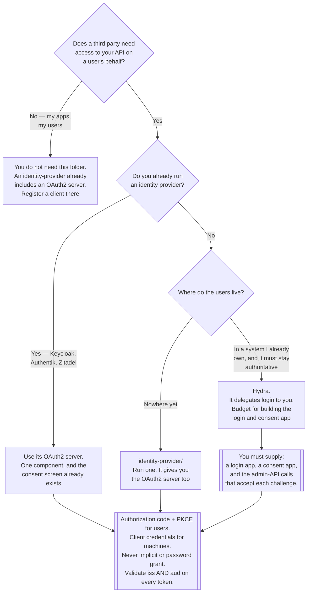

[← Authentication](../README.md)

# OAuth2 and OIDC server

Becoming the authorization server — issuing tokens to clients that act on someone's behalf.

Children: [`hydra/`](hydra/README.md)

## Contents

1. [When you need to be the authorization server](#1-when-you-need-to-be-the-authorization-server)
2. [The four roles, and why they get confused](#2-the-four-roles-and-why-they-get-confused)
3. [The grants that still matter](#3-the-grants-that-still-matter)
4. [Scopes, audiences and consent](#4-scopes-audiences-and-consent)
5. [The separation Hydra insists on](#5-the-separation-hydra-insists-on)
6. [Decision tree](#6-decision-tree)
7. [Anti-patterns](#7-anti-patterns)
8. [How this applies to pikakube](#8-how-this-applies-to-pikakube)

---

## 1. When you need to be the authorization server

Most of [`authentication/`](../README.md) is about *consuming* identity: you have users
somewhere, and you want them to reach your applications. This folder is the other direction.

You need an authorization server when **someone else's software calls your API on behalf of
your users**. Concretely:

| Situation | Why it needs OAuth2 |
|---|---|
| A partner integration reads customer data through your API | the customer must be able to grant and revoke that access, without handing over a password |
| A mobile or single-page app calls your backend | it cannot hold a secret, and its tokens must be short and scoped |
| A marketplace of third-party plugins | each plugin gets its own client, its own scopes and its own revocation |
| CI systems and machine clients call your API | client credentials, scoped per system, individually revocable |
| You are building a developer platform with API keys | OAuth2 is the mature replacement for hand-rolled key management |

And when you do **not** need one — which is most of the time:

- Your applications are yours, and your users log in through an IdP. An
  [`identity-provider/`](../identity-provider/README.md) already includes an OAuth2/OIDC server;
  registering a client there is the whole job.
- You are protecting dashboards. [`auth-proxy/`](../auth-proxy/README.md).
- You want humans to reach the Kubernetes API. [`federation/`](../federation/README.md).

> **The test: is there a third party whose access must be granted and revoked independently of
> the user's own credentials?** If not, you are consuming OAuth2, not providing it.

## 2. The four roles, and why they get confused

OAuth2 defines four roles, and almost every confusing conversation about it comes from two of
them being conflated.

| Role | Who | Example |
|---|---|---|
| **Resource owner** | the user who owns the data | a customer |
| **Client** | the application requesting access | a partner's integration, an SPA, a CI job |
| **Authorization server** | issues tokens; the thing this folder is about | Hydra, Keycloak, Auth0 |
| **Resource server** | the API that accepts tokens | your backend |

The distinction that matters most: **the authorization server and the resource server are
different things.** The authorization server issues the token and never sees the request the
token is later used on. The resource server validates the token and never sees the user
authenticate. Building them as one service is possible and is how most people start; separating
them is what allows one token issuer to serve many APIs.

The second confusion, restated from [`../README.md`](../README.md) because it never stops being
relevant: **OAuth2 is not authentication**. The access token says what a client may do, not who
the user is. The ID token, added by OIDC, is the identity assertion. Treating an access token as
proof of identity is the single most common OAuth2 vulnerability.

## 3. The grants that still matter

OAuth2 defines several ways to obtain a token. Most have been narrowed or removed by current
guidance, and the surviving set is short:

| Grant | Use | Status |
|---|---|---|
| **Authorization code + PKCE** | any user-facing client — web, SPA, mobile, desktop | **the default. Use this.** PKCE is now recommended for confidential clients too, not only public ones |
| **Client credentials** | machine to machine, no user involved | correct and current |
| **Device code** | input-constrained devices: TVs, CLIs | correct and current |
| **Refresh token** | obtaining a new access token without re-authenticating | correct; rotate refresh tokens and detect reuse |
| Implicit | historically for SPAs | **removed in OAuth 2.1.** Tokens travelled in the URL fragment, leaking into history and referrers |
| Resource owner password credentials | client collects the user's password directly | **removed in OAuth 2.1.** It defeats MFA, defeats the IdP's authentication flows, and trains users to type passwords into third-party software |

The last row is worth naming explicitly because it keeps reappearing in tutorials — including
one preserved in [`identity-provider/keycloak/`](../identity-provider/keycloak/README.md), where
it was used for a debugging `curl`. That is a legitimate use of it. Shipping it is not.

## 4. Scopes, audiences and consent

Three mechanisms that people reach for interchangeably and should not.

| Mechanism | Answers | Enforced by |
|---|---|---|
| **Scope** | what *kind* of access the client asked for — `read:orders` | the resource server, when it validates the token |
| **Audience** (`aud`) | which API this token is *for* | the resource server, by rejecting tokens not addressed to it |
| **Consent** | did the user agree to this client having that access? | the authorization server, at issuance |

The audience check is the one most often skipped, and skipping it is a real vulnerability: a
signature-valid token issued for service A will verify perfectly at service B. Checking `aud`
is what stops one service's token being replayed against another.

On scopes: they are a *coarse* mechanism, and the failure mode is inventing hundreds of them to
express fine-grained permissions. A scope says "this client may touch orders". It cannot say
"this client may touch order 4712 because the user shares it with them" — that is
relationship-based authorization, and it is
[`authorization/application/`](../../authorization/application/README.md). Keep scopes few and
coarse; put per-object decisions in the resource server.

Consent is what distinguishes a real third-party integration from an internal one. If every
client is yours, consent screens are noise and are usually skipped. The moment a client is
somebody else's, consent is the mechanism that makes the grant the *user's* decision — and
revocable by them.

## 5. The separation Hydra insists on

The design that defines [Hydra](hydra/README.md), and the thing that confuses people the most:

> **Hydra is an OAuth2 and OIDC server that deliberately does not manage users.**

No user table. No password hashing. No login page. No registration, no password reset, no MFA.
When a client starts an authorization flow, Hydra redirects the browser to a **login URL you
provide**, waits, and accepts the answer through its admin API. The same for consent.

```
client ──► Hydra ──redirect──► YOUR login app ──► authenticate however you like
                 ◄──accept───── (admin API: "this is user X")
       ◄── token
```

This is not an unfinished product. It is a scope decision, and the reasoning holds up:

| Consequence | Why it is deliberate |
|---|---|
| Your existing user database stays authoritative | no migration, no synchronisation, no second copy |
| Authentication can be anything | password, LDAP, an upstream IdP, a hardware token, a bank's flow — Hydra does not care |
| The protocol implementation is separable | OAuth2/OIDC compliance is hard and worth having a specialist do; user management is your domain |
| It composes | Ory's own answer is Kratos for identity; Keycloak or Dex work equally well as the login side |

And the cost, stated plainly: **you must build or supply the login and consent application.**
That is a real application, with real security requirements, and it is why "Hydra is the
lightweight Keycloak" is wrong. It is a *smaller* component that leaves a gap you must fill.

## 6. Decision tree



## 7. Anti-patterns

| Anti-pattern | Why it is bad | What to do instead |
|---|---|---|
| Running an OAuth2 server when all clients are yours | you built a third-party integration mechanism with no third parties | register clients in your IdP, or use an auth proxy |
| Treating an access token as proof of identity | its format and claims are undefined; it is a capability, not an assertion | validate the OIDC ID token |
| Not validating `aud` | a valid token for another service passes verification | check issuer and audience on every token |
| Implicit or password grant | both removed in OAuth 2.1; one leaks tokens through URLs, the other defeats MFA entirely | authorization code with PKCE |
| Hundreds of fine-grained scopes | scopes are coarse by design; per-object permission does not fit | few coarse scopes; per-object decisions in the resource server |
| One client shared by every application | a leaked secret compromises all of them, and per-client revocation becomes impossible | one client per application |
| Access tokens with long lifetimes | revocation stops existing for that window | short access tokens, rotating refresh tokens with reuse detection |
| Refresh tokens that never rotate | a stolen refresh token is permanent access | rotate on each use, and invalidate the whole chain on reuse |
| Expecting Hydra to manage users | it will not, by design, and no configuration changes that | supply a login app, or use a full identity provider |
| Running Hydra with `dev: true` in production | it relaxes security checks and permits insecure transports | disable it, and configure TLS and a real database |

## 8. How this applies to pikakube

**This folder does not currently apply, and saying so is more useful than pretending
otherwise.**

There are no third-party clients. There is no external API. Nobody is granting a partner
delegated access to anything. Every consumer of identity here is a dashboard the platform owns,
which is squarely the [`auth-proxy/`](../auth-proxy/README.md) case, and every human who needs
to reach the API is served by [`federation/`](../federation/README.md).

What is staged is [Hydra](hydra/README.md), with `dev: true` and nothing else configured — and
critically, **without the login and consent application it structurally requires.** As staged it
cannot complete a single authorization flow, and that is not a missing configuration value; it
is the missing half of the architecture described in §5.

The realistic reason to keep it is understanding the pattern. Hydra is the clearest possible
illustration of the split between "who are you" and "what may this client do on your behalf",
because it implements exactly one of those two and refuses the other. That makes it a better
teaching artifact than a bundled IdP, where the same separation exists but is hidden.

If an OAuth2 server were genuinely needed here, the cheaper answer is the one in
[`identity-provider/`](../identity-provider/README.md): Keycloak, Authentik and Zitadel all
include one, along with the login and consent screens Hydra deliberately omits.

---

[← Authentication](../README.md)
