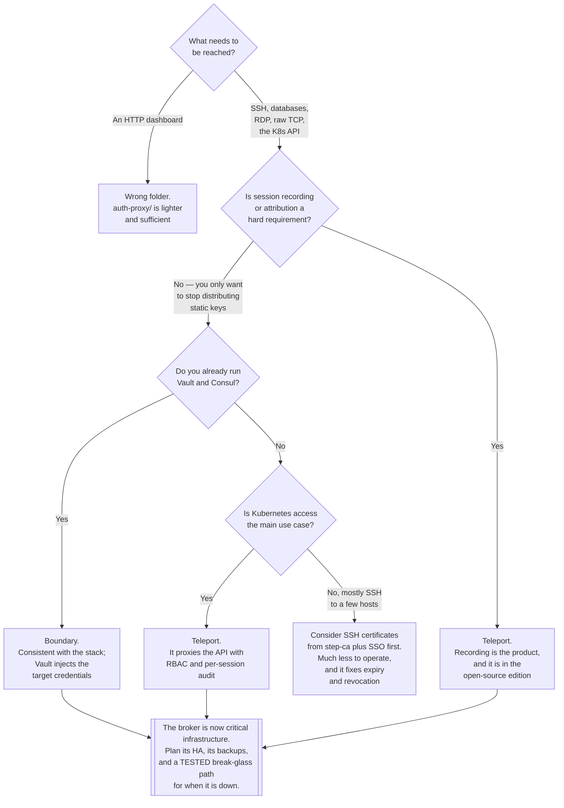

[← Authentication](../README.md)

# Privileged access

Brokered, recorded, time-limited access to infrastructure — instead of distributing SSH keys
and kubeconfigs and hoping.

Children: [`teleport/`](teleport/README.md) — the full access plane ·
[`boundary/`](boundary/README.md) — HashiCorp's session broker

## Contents

1. [The problem with the way this is normally done](#1-the-problem-with-the-way-this-is-normally-done)
2. [What a broker changes](#2-what-a-broker-changes)
   - [Why a bastion with shared keys is not this](#why-a-bastion-with-shared-keys-is-not-this)
3. [Session recording](#3-session-recording)
4. [Just-in-time access](#4-just-in-time-access)
5. [Teleport and Boundary](#5-teleport-and-boundary)
6. [Decision tree](#6-decision-tree)
7. [Anti-patterns](#7-anti-patterns)
8. [How this applies to pikakube](#8-how-this-applies-to-pikakube)

---

## 1. The problem with the way this is normally done

Everything else in [`authentication/`](../README.md) is about HTTP. This folder is about
everything that is not: SSH to a host, `psql` to a database, `kubectl` to a cluster, RDP to a
Windows box, a Redis port, an internal admin panel on a private network.

The standard arrangement, which almost every organisation has some version of:

| Artifact | The problem with it |
|---|---|
| An SSH key on each engineer's laptop, `authorized_keys` on each host | no expiry, no central revocation, and no record of which key is on which host |
| A kubeconfig with a client certificate | **Kubernetes cannot revoke it**; it is valid until it expires, and offboarding does not touch it |
| A shared bastion account with a shared key | every session is attributed to `ubuntu`; you cannot tell who did anything |
| Database credentials in a password manager | shared, long-lived, copied into scripts, and used from unmanaged laptops |
| A VPN that grants network access to a whole subnet | reaching the network becomes reaching everything on it |

Each is a **long-lived credential distributed to endpoints you do not control**. The
consequences follow mechanically:

- **Offboarding is a manual sweep.** Someone must remember every host, every cluster, every
  database. Something is always missed.
- **Attribution is guesswork.** Shared accounts and shared keys mean the audit trail stops at
  the bastion.
- **The blast radius is the union of everything the key opens**, and nobody has an inventory.
- **Rotation never happens** because rotating means touching every host and every laptop at
  once.

## 2. What a broker changes

A privileged-access broker inverts the arrangement. Nobody holds a credential for the target.
The engineer authenticates **to the broker**, using the organisation's identity — SSO, with MFA
— and the broker then:

1. Checks the request against policy: may this identity reach this resource, in this role,
   right now?
2. **Mints a short-lived credential** — usually a certificate valid for minutes to hours.
3. Proxies the connection, or hands over a credential the target already trusts.
4. **Records the session.**
5. Lets the credential expire. Nothing needs to be revoked.

The difference in properties is not incremental:

| | Distributed keys | Brokered access |
|---|---|---|
| Credential lifetime | indefinite | minutes to hours |
| Revocation | find every copy | disable the account; existing sessions can be killed |
| Attribution | shared accounts hide it | every session tied to a person, always |
| Inventory of who can reach what | nobody has one | it is the policy, and it is queryable |
| Audit trail | `sshd` logs, if kept | full session capture |
| Onboarding | provision a key on N hosts | add to a group |

The single sentence that captures it: **access becomes a request that is evaluated, rather than
a credential that is held.**

### Why a bastion with shared keys is not this

Bastions are often described as solving the same problem. They do not, and the gap is worth
being precise about.

A bastion is a **network** control: it narrows the path to one host. It is genuinely useful for
that. But:

| A bastion gives you | It does not give you |
|---|---|
| one network entry point | short-lived credentials — the keys behind it are the same long-lived keys |
| a place to put logging | per-person attribution, if the account is shared |
| a firewall boundary | policy per resource — once you are on it, you reach what it reaches |
| | session recording of what was actually typed and displayed |
| | automatic expiry |

A bastion with individual accounts, certificate-based SSH and full logging is much closer — and
at that point you have built a small fraction of Teleport, by hand, and you own it. The honest
framing is that a bastion is a network hop, and this folder is an **identity and audit** layer.
They are complementary; one is not a substitute for the other.

## 3. Session recording

The property that distinguishes this category from "SSO for infrastructure", and the one that
makes it the only place in [`identity-access/`](../../README.md) where all three As of AAA
appear together.

| Protocol | What is recorded |
|---|---|
| SSH | the full terminal stream, replayable as it appeared — keystrokes and output |
| Kubernetes | every API request through the proxy, plus `kubectl exec` sessions as terminal recordings |
| Databases | the queries executed, per session, per user |
| Web / RDP | screen recording, or a structured request log |

Why it matters more than an ordinary audit log: the API audit log tells you a Secret was read.
The session recording tells you what was done with it. For incident response, the second is what
converts "an account was compromised" into "here is exactly what the attacker saw and did".

Three practical points people discover late:

- **Recordings are sensitive.** They contain whatever was on screen — credentials typed at a
  prompt, customer data, private keys. They need at least the access controls of the systems
  they record, and often more.
- **Volume grows fast**, and retention needs a policy and a budget from day one.
- **Recording changes behaviour**, which is partly the point and partly a thing to be
  transparent about. It is also a works-council or legal question in some jurisdictions, and
  discovering that after deployment is unpleasant.

## 4. Just-in-time access

The natural extension once access is a request rather than a credential: nobody holds
production access by default. Elevation is requested, approved, and expires.

| Step | Detail |
|---|---|
| **Request** | an engineer asks for a role, with a reason, for a duration |
| **Approve** | a peer or an on-call lead approves — in chat, in the tool, or automatically under policy |
| **Elevate** | the broker mints a credential carrying that role |
| **Expire** | it lapses. There is nothing to revoke and nothing to remember |

What this buys, beyond the obvious: **standing privilege becomes zero**. A compromised laptop
belonging to an engineer who is not currently elevated gets nothing. That is a much stronger
position than "the engineer has admin, and we trust the laptop".

The realistic caveats: an approval step in the path of an incident is a genuine cost, so
break-glass — self-approval with loud alerting — must exist and must be tested. And approval
fatigue is real; if every routine action needs a click, people will approve without reading. Set
the boundary at the level where the approval means something.

## 5. Teleport and Boundary

| | [Teleport](teleport/README.md) | [Boundary](boundary/README.md) |
|---|---|---|
| From | Gravitational / Teleport | HashiCorp |
| Model | **identity-aware access plane** — it terminates the protocol and understands it | **session broker** — it authenticates, authorises and brokers, then gets out of the way |
| Protocols | SSH, Kubernetes, databases, web apps, RDP, and more | TCP generally; richer support for specific targets in the commercial edition |
| Session recording | **yes, deeply** — terminal replay, per-session Kubernetes and database audit | limited in the open-source edition; session recording is a commercial feature |
| Credential mechanism | its own **certificate authority**, issuing short-lived certificates for each protocol | brokered credentials, commonly injected from Vault |
| Kubernetes | first-class: it is a Kubernetes API proxy with RBAC and per-session recording | generic — it brokers a connection to the API endpoint |
| Complexity | high — it is a certificate authority, a proxy and an audit store, and it becomes critical infrastructure | lower — fewer concepts, and less of the target's protocol is understood |
| Fits when | Kubernetes and SSH access with real recording is the requirement | you already run Vault and Consul, and want brokered access consistent with them |

The blunt version: **Teleport is the more complete answer and the heavier commitment.**
Boundary is a cleaner fit if HashiCorp's stack is already the platform's spine, and its
open-source edition gives you less of the audit story than people expect.

Both share one operational truth worth internalising before deploying either: **the broker
becomes critical infrastructure.** When it is down, nobody can reach anything. Its own
availability, its own backups, and its own break-glass path are part of the deployment, not
follow-up work.

## 6. Decision tree

## 7. Anti-patterns

| Anti-pattern | Why it is bad | What to do instead |
|---|---|---|
| A shared bastion account with a shared key | every session is attributed to the same user; the audit trail is worthless | per-person identity, brokered |
| Long-lived SSH keys in `authorized_keys` | no expiry, no central revocation, no inventory of which key is where | short-lived SSH certificates |
| Distributing kubeconfigs with client certificates | Kubernetes has **no revocation** for them; offboarding does not touch them | brokered access, or OIDC |
| A VPN as the access control | reaching the network becomes reaching everything on it | per-resource policy |
| Standing production access for everyone | a compromised laptop is a compromised production environment | just-in-time elevation with expiry |
| Session recordings with weaker access control than the systems recorded | the recordings contain typed credentials and customer data | treat them as the most sensitive data you hold |
| No break-glass when the broker is down | the tool that provides all access becomes the tool that denies all access | a tested emergency path, exercised on a schedule |
| Deploying the broker as a single replica | it is now a single point of failure for every kind of access | HA, and back up its certificate authority |
| Approvals on every routine action | approval fatigue; people click through without reading | require approval where it changes the decision |
| Assuming a bastion already does this | it is a network hop; it provides neither short credentials nor attribution nor recording | see §2 |

## 8. How this applies to pikakube

**Not applicable in its intended form, and the reason is worth stating rather than skipping.**

Privileged access management solves an *organisational* problem: many people, many hosts,
credentials that must be attributable and revocable. pikakube is a single-node local Kind
cluster with one operator, no fleet of hosts, no SSH targets, and no external access path.
Deploying Teleport here would make the cluster harder to reach without making anything safer —
it would be a broker in front of a resource that only its owner can reach in the first place.

What is staged: [Teleport](teleport/README.md) has a `HelmRelease`
(`teleport-cluster` chart `15.2.2`, `ClusterIP` service, cluster name `teleport-cluster`) and a
namespace. [Boundary](boundary/README.md) is a link only, with no manifests.

The concept that *does* transfer, and transfers strongly, is the underlying principle — the
same one that runs through [`workload-identity/`](../workload-identity/README.md):

> **Replace long-lived credentials held at endpoints with short-lived credentials issued on
> demand against a verified identity.**

Teleport applies it to humans reaching infrastructure; SPIRE applies it to workloads reaching
services. Recognising them as the same idea in two domains is the reason both folders exist
here.

If some form of this were ever wanted locally, the lightweight version is worth naming: SSH
certificates issued by [step-ca](../../../certificates/step-ca/README.md), which the
certificates folder already documents, gives expiry and central revocation for SSH without
deploying an access plane. That is a fraction of the machinery for a meaningful part of the
benefit.

---

[← Authentication](../README.md)
