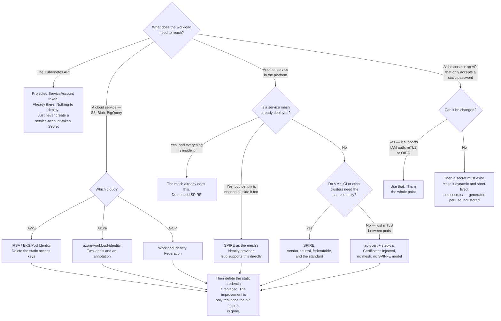

[← Authentication](../README.md)

# Workload identity

The single largest security improvement available to a platform: replacing stored secrets with
short-lived, automatically-rotated, cryptographically-verified identity.

Children: [`spire/`](spire/README.md) — SPIFFE/SPIRE, the general answer ·
[`azure-workload-identity/`](azure-workload-identity/README.md) — federate a ServiceAccount to
an Azure identity · [`autocert/`](autocert/README.md) — automatic certificates from step-ca ·
[`athenz/`](athenz/README.md) — Yahoo's identity and authorization system

## Contents

1. [The problem: a pod needs a credential](#1-the-problem-a-pod-needs-a-credential)
   - [Why a Secret is the worst available answer](#why-a-secret-is-the-worst-available-answer)
2. [The idea that replaces it](#2-the-idea-that-replaces-it)
   - [Attestation: how a pod proves what it is](#attestation-how-a-pod-proves-what-it-is)
   - [The bootstrap problem, and how it is actually solved](#the-bootstrap-problem-and-how-it-is-actually-solved)
3. [SPIFFE and SPIRE](#3-spiffe-and-spire)
   - [The two SVID formats, and when each is used](#the-two-svid-formats-and-when-each-is-used)
4. [Cloud federation](#4-cloud-federation)
5. [What you already have: the projected ServiceAccount token](#5-what-you-already-have-the-projected-serviceaccount-token)
6. [The four tools](#6-the-four-tools)
7. [Where this overlaps with the service mesh](#7-where-this-overlaps-with-the-service-mesh)
8. [Decision tree](#8-decision-tree)
9. [Anti-patterns](#9-anti-patterns)
10. [How this applies to pikakube](#10-how-this-applies-to-pikakube)

---

## 1. The problem: a pod needs a credential

A pod starts. It needs to read from S3, or query Postgres, or call an internal API that
requires a token. It has to prove it is entitled to do that.

The default answer everywhere is: put a credential in a Kubernetes Secret, mount it, and read
it at startup.

### Why a Secret is the worst available answer

Not a rhetorical claim — an enumeration:

| Property | A stored credential |
|---|---|
| **Lifetime** | indefinite. It is valid until a human remembers to change it |
| **Rotation** | manual, and it requires coordinating every consumer, so it does not happen |
| **Blast radius** | anyone who can read the Secret has it. In default RBAC that is a surprisingly large set |
| **Attribution** | none. The credential is a bearer token — whoever presents it *is* the workload, and the logs cannot tell the difference |
| **Distribution** | it existed somewhere before it existed in the cluster: a laptop, a terminal, a CI log, a ticket, a chat message |
| **Revocation** | requires knowing every place it went |
| **Detection** | using a stolen credential looks exactly like using it legitimately |

And the mechanics of Kubernetes make several of those worse than people expect:

- **A Kubernetes Secret is base64, not encryption.** Without encryption at rest, it is
  plaintext in etcd. That is the premise of the entire
  [`secrets/`](../../../secrets/README.md) folder.
- **Read access to Secrets in a namespace is close to owning that namespace.** If any Secret
  there holds a token for something more powerful, it is a privilege escalation path — see
  [`k8s-rbac/`](../../authorization/k8s-rbac/README.md).
- **The credential must be created before the pod runs**, which means a human or a pipeline
  handled it, which means it has already leaked into somewhere with worse controls than the
  cluster.

The critical insight is that **encrypting the secret better does not fix any row in that
table.** Sealed Secrets, SOPS, External Secrets and Vault all improve *how the secret gets
there* and *who can read it at rest*. They do not shorten its lifetime, do not make it
attributable, and do not remove it from the pod. They are real improvements to a fundamentally
weak design.

> **The best secret is the one that does not exist.**

## 2. The idea that replaces it

Workload identity inverts the model completely:

| | Stored credential | Workload identity |
|---|---|---|
| Where it comes from | created by a human, injected | **issued to the pod at runtime**, on request |
| Basis of trust | possession of a string | **attestation** — the platform vouches for what the pod is |
| Lifetime | indefinite | minutes to an hour |
| Rotation | manual | automatic, continuous, invisible |
| If stolen | valid until noticed | expires on its own, and is bound to a workload identity |
| Attribution | "someone with the token" | a specific ServiceAccount, in a specific namespace, in a specific cluster |
| What is in the Secret | the credential | **nothing** |

The last row is the one that matters. There is no long-lived credential *anywhere* — not in
git, not in etcd, not in a vault, not in a CI log. The thing that cannot leak is the thing that
does not exist.

### Attestation: how a pod proves what it is

This is the mechanism that makes the whole thing possible, and it is the part usually skipped.

A pod cannot *claim* an identity — anything it can say, a compromised neighbour can say too.
Instead, the platform **attests** it. The identity provider asks the infrastructure, out of
band, what is actually running:

| Attestation source | What it proves |
|---|---|
| **Node attestation** | that a given SPIRE agent is running on a genuine node in this cluster — via the node's own credentials, a cloud instance identity document, or a TPM |
| **Workload attestation** | that the process calling in is in a particular pod, under a particular ServiceAccount, in a particular namespace — by inspecting the caller's process, its cgroup, and asking the kubelet |
| **Kubernetes API** | that the ServiceAccount token presented is genuine, unexpired, and bound to a live pod |

The result is an identity the workload never had to be *told*. It is derived from what the
platform can independently observe. A compromised pod cannot assume another pod's identity,
because it cannot change the facts the attestor checks.

### The bootstrap problem, and how it is actually solved

The obvious objection: to get a credential you need a credential. Where does the first one come
from?

Kubernetes solves it, and the solution is elegant: **the kubelet mounts a projected
ServiceAccount token into the pod, and the pod did nothing to earn it.** The kubelet knows what
it started. That token is short-lived, audience-bound, and tied to the pod's lifetime. It is the
root of trust, and it is free — it is already there in every pod on every cluster.

Everything in this folder is, in one way or another, a way of exchanging that initial attested
fact for a credential something else will accept.

## 3. SPIFFE and SPIRE

**SPIFFE** (Secure Production Identity Framework For Everyone) is the standard; **SPIRE** is the
reference implementation. Both are CNCF projects, and SPIFFE is the closest thing this area has
to a vendor-neutral answer.

The standard defines three things:

| Concept | What it is |
|---|---|
| **SPIFFE ID** | a URI naming a workload: `spiffe://trust-domain/ns/production/sa/payments`. Human-readable, hierarchical, and not tied to any cloud |
| **SVID** (SPIFFE Verifiable Identity Document) | the credential carrying that ID — an X.509 certificate or a JWT |
| **Workload API** | a **local Unix domain socket** the workload calls to fetch its SVID. No token, no configuration, no secret |

The Workload API deserves emphasis because it is the cleverest part. The workload opens a socket
and asks "who am I?". It presents **no credential at all**. The SPIRE agent on that node
identifies the caller by inspecting the calling process — its PID, its cgroup, and therefore its
pod — and issues an SVID matching what it found.

> **The workload holds nothing. It cannot leak a credential it was never given.**

The architecture:

| Component | Role |
|---|---|
| **SPIRE Server** | the certificate authority for the trust domain. Holds registration entries and signs SVIDs |
| **SPIRE Agent** | a DaemonSet, one per node. Node-attests to the server, then workload-attests local pods and hands out SVIDs |
| **Registration entries** | the policy: "a pod with ServiceAccount `payments` in namespace `production` gets SPIFFE ID X" |

SVIDs are rotated continuously and automatically — commonly with a one-hour lifetime, renewed at
half-life. Nothing restarts, nothing is redeployed, and no human is involved.

### The two SVID formats, and when each is used

| | X.509-SVID | JWT-SVID |
|---|---|---|
| Form | a certificate with the SPIFFE ID in a URI SAN | a signed JWT with the SPIFFE ID as `sub` |
| Proves | possession of a private key — **cannot be replayed** | possession of the token — **a bearer token, replayable** |
| Used for | mTLS between services; the identity *is* the TLS handshake | calling an HTTP API that cannot do mTLS |
| Preferred | **yes, wherever mTLS is possible** | when the other end only accepts a header |

Prefer X.509 when you have the choice. A JWT-SVID is still an enormous improvement over a stored
secret because it lives for minutes, but it is a bearer token and inherits that weakness.

## 4. Cloud federation

The most immediately valuable application of workload identity, and the one with the clearest
before-and-after.

The problem: a pod needs to call S3, Azure Blob Storage or BigQuery. The old answer was a static
access key in a Secret — the exact credential most commonly found in leaked repositories.

The new answer uses **OIDC federation**, and every major cloud now supports it:

1. The cluster publishes an **OIDC discovery document and JWKS** at a public URL. The API server
   signs ServiceAccount tokens with the corresponding key.
2. The cloud is configured to **trust that issuer**, and to map a specific `sub`
   (`system:serviceaccount:<namespace>:<name>`) to a cloud role.
3. The pod presents its projected ServiceAccount token to the cloud's STS.
4. The cloud validates the signature against the cluster's JWKS, checks the subject and
   audience, and returns **short-lived cloud credentials**.

| Cloud | Name |
|---|---|
| AWS | **IRSA** (IAM Roles for Service Accounts), or EKS Pod Identity |
| Azure | **Azure Workload Identity** — see [`azure-workload-identity/`](azure-workload-identity/README.md) |
| GCP | **Workload Identity Federation** |

The properties are exactly the ones from §2: nothing stored, minutes of validity, automatic
rotation, and the cloud's audit log naming the ServiceAccount rather than "some access key".

Note what the trust actually rests on: **the cluster's OIDC signing key**. The JWKS endpoint must
be reachable by the cloud, the key must be protected, and the audience must be restricted —
otherwise a token minted for one purpose is usable for another.

## 5. What you already have: the projected ServiceAccount token

Before deploying anything in this folder, it is worth knowing that Kubernetes already ships a
workload identity mechanism, and most clusters use it badly.

| | Legacy Secret-based token | Projected token (v1.21+) |
|---|---|---|
| Where it lives | a `kubernetes.io/service-account-token` Secret in etcd | a projected volume, in memory |
| Lifetime | **never expires** | configurable; one hour by default, auto-renewed |
| Audience | none — valid against anything that trusts the cluster | **bound to a specific audience** |
| Bound to the pod | no — it survives the pod, the Deployment, everything | **yes** — invalid once the pod is gone |
| Readable from etcd | yes | no |

Modern Kubernetes uses projected tokens automatically for the default mount. The two things to
actually do:

- **Never create a `kubernetes.io/service-account-token` Secret by hand.** It is a permanent,
  unaudienced, unexpiring cluster credential sitting in etcd. It is still possible, and it is
  still done.
- **Use `serviceAccountToken` projection with an explicit `audience`** when a workload needs a
  token for something other than the Kubernetes API. That single field is what turns a token
  into something that cannot be replayed elsewhere.

For calling the Kubernetes API from inside the cluster, this is the whole answer and nothing
else in this folder is needed.

## 6. The four tools

| Tool | What it is | Shines when | Do not use when | Detail |
|---|---|---|---|---|
| **SPIRE** | the SPIFFE reference implementation — a CA plus attestation, issuing SVIDs | you need a **platform-wide, vendor-neutral** identity for service-to-service auth, especially across clusters, VMs and clouds | the only consumer is one cloud's API — federation is free and SPIRE is not | [→](spire/README.md) |
| **azure-workload-identity** | a webhook that federates a Kubernetes ServiceAccount to an Entra ID identity over OIDC | you run AKS, or any cluster, and pods must reach Azure services | you are not on Azure | [→](azure-workload-identity/README.md) |
| **autocert** | a mutating webhook that injects step-ca-issued certificates into pods | you want **mTLS certificates** in pods with no application changes and no service mesh | you need SPIFFE semantics, or a mesh is already deployed | [→](autocert/README.md) |
| **athenz** | Yahoo's combined identity **and** authorization system, X.509-based | you are adopting the whole Athenz model, RBAC included | almost always — SPIFFE is the standard, and the ecosystem is far larger | [→](athenz/README.md) |

The ordering is deliberate. **Cloud federation first** — it costs almost nothing, it removes the
most dangerous secrets you have, and it needs no new component beyond a webhook. **SPIRE second**,
when service-to-service identity becomes the problem. The other two are narrower.

## 7. Where this overlaps with the service mesh

A fair objection: Istio and Linkerd already give every pod an identity and do mTLS
automatically. Why deploy anything here?

| | Service mesh | SPIRE |
|---|---|---|
| Identity for pod-to-pod mTLS | **yes**, automatically | yes |
| Application code changes | none | none, if the mesh is doing the mTLS |
| Identity **outside** the mesh — VMs, CI, other clusters | no | **yes** |
| Identity usable by the application itself, for something else | limited | **yes** — the Workload API is available to the workload |
| Federating trust between organisations | no | **yes** |
| Operational weight | high, but you may already have it | high, and additional |

If a mesh is deployed and everything that needs identity is inside it, the mesh is sufficient
and SPIRE is duplicate machinery. Notably, **Istio can use SPIRE as its identity provider**, so
the two compose rather than compete when the trust domain has to extend past the mesh.

The rule: **if identity is needed beyond the mesh's boundary — VMs, CI runners, another
organisation — you need SPIFFE. If not, the mesh is enough.** The mesh options live in
[`network/service-mesh/`](../../../../../network/service-mesh/README.md).

## 8. Decision tree

## 9. Anti-patterns

| Anti-pattern | Why it is bad | What to do instead |
|---|---|---|
| A static cloud access key in a Secret | indefinite lifetime, no attribution, and the single most common credential in leaked repositories | cloud federation — IRSA, azure-workload-identity, GCP Workload Identity |
| Creating a `kubernetes.io/service-account-token` Secret by hand | a permanent, unaudienced cluster credential sitting in etcd forever | projected tokens; they are the default |
| Encrypting the secret and calling it solved | encryption fixes storage, not lifetime, rotation, attribution or blast radius | remove the secret; do not protect it better |
| Adding workload identity and keeping the old key "just in case" | the weakest credential still works, so the strong one changed nothing | delete it, and verify the workload still runs |
| One ServiceAccount shared by every workload in a namespace | identity is namespace-wide, so least privilege is impossible and attribution is lost | one ServiceAccount per workload |
| A projected token with no `audience` | it is replayable against anything that trusts the cluster's issuer | set an explicit audience, always |
| SPIRE registration entries with wide selectors | any pod matching a loose selector gets a powerful identity | select on namespace **and** ServiceAccount, narrowly |
| Long SVID or token lifetimes to reduce load | it gives back exactly the property that made the change worthwhile | keep them short; rotation is automatic and cheap |
| Deploying SPIRE when a mesh already covers everything | two identity systems, twice the failure modes, no new capability | use the mesh, or make SPIRE the mesh's identity source |
| The cluster's OIDC JWKS endpoint left unprotected or unrotated | it is the root of trust for every federated credential | treat the signing key like a CA key |
| Assuming workload identity is authorization | it proves *what* the workload is; what it may do is a separate decision | pair it with cloud IAM policy or [`k8s-rbac/`](../../authorization/k8s-rbac/README.md) |

## 10. How this applies to pikakube

The argument in this folder is the strongest one in the whole of
[`identity-access/`](../../README.md), and the honest application to this platform is mixed.

**What does not apply.** There is no cloud provider. Federation — the cheapest and highest-value
part — has nothing to federate to. `azure-workload-identity` is staged with an Azure tenant ID
placeholder and a node selector referencing an AKS node pool, which is a direct import from a
real Azure cluster and has no meaning on Kind.

**What is staged.** SPIRE has two HelmReleases — `spire-crds` (`0.5.0`) and `spire` (`0.24.0`),
correctly ordered with `dependsOn` — from the SPIFFE **hardened** chart repository. Values are
empty, so nothing is configured: no trust domain, no registration entries. `autocert` and
`athenz` are links only.

**What does apply, and is worth doing.** Three things, none of which requires deploying anything
in this folder:

| Action | Why |
|---|---|
| Audit for hand-created `kubernetes.io/service-account-token` Secrets | they are permanent cluster credentials in etcd, and finding them is a `kubectl get secrets --all-namespaces --field-selector type=kubernetes.io/service-account-token` away |
| Give each workload its own ServiceAccount | free, and it is the prerequisite for every mechanism in this folder. Sharing `default` makes least privilege impossible later |
| Set an explicit `audience` wherever a projected token is used for something other than the API | one field, and it removes replayability |

**On deploying SPIRE here.** It is a certificate authority, a server, a per-node agent, a
datastore and a registration policy — for a single-node cluster with no VMs, no second cluster,
and no cross-organisation trust to federate. As a learning exercise it is defensible, because
the Workload API and the attestation model are genuinely worth having hands on. As
infrastructure, it is machinery in search of a problem here.

The connection worth drawing explicitly is to [`secrets/`](../../../secrets/README.md). That
folder solves *how a secret gets into a pod safely*. This one asks whether the secret needs to
exist at all. They are not competitors — every platform needs the first, because some database
will only ever accept a password. But the ordering matters: **ask whether the credential can be
eliminated before deciding how to encrypt it.**

---

[← Authentication](../README.md)
