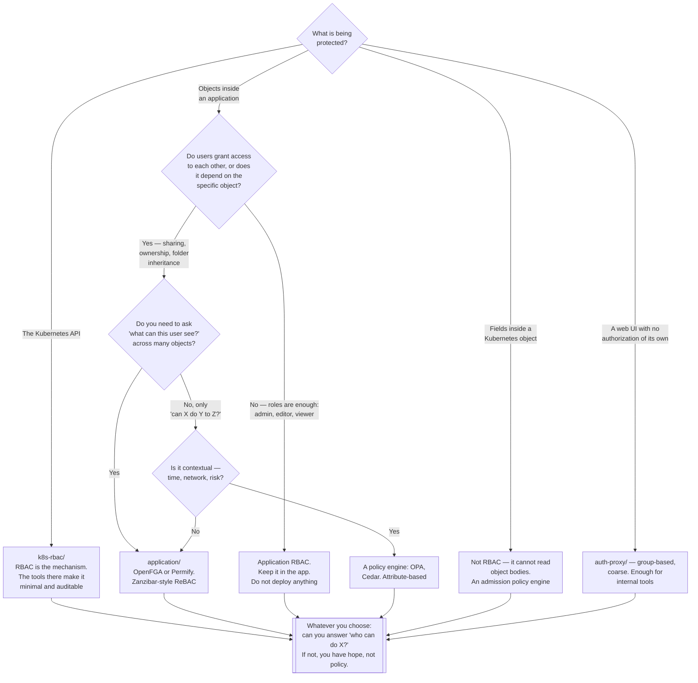

[← Identity and access](../README.md)

# Authorization

Deciding what an already-identified subject may do — and choosing the right model, because the
wrong one is what makes permissions unmaintainable.

Children: [`k8s-rbac/`](k8s-rbac/README.md) — permissions on the Kubernetes API ·
[`application/`](application/README.md) — permissions on objects inside an application

## Contents

1. [Authorization begins where authentication ends](#1-authorization-begins-where-authentication-ends)
2. [The models](#2-the-models)
   - [ACL](#acl)
   - [RBAC](#rbac)
   - [ABAC](#abac)
   - [ReBAC](#rebac)
   - [Which one to reach for](#which-one-to-reach-for)
3. [The layers, and which decision belongs where](#3-the-layers-and-which-decision-belongs-where)
4. [The properties that decide whether it survives](#4-the-properties-that-decide-whether-it-survives)
5. [Decision tree](#5-decision-tree)
6. [Anti-patterns](#6-anti-patterns)
7. [How this applies to pikakube](#7-how-this-applies-to-pikakube)

---

## 1. Authorization begins where authentication ends

[`authentication/`](../authentication/README.md) produces a **subject**: a username, a set of
groups, a SPIFFE ID, a set of claims. Authorization takes that subject plus an intended action
and answers **allow** or **deny**.

The failure modes are opposite, and the asymmetry decides how each should be operated:

| | Authentication fails open | Authorization fails open |
|---|---|---|
| What happens | anyone becomes anyone | a legitimate identity does more than it should |
| How you find out | immediately — it is catastrophic and visible | **you may never find out**; every request looks legitimate |

And when they fail *shut*:

| | Authentication fails shut | Authorization fails shut |
|---|---|---|
| What happens | nobody can log in | someone gets `Forbidden` |
| Consequence | an incident, fixed in minutes | a support ticket, resolved by granting more permissions |

That bottom-right cell is where permission systems go to die. The fastest way to unblock a
`Forbidden` is always to grant more, nobody ever revisits it, and after two years everything has
admin. Every tool in [`k8s-rbac/`](k8s-rbac/README.md) exists to fight that specific drift.

## 2. The models

Four models, in increasing order of expressiveness and cost. Choosing one too expressive is as
damaging as choosing one too weak.

### ACL

An **access control list** attaches permissions directly to objects: "Alice may read file X".

Simple, and it does not scale. Permissions live per object with no shared structure, so
answering "what can Alice reach?" means scanning everything, and onboarding means touching every
object. Filesystems use it; almost nothing else should.

### RBAC

**Role-based access control**. Permissions attach to **roles**; subjects are granted roles.

| | |
|---|---|
| Grants | subject → role → permissions |
| Strength | the indirection. Onboarding is one grant; changing what a role means is one edit |
| Weakness | **no notion of a specific object**. "May edit documents" — all of them |
| Failure at scale | role explosion: `editor-team-a`, `editor-team-b`, `editor-team-a-readonly`… one role per combination |

RBAC is the correct default and covers the large majority of real requirements. Kubernetes uses
it, and [`k8s-rbac/`](k8s-rbac/README.md) is about making it work in practice.

### ABAC

**Attribute-based access control**. A decision is computed from attributes of the subject, the
object, the action and the environment: "allow if `subject.department == object.department` and
the time is within business hours".

| | |
|---|---|
| Strength | genuinely expressive; contextual rules RBAC cannot state |
| Weakness | **you cannot enumerate**. "Who can access this?" requires evaluating the policy against every subject |
| Where it lives | policy engines — OPA/Rego, Cedar, Kyverno for admission control |

Kubernetes has an ABAC authorizer and it is effectively deprecated: a static file on the API
server, no API, requiring a restart to change. Do not use it. Admission-time policy engines are
where attribute-based decisions actually belong.

### ReBAC

**Relationship-based access control**, popularised by Google's **Zanzibar** paper. Permissions
derive from a **graph of relationships** between subjects and objects.

```
alice   —— owner ——>   document:42
document:42 —— parent ——> folder:reports
bob     —— viewer ——>  folder:reports      ⇒ bob can view document:42
```

| | |
|---|---|
| Grants | tuples: `(user, relation, object)` |
| Strength | **per-object, inherited, and enumerable in both directions** — "who can view this?" and "what can this user view?" are both first-class queries |
| Weakness | a new system to run, a schema to design, and a network call per check |
| Where it lives | [`application/`](application/README.md) — OpenFGA, Permify, Ory Keto, SpiceDB |

This is what "Alice shared this document with Bob, and Bob's team can see everything in that
folder" requires. Expressing it in RBAC means a role per document.

### Which one to reach for

| Requirement | Model |
|---|---|
| "Admins can delete, viewers can read" | **RBAC** |
| "Only during business hours, only from the corporate network" | **ABAC** — a policy engine |
| "Alice can edit *this* document because she owns it" | **ReBAC** |
| "Users can share with other users, and sharing is inherited by folders" | **ReBAC**, decisively |
| "Which of the ten thousand documents can this user see?" | **ReBAC** — this query is the differentiator |
| Anything on the Kubernetes API | **RBAC**, plus a policy engine for what RBAC cannot express |

> **Start with RBAC. Move to ReBAC only when per-object permission or user-driven sharing is a
> real product requirement.** The migration is painful; adopting ReBAC prematurely is worse.

## 3. The layers, and which decision belongs where

The same request passes several checkpoints, each seeing different information. Duplicating a
decision across layers means it is enforced inconsistently and understood nowhere.

| Layer | Sees | Decides | Structurally cannot decide |
|---|---|---|---|
| **Ingress / auth proxy** | the HTTP request, the session | is there a session? is the user in a permitted group? | anything about the object — it has not been parsed |
| **Kubernetes RBAC** | subject, verb, resource, namespace | may this subject `delete` `pods` in `ns`? | **field values** — RBAC never reads the object body |
| **Admission control** | the complete object | may this manifest be created as written? | anything about application data |
| **The application** | the user and the specific record | may Alice open document 42? | anything about the cluster |

Two consequences worth stating as rules:

- **RBAC cannot express "may not set `privileged: true`".** It operates on verbs and resource
  types, never on values inside the object. That is why admission policy engines exist as a
  separate layer, and why "use RBAC" is not an answer to workload hardening.
- **The API server cannot express per-record permissions.** Per-object, per-user application
  permissions are not a cluster concern at all — that is [`application/`](application/README.md).

## 4. The properties that decide whether it survives

Any authorization system will work on the day it is built. These are what determine whether it
still means anything two years later:

| Property | The question | Why it matters |
|---|---|---|
| **Enumerable** | "who can do X?" and "what can Y do?" | if these cannot be answered, every audit is a guess and no permission is ever safely revoked |
| **Least privilege by construction** | is the default deny, and is granting deliberate? | additive systems only ever grow |
| **Attributable** | do grants record who granted them, and why? | permissions without provenance are never removed, because nobody dares |
| **Reviewable** | can a human read the policy and predict the outcome? | a policy nobody understands is not enforced, it is hoped |
| **Testable** | can you assert "this subject must not be able to do this"? | the only defence against a refactor quietly widening access |
| **Escalation-aware** | can a permission be used to obtain more permission? | the primitives that allow this are non-obvious — see [`k8s-rbac/`](k8s-rbac/README.md) |

The last row is the one people miss. Some permissions are not merely permissions — they are
permissions to *acquire* permissions. A subject that can create a ServiceAccount token, or bind
a role, or impersonate another user, has the union of everything reachable that way. That is
where the real risk lives, and it is invisible unless you look for it specifically.

## 5. Decision tree



## 6. Anti-patterns

| Anti-pattern | Why it is bad | What to do instead |
|---|---|---|
| Granting broad permissions to resolve a `Forbidden` | it is permanent, invisible, and nobody revisits it | derive the minimal set from what the workload actually did |
| Enforcing authorization only in the UI | the API is still open, and every serious attack goes around the UI | enforce at the API; let the UI reflect it |
| Choosing ReBAC before it is needed | a new distributed system, a schema, and a network call per check, for permissions RBAC covers | start with RBAC; migrate when sharing is a real requirement |
| Staying with RBAC when sharing is the requirement | role explosion — one role per object, and nobody can read the model | ReBAC |
| The same decision duplicated at three layers | enforced inconsistently and understood nowhere | one owner per decision, per §3 |
| Permissions that cannot be enumerated | every audit is a guess, and nothing is ever safely revoked | pick a model where "who can do X?" is a query |
| Ignoring escalation primitives | a limited permission that grants more permission is a full compromise, silently | audit for `escalate`, `bind`, `impersonate`, and Secret read access |
| No test asserting what must be **denied** | a refactor quietly widens access and nothing fails | negative tests, in CI |
| Grants with no recorded reason | nobody dares remove what they do not understand | record who granted it and why |
| Wildcards in policy | they match resources that do not exist yet, including ones added by a future CRD | enumerate explicitly |

## 7. How this applies to pikakube

The two halves of this folder are in very different states here, and only one of them is real.

**[`k8s-rbac/`](k8s-rbac/README.md) applies fully, today, at no cost.** The cluster runs RBAC
whether or not anyone thinks about it. Every operator installed by Flux brought its own
ClusterRoles — CloudNativePG, ingress-nginx, Prometheus, the whole set — and nobody has looked
at what they collectively permit. Two of the four tools there (`kubiscan` and `audit2rbac`) are
**read-only command-line tools that install nothing**: they are pure inspection, they run against
the existing cluster, and they will produce findings. That is the highest value-per-effort item
in this entire folder.

**[`application/`](application/README.md) does not apply.** OpenFGA and Permify both have staged
HelmReleases, and neither has an application to serve. There is no multi-tenant product here, no
document sharing, no per-object permission requirement — nothing that ReBAC exists to solve.
Deploying either would be a permission service with no permission questions to answer.

The concrete recommendation:

| Priority | Action |
|---|---|
| 1 | Run `kubiscan` against the cluster. It is read-only and it will find risky permissions that arrived with operators nobody audited |
| 2 | Enable API audit logging, then use `audit2rbac` on anything running with permissions nobody can justify |
| 3 | Treat `rbac-manager` as optional — useful once the number of bindings is large enough to be unmanageable, and not before |
| 4 | Leave OpenFGA and Permify staged as a catalogue entry. The concepts are worth understanding; the deployment is not warranted |

---

[← Identity and access](../README.md)
