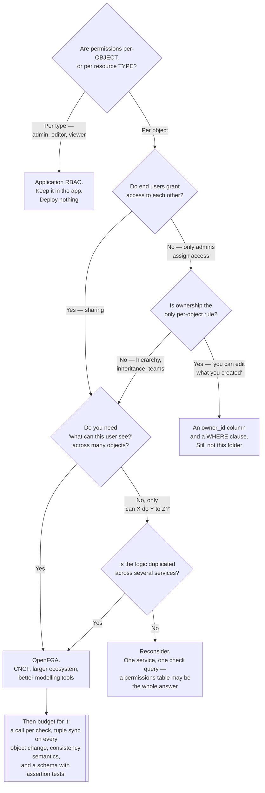

[← Authorization](../README.md)

# Application authorization

Permissions as a graph of relationships instead of a list of roles — Google's Zanzibar model,
and when it is worth the extra system.

Children: [`openfga/`](openfga/README.md) — CNCF, Auth0's implementation ·
[`permify/`](permify/README.md) — Go, the same model

## Contents

1. [The question RBAC cannot answer](#1-the-question-rbac-cannot-answer)
2. [Zanzibar, and what a relationship tuple is](#2-zanzibar-and-what-a-relationship-tuple-is)
   - [The schema](#the-schema)
   - [The two queries that matter](#the-two-queries-that-matter)
3. [When it is worth it, and when RBAC is enough](#3-when-it-is-worth-it-and-when-rbac-is-enough)
4. [The costs nobody mentions first](#4-the-costs-nobody-mentions-first)
5. [OpenFGA and Permify](#5-openfga-and-permify)
6. [Decision tree](#6-decision-tree)
7. [Anti-patterns](#7-anti-patterns)
8. [How this applies to pikakube](#8-how-this-applies-to-pikakube)

---

## 1. The question RBAC cannot answer

RBAC grants permissions on **resource types**: "editors may edit documents". It has no concept of
*which* document. That is not a gap in any particular implementation — it is what the model is.

So the moment a product needs any of these, RBAC starts to strain:

| Requirement | Why RBAC cannot express it |
|---|---|
| "Alice may edit *this* document, because she created it" | ownership is per object, and RBAC has no per-object grants |
| "Bob may view it because Alice shared it with him" | users granting access to other users is not a role |
| "Everyone in the Marketing folder can read everything inside it" | inheritance through a hierarchy has no representation |
| "Members of a team inherit the team's access" | group nesting is a graph, and roles are flat |
| "Show me every document this user can see" | the answer requires evaluating the rule against every object |

The workaround is always the same, and it always fails the same way: **a role per object.**
`document-42-editor`, `document-43-viewer`. Ten thousand documents becomes tens of thousands of
roles, and no human can read the permission model any more.

Google hit exactly this with Drive, Docs, Calendar, Cloud and YouTube, and published the design
they built for it — **Zanzibar** — in 2019. Everything in this folder is an implementation of
that paper.

## 2. Zanzibar, and what a relationship tuple is

The idea is small, and its consequences are large.

> **Permissions are not stored. Relationships are stored, and permissions are computed by
> traversing them.**

The unit of storage is a **tuple**:

```
(object, relation, subject)

document:42     owner    alice
document:42     parent   folder:reports
folder:reports  viewer   team:marketing#member
team:marketing  member   bob
```

Nothing in that data says "Bob can view document 42". It says Bob is a member of Marketing,
Marketing can view the reports folder, and document 42 lives in that folder. The permission is
**derived** by walking the graph.

Note the third row's `team:marketing#member` — a subject that is not a user but *the set of users
related to another object*. That indirection is what makes group nesting and inheritance work
without special cases.

### The schema

The traversal rules live in a schema, declared once per application:

```
type document
  relations
    define parent: [folder]
    define owner:  [user]
    define editor: [user] or owner
    define viewer: [user] or editor or viewer from parent
```

Read the last line carefully, because it is the whole model in one expression: you may view a
document if you are explicitly a viewer, **or** if you can edit it, **or** if you can view the
folder it lives in. Inheritance, implication and delegation, in one line, applying to every
document forever.

Compare to the RBAC equivalent, which is a role per document per relation, maintained by hand.

### The two queries that matter

| Query | Question | Why it is hard elsewhere |
|---|---|---|
| **Check** | "may Bob view document 42?" | the easy one — every system can do this |
| **List objects** | "which documents may Bob view?" | this is the differentiator |

The second query is what makes a UI possible. Rendering a file list means filtering ten thousand
objects by permission. With ABAC you must evaluate the policy against every object. With
role-per-object RBAC you must resolve tens of thousands of roles. Zanzibar-style systems answer
it as a graph query, and they are designed for it.

The reverse — "who can view document 42?" — is equally first-class, and it is the query that
makes an audit possible at all.

## 3. When it is worth it, and when RBAC is enough

Be honest about this, because adopting ReBAC prematurely is a common and expensive mistake.

**RBAC is enough when:**

- permissions are `admin` / `editor` / `viewer` and apply to everything of a type
- users do not grant access to each other
- there is no object hierarchy that permissions should follow
- "what can this user see?" is answerable with a database `WHERE` clause on ownership
- the permission model fits on one page and rarely changes

That covers most internal tools, most admin panels, and most platform components. **Do not
deploy a permission service for them.**

**ReBAC earns its place when at least two of these are true:**

| Signal | Why it points here |
|---|---|
| **Users share with users** | sharing is a relationship created at runtime by end users. There is no role for it |
| **Permissions follow a hierarchy** | organisation → workspace → folder → document, where access at one level implies access below |
| **Per-object grants are the norm**, not the exception | this is where role-per-object explodes |
| **"What can this user see?" is a hot query** | it is on the render path of every list view |
| **Multi-tenant, with cross-tenant sharing** | tenancy plus sharing is exactly the shape the model handles |
| **Permission logic is duplicated across services** | several services answering the same question inconsistently is the argument for centralising it |

The canonical example is genuinely the right test: **if your product looks like Google Drive,
you want this. If it looks like an admin dashboard, you do not.**

## 4. The costs nobody mentions first

Adopting this is adopting a distributed system on the request path. The realities:

| Cost | Detail |
|---|---|
| **A network call per check** | authorization becomes a dependency of every request. It needs latency budgets, timeouts, and a decision about what happens when it is unavailable — and "fail open" is not a decision you want made in a hurry |
| **Consistency** | tuples are written in one place and read in another. Zanzibar solves this with "zookies", a consistency token. If you share a document and immediately check permission, you may read stale data. The API exposes consistency options, and getting this wrong produces bugs that are intermittent by nature |
| **The data must be kept in sync** | every object created, moved, deleted or reparented in your application must write a tuple. A missed write is a silent authorization bug — either a denial nobody can explain, or access nobody intended |
| **Schema design is genuinely hard** | it is a modelling exercise, and getting it wrong is expensive to change once tuples exist in the shape of the old schema |
| **Testing is essential and non-obvious** | both implementations ship assertion mechanisms for exactly this reason. A schema without tests is a permission model you are guessing about |
| **Another datastore** | it needs Postgres or equivalent, with its own backups, scaling and availability story |

The one to weigh most carefully is the second row. Authorization that is *eventually* correct is
a category of bug most teams have never had to reason about before.

## 5. OpenFGA and Permify

| | [OpenFGA](openfga/README.md) | [Permify](permify/README.md) |
|---|---|---|
| Origin | Auth0/Okta, donated to **CNCF** | Permify, a company |
| Status | CNCF incubating | open source, commercially backed |
| Language | Go | Go |
| Schema language | DSL plus JSON | its own DSL |
| APIs | gRPC and HTTP | gRPC and HTTP |
| List-objects query | yes | yes |
| Attribute-based conditions | **yes** — CEL conditions on tuples, so ReBAC and ABAC combine | yes, attribute support |
| Storage | Postgres, MySQL, SQLite, in-memory | Postgres, in-memory |
| SDKs | Go, JS, Python, Java, .NET, and more | Go, JS, Python |
| Playground / modelling tools | **strong** — a hosted playground and a VS Code extension | a playground |
| Ecosystem | **larger**, and CNCF governance | smaller |

The honest recommendation: **OpenFGA is the safer default.** CNCF governance, the larger
community, better modelling tooling, and more SDKs. Permify is a legitimate alternative with a
schema language some find more approachable, and it is worth evaluating — but the tiebreaker for
a component this central is usually ecosystem, not syntax.

Worth knowing that the same family includes **SpiceDB** (AuthZed) and **Ory Keto**. SpiceDB in
particular is the most direct Zanzibar reimplementation and is a serious option; Keto is the Ory
stack's answer and composes with [Hydra](../../authentication/oauth-oidc-server/hydra/README.md)
and [Oathkeeper](../../authentication/auth-proxy/oathkeeper/README.md).

## 6. Decision tree



## 7. Anti-patterns

| Anti-pattern | Why it is bad | What to do instead |
|---|---|---|
| Adopting ReBAC before per-object permission is a real requirement | a distributed system on the request path, for permissions RBAC covers | start with RBAC; migrate when sharing appears |
| Staying with RBAC once sharing is required | a role per object; the model becomes unreadable and unmaintainable | ReBAC |
| Using it for Kubernetes API permissions | that is RBAC's job, and it is built into the API server | [`k8s-rbac/`](../k8s-rbac/README.md) |
| Writing tuples from only some code paths | a missed write is a silent authorization bug in either direction | write tuples in the same transaction as the object change, or reconcile |
| Ignoring the consistency model | share-then-check reads stale data; the bug is intermittent by construction | use the consistency options deliberately |
| No assertion tests on the schema | a schema change quietly widens access and nothing fails | both tools ship assertions — use them, in CI |
| Duplicating the check in the client | the client's copy drifts, and the drift is the vulnerability | one source of truth, called |
| Failing open when the service is unavailable | an outage becomes a full authorization bypass | fail closed, with a tested degradation path |
| Storing permissions instead of relationships | you have rebuilt an ACL with extra steps and lost inheritance | store relationships; derive permissions |
| Deploying it with no application to serve | a permission service with no permission questions | do not |

## 8. How this applies to pikakube

**It does not, and that is the correct answer here.**

Both [OpenFGA](openfga/README.md) and [Permify](permify/README.md) have staged HelmReleases —
namespaces, HelmRepositories, chart versions — and neither has an application to serve. There is
no multi-tenant product in this repository, no document sharing, no user-to-user granting, and no
per-object permission requirement anywhere. Deployed, they would be permission services with no
permission questions to answer.

The gap is worth stating precisely, because it is the whole point of §3: this platform's
authorization surface is the **Kubernetes API**, and that is
[`k8s-rbac/`](../k8s-rbac/README.md) — which applies fully, today, at no cost. The application
layer these tools serve does not exist here.

What is genuinely worth taking from this folder is the **model**, and specifically the test in
§3. Recognising which of the two shapes a future requirement has is what stops both common
mistakes: building a role-per-object nightmare because ReBAC felt like over-engineering, and
deploying a distributed permission service for an admin panel with three roles.

If either ever became warranted, [OpenFGA](openfga/README.md) is the one to reach for — CNCF
governance and the larger ecosystem matter more than schema syntax for a component that sits on
the request path of every authorization decision in a product.

---

[← Authorization](../README.md)
