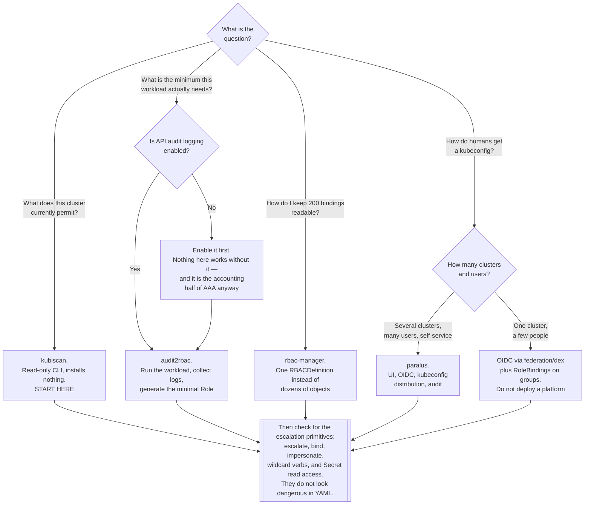

[← Authorization](../README.md)

# Kubernetes RBAC

RBAC is the mechanism, and it is good. These tools solve its four practical problems: nobody
knows the minimum, nobody can see the risk, nobody can read the YAML, and nobody manages who
gets in.

Children: [`audit2rbac/`](audit2rbac/README.md) — derive the minimal Role from audit logs ·
[`kubiscan/`](kubiscan/README.md) — find risky permissions and escalation paths ·
[`rbac-manager/`](rbac-manager/README.md) — declarative, less verbose RBAC ·
[`paralus/`](paralus/README.md) — access management with a UI

## Contents

1. [The model, briefly](#1-the-model-briefly)
   - [The two mistakes in the model itself](#the-two-mistakes-in-the-model-itself)
2. [The escalation primitives](#2-the-escalation-primitives)
   - [escalate](#escalate)
   - [bind](#bind)
   - [impersonate](#impersonate)
   - [Wildcard verbs and resources](#wildcard-verbs-and-resources)
   - [Reading Secrets is close to cluster-admin](#reading-secrets-is-close-to-cluster-admin)
   - [The rest of the list](#the-rest-of-the-list)
3. [The four practical problems](#3-the-four-practical-problems)
4. [The tools](#4-the-tools)
5. [Checking things by hand](#5-checking-things-by-hand)
6. [Decision tree](#6-decision-tree)
7. [Anti-patterns](#7-anti-patterns)
8. [How this applies to pikakube](#8-how-this-applies-to-pikakube)

---

## 1. The model, briefly

Four objects, and the model is genuinely small:

| Object | Scope | Holds |
|---|---|---|
| `Role` | one namespace | rules: verbs × resources (× resource names) |
| `ClusterRole` | cluster-wide | the same, plus cluster-scoped resources and non-resource URLs |
| `RoleBinding` | one namespace | binds subjects to a `Role` **or** to a `ClusterRole`, granting only within that namespace |
| `ClusterRoleBinding` | cluster-wide | binds subjects to a `ClusterRole` everywhere |

Subjects are `User`, `Group` and `ServiceAccount`. Remember from
[`identity-access/README.md`](../../README.md) that `User` and `Group` are **strings produced by
an authenticator** — there is no user object to inspect.

Three properties define its behaviour:

- **Purely additive.** There is no `deny`. The effective permission is the union of every
  binding that applies. You cannot subtract, and you cannot make an exception.
- **Default deny.** Anything not granted is refused.
- **No field-level awareness.** RBAC sees verb, resource type, namespace and optionally resource
  *name*. It never reads the object body, so "may create a Pod but not a privileged one" is not
  expressible — that is an admission policy engine's job.

### The two mistakes in the model itself

Both come from the same place: `ClusterRole` sounds like it means cluster-wide.

**A `RoleBinding` may reference a `ClusterRole`.** This is the intended and most useful pattern —
define `view` once, bind it in fifty namespaces, and each binding grants only within its own
namespace. People avoid it because the name sounds dangerous, and end up duplicating Roles
across namespaces instead.

**A `ClusterRoleBinding` grants everywhere, including namespaces that do not exist yet.** Binding
a ClusterRole with a `namespace` field set does nothing; ClusterRoleBindings have no namespace.
This is the most common accidental over-grant in Kubernetes: someone means "this ServiceAccount
needs to read pods in its namespace" and writes a ClusterRoleBinding, granting it across the
entire cluster forever.

## 2. The escalation primitives

The permissions that are not merely permissions, but permissions to **acquire** permissions.
These are what turn a limited compromise into a cluster compromise, and none of them looks
alarming in a manifest.

### escalate

The verb `escalate` on `roles` / `clusterroles`.

Kubernetes normally prevents privilege escalation through a rule you may not have noticed: **you
cannot create or modify a Role granting permissions you do not already hold.** Without that
check, anyone who could create Roles would be cluster-admin.

The `escalate` verb removes that check. A subject with it can write a Role granting anything at
all, then bind it. **`escalate` is cluster-admin with extra steps.**

### bind

The verb `bind` on `roles` / `clusterroles`.

The same escalation check applies to bindings: you cannot bind a role granting more than you
have. `bind` waives it, so a subject can bind `cluster-admin` to itself. **`bind` is
cluster-admin with one extra step.**

The pair is worth remembering together: `escalate` lets you *write* a powerful role, `bind` lets
you *attach* one. Either alone is sufficient.

### impersonate

The verb `impersonate` on `users`, `groups` or `serviceaccounts`.

It lets a subject act **as** another subject — this is what `kubectl --as` uses. Its legitimate
purpose is debugging: an administrator checking what a user can actually do.

The problem is granularity. `impersonate` on `users` with no `resourceNames` restriction means
impersonating **any** user, including one bound to `cluster-admin`. Impersonating `groups`
includes `system:masters`, which bypasses RBAC entirely. And impersonation is a per-request
header, so it leaves the *impersonator* in the audit log — which is good — but grants the full
permissions of the target.

If it must be granted, constrain it with `resourceNames` to specific subjects.

### Wildcard verbs and resources

`verbs: ["*"]` or `resources: ["*"]` or `apiGroups: ["*"]`.

Three separate problems:

- **They include `escalate` and `bind`.** `verbs: ["*"]` on `clusterroles` is exactly the
  escalation path above, granted without anyone typing the word.
- **They cover resources that do not exist yet.** Install a new operator with new CRDs, and every
  wildcard rule silently expands to cover them. The grant grows without anyone changing it.
- **They defeat review.** Nobody can tell what a wildcard rule permits, so nobody objects to it.

Enumerate. It is more YAML and it is the point of writing it down.

### Reading Secrets is close to cluster-admin

The most under-appreciated item on this list.

> **`get`/`list` on `secrets` in a namespace is, in most real clusters, equivalent to owning
> everything reachable from that namespace.**

Why it compounds:

| Secret in a typical namespace | What it opens |
|---|---|
| ServiceAccount tokens (where legacy Secrets still exist) | act as that ServiceAccount, with all its permissions |
| Database credentials | the data |
| Cloud provider keys | the cloud account |
| TLS private keys | impersonate the service |
| Registry pull secrets | the container registry |
| An operator's credentials | whatever the operator can do |

And `list` is worse than `get`: **`list` on `secrets` returns the contents of every Secret in
scope**, so it cannot be narrowed with `resourceNames`. Resource-name restrictions only work for
`get`, `update`, `patch` and `delete`.

The related escalation is `create` on `pods`: a subject that can create a pod can mount any
Secret in that namespace and read it, or set `serviceAccountName` to a more privileged
ServiceAccount and inherit its token. **Pod creation implies Secret access in the same
namespace**, whether or not `secrets` appears in the Role. This is why namespace-level `edit`
is a much bigger grant than it appears.

### The rest of the list

| Permission | Why it escalates |
|---|---|
| `create` on `pods/exec`, `pods/attach` | run commands in any pod, with that pod's identity and mounts |
| `create` on `serviceaccounts/token` | mint a token for any ServiceAccount in scope, and become it |
| `update`/`patch` on `nodes/status`, or node access generally | a compromised node can affect every pod scheduled to it |
| `create` on `pods` with `hostPath`, `hostPID` or `privileged` | escape to the node, then read every Secret used by every pod on it. RBAC cannot stop this — only admission policy can |
| `update`/`patch` on `validatingwebhookconfigurations` / `mutatingwebhookconfigurations` | disable or subvert admission control cluster-wide |
| `update` on `customresourcedefinitions` | change the schema and behaviour of resources across the cluster |
| `create` on `certificatesigningrequests/approval` | approve a client certificate for any identity, including `system:masters` |
| `delete` on `validatingadmissionpolicies` | remove the control that RBAC delegates field-level policy to |

## 3. The four practical problems

RBAC's model is sound. These are what actually go wrong, and each maps to a tool:

| Problem | Why it happens | Tool |
|---|---|---|
| **"Nobody knows the minimum permissions."** So it gets `cluster-admin` "temporarily" | permissions are only discoverable by trying and failing, one `Forbidden` at a time | [audit2rbac](audit2rbac/README.md) — derive them from what it actually did |
| **"Nobody can see the risk."** A cluster accumulates ClusterRoles from every installed operator | risk is not visible in any single manifest; it is a property of the union | [kubiscan](kubiscan/README.md) — find risky permissions and escalation paths |
| **"Nobody can read the YAML."** Ten teams × three namespaces × four roles is 120 bindings | RBAC is verbose, and the intent is spread across many objects | [rbac-manager](rbac-manager/README.md) — declare it once, compactly |
| **"Nobody manages who gets in."** Onboarding means hand-editing kubeconfigs | RBAC has no user management, by design | [paralus](paralus/README.md) — access management with a UI |

## 4. The tools

| Tool | What it is | Shines when | Do not use when | Detail |
|---|---|---|---|---|
| **audit2rbac** | a CLI that reads API audit logs and emits the minimal Role and bindings for a subject | you must replace `cluster-admin` on a workload and nobody knows what it needs | audit logging is off, or the workload has not exercised its rare paths | [→](audit2rbac/README.md) |
| **kubiscan** | a CLI that scans for risky permissions and privilege-escalation paths | auditing a cluster you did not build, or one where operators were installed freely | you want continuous enforcement — it is a scanner, not a controller | [→](kubiscan/README.md) |
| **rbac-manager** | an operator with an `RBACDefinition` CRD that generates Roles and bindings | many teams and namespaces, and the binding count has become unreadable | a handful of bindings — plain RBAC is clearer than a layer over it | [→](rbac-manager/README.md) |
| **paralus** | a full access-management platform: OIDC login, a UI, kubeconfig distribution, audit | several clusters and many users needing self-service, attributable access | one cluster, one operator — it is a platform, not a utility | [→](paralus/README.md) |

They compose in an order that reflects how the problem is actually approached:

1. **kubiscan** to find out what the cluster currently permits — read-only, no install.
2. **audit2rbac** to replace the over-grants it finds with minimal ones.
3. **rbac-manager** to keep the result manageable as it grows.
4. **paralus** if human access needs a front door.

## 5. Checking things by hand

Before installing anything, `kubectl` answers a surprising amount:

```bash
# What can I do? What can a specific ServiceAccount do?
kubectl auth can-i --list
kubectl auth can-i --list --as=system:serviceaccount:default:my-sa

# Can this specific thing be done?
kubectl auth can-i create pods --as=system:serviceaccount:prod:worker -n prod

# Who is bound to cluster-admin?
kubectl get clusterrolebindings -o json \
  | jq -r '.items[] | select(.roleRef.name=="cluster-admin")
           | .metadata.name + " -> " + ([.subjects[]?.name] | join(","))'

# Which ClusterRoles contain a wildcard verb?
kubectl get clusterroles -o json \
  | jq -r '.items[] | select(.rules[]?.verbs[]? == "*") | .metadata.name'

# Which ClusterRoles grant the escalation verbs?
kubectl get clusterroles -o json \
  | jq -r '.items[] | select(.rules[]?.verbs[]? | IN("escalate","bind","impersonate"))
           | .metadata.name'

# Which subjects can read Secrets cluster-wide?
kubectl get clusterroles -o json \
  | jq -r '.items[] | select(.rules[]? | (.resources[]? == "secrets")
           and (.verbs[]? | IN("get","list","*"))) | .metadata.name'
```

`kubectl auth can-i --list --as=...` is the single most useful command here. It resolves the
union of every applicable binding, which is the thing you cannot compute by reading manifests.

## 6. Decision tree



## 7. Anti-patterns

| Anti-pattern | Why it is bad | What to do instead |
|---|---|---|
| `cluster-admin` "temporarily" | it is permanent, and nobody ever revisits it | derive the minimum with audit2rbac |
| `verbs: ["*"]` or `resources: ["*"]` | includes `escalate` and `bind`, and silently expands to every CRD installed later | enumerate verbs and resources |
| A `ClusterRoleBinding` where a `RoleBinding` was meant | grants across the whole cluster, including namespaces that do not exist yet | a RoleBinding referencing a ClusterRole |
| Granting `list` on `secrets` | `list` returns the contents of every Secret in scope and cannot be narrowed by name | avoid; use `get` with `resourceNames`, or projected tokens |
| Ignoring that `create pods` implies Secret access | a pod can mount any Secret in the namespace, or assume a more privileged ServiceAccount | treat namespace `edit` as a large grant, and pair RBAC with admission policy |
| `impersonate` with no `resourceNames` | impersonating any user or the `system:masters` group bypasses RBAC entirely | constrain to specific subjects |
| Binding individual users | every joiner and leaver is a cluster change | bind groups from the identity provider |
| Using the `default` ServiceAccount | every workload in the namespace shares one identity; least privilege becomes impossible | one ServiceAccount per workload, `automountServiceAccountToken: false` where unused |
| Installing operators without reading their ClusterRoles | a chart routinely grants cluster-wide Secret access, and nobody looks | review before install; scan afterwards with kubiscan |
| No API audit logging | you cannot derive minimal permissions, and you cannot detect misuse of legitimate ones | enable it; it is the prerequisite for most of this folder |
| RBAC treated as workload hardening | it cannot read object bodies, so it cannot stop `privileged: true` | an admission policy engine, alongside |

## 8. How this applies to pikakube

**This is the part of [`identity-access/`](../../README.md) that applies right now, with no
deployment and no decision to make.**

The cluster already runs RBAC. Flux installed a long list of operators — CloudNativePG,
ingress-nginx, Prometheus, and everything else in this repository — and each brought its own
ClusterRoles. Several of them legitimately need broad permissions; nobody has looked at what
they collectively grant. That is not negligence, it is the normal state of every cluster, and it
is exactly what §2 is about.

Concretely, in order:

| Step | Cost | What it gives |
|---|---|---|
| `kubectl auth can-i --list --as=...` on a few ServiceAccounts | minutes | the union of what each can actually do — not visible in any manifest |
| The `jq` queries in §5 | minutes | wildcard verbs, escalation verbs, and cluster-wide Secret readers |
| [kubiscan](kubiscan/README.md) | one read-only CLI run | the same, systematised, plus escalation paths it finds by traversal |
| Enable API audit logging | a control-plane change on Kind | the prerequisite for audit2rbac, and the accounting half of AAA |
| [audit2rbac](audit2rbac/README.md) on anything over-granted | one run per workload | a minimal Role derived from observed behaviour |

The two things worth adopting as habits rather than projects:

- **One ServiceAccount per workload**, never the namespace `default`. It costs nothing at
  creation time and is the prerequisite for every mechanism in
  [`workload-identity/`](../../authentication/workload-identity/README.md) as well as for
  meaningful RBAC.
- **Set `automountServiceAccountToken: false`** on workloads that never call the API. Most do
  not. It removes a credential from the pod for free.

[rbac-manager](rbac-manager/README.md) and [paralus](paralus/README.md) both have staged
HelmReleases and neither is warranted here: there is one cluster, one operator, and nowhere near
enough bindings for either to pay for itself. They are catalogued for the day the shape of the
problem changes.

---

[← Authorization](../README.md)
