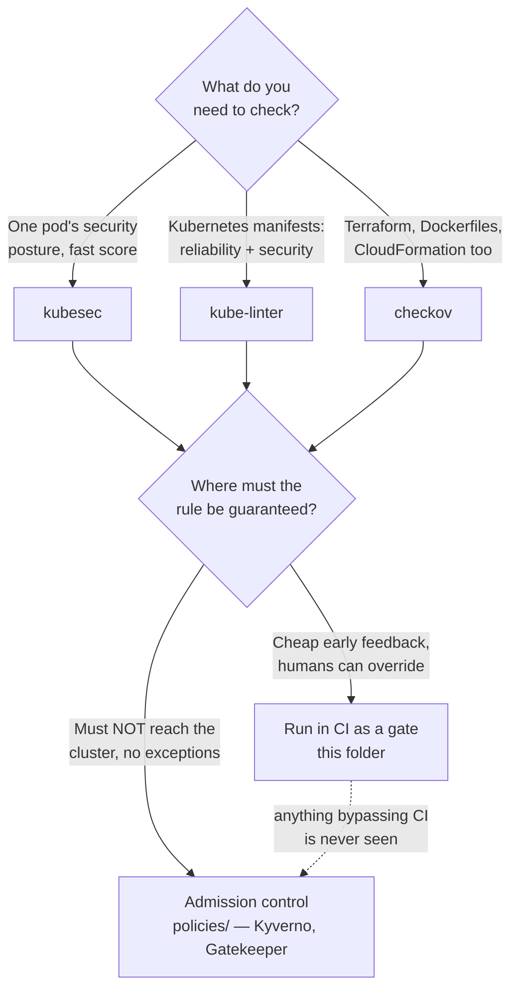

[← Cluster security](../README.md)

# Manifest scanning — catching problems before admission

Checking Kubernetes manifests and IaC in CI, cheaply, before anything reaches the cluster —
and being honest about what that does and does not cover.

Tools covered: [`kubesec`](kubesec/README.md) · [`kube-linter`](kube-linter/README.md) · [`checkov`](checkov/README.md)

## Contents

1. [Where this sits: shift left, but not a boundary](#1-where-this-sits-shift-left-but-not-a-boundary)
2. [The three tools, by breadth](#2-the-three-tools-by-breadth)
   - [kubesec — a security score for one pod](#kubesec--a-security-score-for-one-pod)
   - [kube-linter — production-readiness for Kubernetes](#kube-linter--production-readiness-for-kubernetes)
   - [checkov — all of IaC, one scanner](#checkov--all-of-iac-one-scanner)
3. [The honest limitation: CI is not enforcement](#3-the-honest-limitation-ci-is-not-enforcement)
4. [Decision tree](#4-decision-tree)
5. [Anti-patterns](#5-anti-patterns)
6. [How this applies to pikakube](#6-how-this-applies-to-pikakube)

---

## 1. Where this sits: shift left, but not a boundary

Manifest scanning is the earliest and cheapest security check in the lifecycle. It reads
YAML files in a pull request and flags the obvious problems — a root container, a missing
resource limit, a `latest` tag — before the code is even merged, let alone deployed. The
feedback lands in seconds, in the place the author is already looking.

That is genuinely valuable, and it is also the whole catch: **it acts on files in a
pipeline, not on the cluster.** Everything it finds is a warning a human can ignore, and
everything that reaches the cluster by any route other than that pipeline is never seen by
it. Manifest scanning is a filter, not a gate. The gate is admission control —
[`../policies/README.md`](../policies/README.md) — and the relationship between the two is
the single most important thing to understand about this folder.

## 2. The three tools, by breadth

The three tools are not competitors; they are three concentric rings of scope. Pick by how
wide a net you need.

| Tool | Scope | Shines at | Detail |
|---|---|---|---|
| **kubesec** | one pod's security posture | a fast, opinionated security score on `securityContext` | [→](kubesec/README.md) |
| **kube-linter** | all Kubernetes manifests | production-readiness: probes, limits, replicas, plus security | [→](kube-linter/README.md) |
| **checkov** | all IaC | Terraform, Dockerfiles, CloudFormation, Helm and Kubernetes in one scanner | [→](checkov/README.md) |

### kubesec — a security score for one pod

The narrowest and most opinionated. It scores a single manifest on its `securityContext`
and returns a number plus the reasons. Zero configuration, easy to gate on a threshold, and
it maps almost exactly onto the fields in
[`../pod-security/security-context/README.md`](../pod-security/security-context/README.md).
It says nothing about reliability. [→](kubesec/README.md)

### kube-linter — production-readiness for Kubernetes

Broader, and half of it is not security at all: missing probes, absent resource limits,
single-replica Deployments, dangling ConfigMap references. These are the mistakes that
cause outages, not breaches, and catching them is why kube-linter earns its place. Checks
are configurable per repository. [→](kube-linter/README.md)

### checkov — all of IaC, one scanner

The widest ring. Kubernetes is one of many targets — it also scans the Terraform that built
the cluster and the Dockerfile that built the image. On a real platform, misconfigurations
do not live only in Kubernetes YAML, and checkov is the single tool that sees across all of
it. Findings carry stable IDs (`CKV_K8S_*`) so exceptions are manageable. [→](checkov/README.md)

## 3. The honest limitation: CI is not enforcement

This is worth stating bluntly, because teams routinely believe manifest scanning secures the
cluster. It does not.

| | Manifest scanning (this folder) | Admission control (`policies/`) |
|---|---|---|
| Where it runs | CI, on files in the repo | the cluster's API server, on every request |
| Can it be bypassed? | **Yes** — anything not going through CI never sees it | **No** — every write goes through admission |
| What it produces | a warning, which a human can override | a hard reject, which nothing overrides |
| When it acts | before merge | at the moment of `apply` |

The consequences are concrete. A `kubectl apply` from a laptop, an operator generating
resources at runtime, a Helm install run outside the pipeline, a compromised CI step that
skips the scan — all of these reach the cluster with the scanner none the wiser. A green
manifest-scan run proves the files in the repo are clean; it proves nothing about what is
running.

So the two are complements, in a fixed order:

- **manifest-scan** catches the obvious things *cheaply and early*, with feedback in the PR
- **policies/** enforces the *non-negotiable* things at admission, where nothing can slip past

Use scanning to keep the pipeline clean and fast; use admission control for anything that
genuinely must not exist in the cluster. Neither replaces the other.

## 4. Decision tree

## 5. Anti-patterns

| Anti-pattern | Why it is bad | What to do instead |
|---|---|---|
| Treating manifest scanning as cluster security | anything not going through CI reaches the cluster unchecked; findings are ignorable warnings | pair it with admission control in `policies/` for anything non-negotiable |
| Only scanning Kubernetes YAML | the S3 bucket that is public and the base image running as root live in Terraform and Dockerfiles, not in the manifests | use checkov for the whole IaC surface |
| Gating on kubesec alone | it scores pod security and nothing else — no probes, no limits, no dangling references | add kube-linter for production-readiness |
| Disabling checks globally to get a green build | you lose the check everywhere to silence it in one place | skip the specific check on the specific resource, by ID, with a recorded reason |
| Believing a green CI run means the cluster is safe | it means the *files in the repo* are clean, nothing more | verify the running cluster too (e.g. checkov's in-cluster Job) and enforce at admission |
| Trusting a hosted scanning API with sensitive manifests | the manifest leaves your control | run the scanner locally / in-container in CI |

## 6. How this applies to pikakube

All three tools are catalogued here, and checkov additionally ships a working **in-cluster**
example that is worth calling out because it plugs the folder's own gap: a `Job` with
least-privilege RBAC (a `ClusterRole` that reads workloads and networking but is
deliberately denied Secrets) scans the *live* cluster, catching drift and hand-applied
resources that CI never saw. It is still reporting rather than enforcement — it finds
problems after they are running — but it is the closest thing in this folder to checking
reality instead of files.

The intended shape on a real pikakube pipeline: kube-linter and checkov as CI gates on every
manifest and chart, kubesec where a quick pod-security score helps, and the genuinely
non-negotiable rules pushed down into `policies/` so they hold regardless of how a resource
arrives. This folder is the cheap early filter; it is not, and is not meant to be, the
boundary.

---

[← Cluster security](../README.md)
