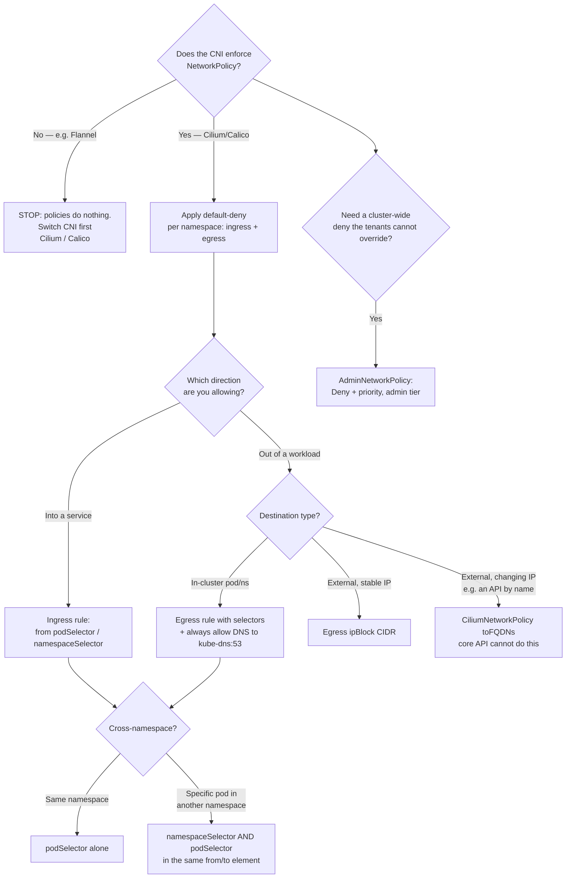

[← Cluster security](../README.md)

# Network policies — segmenting pod-to-pod traffic

The `NetworkPolicy` API, what it controls, why default-deny is the only sensible baseline,
and the one fact that catches everyone: the API does nothing unless the CNI enforces it.

Subfolders: [`network-policy-api/`](network-policy-api/README.md) — the upstream `ClusterNetworkPolicy`,
which is where the admin tier, the real deny and the cluster-wide baseline live

## Contents

1. [The fact that matters most: NetworkPolicy is an API, not an implementation](#1-the-fact-that-matters-most-networkpolicy-is-an-api-not-an-implementation)
2. [The default is wide open](#2-the-default-is-wide-open)
   - [Default-deny is the only sensible baseline](#default-deny-is-the-only-sensible-baseline)
3. [Ingress vs egress](#3-ingress-vs-egress)
   - [Why egress is where the value and the pain both live](#why-egress-is-where-the-value-and-the-pain-both-live)
4. [How pods are selected: namespace vs pod selectors](#4-how-pods-are-selected-namespace-vs-pod-selectors)
5. [Policies are additive: there is no deny rule](#5-policies-are-additive-there-is-no-deny-rule)
6. [Beyond the core API: CNI extensions and ClusterNetworkPolicy](#6-beyond-the-core-api-cni-extensions-and-clusternetworkpolicy)
7. [Decision tree](#7-decision-tree)
8. [Anti-patterns](#8-anti-patterns)
9. [How this applies to pikakube](#9-how-this-applies-to-pikakube)

---

## 1. The fact that matters most: NetworkPolicy is an API, not an implementation

Start here, because everything else is wasted effort if this is wrong:

> **`NetworkPolicy` is an API, not an implementation. The CNI enforces it. Some CNIs do
> not.**

Kubernetes defines the `NetworkPolicy` object, but the API server does nothing with it
beyond storing it. Enforcement is entirely the job of the **CNI plugin**. If the installed
CNI does not implement NetworkPolicy, the objects apply cleanly, report no error, and
enforce **nothing**. A cluster with a wall of carefully written NetworkPolicies committed to
Git can be completely unsegmented, and there is no error message to tell you.

**Flannel does not enforce NetworkPolicy.** This is the canonical trap, and it is documented
in [`infrastructure/network/cni/README.md`](../../../network/cni/README.md#networkpolicy-support-is-not-universal):
a cluster on Flannel with NetworkPolicies "looks secured and is not." Calico and Cilium
enforce; Flannel does not; kindnet (Kind's default) satisfies the network model but is not
the tool you reach for when policy enforcement is the point.

The practical consequence is a sequencing one: **if network segmentation is a requirement,
it constrains the CNI choice before anything else does.** You cannot decide to segment the
cluster after picking Flannel. Verify enforcement — deploy a deny policy and confirm a
blocked connection actually fails — before trusting a single policy in this folder.

## 2. The default is wide open

By default, **every pod can talk to every other pod, in every namespace.** The Kubernetes
network model mandates flat, unrestricted connectivity: no policy means no restriction. A
compromised pod in one namespace can, out of the box, open a connection to a database in
another.

### Default-deny is the only sensible baseline

Because the default is "everything allowed", the only defensible starting posture is to flip
it: a **default-deny** policy per namespace that drops all ingress (and, ideally, all
egress), after which you add back exactly the connections that are needed. This is
allow-listing, and it is the only model that fails safe — a connection you forgot to think
about is denied, not permitted.

The alternative — trying to *block* specific bad paths while leaving everything else open —
is unworkable, because the API has no deny rule (§5) and because you cannot enumerate every
path you do not want. Default-deny, then selectively allow, is the entire method.

## 3. Ingress vs egress

A NetworkPolicy governs two independent directions, and a policy can specify either or both
via `policyTypes`:

| Direction | Controls | Example |
|---|---|---|
| **Ingress** | connections *into* the selected pods | "only the API pods may connect to the database on 5432" |
| **Egress** | connections *out of* the selected pods | "the payment service may only reach the bank gateway and DNS" |

### Why egress is where the value and the pain both live

Ingress is the intuitive half and the easy half: restrict who can reach a service. Most
teams start and stop there.

**Egress is where the real security value is** — and where all the difficulty is. Egress
control is what contains a *compromised* pod: it stops an attacker who has taken over a
workload from exfiltrating data to the internet, reaching the cloud metadata endpoint
(`169.254.169.254`) to steal node credentials, or pivoting to other internal services. A
pod that has been popped can only do damage through the connections it is allowed to open;
egress policy is what shrinks that set.

The pain is equally real and worth stating plainly, because it is why egress policy is so
often skipped:

- **DNS breaks first.** Deny all egress and pods can no longer reach CoreDNS, so every name
  resolution fails and everything appears broken in confusing ways. The first egress allow
  rule you always need is UDP/TCP 53 to `kube-dns`.
- **External dependencies are hard to enumerate.** A workload's real egress set (APIs,
  registries, webhooks, telemetry endpoints) is rarely documented and often surprising, so a
  tight egress policy is discovered painfully through breakage.
- **IP-based rules are brittle.** The core API expresses external destinations as CIDR
  blocks (`ipBlock`), and the IPs behind a cloud API or CDN change. FQDN-based egress needs
  an extension (§6).

The honest summary: ingress is easy and worth doing; egress is hard and worth more.

## 4. How pods are selected: namespace vs pod selectors

A policy targets pods, and names peers, using label selectors. The distinction between the
two selector types is the usual source of subtle mistakes:

| Selector | Matches | Scope |
|---|---|---|
| `podSelector` | pods by label, **within the policy's own namespace** | intra-namespace |
| `namespaceSelector` | whole namespaces by label | cross-namespace |
| both together | pods matching the pod labels **within** namespaces matching the namespace labels | precise cross-namespace |

The trap: inside an `ingress.from` or `egress.to` block, a `podSelector` on its own means
"pods with these labels **in this policy's namespace**", not "anywhere in the cluster". To
allow traffic from a pod in another namespace you must use a `namespaceSelector` — and to
allow from a *specific* pod in a *specific* other namespace you combine both in the same
`from` element. Whether they are combined (AND) or listed separately (OR) changes the meaning
entirely.

Because selection is label-based, network segmentation is only as reliable as label
discipline. A namespace missing its identifying label silently falls outside a
`namespaceSelector` — so labelling namespaces consistently (ideally enforced by a policy in
[`../policies/README.md`](../policies/README.md)) is a prerequisite, not an afterthought.

## 5. Policies are additive: there is no deny rule

This is the property that most confuses people coming from firewalls: **NetworkPolicy has no
`deny`.** You cannot write "block traffic from X". Every rule is an *allow*, and the
combined effect of all policies is the **union** of what they permit.

The model is precise:

- A pod selected by **no** policy is **unrestricted** (the wide-open default of §2).
- As soon as a pod is selected by **any** policy for a direction, that direction flips to
  **default-deny**, and only the traffic explicitly allowed by some policy is permitted.
- Multiple policies selecting the same pod are **additive** — their allowed sets combine.
  There is no way for one policy to subtract from another.

The consequences follow directly:

- **"Deny" is achieved by selecting a pod and allowing nothing.** A policy that selects pods
  and lists an empty ingress set *is* the default-deny rule — it flips the pods to deny and
  permits nothing back.
- **You cannot carve an exception out of an allow.** If a broad policy allows a CIDR and you
  want to exclude one address inside it, no second policy can remove it. You must instead
  write the narrow policy correctly in the first place (the core API's `ipBlock.except`
  handles this one case within a single rule).
- **Order and priority do not exist** in the core API — there is nothing to order, because
  everything is additive allow. (This is one of the things the extensions in §6 add.)

## 6. Beyond the core API: CNI extensions and ClusterNetworkPolicy

The core `NetworkPolicy` is deliberately minimal, and its limits (IP-only external
destinations, no deny, no priority, no cluster-wide scope) are exactly what the extensions
address:

| Extension | Adds | Where it lives |
|---|---|---|
| **CiliumNetworkPolicy** (CRD) | FQDN-based egress (`toFQDNs`), L7/HTTP-aware rules, egress to Kubernetes Services by name, cluster-wide policies | Cilium CNI — [`network/cni/cilium/`](../../../network/cni/cilium/README.md) |
| **Antrea-native policies** (CRD) | cluster-scoped tiers, priorities, `Allow`/`Drop`/`Reject`/`Pass` | Antrea CNI — [`network/cni/antrea/`](../../../network/cni/antrea/README.md) |
| **`ClusterNetworkPolicy`** (`policy.networking.k8s.io`) | the same capability, **vendor-neutral**: a cluster-scoped `Admin` tier above tenant policies and a `Baseline` tier below them, with real `Deny` and priority | the upstream standard — [`network-policy-api/`](network-policy-api/README.md) |

Two points worth holding onto. First, **CiliumNetworkPolicy's FQDN egress is the usual
answer to the "IPs change" problem** in §3 — you allow `egress to api.stripe.com` instead of
chasing CIDR blocks. Second, the upstream API **finally introduces a real deny, a priority order and
a cluster scope**, which the core API pointedly lacks (§5): an `Admin` tier for the platform baseline
("no namespace may reach the metadata endpoint, ever") that tenants cannot override, and a
`Baseline` tier that makes default-deny a property of the cluster instead of a policy object per
namespace. All of them require a CNI that implements them — which loops back to §1.

**The naming changed in October 2025.** `AdminNetworkPolicy` and `BaselineAdminNetworkPolicy` were
consolidated into a single `ClusterNetworkPolicy` with a `tier` field in `v1alpha2`; the model is
unchanged, the objects are not. Anything written before then — including a CNI advertising
"AdminNetworkPolicy support" — may mean the older pair. The detail, the evaluation order and the
implementation status per CNI are in [`network-policy-api/`](network-policy-api/README.md).

## 7. Decision tree

## 8. Anti-patterns

| Anti-pattern | Why it is bad | What to do instead |
|---|---|---|
| Writing NetworkPolicies on Flannel (or any non-enforcing CNI) | they apply without error and enforce nothing — a false sense of segmentation | verify the CNI enforces policy first; use Cilium or Calico if segmentation is required |
| No default-deny, only allow rules for known-bad | the wide-open default means everything you did not think about is permitted | default-deny per namespace, then allow-list what is needed |
| Controlling ingress only | the compromised-pod case — exfiltration, metadata endpoint, lateral movement — is entirely an egress problem | add egress policies, starting with a metadata-endpoint deny |
| Forgetting to allow DNS in an egress policy | every name resolution fails; the whole namespace appears broken in baffling ways | always allow egress to `kube-dns` on port 53 |
| `podSelector` expecting it to match another namespace | it only matches within the policy's own namespace; the cross-namespace traffic is silently dropped | use `namespaceSelector`, combined with `podSelector` for a specific pod |
| Chasing external IPs with `ipBlock` for a cloud API | the IPs behind the name change and the policy breaks intermittently | use FQDN egress via CiliumNetworkPolicy |
| Relying on labels without enforcing them | a namespace missing its label falls outside every `namespaceSelector` silently | enforce required namespace labels via `policies/` |
| Expecting a `deny` rule or rule ordering in the core API | it has neither; a "deny" is a selecting-policy-that-allows-nothing, and everything is additive | model as default-deny + allow; use AdminNetworkPolicy for a real admin-tier deny |

## 9. How this applies to pikakube

pikakube's default CNI is **kindnet** (see
[`network/cni/kindnet/README.md`](../../../network/cni/kindnet/README.md)), Kind's built-in
plugin, chosen because networking is not what the local cluster exists to test. That choice
has a direct bearing on this folder: kindnet satisfies the Kubernetes network model but is
not the tool for exercising NetworkPolicy enforcement. When network segmentation *is* the
subject, the repository documents **Cilium** as the CNI to install on the Kind cluster —
which also unlocks the CiliumNetworkPolicy extensions in §6 (FQDN egress, L7 rules).

So the honest state is: this folder is where the *policy model* is documented, but on a
default kindnet cluster you must confirm enforcement before trusting any policy — deploy a
default-deny, confirm a connection actually fails, and if it does not, that is §1 biting.
The moment segmentation matters, the CNI decision in
[`network/cni/`](../../../network/cni/README.md) comes first, exactly as that folder warns.

The design a real cluster would run: a default-deny (ingress and egress) per namespace as
the baseline, DNS allowed explicitly, an admin-tier deny on the metadata endpoint
(`169.254.169.254`) via AdminNetworkPolicy or a Cilium cluster-wide policy, and per-workload
allow rules kept narrow — with namespace labelling enforced by
[`../policies/README.md`](../policies/README.md) so the selectors it all depends on are
actually reliable.

---

[← Cluster security](../README.md)
