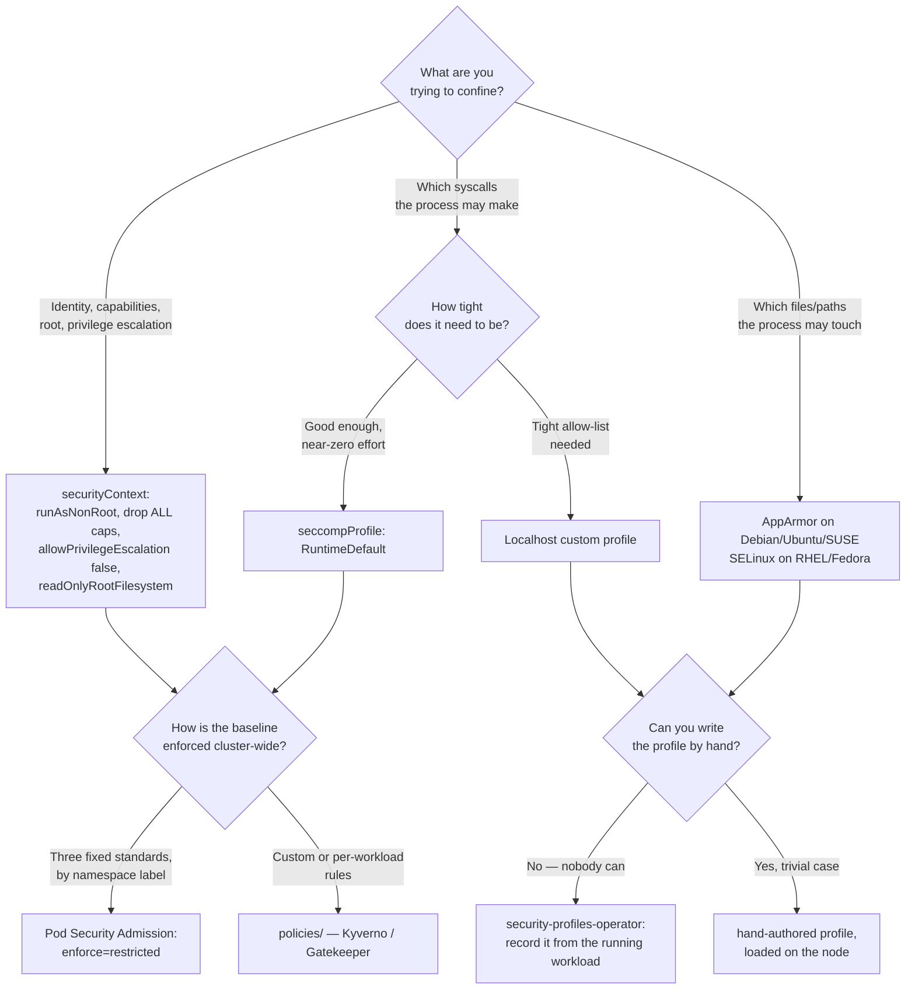

[← Cluster security](../README.md)

# Pod security — confining the container itself

How a single container is boxed in: who it runs as, which syscalls it can make, which files
it can touch, and how to enforce and generate those constraints.

Tools covered: [`security-context`](security-context/README.md) · [`seccomp`](seccomp/README.md) · [`apparmor`](apparmor/README.md) · [`security-profiles-operator`](security-profiles-operator/README.md)

## Contents

1. [The layers, from coarse to fine](#1-the-layers-from-coarse-to-fine)
   - [securityContext — identity and capabilities](#securitycontext--identity-and-capabilities)
   - [seccomp — syscalls](#seccomp--syscalls)
   - [AppArmor / SELinux — file and resource access](#apparmor--selinux--file-and-resource-access)
2. [Pod Security Standards and Pod Security Admission](#2-pod-security-standards-and-pod-security-admission)
   - [The three standards](#the-three-standards)
   - [Admission replaced PodSecurityPolicy](#admission-replaced-podsecuritypolicy)
   - [Where this overlaps with policies/](#where-this-overlaps-with-policies)
3. [The profile-authoring problem, and its answer](#3-the-profile-authoring-problem-and-its-answer)
4. [Decision tree](#4-decision-tree)
5. [Anti-patterns](#5-anti-patterns)
6. [How this applies to pikakube](#6-how-this-applies-to-pikakube)

---

## 1. The layers, from coarse to fine

"Pod security" is not one control. It is a stack of independent Linux mechanisms, each
confining a different axis. They compose — a serious workload sets all of them — and
understanding them means seeing which axis each one owns.

| Layer | Axis it controls | Where it lives |
|---|---|---|
| `securityContext` | identity (UID/GID) and Linux capabilities | pod/container spec |
| seccomp | which syscalls are permitted | profile + `securityContext.seccompProfile` |
| AppArmor / SELinux | which files, paths and resources may be touched (MAC) | node-loaded profile, referenced by the pod |

### securityContext — identity and capabilities

The baseline, and the one every workload must set. `runAsNonRoot: true`,
`allowPrivilegeEscalation: false`, `readOnlyRootFilesystem: true`, drop `ALL` capabilities,
and `seccompProfile: RuntimeDefault`. It decides *who* the process is and *what powers* it
holds. Full detail and the worked examples in
[`security-context/README.md`](security-context/README.md).

### seccomp — syscalls

One level down: of the ~350 Linux syscalls, which may this process make at all. Setting
`RuntimeDefault` is one line and blocks the dangerous ones for free; a `Localhost` profile
tightens it to an allow-list. Detail and the tutorial's worked profiles in
[`seccomp/README.md`](seccomp/README.md).

### AppArmor / SELinux — file and resource access

The Mandatory Access Control layer: which files and paths the process may read or write,
enforced by the kernel regardless of Unix ownership. AppArmor on Debian/Ubuntu/SUSE,
SELinux on Red Hat/Fedora — the same axis, two implementations. Detail in
[`apparmor/README.md`](apparmor/README.md).

## 2. Pod Security Standards and Pod Security Admission

The individual fields above are the *what*. Pod Security Standards are the *policy* that
says which combination of them a namespace requires, and Pod Security Admission is the
*enforcement* built into the API server.

### The three standards

| Standard | Meaning | Use for |
|---|---|---|
| `privileged` | unrestricted — no constraints | trusted, infrastructure workloads that genuinely need host access |
| `baseline` | blocks known privilege escalations (no `privileged`, no `hostNetwork`, no dangerous capabilities) | a sane minimum for general workloads |
| `restricted` | the hardened tier — enforces `runAsNonRoot`, dropped capabilities, `RuntimeDefault` seccomp, no privilege escalation | the target for anything running untrusted or internet-facing code |

`restricted` is, in effect, "every good `securityContext` field, set correctly" — the same
fields described in §1, made mandatory.

### Admission replaced PodSecurityPolicy

**PodSecurityPolicy (PSP) was removed in Kubernetes 1.25.** Its replacement is **Pod
Security Admission (PSA)**, a built-in admission controller configured per namespace with
labels:

- `pod-security.kubernetes.io/enforce: restricted` — reject pods that violate the standard
- `pod-security.kubernetes.io/warn` and `.../audit` — warn or audit without rejecting

It runs in three modes (`enforce`, `warn`, `audit`) so you can roll out gradually: audit
first, see what would break, then enforce.

### Where this overlaps with policies/

PSA is deliberately limited — three fixed standards, applied by namespace label, no custom
rules. When you need something PSA cannot express (an org-specific rule, a per-workload
exception, a mutating default), that is `policies/` (Kyverno, Gatekeeper). PSA is the
built-in floor; the policy engines are the general tool. See
[`../policies/README.md`](../policies/README.md).

## 3. The profile-authoring problem, and its answer

The tight end of both seccomp and AppArmor hits the same wall: **nobody can write a good
profile by hand.** You cannot enumerate the syscalls or file paths a real application uses,
so a hand-written profile either blocks something the app needs (a crash that is miserable
to debug) or is so loose it adds nothing.

The [security-profiles-operator](security-profiles-operator/README.md) is the answer. It
**records** a profile from a running workload — you exercise the app under real traffic and
it emits the exact seccomp/AppArmor profile of what the app actually did — and it manages
those profiles as Kubernetes resources distributed to nodes, instead of files copied by
hand. The rule to remember: you do not write the profile, you record it, review it, and
promote it.

## 4. Decision tree

## 5. Anti-patterns

| Anti-pattern | Why it is bad | What to do instead |
|---|---|---|
| Leaving `securityContext` unset | container runs as root with full capabilities and a writable filesystem — the widest possible blast radius | set the baseline: `runAsNonRoot`, drop `ALL`, `allowPrivilegeEscalation: false`, `RuntimeDefault` |
| `privileged: true` for convenience | it is effectively root on the node; one compromise owns the host | grant the single specific capability actually needed, after dropping `ALL` |
| `runAsUser: 1000` without `runAsNonRoot: true` | an image that hardcodes `USER 0` still wins and runs as root | set both; `runAsNonRoot` is the one that refuses to start a root image |
| Hand-writing a tight seccomp/AppArmor profile from guesswork | you will block a needed syscall (obscure crash) or allow too much (pointless) | record it with security-profiles-operator, then review |
| Relying on PodSecurityPolicy | removed in Kubernetes 1.25; it does not exist anymore | Pod Security Admission, or a policy engine in `policies/` |
| Setting `seccompProfile: Unconfined` | disables syscall filtering entirely — the absence of the control | `RuntimeDefault` at minimum |
| Treating one layer as sufficient | a kernel bug or a missing axis defeats any single mechanism | stack `securityContext` + seccomp + AppArmor/SELinux |
| Referencing an AppArmor profile not loaded on the node | the pod does not get the confinement it claims | distribute profiles with security-profiles-operator |

## 6. How this applies to pikakube

This folder is a teaching set as much as a deployment, built around the Kubernetes
documentation's own examples:

| Layer | What is here | State |
|---|---|---|
| `securityContext` | four demo pods showing identity, precedence, the unconfigured case, and the capability escape hatch | reference examples |
| seccomp | the tutorial's three profiles (deny-all, audit/log, fine-grained allow-list) and four pods attaching them | reference examples |
| AppArmor | a `deny-write` example pod using the (now-deprecated) beta annotation | reference example |
| security-profiles-operator | installed via Flux (`GitRepository` + `HelmRelease`, pinned to `v0.8.4`) | the one actually deployed |

The through-line: the `securityContext`, seccomp and AppArmor folders teach what a profile
*is* and what each field does; the security-profiles-operator is the one component actually
reconciled into the cluster, because it is the piece that turns "you should have tight
profiles" into something achievable — record them, do not write them. On a real cluster the
baseline (`restricted` `securityContext` on every workload, `RuntimeDefault` seccomp) is
enforced with Pod Security Admission labels on namespaces, escalating to `policies/` when a
rule needs to be custom.

---

[← Cluster security](../README.md)
