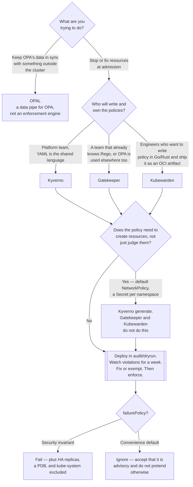

[← Cluster security](../README.md)

# Admission policies

Admission control is the last point at which a bad resource can be stopped. After this, it exists.

Tools: [`gatekeeper/`](gatekeeper/README.md) — OPA/Rego ·
[`kyverno/`](kyverno/README.md) — YAML, Kubernetes-native ·
[`kubewarden/`](kubewarden/README.md) — WebAssembly ·
[`opal/`](opal/README.md) — keeps OPA's data fresh

## Contents

1. [Where admission sits](#1-where-admission-sits)
   - [Why the API server is the only honest checkpoint](#why-the-api-server-is-the-only-honest-checkpoint)
2. [Validating vs mutating](#2-validating-vs-mutating)
   - [Order matters](#order-matters)
3. [The failure mode decision](#3-the-failure-mode-decision)
   - [Both answers are bad](#both-answers-are-bad)
   - [How to survive either choice](#how-to-survive-either-choice)
4. [Audit vs enforce](#4-audit-vs-enforce)
   - [Start in audit. Always](#start-in-audit-always)
   - [The exemption problem](#the-exemption-problem)
5. [The language question](#5-the-language-question)
   - [Kyverno: YAML](#kyverno-yaml)
   - [Gatekeeper: Rego](#gatekeeper-rego)
   - [Kubewarden: WebAssembly](#kubewarden-webassembly)
   - [OPAL is not in this competition](#opal-is-not-in-this-competition)
6. [Generate and mutate: policy that does work](#6-generate-and-mutate-policy-that-does-work)
7. [What admission control cannot do](#7-what-admission-control-cannot-do)
8. [Decision tree](#8-decision-tree)
9. [Anti-patterns](#9-anti-patterns)
10. [How this applies to pikakube](#10-how-this-applies-to-pikakube)

---

## 1. Where admission sits

A request to the Kubernetes API server passes through a fixed pipeline:

```
authentication → authorization (RBAC) → mutating admission → schema validation → validating admission → etcd
```

RBAC answers *who may do this*. Admission answers *is this particular object acceptable*. They are
different questions and RBAC cannot answer the second one: RBAC can say "this service account may
create Pods", it cannot say "but not privileged ones, and not from Docker Hub".

### Why the API server is the only honest checkpoint

Every other place you could check is optional in practice:

| Checkpoint | Why it is not enough |
|---|---|
| CI pipeline linting | someone runs `kubectl apply` from a laptop |
| Git review | an operator or controller creates resources nobody reviewed |
| The chart's own defaults | overridden by values, silently |

Admission is the only one that sees **every** write, whatever created it — Flux, a Helm chart, an
operator, a human in a hurry. That is the entire argument for putting policy here rather than
earlier. Putting it *only* here is also a mistake — see [section 7](#7-what-admission-control-cannot-do).

## 2. Validating vs mutating

Two webhook types, and the distinction drives almost every design decision.

| | Validating | Mutating |
|---|---|---|
| What it does | accepts or rejects | rewrites the object before it is stored |
| Feedback | the user sees a rejection message | the user sees nothing; the object silently differs from what was submitted |
| Failure blast radius | the write fails | the write succeeds but is wrong |
| Good for | invariants: no `:latest`, no privileged, resources required | defaults: add a label, set `imagePullPolicy`, inject a sidecar |

Mutation is the more dangerous of the two, and it is the one people reach for first because it is
friendlier. A mutating policy that adds `imagePullPolicy: IfNotPresent` to every `*:latest` image
(see `kyverno/examples/set-image-pull-policy/clusterpolicy.yaml`) is invisible: the manifest in Git
and the object in the cluster no longer match, and nobody will notice until someone debugs why an
image is stale.

The rule of thumb: **mutate to add things that are safe to add, validate everything you actually
care about.** If a mutating policy would silently fix a security problem, validate it instead so
somebody has to see it.

### Order matters

All mutating webhooks run before all validating webhooks. So a validating policy sees the
*mutated* object, not what the user submitted. This is usually what you want (defaults get applied,
then checked), but it means a mutating policy can make a validating policy pass — which is fine
when deliberate and a hole when accidental.

## 3. The failure mode decision

This is the single most consequential setting in the whole folder, and it lives on the
`ValidatingWebhookConfiguration` / `MutatingWebhookConfiguration`:

| `failurePolicy` | If the policy engine is unreachable |
|---|---|
| `Fail` | the API server rejects the request |
| `Ignore` | the API server allows the request |

### Both answers are bad

**`failurePolicy: Fail`** makes the policy engine a cluster-wide single point of failure. If every
Pod creation must consult a webhook and that webhook's pods are down, nothing can be scheduled —
including, in the worst case, the policy engine's own replacement pods. This is the classic
Kubernetes outage: the admission controller crashes, and the cluster cannot heal itself because
healing requires creating pods, which requires the admission controller. It is a real, documented,
repeatedly-experienced failure mode, not a theoretical one.

**`failurePolicy: Ignore`** turns every policy into advice. The moment the webhook is under load,
being restarted, or rolling out a new version, the exact requests you most wanted to block sail
through. The policy is enforced *most of the time*, which for a security control is close to
worthless — an attacker who can cause load can cause a gap.

There is no third option. You are choosing between an availability risk and a security gap.

### How to survive either choice

If you pick `Fail` — and for genuine security invariants you probably should — the mitigations are
not optional:

| Mitigation | Why |
|---|---|
| Multiple replicas, spread across nodes | one node loss must not take admission down |
| A `PodDisruptionBudget` | drains must not evict the last replica |
| **Exclude `kube-system` and the engine's own namespace** | so the cluster can always repair itself |
| Narrow `rules` — only the resources and verbs you actually check | fewer requests through the webhook, smaller blast radius |
| A short `timeoutSeconds` | a slow webhook must not become a slow API server |

The exclusion is the one that saves you. Kyverno ships this as a `resourceFilters` list in the
`kyverno` ConfigMap — `configs/configmap.yaml` in this repo excludes `kyverno`, `kube-system`,
`kube-public`, `kube-node-lease`, `Node`, and `Event`. That is not tidiness, it is the escape
hatch.

A defensible split: `Fail` for validating policies on workload namespaces, `Ignore` for mutating
policies that only add convenience defaults.

## 4. Audit vs enforce

Every engine has the same two modes under different names:

| Concept | Kyverno | Gatekeeper |
|---|---|---|
| Report only | `validationFailureAction: Audit` | `enforcementAction: dryrun` |
| Report loudly, still allow | — | `enforcementAction: warn` |
| Block | `validationFailureAction: Enforce` | `enforcementAction: deny` |

Both are visible in this repo. `policies/gatekeeper/policies/allowed-repositories/constraint.yaml`
carries `enforcementAction: dryrun` with the comment `#dryrun warn deny`; `disallow-tags` is on
`warn`; `container-ratios` is on `deny`. On the Kyverno side,
`examples/disallow-latest-tag/clusterpolicy.yaml` is `Enforce` while
`examples/require-labels/clusterpolicy.yaml` is `Audit # Enforce # Audit`.

### Start in audit. Always

A new policy in enforce mode against an existing cluster is an outage waiting for the next
deployment. The sequence that works:

1. Deploy in audit/dryrun.
2. Collect violations for long enough to cover the slow-moving workloads — a week, not an hour.
3. Fix the workloads, or write the exemptions.
4. Flip to enforce.
5. Only now is the policy real.

Step 2 needs somewhere to read violations from. That is what
[`kyverno/policy-reporter/`](kyverno/policy-reporter/README.md) is for; on the Gatekeeper side the
violations live in the constraint's `status`, and the practical extraction commands are recorded in
[`gatekeeper/README.md`](gatekeeper/README.md).

### The exemption problem

Every real policy needs exemptions, and every exemption is a hole. Two things keep them honest:

- **Exempt narrowly.** A namespace exclusion is broader than an image exclusion.
  `disallow-tags/constraint.yaml` uses `exemptImages`, which is the narrow kind.
- **Write down why.** The gatekeeper notes record the tag-policy exemptions as *Flux and spot
  instances, because they update tags automatically* — that is a reason someone can re-evaluate
  later. An unexplained exemption is permanent.

## 5. The language question

The three enforcement engines differ mainly in how a policy is written, and that is a bigger deal
than it sounds, because whoever cannot write a policy will not own one.

### Kyverno: YAML

Policies are Kubernetes resources with `match` / `validate` / `mutate` / `generate` blocks. Anyone
who can read a manifest can read a policy. There is a large official library
(<https://kyverno.io/policies/>) that is mostly copy-paste. The cost is that complex logic gets
awkward — deeply conditional rules turn into JMESPath expressions that are harder to read than the
Rego equivalent would have been.

### Gatekeeper: Rego

Policies are Rego, split across two objects: a `ConstraintTemplate` (the logic, plus a generated
CRD) and a `Constraint` (an instance of it with parameters). See
[`gatekeeper/policies/`](gatekeeper/policies/README.md) for worked examples of both halves.

Rego is genuinely powerful and genuinely a learning curve. It is a declarative logic language, not
a scripting language, and the mental model — rules that produce sets, `violation[{"msg": msg}]`
holding when a violation exists — does not resemble anything most platform engineers write daily.
The payoff is that the same language is used by OPA everywhere else (API gateways, Kafka, CI), so
the investment transfers.

### Kubewarden: WebAssembly

Policies compile to Wasm modules and can be written in Rust, Go, or anything else with a Wasm
target — including Rego, which Kubewarden can run as a Wasm module. The modules are distributed as
OCI artifacts, so policies are versioned and pulled like images.

This is the most flexible model and the least common. It suits teams that already have a language
they want to write policy in and want policies to be shippable artifacts. It is the least
accessible to someone who just wants to require a label.

### OPAL is not in this competition

[OPAL](opal/README.md) does not enforce anything. It keeps OPA's *data* — not its policies — in
sync from external sources. This matters when a decision depends on state outside the cluster: "is
this team's budget exhausted", "is this image approved in the CMDB", "is this user in the on-call
rotation". Rego can express that rule; it cannot fetch the answer. OPAL is the pipe.

## 6. Generate and mutate: policy that does work

The underrated half of Kyverno. Most people install a policy engine to say *no*; `generate` and
`mutate` make it produce things instead:

| Capability | Example in this repo | What it replaces |
|---|---|---|
| `generate` a Secret into every namespace | `kyverno/policies/sync-secret/sync-tls-secret.yaml` clones a TLS secret into new namespaces | a replicator controller, or copy-paste |
| `generate` a default NetworkPolicy | — | remembering to add one per namespace |
| `mutate` to add labels | `kyverno/examples/add-labels/clusterpolicy.yaml` | asking teams to add them |
| `mutate` to rewrite the registry | `kyverno/examples/replace-image-registry.yaml` rewrites `docker.io/*` to a Harbor mirror | editing every manifest |
| `mutate` to add a TTL to Jobs | `kyverno/examples/add-ttl-jobs/clusterpolicy.yaml` | Jobs accumulating forever |

A generated default NetworkPolicy is worth more than a validating policy that requires one:
the second produces a rejection and an annoyed engineer, the first produces a secure namespace.

The caveat, recorded in `kyverno/policies/sync-secret/`: `generate` only fires on the events it
matches, so by default it covers namespaces created *from now on*. Kyverno's `generateExisting:
true` (used in that policy) is what makes it apply retroactively.

## 7. What admission control cannot do

Admission sees an object once, at write time. It therefore cannot see:

- **What the container does at runtime.** A perfectly compliant Pod spec can run a cryptominer.
  That is [`runtime-security/`](../runtime-security/README.md).
- **Drift after admission.** A resource edited by a controller, or an object that predates the
  policy, is never re-evaluated by the webhook. Both Kyverno and Gatekeeper run a *background* or
  *audit* scan for exactly this reason, and the results are reports, not blocks.
- **Anything outside the cluster.** The registry, the CI pipeline, the cloud account.

Treating admission as the whole security programme is the most common structural mistake in this
area.

## 8. Decision tree



## 9. Anti-patterns

| Anti-pattern | Why it is bad | What to do instead |
|---|---|---|
| Enforce mode on day one | the first deployment after rollout fails, and policy gets blamed | audit → collect → fix → enforce |
| `failurePolicy: Fail` with one replica | the cluster cannot create pods, including the ones that would fix it | multiple replicas, a PDB, and namespace exclusions |
| `failurePolicy: Ignore` on a security control | enforced only when nothing is wrong, which is when you least need it | `Fail`, hardened — or admit the policy is advisory |
| No exclusion for `kube-system` and the engine's own namespace | there is no way to recover a broken webhook | exclude them; `configs/configmap.yaml` shows the Kyverno form |
| Mutating away a security problem | the cluster is compliant and the manifest in Git is not; nobody learns | validate, so the rejection is visible |
| Policies that only reject | teams route around policy instead of adopting it | `generate` the compliant thing where you can |
| Violations nobody reads | audit mode without a reader is a no-op with extra latency | Policy Reporter, or the log-extraction commands in the Gatekeeper notes |
| Undocumented exemptions | they outlive their reason and become permanent holes | record why, and exempt by image rather than by namespace |
| Two enforcement engines at once | two webhooks in the path, two languages, two on-call surprises | pick one; keep the others as evaluation folders |
| Treating admission as the whole programme | it never sees runtime behaviour or pre-existing drift | pair it with runtime security and posture scanning |

## 10. How this applies to pikakube

Four engines are present, which is an evaluation set rather than a deployment plan — only one
should end up enforcing in a cluster, because two admission webhooks in the write path double both
the latency and the failure modes.

**Kyverno is the one that is actually wired up.** It has a `kustomization.yaml`, a
`resourceFilters` ConfigMap, RBAC for the `generate` rules, and it is the only one on an
`OCIRepository` chart source rather than a plain `HelmRepository`. Gatekeeper, Kubewarden, and OPAL
have a namespace and a HelmRelease and nothing that says they are in the delivery path.

The Gatekeeper folder is still worth keeping for its constraint library — five worked
`ConstraintTemplate` + `Constraint` pairs are the clearest available explanation of the Rego model
— and for the violation-extraction commands, which solve a real problem (Gatekeeper's constraint
status truncates at 20 records) that anyone running Gatekeeper hits on day two.

The genuinely valuable thing here for a platform like this one is the `generate` half of Kyverno,
not the `validate` half: a data platform spins up namespaces for Airflow, Spark and friends, and
each of those namespaces needs a TLS secret, an image-pull secret, and a default NetworkPolicy. The
`sync-secret` policy is that pattern, already working. Extending it beats writing a validating
policy that complains when a namespace lacks them.

---

[← Cluster security](../README.md)
