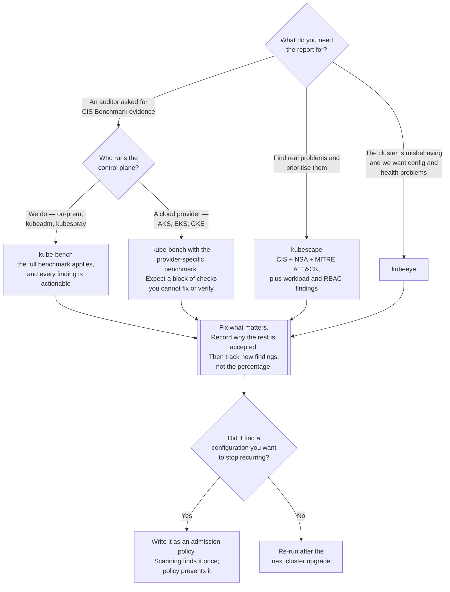

[← Cluster security](../README.md)

# Posture assessment

Scanning the cluster's own configuration against a benchmark, and being honest about what the score
is worth.

Tools: [`kube-bench/`](kube-bench/README.md) — CIS Kubernetes Benchmark ·
[`kubescape/`](kubescape/README.md) — CIS plus NSA and MITRE ATT&CK ·
[`kubeeye/`](kubeeye/README.md) — cluster health and configuration checks

## Contents

1. [What posture means here](#1-what-posture-means-here)
   - [What it is not](#what-it-is-not)
2. [The frameworks](#2-the-frameworks)
   - [CIS Kubernetes Benchmark](#cis-kubernetes-benchmark)
   - [NSA/CISA hardening guidance](#nsacisa-hardening-guidance)
   - [MITRE ATT&CK for containers](#mitre-attck-for-containers)
3. [The managed control plane problem](#3-the-managed-control-plane-problem)
4. [Why the score is a starting point, not a programme](#4-why-the-score-is-a-starting-point-not-a-programme)
   - [Exceptions are the real work](#exceptions-are-the-real-work)
5. [How the three tools differ](#5-how-the-three-tools-differ)
6. [Job or operator: how often to scan](#6-job-or-operator-how-often-to-scan)
7. [Decision tree](#7-decision-tree)
8. [Anti-patterns](#8-anti-patterns)
9. [How this applies to pikakube](#9-how-this-applies-to-pikakube)

---

## 1. What posture means here

Posture assessment reads configuration — of the control plane, of the nodes, of the workloads — and
compares it against a published list of expectations. It answers *is this cluster set up the way a
hardened cluster is set up*.

The output is a report: a list of checks, each passed, failed, or not applicable, usually with a
percentage attached.

### What it is not

| It is not | That is |
|---|---|
| A vulnerability scanner | image and manifest scanning — `../manifest-scan/` and container-level tooling |
| A runtime detector | [`runtime-security/`](../runtime-security/README.md) |
| An enforcement mechanism | [`policies/`](../policies/README.md) |

The distinction that matters most: posture tools tell you the door is unlocked. They do not tell you
whether anyone walked through it, and they do not lock it.

## 2. The frameworks

### CIS Kubernetes Benchmark

The Center for Internet Security publishes a versioned document of several hundred checks, split by
component: control plane API server flags, controller manager, scheduler, etcd, kubelet
configuration, and a set of policy recommendations. Each check is scored (has a pass/fail test) or
unscored (requires human judgement).

This is what kube-bench implements, and it is deliberately narrow: it is a *configuration* standard
for the Kubernetes components themselves. Most of it is about flags on processes and permissions on
files under `/etc/kubernetes`.

### NSA/CISA hardening guidance

Broader and less mechanical: network separation, authentication, audit logging, supply chain. It
overlaps CIS but is written as guidance rather than a checklist, so tools that "implement NSA"
are interpreting it.

### MITRE ATT&CK for containers

Not a hardening standard at all — a taxonomy of *attacker techniques*. Mapping findings to ATT&CK
changes the question from "is this flag set" to "which attack step does this enable". It is the most
useful framing for prioritisation and the least useful for compliance paperwork, because there is no
score to report.

kubescape covers all three.

## 3. The managed control plane problem

A large fraction of the CIS Kubernetes Benchmark checks the control plane: API server flags, etcd
encryption, scheduler configuration, file ownership under `/etc/kubernetes/manifests`. On AKS, EKS,
or GKE **none of that is yours**. You cannot read those files, you cannot change those flags, and
the provider will not tell you what they are set to.

The consequence is concrete and it surprises people:

- kube-bench run against a managed cluster reports a large block of failures or `[INFO]` results
  that are simply not actionable.
- The percentage score is therefore meaningless as a target — you cannot reach 100%, and chasing
  the number wastes time on checks nobody can fix.
- The vendors publish provider-specific benchmark variants (CIS Amazon EKS Benchmark, CIS AKS
  Benchmark) precisely because the generic one does not fit. kube-bench supports selecting these
  with `--benchmark` / `--targets`.

The part that *is* yours on a managed cluster: kubelet and node configuration (if you manage the
node pools), RBAC, network policy, Pod security, and secrets handling. That is where the actionable
findings live, and it is a much shorter list than the full benchmark.

## 4. Why the score is a starting point, not a programme

A benchmark score is a compression of hundreds of unrelated facts into one number, and every
compression loses the thing you care about. Three specific problems:

**It weights everything equally.** "API server `--anonymous-auth` is enabled" and "the audit log
file has the wrong permissions" are one point each. One is an exploitable hole and one is
paperwork.

**It only measures what the benchmark thought to ask.** The benchmark has no opinion about your
application's service accounts, your CI credentials, or the fact that six people share a
cluster-admin kubeconfig. Passing it says nothing about those.

**It rewards suppression.** Every one of these tools supports exceptions, and the fastest route to
a good score is to write them. The score then measures how many exceptions you wrote.

So the honest use of a posture tool is: run it once to find the things you did not know about, fix
the ones that matter, record why the rest are accepted, and then track *changes* rather than the
absolute number. A finding that appeared this week is information. A stable 72% is not.

### Exceptions are the real work

Because so much of the output is not applicable, the exception mechanism is the part of the tool
you will actually live with — and it is where these tools tend to be weakest. The kubescape notes
in this repo record exactly that friction: supplying an exceptions JSON through the Helm chart is
not supported (<https://github.com/kubescape/helm-charts/issues/393>). That is not a footnote; for
a GitOps-managed cluster, "the exceptions cannot be declared in the chart" means the exceptions
live somewhere outside Git, which is the thing GitOps exists to prevent.

## 5. How the three tools differ

| | kube-bench | kubescape | kubeeye |
|---|---|---|---|
| Vendor | Aqua Security | ARMO (CNCF sandbox) | KubeSphere |
| Scope | CIS Kubernetes Benchmark only | CIS + NSA + MITRE, workload config, image vulnerabilities, RBAC | cluster health, resource config, node problems |
| How it runs | a one-shot `Job` on the node, with host paths mounted | an operator with scheduled scans, plus a CLI | an operator with an inspection CRD |
| Output | text/JSON to stdout | reports in-cluster, and optionally to a SaaS backend | `ClusterInsight` resources |
| Needs host access | yes — it reads `/etc/kubernetes`, `/var/lib/kubelet` | partly | partly |
| SaaS involved | no | optional (`cloud.armosec.io`), and the chart is built around it | no |
| Best at | the authoritative CIS answer on a self-managed cluster | breadth, and prioritisation via ATT&CK | operational health, not only security |

kubeeye is the odd one out and worth being clear about: it is closer to a cluster *health* checker
than a security benchmark. Misconfigured resource limits, unhealthy nodes, deprecated APIs. Useful,
but it does not answer "are we CIS compliant".

## 6. Job or operator: how often to scan

Two shapes, and they encode different assumptions:

| Shape | Example | Assumption |
|---|---|---|
| One-shot `Job` | `kube-bench/job.yaml` | configuration changes rarely; run it when something changes |
| Operator with a schedule | `kubescape/helm/helmrelease.yaml`, `scanSchedule: "0 8 * * 1"` — Mondays at 08:00 | configuration drifts; catch it weekly |

The one-shot Job is not a worse choice. Control-plane configuration genuinely does not change on
its own, and a Job you run after every cluster upgrade catches everything a weekly scan would, with
no permanent privileged workload sitting on the node.

The operator earns its place when the scope includes *workloads*, because those change constantly.

Either way the cost is real: these tools need host mounts and privileged access to do their job.
`kube-bench/job.yaml` mounts `/var/lib/etcd`, `/etc/kubernetes`, `/var/lib/kubelet`, `/etc/systemd`
and `/usr/bin` from the host, with `hostPID: true`. That is a lot of authority to leave running
permanently for a report you read once a quarter.

## 7. Decision tree

## 8. Anti-patterns

| Anti-pattern | Why it is bad | What to do instead |
|---|---|---|
| Treating the percentage as a KPI | it rewards writing exceptions, not fixing things | track new findings between runs |
| Chasing control-plane failures on a managed cluster | you cannot change the API server flags, and the provider will not tell you what they are | use the provider-specific benchmark; focus on kubelet, RBAC, workloads |
| Running the scan once, at install | configuration drifts, and the report ages instantly | schedule it, or run it on every upgrade |
| Nobody owns the report | findings accumulate and the tool becomes noise | assign each failing check an owner or an accepted-risk note |
| Exceptions outside Git | the accepted-risk list is invisible and unreviewable | keep exceptions in the repo; if the chart cannot take them, that is a real objection to the tool |
| Fixing findings by hand | the same misconfiguration reappears with the next chart | turn recurring findings into admission policies |
| Leaving a privileged scanner running permanently | `hostPID`, host mounts and node access, for a report read quarterly | a `Job` on demand is often enough |
| Confusing posture with runtime | a compliant cluster can be actively compromised | pair with runtime security |

## 9. How this applies to pikakube

The three tools here are deployed in three different shapes, and that is the most informative thing
about the folder.

kube-bench is a bare `Job` and a namespace — no Helm, no schedule. That is the correct shape for
what it does, and it means running it is a deliberate act rather than something that happens on its
own. Worth doing after each cluster upgrade.

kubescape is the fully-wired one: an operator, a weekly scan on Monday morning, a `ServiceMonitor`
so results reach Prometheus, and a registry-scan secret. It is also the one with a dependency
nobody should skip past — the HelmRelease pulls `account` and `accessKey` from a `credentials`
Secret and points `server: api.armosec.io`. That is the SaaS backend. It is optional in kubescape
generally, but the configuration in this repo is not the offline mode, and the recorded issues are
all about that same seam: exceptions not supplied through the chart, and several open bugs in the
chart itself.

kubeeye is on a `GitRepository` source with an unpinned chart path — the least finished of the
three, and the one whose purpose overlaps least with the other two.

For a cluster running on a managed control plane, the honest expectation is that most of what
kube-bench reports will be unactionable and the value will come from the kubelet and workload
sections. The findings worth acting on are the ones that map onto things this repo can actually
change: Pod security settings, RBAC, network policies, and secrets handling — and each of those has
a folder that can enforce it rather than merely report on it.

---

[← Cluster security](../README.md)
