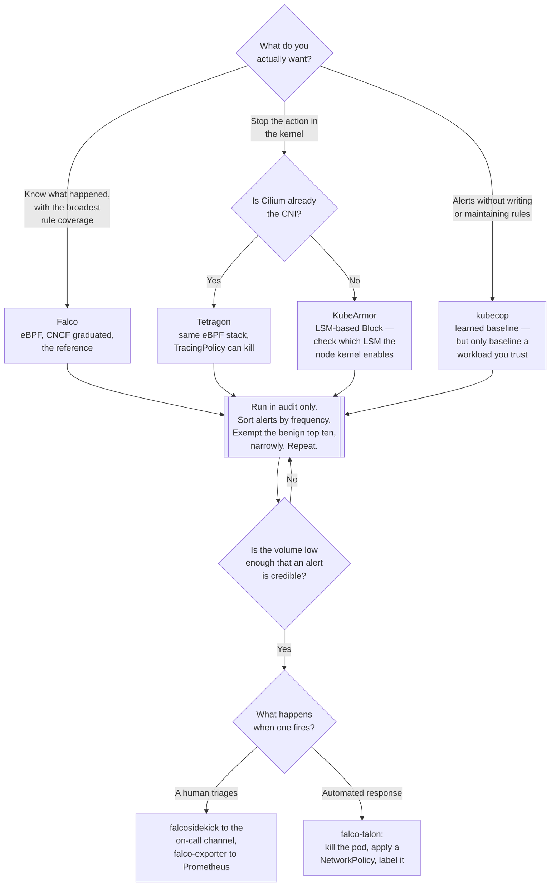

[← Cluster security](../README.md)

# Runtime security

The only layer that can see an exploit while it is happening. Also the layer that will drown you in
alerts if you deploy it and walk away.

Tools: [`falco/`](falco/README.md) — the reference implementation ·
[`falco-operator/`](falco-operator/README.md) — the same Falco, delivered as CRDs ·
[`tetragon/`](tetragon/README.md) — Cilium, eBPF, can enforce ·
[`tracee/`](tracee/README.md) — Aqua, eBPF ·
[`kubearmor/`](kubearmor/README.md) — enforcement via LSM ·
[`kubecop/`](kubecop/README.md) — behavioural baselining

## Contents

1. [Why this layer exists](#1-why-this-layer-exists)
2. [How these tools see anything](#2-how-these-tools-see-anything)
   - [Kernel module vs eBPF](#kernel-module-vs-ebpf)
   - [LSM: a different hook, and a different power](#lsm-a-different-hook-and-a-different-power)
3. [Detection vs enforcement](#3-detection-vs-enforcement)
   - [Why blocking in the kernel is harder than it sounds](#why-blocking-in-the-kernel-is-harder-than-it-sounds)
4. [The alert volume problem](#4-the-alert-volume-problem)
   - [Where the noise comes from](#where-the-noise-comes-from)
   - [Tuning is the job](#tuning-is-the-job)
5. [Detection without response is a dashboard](#5-detection-without-response-is-a-dashboard)
6. [The tools compared](#6-the-tools-compared)
7. [Decision tree](#7-decision-tree)
8. [Anti-patterns](#8-anti-patterns)
9. [How this applies to pikakube](#9-how-this-applies-to-pikakube)

---

## 1. Why this layer exists

Every other control in `2-cluster/` operates on *intent*:

| Layer | What it inspects | What it misses |
|---|---|---|
| [`policies/`](../policies/README.md) | the object at admission | what the container does after it starts |
| [`posture/`](../posture/README.md) | configuration | behaviour |
| manifest and image scanning | what is declared, and what is in the image | anything downloaded at runtime |

A Pod can pass every one of those and still be running a reverse shell, because the exploit is not in
the manifest — it is in a request to the application that arrives at 03:00 on a Tuesday. Runtime
security watches what the process actually does: which files it opens, which binaries it executes,
which sockets it opens, whether it escalated privileges.

This is the only layer that observes an in-progress compromise. It is also the noisiest, the most
operationally expensive, and the one most often installed and then ignored.

## 2. How these tools see anything

The container's behaviour is visible to the kernel, so every tool here hooks the kernel. There are
three mechanisms in play.

### Kernel module vs eBPF

| | Kernel module | eBPF |
|---|---|---|
| What it is | code loaded into the kernel | a verified, sandboxed program attached to kernel hooks |
| Risk | a bug is a kernel panic | the verifier rejects programs that could misbehave |
| Portability | must match the kernel version; needs headers or a prebuilt driver | portable across kernels with CO-RE |
| Where it fails | anywhere you cannot load modules — managed nodes, hardened hosts | very old kernels |

Every modern tool here defaults to eBPF, and the pikakube Falco release sets
`driver.kind: modern-bpf` explicitly. The recorded note in the Falco folder is exactly this problem
found the hard way: the kernel module did not work above kernel 5.x and testing on Kind failed, with
eBPF as the way out. That is the normal experience — kernel modules are the legacy path and choosing
them is choosing a class of problem.

Both mechanisms observe **syscalls**. That is the vocabulary of the whole layer: `execve` (a process
started), `open` (a file was read), `connect` (an outbound connection), `setuid` (privileges
changed). A rule in any of these tools is ultimately a statement about syscalls plus container
metadata.

### LSM: a different hook, and a different power

Linux Security Modules (AppArmor, SELinux, and BPF-LSM) are a separate kernel interface, and the
difference is decisive: LSM hooks are *authorisation* hooks. The kernel asks "may this happen?" and
takes no for an answer. Syscall tracepoints, by contrast, fire when it already happened.

KubeArmor uses LSM, which is why it can genuinely block rather than react. The cost is that it
depends on which LSM the node's kernel has enabled — this is a property of the host, not of the
cluster, and on managed node pools you get what the image ships with.

## 3. Detection vs enforcement

| Tool | Observes | Blocks |
|---|---|---|
| Falco | yes | no — it emits events; blocking is someone else's job (see [falco-talon](falco/falco-talon/README.md)) |
| Tracee | yes | detection-focused |
| Tetragon | yes | yes — it can kill a process from the kernel via `TracingPolicy` |
| KubeArmor | yes | yes — LSM-based `Block` actions |
| kubecop | yes (learned baseline) | no |

The instinct is to want the ones that block. Restrain it, at least at first.

### Why blocking in the kernel is harder than it sounds

A false positive in detection is an alert somebody dismisses. A false positive in enforcement is a
killed process in production, at the moment of highest load, with no obvious cause — because the
application log will show a signal or a permission error, not "a security policy killed you".

Worse, the failure is invisible to the usual debugging path. Nobody's first hypothesis for "the
Spark executor died" is "the runtime security agent decided `/usr/bin/apt` was suspicious".

So the sequence is the same as for admission policies: observe first, understand the workload's
normal behaviour, then enforce narrowly. The KubeArmor configuration in this repo does exactly
this — `kubearmorconfig.yaml` sets `defaultFilePosture`, `defaultNetworkPosture` and
`defaultCapabilitiesPosture` to `audit`, and the two example policies in
[`kubearmor/kubearmorpolicies/`](kubearmor/kubearmorpolicies/README.md) are one `Audit` and one
`Block`, the `Block` being narrowly scoped to package managers on one labelled app.

## 4. The alert volume problem

This is the central, honest fact about the layer, and it is not a tooling defect: **the default
rule sets fire constantly on a real cluster.**

### Where the noise comes from

| Source | Why it looks malicious |
|---|---|
| Init containers and entrypoint scripts | they write to `/etc`, install packages, chmod things — indistinguishable from tampering |
| Package managers in images | `apt`, `apk`, `pip` at runtime is a real Falco rule, and a real thing many images do |
| Debug access | `kubectl exec` into a pod fires "terminal shell in container", every time, legitimately |
| Operators and agents | they read secrets, open sockets, and spawn processes as their entire purpose |
| Data workloads | Spark, Airflow and friends spawn processes and write files at high volume by design |

None of these are bugs in the rules. The rules encode "this is unusual", and on your cluster it is
usual.

### Tuning is the job

Deploying the tool is an afternoon. Making it useful is a quarter, and it consists of:

1. Run in a non-production cluster, collecting everything.
2. Sort alerts by frequency. The top ten are almost always benign and almost always account for
   most of the volume.
3. For each, write an exception scoped as narrowly as possible — this image, this container name,
   this path — never "disable the rule".
4. Repeat until the remaining volume is something a human could actually read.
5. Only then route alerts anywhere a human is expected to respond.

Skipping to step 5 is how this layer gets a reputation for being useless. An alert channel nobody
reads is worse than no alerting, because it creates the belief that someone is watching.

There is a second approach to the same problem: **behavioural baselining**, which is what
[kubecop](kubecop/README.md) does — learn what each workload normally does, then alert on
deviation. It removes the hand-written rule set at the cost of a learning window during which
anything abnormal becomes the baseline. If the workload was already compromised, you have just
taught the tool that the compromise is normal.

## 5. Detection without response is a dashboard

A detection that arrives in a Slack channel at 03:00 and is read at 09:00 has not prevented
anything. The gap between "we detected it" and "we did something" is where this layer either earns
its cost or does not.

Three ways to close it:

| Approach | What it means | Trade-off |
|---|---|---|
| Automated response | kill the pod, apply a deny-all NetworkPolicy, label it for quarantine | fast; a false positive is now an outage |
| Enforcement in the kernel | Tetragon or KubeArmor block the action itself | fastest; hardest to get right |
| Alert to a human on call | someone triages | slow, and only works if the volume is low enough to be real |

[falco-talon](falco/falco-talon/README.md) is the first of these, wired to Falco. It is the piece
that turns Falco from a detector into a control, and it is the reason the Falco subfolder is worth
reading in detail.

The pragmatic order: get the volume low enough that alerts are credible, then automate response for
the small number of rules you would trust a robot with — typically the unambiguous ones, like a
process writing to `/etc/shadow`, not the ambiguous ones, like an outbound connection to an unusual
port.

## 6. The tools compared

| | Falco | Tetragon | Tracee | KubeArmor | kubecop |
|---|---|---|---|---|---|
| Owner | CNCF (graduated) | Cilium / Isovalent | Aqua Security | Accuknox (CNCF sandbox) | ARMO |
| Mechanism | eBPF or kernel module | eBPF | eBPF | LSM (AppArmor / SELinux / BPF-LSM) | eBPF |
| Model | rules over syscalls | `TracingPolicy` over kernel hooks | events and signatures | allow/deny policy per workload | learned behavioural baseline |
| Enforces | no | yes | no | yes | no |
| Rule ecosystem | large, and the de-facto standard | small, but expressive | moderate | policy library per workload type | none needed by design |
| Strongest when | you want the widest rule coverage and an output ecosystem | Cilium is already deployed and you want kernel-level enforcement | you want deep tracing and Aqua tooling alongside | you want per-workload allow-lists enforced by the kernel | you do not want to write rules at all |

Falco's advantage is not technical superiority, it is the ecosystem: falcosidekick fans events out
to dozens of destinations, falco-exporter turns them into Prometheus metrics, falco-talon acts on
them, and the plugin system lets it consume non-syscall sources (cloud audit logs, for instance).
Nothing else here has that.

Tetragon's advantage is that if you already run Cilium for networking, the eBPF infrastructure and
the identity model are already there.

## 7. Decision tree

## 8. Anti-patterns

| Anti-pattern | Why it is bad | What to do instead |
|---|---|---|
| Deploy with default rules straight to a production alert channel | hundreds of benign alerts on day one; the channel is muted by day three | tune in a non-production cluster first |
| Disabling a noisy rule outright | you lose the detection along with the noise | exempt the specific image, container or path |
| Enforcement mode before understanding the workload | a false positive kills a production process, and nothing in the app logs says why | audit posture first, as `kubearmorconfig.yaml` does |
| Alerts with no response path | detection that nobody acts on is a dashboard | route to a human who is expected to act, or automate the unambiguous cases |
| Automating response on ambiguous rules | a killed pod is now an outage caused by a false positive | automate only rules you would trust without review |
| Kernel module driver by default | breaks on newer kernels and wherever modules cannot load | eBPF (`modern-bpf`), which is what this repo sets |
| Running several runtime agents at once | duplicate alerts, duplicate node overhead, unclear ownership | one in the delivery path; the rest are evaluations |
| Baselining a workload you have not verified | if it was already compromised, the compromise becomes the baseline | baseline from a known-good state |
| No node resource limits on the agent | a DaemonSet on every node competing with workloads at high event rates | set requests and limits, and watch the event drop rate |
| Treating runtime security as a substitute for hardening | it detects the exploit you could have prevented at admission | it is the last layer, not the first |

## 9. How this applies to pikakube

Five agents are present, which is an evaluation set. Only one belongs in the delivery path of a
given cluster — a DaemonSet hooking the kernel on every node is not a thing to have five of.

**Falco is the one that is built out.** Its HelmRelease enables falcosidekick and the sidekick web
UI, turns on gRPC output, and pins `driver.kind: modern-bpf`; three companion charts hang off it,
each with `dependsOn: falco`:

- [`event-generator/`](falco/event-generator/README.md) — deliberately performs suspicious actions
  so you can confirm rules actually fire. Configured with `loop: false`, so it runs once.
- [`falco-exporter/`](falco/falco-exporter/README.md) — Prometheus metrics, with the Grafana
  dashboard enabled.
- [`falco-talon/`](falco/falco-talon/README.md) — the response engine, deployed with empty values,
  which means the rules that would make it act have not been written yet.

That last point is the honest state of this folder: detection is wired, response is installed but
not configured. The `values:` block in `falco-talon/helm/helmrelease.yaml` is empty. Until it has
rules, Falco here is a detector whose output goes to a web UI with the credentials `admin`/`admin`.

The other four are namespace-plus-HelmRelease with default or near-default values. KubeArmor is the
most developed of them, with a `KubeArmorConfig` set to audit everywhere and two example policies —
which is the correct starting posture and a good model for how to introduce any of these.

For a data platform the tuning problem is worse than average, not better: Airflow spawns processes,
Spark writes to disk constantly, and operators read secrets by design. Whichever agent stays,
budget the tuning time honestly, and expect the exception list to be long before the alerts are
worth reading.

---

[← Cluster security](../README.md)
