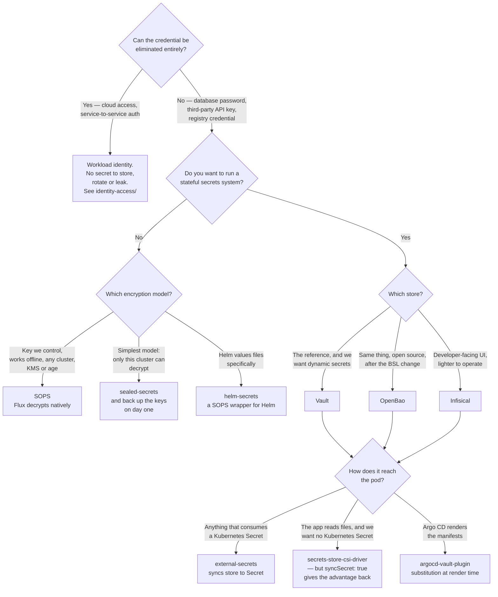

[← Cluster security](../README.md)

# Secrets

A Kubernetes Secret is base64, not encryption. Everything in this folder exists because of that
sentence.

Subfolders: [`encryption/`](encryption/README.md) — the secret lives in Git, encrypted ·
[`stores/`](stores/README.md) — an external system holds the secret ·
[`integrations/`](integrations/README.md) — how a secret gets from the store into a pod

## Contents

1. [What a Kubernetes Secret actually is](#1-what-a-kubernetes-secret-actually-is)
   - [Encryption at rest, and what it does not fix](#encryption-at-rest-and-what-it-does-not-fix)
   - [`get secrets` is the whole credential](#get-secrets-is-the-whole-credential)
2. [The three approaches](#2-the-three-approaches)
   - [Encryption: the secret is in Git](#encryption-the-secret-is-in-git)
   - [Stores: the secret is somewhere else](#stores-the-secret-is-somewhere-else)
   - [Integrations: the delivery mechanism](#integrations-the-delivery-mechanism)
3. [Dynamic secrets: the genuinely different capability](#3-dynamic-secrets-the-genuinely-different-capability)
4. [Rotation is the thing that separates the approaches](#4-rotation-is-the-thing-that-separates-the-approaches)
5. [The best secret is one that does not exist](#5-the-best-secret-is-one-that-does-not-exist)
6. [Decision tree](#6-decision-tree)
7. [Anti-patterns](#7-anti-patterns)
8. [How this applies to pikakube](#8-how-this-applies-to-pikakube)

---

## 1. What a Kubernetes Secret actually is

A `Secret` is a `ConfigMap` with a different `kind`, a `type` field, and base64-encoded values.
Base64 is an encoding, not a cipher — `echo <value> | base64 -d` reverses it, and no key is
involved.

What that means concretely:

- A Secret committed to Git is a plaintext credential in Git.
- A Secret in an etcd backup is a plaintext credential in the backup.
- A Secret printed by `kubectl get secret -o yaml` is a plaintext credential in someone's
  terminal scrollback.

### Encryption at rest, and what it does not fix

Kubernetes supports `EncryptionConfiguration` on the API server, which encrypts Secret values before
they are written to etcd, using either a local key or a KMS provider. It is **off by default** on a
self-managed cluster and its status on a managed cluster is provider-specific — worth checking
rather than assuming.

When it is on, it fixes exactly one threat: someone reading etcd or an etcd backup directly. It does
not change anything about the API. The API server decrypts on read, so:

| Threat | Encryption at rest helps? |
|---|---|
| Stolen etcd backup | yes |
| Disk taken from a control-plane node | yes |
| Anyone with RBAC `get secrets` | no |
| A compromised pod mounting the Secret | no |
| A Secret committed to Git | no |

And with a local key, the key sits in a file on the control-plane node next to the data it protects,
which is better than nothing and less than it sounds. KMS provider is the version that means
something.

### `get secrets` is the whole credential

The most under-appreciated fact in Kubernetes security: **anyone with `get secrets` in a namespace
has every credential in that namespace.** Not "can request access to" — has. There is no audit
gate, no approval, no second factor, and by default no log entry anyone reads.

This makes RBAC on Secrets the actual control, and it is why `list` and `watch` on secrets are
worse than they look: `list` returns the values, so a role granting `list secrets` cluster-wide is
equivalent to handing over every credential in the cluster. See `../identity-access/` for the RBAC
side of this.

It also means the tools in this folder are solving a *Git and lifecycle* problem, not the runtime
exposure problem. Once the secret is a Kubernetes Secret in a namespace, all of them are equally
exposed — except the CSI driver, which is the one that does not create a Kubernetes Secret at all.

## 2. The three approaches

The subfolders are not three flavours of the same thing. They answer different questions, and two
of them compose.

| | encryption/ | stores/ | integrations/ |
|---|---|---|---|
| Where the secret lives | in Git, encrypted | in an external system | nowhere — it is a pipe |
| Source of truth | the repository | the store | the store |
| Needs another system running | no | yes | yes (a store) |
| Works with GitOps out of the box | yes, natively | needs an integration | that is what it is |
| Rotation | edit, re-encrypt, commit, reconcile | change it in the store | automatic, on a sync interval |
| Audit trail | git log | the store's audit log | the store's audit log |

### Encryption: the secret is in Git

[`encryption/`](encryption/README.md) — [SOPS](encryption/sops/README.md),
[sealed-secrets](encryption/sealed-secrets/README.md), [helm-secrets](encryption/helm-secrets/README.md).

The encrypted secret is committed. Flux or Argo decrypts it during reconciliation. No extra system
needs to be running for the platform to work — the trust anchor is a key, not a service.

The catch is entirely about that key: who holds it, where it is backed up, and what happens when it
must be rotated. Losing the sealed-secrets private key means every sealed secret in the repository
is unreadable, permanently. That is why `sealed-secrets/backup-secret/` exists in this repo, and why
its notes are worth more than the tool's documentation.

### Stores: the secret is somewhere else

[`stores/`](stores/README.md) — [Vault](stores/vault/README.md),
[OpenBao](stores/openbao/README.md), [Infisical](stores/infisical/README.md).

A dedicated system owns the secret, with its own authentication, authorisation, audit log, and
lifecycle. Nothing sensitive is ever in Git. Rotation happens in one place and everything that reads
it gets the new value.

The cost is that this is now a stateful, highly-available system you operate, and it is on the
critical path of every deployment. When Vault is sealed, nothing that needs a secret can start.

### Integrations: the delivery mechanism

[`integrations/`](integrations/README.md) — [external-secrets](integrations/external-secrets/README.md),
[secrets-store-csi-driver](integrations/secrets-store-csi-driver/README.md),
[argocd-vault-plugin](integrations/argocd-vault-plugin/README.md).

A store is useless until the value reaches a container. Three mechanisms, and they differ in one
important way:

| Mechanism | Result | Does a Kubernetes Secret exist? |
|---|---|---|
| external-secrets | an operator syncs store → `Secret` | **yes** — so `get secrets` still exposes it |
| secrets-store-csi-driver | mounted as files in a volume | **no**, unless `syncSecret` is enabled |
| argocd-vault-plugin | placeholders substituted at manifest render time | yes, whatever the manifest declares |

The CSI driver is the only one that avoids creating a Kubernetes Secret, which is a genuine security
difference and the main reason to choose it. The price is that the value is only visible to a
running pod with that volume — so anything that consumes Secrets by reference (an operator, a
`imagePullSecrets` field, a chart that expects `secretKeyRef`) does not work, and you end up
enabling `syncSecret` and losing the advantage. In this repo the CSI driver HelmRelease has exactly
that: `syncSecret.enabled: true`.

## 3. Dynamic secrets: the genuinely different capability

Everything above moves a *static* credential around more carefully. A static credential is one that
exists before it is needed, is shared by everything that uses it, and is valid until someone
remembers to change it.

Vault (and OpenBao) can do something categorically different: **generate the credential on demand,
scoped to the requester, with a TTL.** The application asks for database access; Vault creates a
PostgreSQL role right then, hands over the username and password, and revokes them when the lease
expires.

Why this is not a marginal improvement:

| Static credential | Dynamic credential |
|---|---|
| Exists whether or not anyone is using it | exists only while in use |
| Shared by every replica and every environment that copied it | unique per lease |
| A leak is valid until rotation | a leak expires in an hour |
| "Who used this credential?" is unanswerable | each lease is attributable |
| Rotation is a coordinated change across every consumer | rotation is what happens automatically |

This is the one capability that cannot be replicated by encrypting things in Git better. If a
platform has a reason to run Vault rather than commit SOPS files, this is it. Database credentials,
cloud IAM credentials, and PKI certificates are the three that pay for themselves.

The requirement is that the *consumer* can handle a credential that changes — which means
re-reading it, or being restarted. Applications that read config once at startup get most of the
benefit only when paired with a restart mechanism.

## 4. Rotation is the thing that separates the approaches

Ask "what happens when this credential must change" and the approaches separate cleanly:

| Approach | Rotating one secret | Rotating the encryption key |
|---|---|---|
| SOPS | decrypt, edit, re-encrypt, commit; Flux reconciles | re-encrypt every file in the repo |
| sealed-secrets | re-seal with the cluster's public cert, commit | the controller rotates its key automatically, but old sealed secrets stay decryptable only by the old key — which must therefore be kept |
| Vault / OpenBao | change the value in the store | not applicable — the store handles its own |
| Vault dynamic | happens on its own, per lease | not applicable |

The sealed-secrets row is the one that bites. The controller creates a new key periodically and
keeps the old ones so existing sealed secrets still decrypt, which means the set of keys grows and
**all of them** must be backed up, forever. Restoring a cluster without them means re-sealing every
secret from the original plaintext — which you may not have.

## 5. The best secret is one that does not exist

Before choosing between these tools, check whether the credential is needed at all.

Most cloud access, and an increasing amount of service-to-service access, can be done with
**workload identity**: the pod's ServiceAccount token is exchanged for a short-lived cloud
credential, and nothing is stored anywhere. No Secret, no store, no rotation, no leak. The same
idea underlies SPIFFE/SPIRE for mutual TLS between services, and OIDC federation for CI systems
pushing to a cloud account.

The relevant material lives in the `identity-access/` folder alongside this one, under
authentication and workload identity.

The practical consequence: a static cloud access key stored in Vault is a *worse* design than no
key at all, and the effort spent choosing how to store it is effort not spent removing it. Reach for
this folder for the credentials that genuinely cannot be eliminated — database passwords, third-party
API keys, registry credentials, TLS material.

## 6. Decision tree

## 7. Anti-patterns

| Anti-pattern | Why it is bad | What to do instead |
|---|---|---|
| A plain `Secret` committed to Git | base64 is not encryption; it is a plaintext credential in history | SOPS, sealed-secrets, or a store |
| Assuming Secrets are encrypted in etcd | off by default; and with a local key, the key sits beside the data | configure `EncryptionConfiguration` with a KMS provider, and do not stop there |
| Broad `get`/`list secrets` in RBAC | `list` returns the values — it is equivalent to handing over every credential | namespace-scoped, resource-name-scoped roles |
| No backup of the sealed-secrets key | every sealed secret in the repo becomes permanently unreadable | back up all keys, not just the current one — see `encryption/sealed-secrets/backup-secret/` |
| One shared credential across environments | a leak in dev is a leak in production | separate credentials per environment; dynamic ones if the store supports it |
| Static cloud access keys in a store | a long-lived key you now also have to operate a store for | workload identity |
| Vault in dev mode as the real thing | in-memory, unsealed, root token `root` — everything is lost on restart | dev mode for tutorials only; a real deployment for anything else |
| Auto-unseal key in the HelmRelease | the unseal key is in Git, so the seal protects nothing | a KMS auto-unseal, or manual unseal with the keys held elsewhere |
| `syncSecret: true` on the CSI driver by default | the one advantage of the CSI approach was not creating a Secret | enable it only for the workloads that need it |
| Rotating nothing because nothing broke | credentials outlive the people who created them | decide a rotation interval, or move to dynamic secrets |
| Two approaches in parallel with no rule | nobody knows where the source of truth is for a given credential | write down which class of secret goes where |

## 8. How this applies to pikakube

All three approaches are present and none is exclusively adopted, which is fine for a learning
repository and would not be fine in an operated platform — the question "where does a new credential
go?" needs one answer.

What is actually wired up:

- **external-secrets** is the most complete integration, with a `kustomization.yaml` and two working
  `ClusterSecretStore` examples: one against Vault at `http://vault.vault:8200` using a token, one
  against Azure Key Vault using a service principal. Its notes record both as done.
- **Vault** has a real deployment (Raft storage, audit storage enabled, UI and ingress, a
  `ServiceMonitor`) *and* a dev-mode deployment beside it, plus two different operators. The
  production-shaped one auto-unseals with `VAULT_AUTO_UNSEAL_KEY_0: pikakube` set directly in the
  HelmRelease — appropriate for a local cluster, and a thing to never carry anywhere else.
- **sealed-secrets** is deployed with a working `encrypt.sh` and, more usefully, a documented key
  backup and recovery procedure.
- **SOPS** is configured with an age recipient and `encrypted_regex: '^(data|stringData)$'`, which
  is the right shape: encrypt the values, leave the structure readable so diffs mean something.

The gap worth naming is the one in [section 5](#5-the-best-secret-is-one-that-does-not-exist).
Several credentials here exist to authenticate to a cloud provider — the Azure Key Vault service
principal is one — and workload identity would remove them rather than store them better.

For a platform of this shape, the defensible split is: SOPS for bootstrap and cluster-level
configuration that must work before anything else is running, and a store plus external-secrets for
application credentials, where rotation and audit matter and where dynamic database credentials
would actually pay for the operational cost of Vault.

---

[← Cluster security](../README.md)
