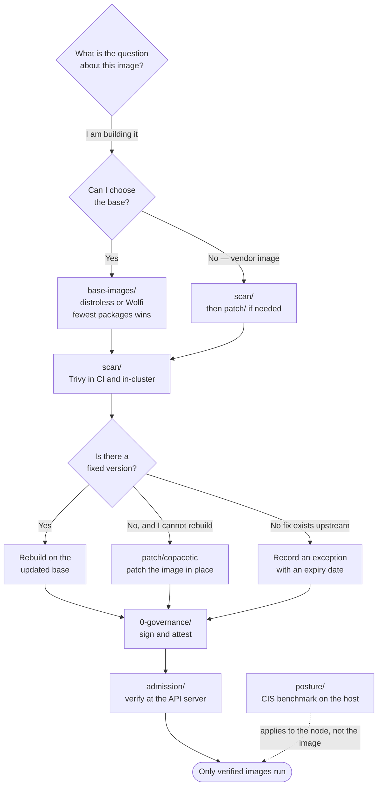

[← Security](../README.md)

# Container security

The image is the only artefact that actually gets deployed. This layer is about what is
inside it, whether anyone looked, and whether the cluster is willing to refuse the ones
nobody signed.

Capabilities: [`base-images/`](base-images/README.md) · [`scan/`](scan/README.md) ·
[`patch/`](patch/README.md) · [`admission/`](admission/README.md) ·
[`posture/`](posture/README.md)

## Contents

1. [The five moves, in the order they pay off](#1-the-five-moves-in-the-order-they-pay-off)
2. [Choosing the base image is the highest-leverage decision](#2-choosing-the-base-image-is-the-highest-leverage-decision)
3. [Scanning tells you things; it does not fix them](#3-scanning-tells-you-things-it-does-not-fix-them)
4. [Patching when you cannot rebuild](#4-patching-when-you-cannot-rebuild)
5. [Admission is where the supply chain becomes enforcement](#5-admission-is-where-the-supply-chain-becomes-enforcement)
6. [Posture: the daemon and the host underneath](#6-posture-the-daemon-and-the-host-underneath)
7. [What this layer cannot see](#7-what-this-layer-cannot-see)
8. [Decision tree](#8-decision-tree)
9. [Anti-patterns](#9-anti-patterns)
10. [How this applies to pikakube](#10-how-this-applies-to-pikakube)

---

## 1. The five moves, in the order they pay off

There are exactly five things you can do about an image, and they are not equally valuable:

| # | Move | Capability | What it changes |
|---|---|---|---|
| 1 | Ship fewer packages | [`base-images/`](base-images/README.md) | removes vulnerabilities that will never exist |
| 2 | Find out what is in there | [`scan/`](scan/README.md) | produces a list; changes nothing on its own |
| 3 | Fix without rebuilding | [`patch/`](patch/README.md) | a mitigation for images you do not control |
| 4 | Refuse unverified images | [`admission/`](admission/README.md) | the only step that actually *stops* something |
| 5 | Harden the daemon and host | [`posture/`](posture/README.md) | the runtime underneath the image |

The ordering is deliberate. Most teams start at 2, generate thousands of findings, and never
reach 1 or 4 — which are the two that change outcomes. Scanning a 900 MB Ubuntu-based image
is work you created for yourself by picking that base.

## 2. Choosing the base image is the highest-leverage decision

**A smaller base image has fewer vulnerabilities because it has fewer packages.** That is not
a tuning trick, it is arithmetic. A scanner reports CVEs against installed packages; remove
the package and the CVE cannot be reported, cannot be triaged, and cannot be exploited.

This is the one decision in this whole layer that is **not a tool** — it is a choice about
what you build on, made once and inherited by every image afterwards. See
[`base-images/`](base-images/README.md) for the honest trade-offs, including the one nobody
mentions in the marketing: distroless images have no shell, so you cannot `kubectl exec` into
them.

## 3. Scanning tells you things; it does not fix them

A scanner compares the package inventory of an image against vulnerability databases. That is
genuinely useful and it is also where most container-security programmes stall, because the
output is dominated by findings you cannot act on:

- **unfixable** — the upstream distribution has not released a patched package, so there is no
  version to move to
- **unreachable** — the vulnerable code path exists in the image but nothing in your
  application ever calls it
- **not in your control** — the finding is in a base image or a vendor image you did not build

A "block on any CRITICAL" gate without reachability or fix-availability filtering produces a
queue nobody works, and eventually gets bypassed by whoever needs to ship. Details, and what
to do instead, in [`scan/`](scan/README.md).

## 4. Patching when you cannot rebuild

Sometimes the right answer — rebuild on a newer base — is unavailable: the image comes from a
vendor, or upstream has not shipped the fixed package yet. [`patch/`](patch/README.md) covers
patching the vulnerable packages **directly into an existing image**, producing a new layer
without a rebuild. It is a mitigation, not a fix, and it should be treated as one.

## 5. Admission is where the supply chain becomes enforcement

Everything the governance layer produces — signatures, attestations, SBOMs, provenance — is
**evidence**. Evidence changes nothing until something refuses to run a workload that lacks
it.

> **Signing without admission verification is documentation.**

[`admission/`](admission/README.md) is the enforcement point: a webhook that intercepts pod
creation, resolves the image digest, verifies the signature and attestations against a policy,
and rejects the pod if verification fails. It is the step that converts a supply-chain
programme from an artefact-production exercise into a control.

## 6. Posture: the daemon and the host underneath

The image runs on a container runtime, on a host, with a daemon configuration.
[`posture/`](posture/README.md) covers benchmarking that layer — the CIS Docker Benchmark
checks — which is about the machine rather than the artefact. On a managed Kubernetes cluster
much of it is the provider's responsibility; on self-managed nodes it is yours.

## 7. What this layer cannot see

Worth stating so nobody expects otherwise:

| Question | Answered by |
|---|---|
| Does the pod run privileged, as root, with hostPath? | `2-cluster/` — Pod Security and admission policies |
| Is the code itself vulnerable? | [`4-code/`](../4-code/README.md) — SAST and SCA |
| Is the IAM role over-permissive? | `1-cloud/` |
| Who is allowed to sign, and what counts as a valid signature? | `0-governance/supply-chain/` |

An image scanner cannot tell you the container runs as UID 0. An admission signature check
cannot tell you the code has an injection flaw. That is the point of five rings.

## 8. Decision tree

## 9. Anti-patterns

| Anti-pattern | Why it is bad | What to do instead |
|---|---|---|
| Scanning hard while building on `ubuntu:latest` | you are generating findings you chose to have; the scanner is reporting your base image back at you | pick a minimal base first, then scan |
| "Fail the build on any CRITICAL" with no fix-availability filter | most criticals are unfixable; the gate becomes an obstacle to route around | gate on *fixable* findings, with reachability where available |
| Signing images but not verifying them at admission | produces artefacts nobody checks; the attacker is unaffected | pair signing with an admission verifier |
| Referencing images by mutable tag | `:latest` and `:v1` can be repointed after verification; what you scanned is not what runs | pin by digest, and let admission resolve and verify the digest |
| Patching with copacetic instead of rebuilding, permanently | drift from upstream, and the fix never reaches the source of truth | use it as a bridge, with a ticket to rebuild |
| Treating a passing scan as "the image is secure" | scanners only know packages in a database; they see neither your code nor your configuration | combine with `4-code/` and cluster-level controls |
| One scanner, one report, ten dashboards | findings are never triaged because nobody owns the queue | aggregate — see [`4-code/aspm/`](../4-code/aspm/README.md) |
| Running the scanner only in CI | images sit in the cluster for months; new CVEs are published daily against images that already passed | scan continuously in-cluster as well |

## 10. How this applies to pikakube

The material committed in this tree is **Trivy Operator**, deployed with Flux and wired into
the rest of the platform — see [`scan/trivy/README.md`](scan/trivy/README.md). It is the only
piece here with real operational history: the HelmRelease, an EKS Pod Identity role for
pulling from ECR, a Grafana folder and dashboard, and the Policy Reporter adapter that makes
its findings land in the same place as Kyverno's.

Two settings in that HelmRelease encode opinions from section 3:

- `trivy.ignoreUnfixed: true` — findings with no available fix are suppressed, because a
  queue of unactionable items is worse than no queue
- `targetNamespaces: airbyte` — scoped rather than cluster-wide, which is how you keep the
  first rollout from producing thousands of findings on day one

Everything else in this tree — [`base-images/`](base-images/README.md),
[`admission/`](admission/README.md), [`patch/`](patch/README.md),
[`posture/`](posture/README.md) — is mapped but not deployed. Of those, the highest-value next
step is not another scanner: it is deciding the base image, followed by turning on admission
verification so signing means something.

---

[← Security](../README.md)
