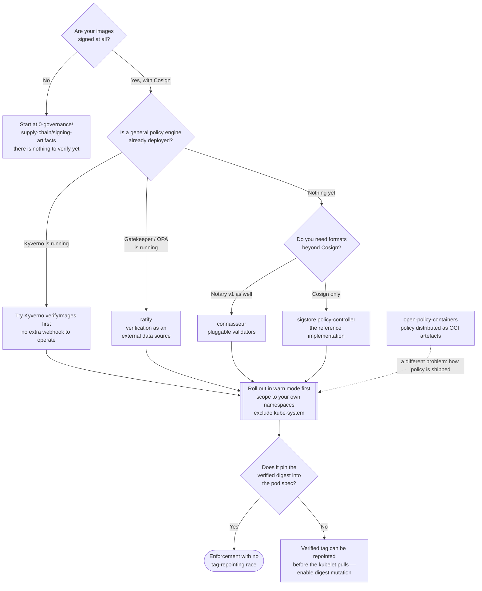

[← Container security](../README.md)

# Admission control

Refusing to run images that cannot prove where they came from. This is where every signature
and attestation produced upstream stops being paperwork.

Tools covered: [`sigstore-policy-controller`](sigstore-policy-controller/README.md) ·
[`connaisseur`](connaisseur/README.md) · [`ratify`](ratify/README.md) ·
[`open-policy-containers`](open-policy-containers/README.md)

## Contents

1. [Signing without verification is documentation](#1-signing-without-verification-is-documentation)
2. [What actually happens at admission](#2-what-actually-happens-at-admission)
   - [Why digest resolution is the load-bearing step](#why-digest-resolution-is-the-load-bearing-step)
3. [Signatures, attestations and what each proves](#3-signatures-attestations-and-what-each-proves)
4. [The tools](#4-the-tools)
5. [The rollout that works, and the one that fails](#5-the-rollout-that-works-and-the-one-that-fails)
6. [Failure modes to design for](#6-failure-modes-to-design-for)
7. [How this differs from Kyverno and Gatekeeper](#7-how-this-differs-from-kyverno-and-gatekeeper)
8. [Decision tree](#8-decision-tree)
9. [Anti-patterns](#9-anti-patterns)
10. [How this applies to pikakube](#10-how-this-applies-to-pikakube)

---

## 1. Signing without verification is documentation

A supply-chain programme produces evidence: Cosign signatures, SLSA provenance, SBOM
attestations, VEX documents. All of it is generated in CI, pushed to the registry, and — in the
overwhelming majority of implementations — **never checked by anything**.

> **An attacker who pushes a malicious image is completely unaffected by the fact that your
> legitimate images are signed. They are only affected by something that refuses to run images
> that are not.**

That something is an admission webhook, and this folder is where it lives. The material in
`security/0-governance/supply-chain/` produces the evidence; this layer is what makes the
evidence load-bearing.

The corollary is uncomfortable and worth saying: if you are signing images and not verifying
them at admission, you have added a step to your build pipeline and changed nothing about your
security posture.

## 2. What actually happens at admission

Every tool here is a `ValidatingWebhookConfiguration` that the API server calls on pod creation:

1. **Intercept.** The API server sends the pod spec to the webhook before persisting it.
2. **Extract image references.** Every container, init container and ephemeral container.
3. **Resolve to a digest.** Ask the registry what `myapp:v1.2` currently points at.
4. **Fetch the evidence.** Signatures and attestations live in the registry alongside the image,
   at a predictable tag derived from the digest (`sha256-<digest>.sig`).
5. **Verify.** Against a public key, or a Fulcio certificate identity (issuer + subject) with a
   Rekor transparency-log entry.
6. **Evaluate policy.** Which images require which identity, for which namespaces.
7. **Admit or reject** — and, in most implementations, optionally **mutate the pod spec to pin
   the digest**.

### Why digest resolution is the load-bearing step

Steps 3 and 7 are where the security actually is, and they are the ones people skip.

A tag is mutable. If the webhook verifies `myapp:v1.2`, admits the pod, and the kubelet then
pulls `myapp:v1.2` again, **the registry is free to have repointed that tag in between**. The
verification and the pull are two separate lookups of a mutable name.

The fix is for the webhook to rewrite the pod spec so it references the digest it verified:

```
image: registry/myapp:v1.2
        ↓ mutated at admission
image: registry/myapp@sha256:abc123...
```

Any admission tool that verifies but does not pin the digest has a race in it. Check that the
one you pick does this, and that it is enabled.

## 3. Signatures, attestations and what each proves

These are not the same thing and they answer different questions:

| Evidence | The claim | Verified against | Question it answers |
|---|---|---|---|
| **Signature** | "someone holding this key vouches for this digest" | a public key, or a Fulcio identity + Rekor entry | did this come from us? |
| **Provenance attestation** (SLSA) | "this digest was built by this workflow, from this commit" | the same, plus a policy on the attestation's contents | was it built where we build things? |
| **SBOM attestation** | "these are the components inside" | the same | what is in it? |
| **VEX** | "this CVE does not affect this artefact, because…" | the same | does this finding apply? |

The important distinction: a signature alone proves *custody*, not *provenance*. An attacker who
compromises the CI runner can sign a malicious image with the legitimate key and it will verify
perfectly. Policy on **provenance attestations** — this image was built by this repository's
workflow, from a commit on the default branch — is what raises the bar, and it is the reason
keyless signing with identity-based verification is worth the extra complexity.

**Keyless** signing deserves a note, because it changes the operational picture entirely: instead
of a long-lived private key you have to store and rotate, Fulcio issues a short-lived certificate
bound to a workflow's OIDC identity, and Rekor records the signing event publicly. Verification
then asserts *who signed* (`https://github.com/org/repo/.github/workflows/build.yaml@refs/heads/main`)
rather than *which key was used*. There is no key to leak.

## 4. The tools

| Tool | Origin | What it is | Shines when | Detail |
|---|---|---|---|---|
| **sigstore policy-controller** | the Sigstore project | the reference implementation; `ClusterImagePolicy` CRD, keyless and key-based, attestation policy in CUE or Rego | you are already committed to Sigstore/Cosign and want the canonical implementation | [→](sigstore-policy-controller/README.md) |
| **Connaisseur** | SSE Secure Systems | pluggable validators — Cosign, Notary v1, and others — with a strong focus on being operationally safe to roll out | you need Notary as well as Cosign, or you want the gentlest rollout story | [→](connaisseur/README.md) |
| **Ratify** | the Ratify project (originally Microsoft/Azure) | a **verification engine** that pairs with an external policy engine (Gatekeeper) rather than owning policy itself | you already run Gatekeeper/OPA and want verification results as policy inputs | [→](ratify/README.md) |
| **Open Policy Containers** | opcr-io | policy *for* containers: OPA policies packaged, signed and distributed as **OCI artefacts** | you want to version and distribute policy the way you distribute images | [→](open-policy-containers/README.md) |

The first three answer "may this image run". The fourth is a different idea and is grouped here
because it is about policy and OCI — see its page before assuming it is a fourth signature
verifier.

## 5. The rollout that works, and the one that fails

This is the part that decides whether admission verification survives its first week.

**The rollout that fails:** enable enforcement cluster-wide, discover that nothing in
`kube-system`, no CNI image, no chart-provided sidecar and no vendor image is signed, watch pods
stop scheduling, and disable the webhook.

**The rollout that works:**

| Step | Detail |
|---|---|
| 1. Start in warn/audit mode | log what *would* be rejected. Every tool here supports this |
| 2. Read the list | it will be longer than expected, and mostly third-party images |
| 3. Scope the policy to specific namespaces and image patterns | your own registry first. `kube-system` and infrastructure namespaces are the last thing you touch, not the first |
| 4. Decide the third-party story | some upstream images are signed (distroless, Chainguard, many CNCF projects) and can be verified against *their* identity; the rest need an explicit allow-list |
| 5. Enforce for your own images | now the policy has real meaning and a small blast radius |
| 6. Expand gradually | one namespace at a time, with the audit log driving it |

The principle underneath: **an admission policy that blocks the platform gets deleted, and a
deleted policy protects nothing.** Coverage you actually keep beats coverage you had for two
days.

## 6. Failure modes to design for

A webhook in the path of pod creation is a availability-critical component. Decide these before
enabling, not during an incident:

| Question | The trade-off |
|---|---|
| `failurePolicy: Fail` or `Ignore`? | `Fail` means an unavailable webhook stops all pod creation — including the webhook's own pods, which is how clusters deadlock. `Ignore` means an outage silently disables enforcement |
| Is the webhook's namespace excluded? | it must be, or a restart cannot recover |
| Registry unreachable? | verification needs the registry. A registry outage becomes a cluster outage under `Fail` |
| Rekor / Fulcio reachable? | keyless verification depends on public Sigstore infrastructure unless you mirror it. Consider caching and offline verification |
| Timeout and replica count | the default webhook timeout is short; a slow registry pushes you over it |

The pragmatic default: `failurePolicy: Fail` with the webhook's own namespace and `kube-system`
excluded, a minimum of two replicas, and monitoring on webhook latency and error rate.

## 7. How this differs from Kyverno and Gatekeeper

Kyverno and Gatekeeper are general policy engines and both **can** verify image signatures —
Kyverno's `verifyImages` rule is genuinely good and already integrated with Cosign.

| | General policy engine (Kyverno, Gatekeeper) | Dedicated verifier (this folder) |
|---|---|---|
| Scope | any rule about any resource | image provenance specifically |
| Signature verification | supported, one feature among hundreds | the entire product |
| Attestation policy | supported, less depth | richer — CUE/Rego over attestation contents |
| Operational cost | already deployed for other reasons | another webhook to run |

If Kyverno is already running — and in this repository it is — the honest first question is
whether `verifyImages` covers the requirement. It usually does. Reach for a dedicated verifier
when you need Notary v1 as well, when attestation policy gets complex, or when the verification
result must feed a separate policy engine (Ratify's model).

## 8. Decision tree



## 9. Anti-patterns

| Anti-pattern | Why it is bad | What to do instead |
|---|---|---|
| Signing images with nothing verifying them | the attacker is unaffected; you added a build step | deploy a verifier, even in warn mode |
| Verifying a tag without pinning the digest | the tag can be repointed between verification and pull | enable digest mutation in the webhook |
| Enabling enforcement cluster-wide on day one | infrastructure images are unsigned; pods stop scheduling and the webhook gets deleted | warn mode, then namespace by namespace |
| `failurePolicy: Fail` with no namespace exclusions | the webhook cannot restart itself; the cluster deadlocks | exclude the webhook's namespace and `kube-system` |
| A single long-lived signing key in CI | a leaked key signs anything, forever, and revocation is a rebuild of everything | keyless signing with Fulcio identities and Rekor |
| Verifying the signature but not the provenance | a compromised CI runner signs malicious images perfectly | policy on provenance attestations: this workflow, this repository, this branch |
| Allow-listing "any signature" to make the rollout pass | any key that can reach the registry now satisfies the policy | verify a specific identity or key |
| Running a dedicated verifier alongside Kyverno for the same check | two webhooks, two policies, two things to keep consistent | pick one place for image verification |

## 10. How this applies to pikakube

Three verifiers are mapped and each has Flux manifests committed —
[Connaisseur](connaisseur/README.md), [Ratify](ratify/README.md) and
[sigstore policy-controller](sigstore-policy-controller/README.md) — each with a namespace, a
HelmRepository and a HelmRelease running on chart defaults. Read that as **three candidates
staged for evaluation, not three things to run.** Running more than one image verifier in a
cluster means two webhooks disagreeing about the same pod.

The order that makes sense for this repository:

1. **Signing has to exist first.** `security/0-governance/supply-chain/signing-artifacts/` is the
   prerequisite; verification of images nobody signs has nothing to check.
2. **Kyverno is already deployed here**, and `verifyImages` is part of it. Test whether that
   covers the requirement before adding a fourth webhook to the cluster — section 7.
3. **If a dedicated verifier is warranted**, pick one. sigstore policy-controller is the
   reference implementation and the natural choice if Cosign is the only format in use;
   Connaisseur if Notary is also needed; Ratify only if Gatekeeper is the policy engine, which it
   is not here.
4. **Verify upstream images you already consume.** distroless, Chainguard and many CNCF project
   images are signed. Verifying *those* is a real control that costs no developer friction and is
   a good first policy — see [`../base-images/README.md`](../base-images/README.md).

The three HelmReleases as committed set no values beyond a replica count for Connaisseur. They
will install a webhook; they will not enforce anything useful until a policy resource
(`ClusterImagePolicy`, a Connaisseur validator configuration, a Ratify verifier) is written. That
policy — not the chart — is the actual work.

---

[← Container security](../README.md)
