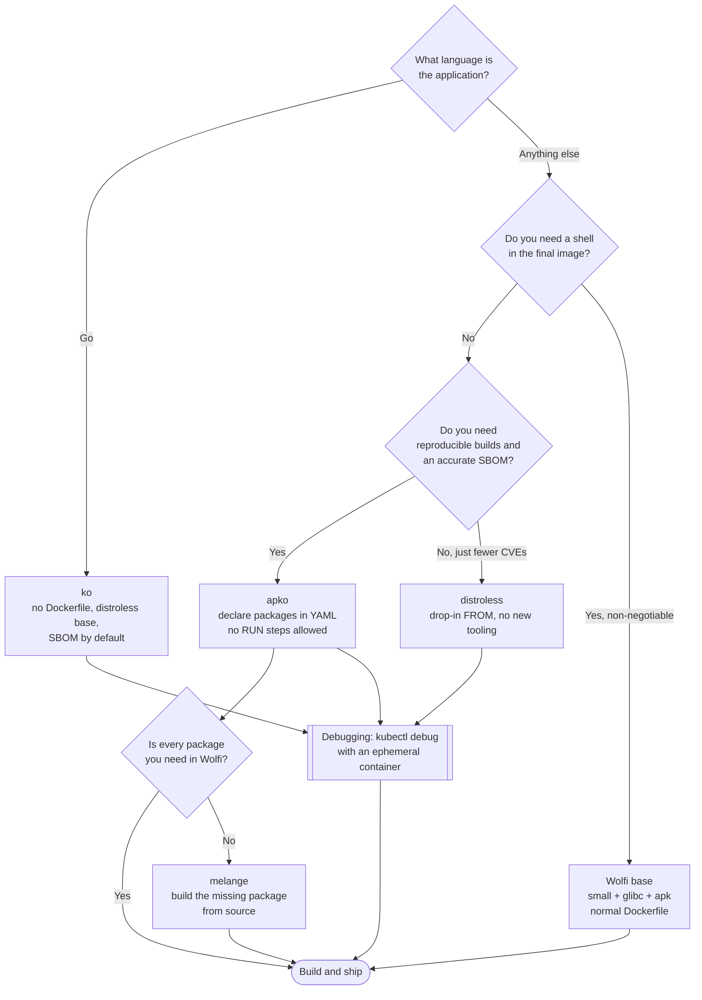

[← Container security](../README.md)

# Base images

A smaller base image has fewer vulnerabilities because it has fewer packages. This is the
highest-leverage security decision available, and it is not a tool.

Tools covered: [`distroless`](distroless/README.md) · [`wolfi`](wolfi/README.md) ·
[`apko`](apko/README.md) · [`melange`](melange/README.md) · [`ko`](ko/README.md)

## Contents

1. [The arithmetic](#1-the-arithmetic)
2. [Distroless, and the cost nobody mentions](#2-distroless-and-the-cost-nobody-mentions)
   - [How you debug an image with no shell](#how-you-debug-an-image-with-no-shell)
3. [Wolfi, apko and melange are one stack](#3-wolfi-apko-and-melange-are-one-stack)
4. [ko: no Dockerfile at all, if you write Go](#4-ko-no-dockerfile-at-all-if-you-write-go)
5. [Alpine and the musl question](#5-alpine-and-the-musl-question)
6. [Comparing the options](#6-comparing-the-options)
7. [Decision tree](#7-decision-tree)
8. [Anti-patterns](#8-anti-patterns)
9. [How this applies to pikakube](#9-how-this-applies-to-pikakube)

---

## 1. The arithmetic

A vulnerability scanner works by building an inventory of installed packages and matching it
against vulnerability databases. It follows directly that:

> **Every package you do not install is a package that can never produce a finding.**

That is not a trick to game the scanner. A package that is absent cannot be exploited, cannot
need patching, cannot need triage, and cannot appear in a report someone has to read. The
usual numbers make the point:

| Base | Rough package count | Typical scanner output |
|---|---|---|
| `ubuntu:24.04` | ~100 packages, plus a shell, apt, coreutils | dozens to hundreds of CVEs, most unfixable |
| `debian:stable-slim` | ~80 | fewer, same character |
| `alpine:3` | ~15 | far fewer |
| `cgr.dev/chainguard/static` / distroless static | a handful of files | close to zero |

The important consequence is about attention, not about the number. A base with hundreds of
unfixable findings trains everyone to ignore the report. A base with zero findings makes a
single new finding *mean something*.

Second-order benefits that come free with the same decision:

- **smaller attack surface at runtime** — no shell means no `sh -c` for an attacker who
  achieves code execution; no `curl`, `wget`, `apt` means no easy second-stage download
- **faster pulls and less registry storage** — this is the argument that gets budget
- **fewer moving parts to patch** — the base updates less often because there is less in it

## 2. Distroless, and the cost nobody mentions

[Distroless](distroless/README.md) images contain your application, its runtime dependencies,
CA certificates, timezone data — and nothing else. **No shell. No package manager. No
coreutils.** There is no `/bin/sh`, so there is nothing for `RUN` to execute and nothing for
an attacker to spawn.

Be honest about what that costs:

| You lose | Consequence |
|---|---|
| `/bin/sh` | `kubectl exec -it pod -- sh` fails. There is no interactive debugging in the container |
| a package manager | you cannot install a tool to investigate; the image must be rebuilt |
| `RUN` steps in a derived Dockerfile | anything you would have run at build time has to happen in an earlier multi-stage layer |
| shell-form `ENTRYPOINT`/`CMD` | exec form only, since there is no shell to interpret the string |
| shell-based healthchecks and init scripts | replace with native probes or a static binary |

This is a real operational cost and the reason teams quietly revert to Debian after the first
production incident they cannot poke at. Decide it deliberately.

### How you debug an image with no shell

There are three answers, and the first one is the right one:

1. **Ephemeral debug containers.** `kubectl debug` attaches a *new* container, with whatever
   image you like, into the running pod's namespaces. The workload image stays minimal and you
   still get a shell:

   ```bash
   # share the process namespace with the target container and get a real toolbox
   kubectl debug -it <pod> -n <ns> --image=busybox --target=<container>
   ```

   This is the answer distroless assumes you know about. It has been stable since Kubernetes
   1.25.

2. **The `:debug` variants.** Both Google's distroless images and Chainguard's images publish
   a `-debug` / `:debug` tag containing busybox. Useful for local reproduction; not what you
   deploy.

3. **Do the debugging outside the container.** Logs, metrics, traces and `kubectl describe`
   answer most of what people shell in for. The habit of shelling into production containers
   is itself worth losing.

## 3. Wolfi, apko and melange are one stack

These three are not alternatives to one another — they are Chainguard's build chain, and they
compose:

```
melange   builds packages (apk) from source, declaratively, with provenance and SBOM
   ↓
Wolfi     a Linux distribution made of those packages, built for containers only
   ↓
apko      assembles packages into an OCI image, declaratively, with no Dockerfile
   ↓
an image with a complete SBOM, reproducible bit-for-bit
```

| Piece | What it is | Why it exists |
|---|---|---|
| [**Wolfi**](wolfi/README.md) | a distribution designed for containers: glibc, apk package format, **no kernel**, rolling releases, aiming at zero known CVEs | traditional distributions patch on a release cadence measured in weeks; Wolfi rebuilds continuously so a fix is available almost immediately |
| [**apko**](apko/README.md) | declares an image as a **list of packages** in YAML and produces the OCI image directly | no `RUN` steps means no arbitrary build-time state, which is what makes the output reproducible and the SBOM accurate |
| [**melange**](melange/README.md) | builds the apk packages Wolfi and apko consume, from source | if you need something that is not already in Wolfi, this is how it gets there, with the same provenance guarantees |

The through-line worth remembering: **apko can only be declarative because Wolfi is a package
repository, and Wolfi can only claim near-zero CVEs because melange rebuilds continuously.**
Adopting apko without Wolfi packages leaves you with nothing to assemble.

The practical entry point is usually *not* running melange. It is using the prebuilt Wolfi and
Chainguard base images the same way you use `debian:slim` today.

## 4. ko: no Dockerfile at all, if you write Go

[ko](ko/README.md) is narrower than the others and correspondingly simpler: for **Go
applications only**, it compiles the binary on your machine and lays it into a base image
(distroless static by default), then pushes it. There is no Dockerfile, no Docker daemon and
no build context.

Because Go produces a static binary, the "base image" collapses to CA certificates plus the
binary — which is why ko images tend to have literally zero CVEs. It also rewrites image
references inside Kubernetes YAML on the fly, which is why so many controllers and operators
in the CNCF ecosystem are built with it.

Constraint that decides the matter: **it is Go-only**. There is no Python, Java or Node
equivalent inside ko.

## 5. Alpine and the musl question

Alpine is the familiar "small base" and it is genuinely small, but it uses **musl** libc
rather than glibc. That has consequences people meet the hard way:

- Python wheels built as `manylinux` do not work; packages are compiled from source, so builds
  are slow and sometimes fail
- some JVM and Go cgo workloads behave differently, and DNS resolution semantics differ
- a class of subtle performance differences in threading and memory allocation

Wolfi's specific design decision was to be small **and** glibc-based, which removes this whole
category of problem. That is the main reason to prefer Wolfi over Alpine when the choice is
open.

## 6. Comparing the options

| Base | Shell? | Package manager? | Language scope | Shines when | Do not use when |
|---|---|---|---|---|---|
| [**distroless**](distroless/README.md) | no | no | Go, Java, Python, Node, static | you want the minimum with no new tooling — it is just an image you `FROM` | the team cannot live without `exec` and will not learn `kubectl debug` |
| [**Wolfi**](wolfi/README.md) | yes (`wolfi-base`) or no (`static`) | apk | any | you want minimal *and* glibc *and* fast CVE turnaround, with a normal Dockerfile | you need packages nobody has built for Wolfi yet |
| [**apko**](apko/README.md) | only if you add it | declared, not run | any | reproducible images with accurate SBOMs, built from a package list | your build genuinely needs imperative steps — apko has no `RUN` |
| [**melange**](melange/README.md) | n/a | n/a | any | you must build packages that do not exist in Wolfi | you can consume existing packages, which is most of the time |
| [**ko**](ko/README.md) | no | no | **Go only** | Go services and Kubernetes controllers — fastest path to a zero-CVE image | anything not written in Go |

## 7. Decision tree



## 8. Anti-patterns

| Anti-pattern | Why it is bad | What to do instead |
|---|---|---|
| Building on a full OS image "so we can debug it" | you inherit hundreds of packages, and therefore hundreds of findings, to preserve a habit | minimal base + `kubectl debug` ephemeral containers |
| Suppressing base-image CVEs in the scanner instead of changing the base | the findings are still there; you have only stopped seeing them | change the base — the fix is upstream of the scanner |
| `FROM ubuntu:latest` | the base changes underneath you; two builds of the same commit differ | pin a specific tag, ideally a digest |
| Installing `curl`, `netcat`, `vim` "for troubleshooting" | you shipped an attacker's toolkit into production | ephemeral debug containers |
| Alpine for Python, then fighting the build | musl breaks manylinux wheels; builds get slow and flaky | Wolfi or a `-slim` Debian base |
| Running as root because the minimal image "doesn't have a user" | container escape becomes host root | distroless publishes `:nonroot` variants; set `USER` and `runAsNonRoot` |
| Adopting apko while still needing imperative build steps | apko deliberately has no `RUN`; people work around it by pre-baking mystery tarballs | build a proper package with melange, or stay on a Dockerfile |
| Treating "zero CVEs" as "secure" | your own code and your dependencies are untouched by the base image choice | [`4-code/`](../../4-code/README.md) covers that half |

## 9. How this applies to pikakube

Nothing in this folder is deployed, and that is appropriate — **a base image is not something
you install in a cluster**, it is a decision applied in every Dockerfile the platform builds.
The relevant place for that decision is the build tooling under
[`devops/image/`](../../../devops/image/README.md), not here.

The concrete position worth taking for this repository:

| Case | Base |
|---|---|
| Go tools and controllers | **ko**, or distroless static — zero packages, zero findings |
| Python jobs and services | **Wolfi** (glibc, so wheels install normally), or distroless Python |
| JVM workloads | distroless Java, or a Wolfi JDK image |
| Anything where a shell is genuinely required | `wolfi-base`, not Ubuntu |

And the operational precondition before any of it: agree that debugging happens through
`kubectl debug`, not `kubectl exec`. If that is not agreed, the minimal base gets reverted the
first time production misbehaves — which is the real reason most of these migrations fail.

The connection back up the tree: every finding [`scan/`](../scan/README.md) reports against a
base image is a finding this folder could have prevented from existing.

---

[← Container security](../README.md)
