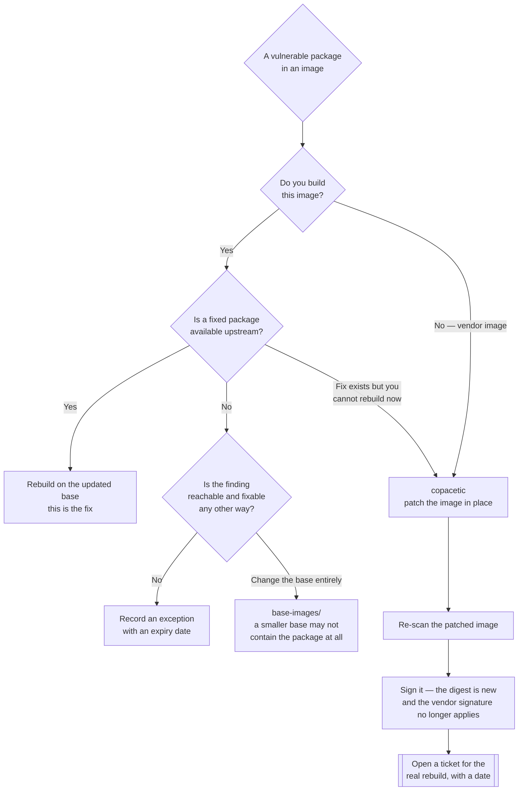

[← Container security](../README.md)

# Image patching

Fixing vulnerable packages inside an image you already have, without rebuilding it. A
mitigation for the case where the correct fix is unavailable to you.

Tools covered: [`copacetic`](copacetic/README.md)

## Contents

1. [When rebuilding is not an option](#1-when-rebuilding-is-not-an-option)
2. [What patching actually does](#2-what-patching-actually-does)
3. [Where it fits in the pipeline](#3-where-it-fits-in-the-pipeline)
4. [The things it breaks](#4-the-things-it-breaks)
5. [Decision tree](#5-decision-tree)
6. [Anti-patterns](#6-anti-patterns)
7. [How this applies to pikakube](#7-how-this-applies-to-pikakube)

---

## 1. When rebuilding is not an option

The correct response to a vulnerable package in an image is to rebuild the image on an updated
base. That is the fix; everything in this folder is what you do when you cannot have it.

Three situations where you cannot:

| Situation | Why a rebuild does not help |
|---|---|
| **A vendor image** | you do not have the Dockerfile, the source, or the right to rebuild it. The vendor's patch schedule is not yours |
| **Upstream has not released a fixed package for that base** | the fix exists in a newer distribution release; your base is pinned to an older one for compatibility |
| **The build is not reproducible right now** | the toolchain has drifted, the pipeline is broken, or the original build environment no longer exists — a rebuild would change far more than the vulnerable package |

There is a fourth, less respectable but very common one: **the rebuild takes 40 minutes and the
audit is tomorrow**. Patching is legitimate there too, provided it is recorded as temporary.

## 2. What patching actually does

The mechanism is narrower than it sounds and that is what makes it safe:

1. Scan the image to identify which OS packages are vulnerable and which fixed versions exist.
2. Run the distribution's own package manager (`apt`, `apk`, `dnf`) against the image's
   filesystem to upgrade **only those packages**.
3. Write the result as a **new layer** on top of the original image, producing a new digest.

Points that follow:

- The application, the configuration and every other layer are untouched. The diff is the
  package upgrade and nothing else.
- It is not a binary rewrite or a "virtual patch" — the real, upstream-fixed package replaces
  the vulnerable one.
- It is limited to **OS packages managed by a package manager**. Application dependencies —
  the Python wheel, the npm package, the JAR — are outside its reach, because they were not
  installed by `apt`. Those belong to [`../../4-code/dependency/README.md`](../../4-code/dependency/README.md).

## 3. Where it fits in the pipeline

The useful placement is **between the registry and deployment**, not inside the application
build:

```
vendor image → scan → vulnerable? → patch → re-scan → sign → admission verifies → deploy
```

Two properties of that flow are worth insisting on:

- **Re-scan after patching.** The patch either worked or it did not, and asserting it worked is
  not the same as checking.
- **Sign the patched image.** The patched image is a new digest that never existed in the
  original supply chain. If [`../admission/README.md`](../admission/README.md) verifies
  signatures, the patched image must be signed by you or it will be — correctly — rejected.

## 4. The things it breaks

Patching is a mitigation, and mitigations have costs that should be stated before adoption, not
discovered afterwards:

| Cost | Detail |
|---|---|
| **Drift from source** | the running image no longer corresponds to any Dockerfile. Reproducing it means re-running the patch, not re-running the build |
| **Provenance is now yours** | the vendor's signature no longer covers the image; you have re-signed something you did not build |
| **It accumulates** | patch on patch on patch, each a layer, each a step further from anything reproducible |
| **Untestable changes** | the package upgrade did not go through the vendor's test suite. Usually harmless; occasionally not |
| **OS packages only** | it silently does nothing for the language-level dependencies that produce most real vulnerabilities |

The governing rule: **every patched image should have a ticket attached that closes when the
proper rebuild lands.** Without it, "temporary" becomes the architecture.

## 5. Decision tree



## 6. Anti-patterns

| Anti-pattern | Why it is bad | What to do instead |
|---|---|---|
| Patching instead of rebuilding, as normal practice | permanent drift from source; nothing is reproducible from the repository | rebuild by default; patch as an exception with an expiry |
| Not re-scanning after the patch | you have asserted the fix rather than verified it | re-scan, and fail if the finding persists |
| Patching a signed vendor image and deploying without re-signing | the digest changed, so signature verification fails — or worse, is disabled to make it pass | re-sign, and record who did |
| Expecting it to fix application dependencies | it only touches packages the OS package manager installed | [`../../4-code/dependency/README.md`](../../4-code/dependency/README.md) |
| Patching to satisfy a scanner rather than to remove risk | if the finding was unreachable, you added a layer and changed nothing real | triage first; patch what matters |
| Layering patches indefinitely | each patch is another layer over an image nobody can reproduce | cap it: after N patches, force a rebuild |

## 7. How this applies to pikakube

Nothing here is deployed, and for a platform whose images are mostly upstream charts that is
the right state today — you do not patch someone else's chart image, you upgrade the chart.

The situation where this folder becomes relevant is specific: a **vendor or partner image that
must run and that the vendor is slow to patch**. Data platforms accumulate these — connector
images, JDBC drivers packaged by a third party, proprietary agents. When that happens, the flow
in section 3 is the one to implement, and the discipline in section 4 is what stops it becoming
permanent.

The tie-in to the rest of the tree: [`../scan/README.md`](../scan/README.md) sets
`ignoreUnfixed: true`, which means unfixable findings are already suppressed. What remains in
the queue is by definition **fixable** — and for an image you do not build, patching is how a
fixable finding gets fixed.

---

[← Container security](../README.md)
