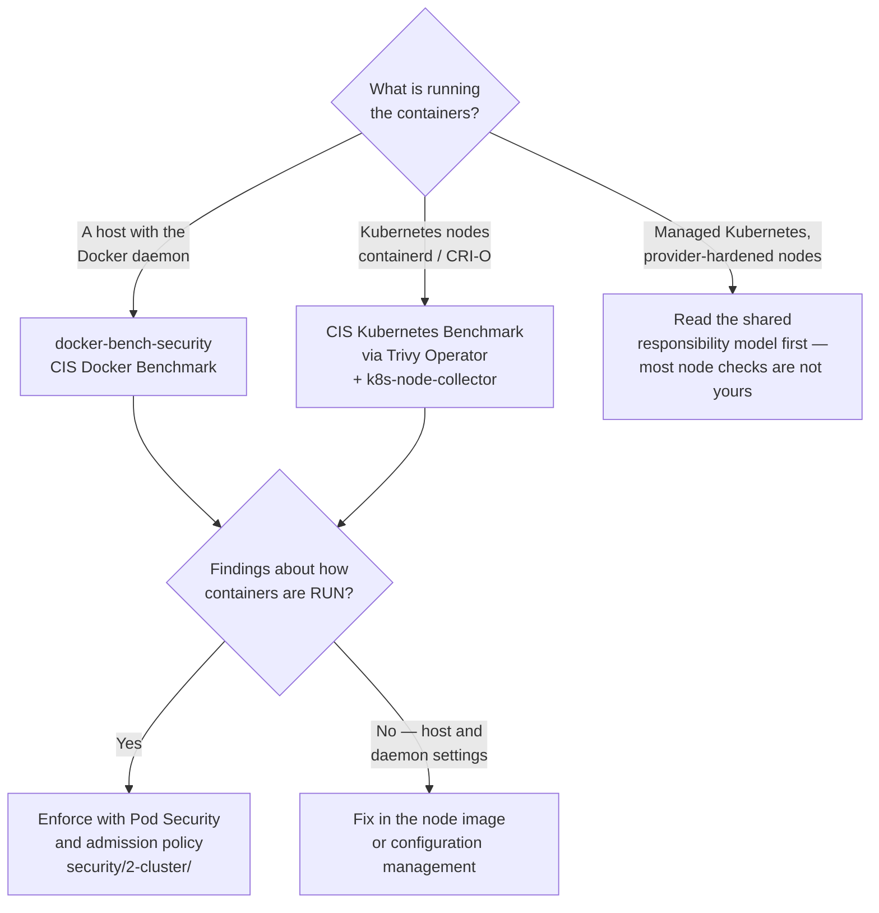

[← Container security](../README.md)

# Container posture

Benchmarking the machinery that runs containers — the daemon, the host, the runtime
configuration — rather than the images themselves.

Tools covered: [`docker-bench-security`](docker-bench-security/README.md)

## Contents

1. [A different question from scanning](#1-a-different-question-from-scanning)
2. [What the CIS Docker Benchmark actually checks](#2-what-the-cis-docker-benchmark-actually-checks)
3. [Who owns this on Kubernetes](#3-who-owns-this-on-kubernetes)
4. [The overlap with cluster-level controls](#4-the-overlap-with-cluster-level-controls)
5. [Decision tree](#5-decision-tree)
6. [Anti-patterns](#6-anti-patterns)
7. [How this applies to pikakube](#7-how-this-applies-to-pikakube)

---

## 1. A different question from scanning

[`../scan/README.md`](../scan/README.md) asks "what vulnerable packages are in this image".
Posture asks something orthogonal:

> **Is the machine running these containers configured the way it should be?**

A perfectly clean image running on a Docker daemon with an exposed unauthenticated TCP socket
is a compromised host waiting to happen, and no image scanner will ever mention it. The two
checks do not overlap and neither substitutes for the other.

The reference standard is the **CIS Docker Benchmark** — a published, numbered list of
configuration checks maintained by the Center for Internet Security. Its Kubernetes equivalent
is the CIS Kubernetes Benchmark, which is a different document covering a different layer.

## 2. What the CIS Docker Benchmark actually checks

Grouped, the sections are:

| Section | Examples of what it checks |
|---|---|
| **Host configuration** | is a separate partition used for `/var/lib/docker`; is auditing enabled on the Docker daemon and its files; is the host kernel current |
| **Docker daemon configuration** | is the daemon socket exposed over TCP; is TLS with client certificates required; is `--icc` (inter-container communication) restricted; is a default seccomp profile applied; is live restore enabled; are user namespaces enabled |
| **Daemon files and directories** | ownership and permissions on `docker.sock`, `daemon.json`, TLS keys and the systemd unit |
| **Container images and build files** | is a `USER` set; is content trust enabled; are images scanned; is a HEALTHCHECK defined |
| **Container runtime** | privileged containers, host namespace sharing (`--pid=host`, `--net=host`), mounted `docker.sock`, `--cap-add`, writable root filesystem, restricted memory and CPU, `no-new-privileges` |
| **Security operations** | image sprawl, container sprawl — operational hygiene rather than configuration |
| **Swarm configuration** | mostly irrelevant unless you actually run Swarm |

The single most valuable check in the whole document, if you only take one thing:
**`/var/run/docker.sock` mounted into a container is root on the host.** Every "CI runner that
builds images" design eventually confronts this.

## 3. Who owns this on Kubernetes

Most of the daemon-configuration half **is not yours** on managed Kubernetes:

| Environment | Who owns the daemon and host configuration |
|---|---|
| EKS, AKS, GKE (managed node groups) | the provider hardens the node image; you own what you change on top of it |
| Self-managed nodes, kubeadm, on-prem | **you** |
| Local development (Kind, k3d, Docker Desktop) | you, but the threat model is different and most findings are irrelevant |

Also worth stating: Kubernetes has largely moved off Docker. `dockershim` was removed in
Kubernetes 1.24, so clusters run **containerd** or **CRI-O**. A benchmark written for the Docker
daemon therefore checks a component that may not be present. The container-runtime section of the
CIS **Kubernetes** Benchmark is the relevant document for a modern cluster, and Trivy Operator
can produce those results in-cluster with the
[k8s-node-collector](../scan/trivy/README.md).

That is the honest framing for this folder: docker-bench-security is the tool for **hosts running
Docker** — build machines, CI runners, VMs, legacy estate — more than for Kubernetes nodes.

## 4. The overlap with cluster-level controls

Several runtime checks in the benchmark are enforced better, and earlier, by Kubernetes itself:

| CIS Docker check | The Kubernetes way to enforce it |
|---|---|
| Do not run privileged containers | Pod Security Admission `restricted`, or a Kyverno/Gatekeeper policy |
| Do not share host namespaces | the same |
| Set a non-root `USER` | `runAsNonRoot: true` in the security context, enforced by policy |
| Read-only root filesystem | `readOnlyRootFilesystem: true`, enforced by policy |
| Restrict capabilities | `capabilities.drop: [ALL]`, enforced by policy |
| Apply seccomp | `seccompProfile: RuntimeDefault`, enforced by policy |

Those all belong to `security/2-cluster/`, and they are **preventive** where the benchmark is
**detective**. The benchmark tells you a privileged container is running; admission policy stops
it from being created. Prefer the second, and use the first to find what escaped.

## 5. Decision tree

## 6. Anti-patterns

| Anti-pattern | Why it is bad | What to do instead |
|---|---|---|
| Running a CIS Docker Benchmark against a containerd Kubernetes node | it audits a daemon that is not there; findings are noise | use the CIS Kubernetes Benchmark for clusters |
| Treating every benchmark failure as a defect | many checks do not apply to your environment, and a few conflict with how Kubernetes works | select an applicable profile, and document the exclusions |
| Detecting privileged containers instead of preventing them | you learn about it after it is running | admission policy in `2-cluster/` |
| Mounting `docker.sock` into a container | that is root on the host, full stop | a rootless builder — kaniko, buildkit, buildah — see [`devops/image/`](../../../devops/image/README.md) |
| Running the benchmark once, before an audit | posture drifts continuously as nodes are replaced and configuration changes | run it on a schedule, as part of node provisioning |
| Assuming the cloud provider hardened everything | the shared responsibility line is specific, and the parts above it are yours | read the provider's model and check what falls to you |

## 7. How this applies to pikakube

Nothing is deployed here, and for this repository that is defensible. The cluster does not run
the Docker daemon in production shape, and node-level benchmarking is already reachable through
a component that *is* deployed: **Trivy Operator's node collector** produces CIS Kubernetes
Benchmark results in-cluster — see [`../scan/trivy/README.md`](../scan/trivy/README.md), where
the tolerations needed to make it schedule on tainted node pools are discussed.

Where docker-bench-security would genuinely earn a place is the **CI runner estate**: the hosts
that build images do run a Docker daemon, they do have a socket, and they hold registry
credentials and signing keys. That is a higher-value target than any application node, and it is
the place this benchmark was written for. The related hardening for the CI side lives under
`security/0-governance/runner-hardening/`.

---

[← Container security](../README.md)
