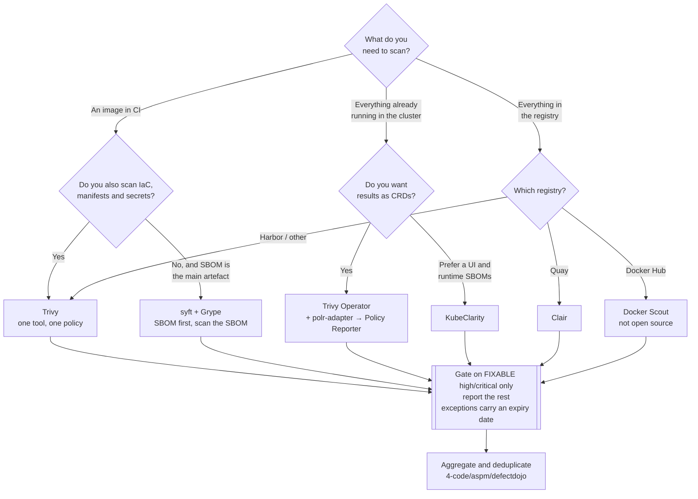

[← Container security](../README.md)

# Image scanning

Comparing what is installed in an image against vulnerability databases. Easy to turn on,
and the output is mostly things you cannot act on — which is the part worth planning for.

Tools covered: [`trivy`](trivy/README.md) · [`grype`](grype/README.md) ·
[`clair`](clair/README.md) · [`docker-scout`](docker-scout/README.md) ·
[`kubeclarity`](kubeclarity/README.md)

## Contents

1. [How a scanner actually works](#1-how-a-scanner-actually-works)
2. [The honest problem: most findings are not actionable](#2-the-honest-problem-most-findings-are-not-actionable)
   - [Unfixable](#unfixable)
   - [Unreachable](#unreachable)
   - [What a workable policy looks like](#what-a-workable-policy-looks-like)
3. [Where to scan: four different places](#3-where-to-scan-four-different-places)
4. [The tools](#4-the-tools)
5. [Making results visible next to policy results](#5-making-results-visible-next-to-policy-results)
6. [Decision tree](#6-decision-tree)
7. [Anti-patterns](#7-anti-patterns)
8. [How this applies to pikakube](#8-how-this-applies-to-pikakube)

---

## 1. How a scanner actually works

There is no magic and no code analysis involved. Every scanner in this folder does the same
three things:

1. **Build an inventory.** Unpack the image layers and read the package databases —
   `/var/lib/dpkg/status`, the RPM database, `apk` records — plus language manifests
   (`package-lock.json`, `poetry.lock`, `go.mod`, `pom.xml`, Gemfile.lock) and, for compiled
   languages, binary metadata.
2. **Match against a database.** NVD, the distribution security trackers (Debian, Alpine, RHEL,
   Ubuntu), GitHub Security Advisories, OSV.
3. **Report.** Package, installed version, CVE, severity, and whether a fixed version exists.

Two consequences follow immediately and explain most confusion about scanner behaviour:

- **A scanner only knows what it can inventory.** A binary copied in by `COPY` with no package
  metadata, or a vendored library compiled into an executable, is largely invisible.
- **Distribution severity beats NVD severity.** Debian and Red Hat routinely rate a CVE lower
  than NVD does because their build disables the affected feature. Scanners that prefer the
  distribution's assessment produce far fewer false criticals — Trivy does this by default.

## 2. The honest problem: most findings are not actionable

Turn a scanner on against a typical image and you get hundreds of findings. Very few of them
represent work anybody can do.

### Unfixable

The vulnerability is real, the package is present, and **the distribution has not released a
fixed version**. There is no version to upgrade to. These findings sit in the report forever,
and they are frequently the majority.

Every scanner has a flag for this. Trivy's is `--ignore-unfixed`; the operator equivalent is
`trivy.ignoreUnfixed: true`, which is set in this repository's HelmRelease.

The trade-off, stated plainly: suppressing unfixed findings means you will not see a real
vulnerability that has no patch. That is a genuine loss. It is still usually the right call,
because a queue of items with no possible action is not a queue — it is noise that trains people
to close the tab.

### Unreachable

The vulnerable function exists in a library in the image, but nothing in your application calls
it. Reachability analysis is the technique for detecting this, and it is where scanning is
genuinely improving — but it is still weak for OS packages and only reasonably good for some
language ecosystems.

The practical effect is a large gap between "CVE present in the image" and "vulnerability
exploitable in this deployment", and no scanner in this folder closes it entirely.

### What a workable policy looks like

> **A policy of "no criticals" without fix-availability and reachability filtering produces
> noise, and noise gets ignored — including the finding that mattered.**

Something like this survives contact with a delivery team:

| Rule | Rationale |
|---|---|
| Gate the build on **fixable** CRITICAL and HIGH only | every finding in the gate has an action: bump a version |
| Report, do not gate, on everything else | visibility without blocking |
| Exceptions must have an **expiry date** | a permanent exception is a decision nobody revisits |
| Re-scan images already running, continuously | a clean image at build time is not clean three months later, because the CVEs are new |
| Fix at the base image where possible | one change removes findings from every downstream image — see [`../base-images/README.md`](../base-images/README.md) |

## 3. Where to scan: four different places

| Place | Catches | Cost |
|---|---|---|
| **Developer machine / pre-commit** | problems before they reach CI | fast feedback, easy to skip |
| **CI, on build** | a new image with a known-bad dependency | blocks merges; needs the policy above to be tolerable |
| **Registry** | everything already published, re-evaluated as the database updates | no developer friction; findings arrive with no owner attached |
| **In-cluster, continuously** | what is *actually running*, including images nobody rebuilds | the only place that answers "am I exposed right now" |

The last one is the one people skip, and it is the one that matters most operationally. An image
that passed CI in January is being scanned against January's database; the CVE published in
March is invisible until something re-scans. That is exactly what an in-cluster operator such as
Trivy Operator or [`kubeclarity`](kubeclarity/README.md) exists to do.

## 4. The tools

| Tool | Origin | Where it shines | Do not use when | Detail |
|---|---|---|---|---|
| **Trivy** | Aqua Security | the default and the broadest: container images, filesystems, Git repositories, IaC (it absorbed **tfsec**), Kubernetes clusters, secrets, licences, SBOMs — plus an in-cluster operator | you want a very small single-purpose binary and nothing else | [→](trivy/README.md) |
| **Grype** | Anchore | pairs with **syft** for SBOMs; scan the SBOM rather than the image, which is faster and works where the image is not available | you would rather have one tool covering IaC and Kubernetes too | [→](grype/README.md) |
| **Clair** | Quay / Red Hat | registry-side scanning, particularly if you already run Quay | as a CLI in CI — it is a service, not a command | [→](clair/README.md) |
| **Docker Scout** | Docker | integrated into Docker Desktop and Docker Hub; good base-image recommendations | you need open source or want to avoid a Docker subscription — **it is not open source** | [→](docker-scout/README.md) |
| **KubeClarity** | OpenClarity (VMware, then CNCF-adjacent) | runtime SBOM generation and vulnerability detection **inside the cluster**, with a UI | as a CI scanner; and see the note about the project's status | [→](kubeclarity/README.md) |

Reasonable defaults: **Trivy for everything**, because one tool covering images, IaC, Kubernetes
and secrets means one policy, one output format and one place to look. **Grype + syft** when the
SBOM is the primary artefact and scanning is derived from it — a cleaner model if
`0-governance/supply-chain/sbom/` is where your programme is centred.

## 5. Making results visible next to policy results

Scanner findings and admission-policy violations are the same kind of thing to whoever is
looking: "what is wrong in this cluster". Keeping them in two separate tools guarantees that one
of them goes unread.

**Policy Reporter** is the Kubernetes-native surface for `PolicyReport` resources, and the
`trivy-operator-polr-adapter` converts Trivy Operator's CRDs (`VulnerabilityReport`,
`ConfigAuditReport`, `ExposedSecretReport`, `RbacAssessmentReport`) into `PolicyReport`
resources. The effect is that vulnerability findings appear in the same UI, with the same
metrics, as Kyverno's policy results.

That adapter is deployed in this repository — see
[`trivy/polr-adapter/README.md`](trivy/polr-adapter/README.md).

## 6. Decision tree

## 7. Anti-patterns

| Anti-pattern | Why it is bad | What to do instead |
|---|---|---|
| Failing the build on any CRITICAL, unfiltered | most criticals are unfixable; developers learn to bypass the gate | gate on fixable findings only |
| Scanning only in CI | new CVEs appear daily against images that already passed | scan continuously in-cluster too |
| Running four scanners "for coverage" | four dashboards, four formats, the same finding four times, and nobody owns any of them | one scanner, plus aggregation in [`../../4-code/aspm/README.md`](../../4-code/aspm/README.md) |
| Suppressing findings instead of changing the base image | the vulnerable packages are still shipped; you stopped looking | fix upstream in [`../base-images/README.md`](../base-images/README.md) |
| Permanent, undated exceptions | an exception without an expiry is a decision that never gets revisited | require an expiry date, and re-review on it |
| Trusting a passing scan as "secure" | scanners see packages, not your code, configuration or runtime posture | pair with [`../../4-code/README.md`](../../4-code/README.md) and cluster controls |
| Scanning by mutable tag | the tag can be repointed; the scanned image and the running image differ | scan and deploy by digest |
| Cluster-wide rollout on day one | thousands of findings arrive at once and the project dies | scope to a namespace, fix that, expand |

## 8. How this applies to pikakube

**Trivy Operator is the one scanner actually deployed here**, via Flux — the full picture is in
[`trivy/README.md`](trivy/README.md). What is committed:

| Piece | File | Purpose |
|---|---|---|
| Operator | [`trivy/helm/README.md`](trivy/helm/README.md) | HelmRelease for `trivy-operator`, scoped to the `airbyte` namespace, with `ignoreUnfixed: true` and a ServiceMonitor |
| Registry access | [`trivy/crossplane/README.md`](trivy/crossplane/README.md) | an AWS IAM role with `AmazonEC2ContainerRegistryReadOnly` plus an EKS Pod Identity association, so the operator can pull image metadata from ECR |
| Dashboards | [`trivy/observability/README.md`](trivy/observability/README.md) | a Grafana folder and community dashboard 17813 |
| Report routing | [`trivy/polr-adapter/README.md`](trivy/polr-adapter/README.md) | converts Trivy CRDs into `PolicyReport`s for Policy Reporter |

Three things that configuration gets right and are worth naming, because they are the decisions
this page argues for: the scan is **continuous and in-cluster** rather than only in CI, unfixed
findings are **suppressed** so the queue stays actionable, and results are **routed into the
same reporting surface as policy results** rather than into a second dashboard.

The gap: nothing scans at build time yet, so a bad dependency is caught after deployment rather
than before it. Adding `trivy-action` in CI — the same engine, the same ignore rules — is the
obvious complement rather than a second product.

---

[← Container security](../README.md)
