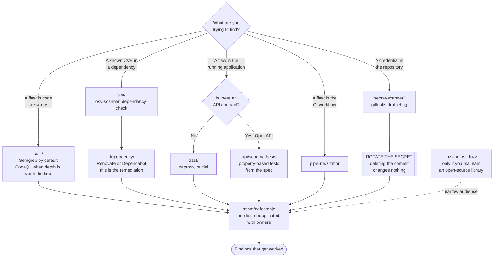

[← Security](../README.md)

# Code security

The innermost ring: the source, the dependencies it pulls in, the secrets accidentally
committed next to it, and the pipeline that turns all of it into an artefact.

Capabilities: [`sast/`](sast/README.md) · [`sca/`](sca/README.md) ·
[`dependency/`](dependency/README.md) · [`secret-scanner/`](secret-scanner/README.md) ·
[`dast/`](dast/README.md) · [`api/`](api/README.md) · [`pipeline/`](pipeline/README.md) ·
[`aspm/`](aspm/README.md) · [`fuzzing/`](fuzzing/README.md)

## Contents

1. [Nine capabilities, four distinct questions](#1-nine-capabilities-four-distinct-questions)
2. [Where the vulnerabilities actually are](#2-where-the-vulnerabilities-actually-are)
3. [Finding and fixing are different capabilities](#3-finding-and-fixing-are-different-capabilities)
4. [Static and dynamic see different things](#4-static-and-dynamic-see-different-things)
5. [Secrets are the special case](#5-secrets-are-the-special-case)
6. [The pipeline is part of the attack surface](#6-the-pipeline-is-part-of-the-attack-surface)
7. [Ten tools produce ten dashboards](#7-ten-tools-produce-ten-dashboards)
8. [The overlap with code quality](#8-the-overlap-with-code-quality)
9. [Decision tree](#9-decision-tree)
10. [Anti-patterns](#10-anti-patterns)
11. [How this applies to pikakube](#11-how-this-applies-to-pikakube)

---

## 1. Nine capabilities, four distinct questions

The folder count is misleading; there are really four questions here, plus the plumbing:

| Question | Capability | Technique |
|---|---|---|
| **Is my code vulnerable?** | [`sast/`](sast/README.md) | read the source, look for dangerous patterns |
| **Are my dependencies vulnerable?** | [`sca/`](sca/README.md) | inventory dependencies, match against advisories |
| | [`dependency/`](dependency/README.md) | keep them current — the actual remediation |
| **Is the running application vulnerable?** | [`dast/`](dast/README.md) | attack it and see what happens |
| | [`api/`](api/README.md) | the same, driven by the API contract |
| | [`fuzzing/`](fuzzing/README.md) | feed it malformed input, continuously |
| **Did we leak something?** | [`secret-scanner/`](secret-scanner/README.md) | search source and history for credentials |
| Plumbing | [`pipeline/`](pipeline/README.md) | audit the CI that runs all of the above |
| Plumbing | [`aspm/`](aspm/README.md) | aggregate, deduplicate and triage every finding |

## 2. Where the vulnerabilities actually are

The proportion is not intuitive and it should shape where effort goes:

> **The large majority of vulnerabilities in a typical application are in its dependencies,
> not in first-party code.**

A modern service is a small amount of your logic sitting on a tree of hundreds of transitive
packages, and it is the tree that carries the CVEs. This has two consequences that most
programmes get backwards:

- **SCA plus dependency updating outranks SAST** in expected value for most teams. The finding
  is unambiguous ("this package version has a known vulnerability"), the fix is mechanical
  ("upgrade it"), and the tooling can do most of it for you.
- **SAST's value is concentrated in the categories dependencies cannot cover** — injection built
  from your own string concatenation, authorisation logic, unsafe deserialisation of your own
  formats, cryptographic misuse. Those are genuinely yours and nothing else will find them.

This is also why [`dependency/`](dependency/README.md) sits in a *security* tree rather than in
build tooling. Renovate and Dependabot are the remediation layer for everything SCA reports.

## 3. Finding and fixing are different capabilities

A pairing worth making explicit, because tools are usually adopted one at a time and the second
half never arrives:

| Finds | Fixes |
|---|---|
| [`sca/`](sca/README.md) — "this package has CVE-2024-x" | [`dependency/`](dependency/README.md) — a pull request bumping it |
| [`sast/`](sast/README.md) — "this is SQL injection" | a human, reading the code |
| [`secret-scanner/`](secret-scanner/README.md) — "this is an AWS key" | **rotation** — and only rotation. See section 5 |
| [`dast/`](dast/README.md) — "this endpoint reflects input" | a human, changing the application |

Only the first row has a mechanical fix, which is exactly why it is the one to automate first.

## 4. Static and dynamic see different things

| | Static (SAST) | Dynamic (DAST) |
|---|---|---|
| Needs | source code | a running application |
| Runs | at commit, in seconds to minutes | against a deployed environment, in minutes to hours |
| Coverage | every path in the code, including unreachable ones | only paths the scanner reaches |
| False positives | many — it cannot know what is reachable or sanitised elsewhere | few — a finding is usually a real response it observed |
| False negatives | misses anything emerging from configuration or composition | misses everything it did not exercise |
| Finds | injection patterns, hardcoded crypto, unsafe APIs | misconfiguration, missing headers, auth bypass, real behaviour |

They are complementary and neither subsumes the other. The classic gap DAST covers: an
application whose code is fine but which is deployed with debug mode on and CORS set to `*`.
No SAST tool will ever see that. The classic gap SAST covers: a vulnerable code path behind an
authenticated workflow the scanner never reached.

## 5. Secrets are the special case

Every other finding in this tree is "fix it before it ships". Secret findings are not, and this
is the single most commonly misunderstood point in the whole folder:

> **A secret committed to Git is compromised from that moment. Deleting the commit does not
> undo it.**

Git history is distributed. By the time the scanner reports it, the value exists in every clone,
every fork, every CI cache, every mirror, and — if the repository was ever public — in datasets
that are scraped continuously. Rewriting history changes your copy and nothing else's.

**Rotation is the only remediation.** History rewriting is optional cleanup afterwards. See
[`secret-scanner/`](secret-scanner/README.md).

## 6. The pipeline is part of the attack surface

The CI workflow holds registry credentials, cloud roles, signing keys and the ability to publish
artefacts that go straight to production. It is, on any honest assessment, one of the most
privileged systems in the organisation — and it is routinely the least examined.

Concrete attack shapes, all of them common:

- a workflow interpolating `${{ github.event.pull_request.title }}` into a `run:` block, giving
  script execution to anyone who can open a pull request
- `pull_request_target` combined with checking out the PR's code, which runs untrusted code with
  access to secrets
- actions referenced by mutable tag rather than commit SHA, so a compromised action changes
  under you
- a `GITHUB_TOKEN` with `write-all` permissions when the job needed to read one file

[`pipeline/`](pipeline/README.md) is about auditing exactly this.

## 7. Ten tools produce ten dashboards

Adopt everything in this tree and you have SAST, SCA, secret scanning, DAST and API testing all
producing findings, in different formats, with different severity scales, and the same
vulnerability reported by three of them.

The result is predictable: nobody triages anything, because there is no single list to triage.
[`aspm/`](aspm/README.md) is the answer — one place, deduplicated, with ownership and state.
It is unglamorous and it is what makes the rest usable.

## 8. The overlap with code quality

SAST and static analysis for maintainability use the **same technique** on the same source, and
they are frequently confused:

| | [`sast/`](sast/README.md) | [`code-quality/static-analysis/`](../../software-engineering/code-quality/static-analysis/README.md) |
|---|---|---|
| Question | is this **exploitable**? | is this **maintainable**? |
| Typical finding | SQL injection, unsafe deserialisation | duplication, complexity, missing tests, code smells |
| Typical tool | Semgrep, CodeQL, bandit, gosec | SonarQube |
| Who acts | security, or the developer with a security ticket | the developer, during review |

SonarQube does have security rules, and Semgrep does have maintainability rules. The overlap is
real. The distinction that keeps them in separate folders is the **question being asked**, and
therefore the audience and the response.

## 9. Decision tree

## 10. Anti-patterns

| Anti-pattern | Why it is bad | What to do instead |
|---|---|---|
| Adopting SAST before SCA | most real vulnerabilities are in dependencies, and SAST is the noisier of the two | SCA and dependency updating first |
| Deleting the commit containing a secret | history is distributed; the value is already out | rotate. Always rotate |
| Automated dependency PRs with no grouping or schedule | forty pull requests a week, nobody merges any, the bot gets muted | group by ecosystem, schedule, automerge patch updates — [`dependency/`](dependency/README.md) |
| Turning on every scanner at once | thousands of findings, no owner, no triage, and the programme dies of its own output | one capability at a time, each with a working queue |
| Blocking merges on unfiltered SAST output | false positive rate makes the gate an obstacle, and it gets bypassed | curated rule sets, blocking only on high-confidence categories |
| Ten tools, ten dashboards | the same finding ten times and no shared state | aggregate — [`aspm/`](aspm/README.md) |
| Treating the CI pipeline as trusted infrastructure | it holds every secret you have and can publish to production | audit it — [`pipeline/`](pipeline/README.md) |
| DAST against production | you are attacking a live system with real data | a staging environment that resembles production |
| Assuming SAST covers dependencies | it analyses your source; a vulnerable transitive package is invisible to it | that is [`sca/`](sca/README.md) |

## 11. How this applies to pikakube

The one capability with real committed material is **[`dependency/`](dependency/README.md)** —
Renovate, in three deployment shapes (a GitHub Actions workflow, the Mend CE server, and the
community operator), plus the recorded battle scars with Dependabot. That is the correct
priority given section 2: dependency currency is the highest-value thing in this tree, and it is
the one being taken seriously.

The Renovate workflow committed at `dependency/renovate/renovate.yaml` is worth reading as an
example of section 6 done right: a GitHub App token rather than a personal access token,
`permissions: contents: read` at the top level, every action **pinned to a commit SHA** with the
version in a trailing comment, and a monthly schedule. That is what a workflow audited by
[`pipeline/zizmor`](pipeline/zizmor/README.md) is supposed to look like.

**[`aspm/defectdojo`](aspm/defectdojo/README.md)** also has manifests, which is a sensible second
choice: the aggregation layer is worth having *before* the tools that flood it, not after.

Everything else is mapped and not deployed. The order that follows from the arguments above:

| Priority | Capability | Why |
|---|---|---|
| 1 | [`secret-scanner/`](secret-scanner/README.md) | cheapest to add, and the one failure that cannot be undone later |
| 2 | [`sca/`](sca/README.md) | pairs with the Renovate work already in place — findings that already have a remediation path |
| 3 | [`pipeline/`](pipeline/README.md) | the workflows exist and are unexamined; zizmor is a single command |
| 4 | [`sast/`](sast/README.md) | Semgrep with a curated rule set, reporting before blocking |
| 5 | [`dast/`](dast/README.md), [`api/`](api/README.md) | need a deployed environment and an owner for the results |

[`fuzzing/`](fuzzing/README.md) is out of scope unless this repository starts maintaining an
open-source library, which it does not.

---

[← Security](../README.md)
