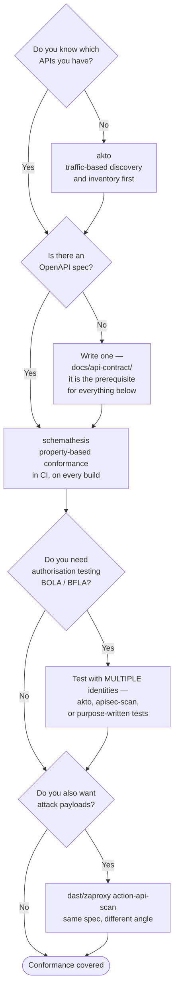

[← Code security](../README.md)

# API security testing

Testing an interface rather than a page. The contract is what makes it tractable — and the
absence of one is why most API testing has no coverage.

Tools covered: [`schemathesis`](schemathesis/README.md) · [`akto`](akto/README.md) ·
[`apisec-scan`](apisec-scan/README.md)

## Contents

1. [Why APIs need their own folder](#1-why-apis-need-their-own-folder)
2. [The contract is the test plan](#2-the-contract-is-the-test-plan)
   - [Property-based testing against a specification](#property-based-testing-against-a-specification)
3. [The failure classes a spec cannot express](#3-the-failure-classes-a-spec-cannot-express)
4. [Discovering the APIs you did not document](#4-discovering-the-apis-you-did-not-document)
5. [The tools](#5-the-tools)
6. [Decision tree](#6-decision-tree)
7. [Anti-patterns](#7-anti-patterns)
8. [How this applies to pikakube](#8-how-this-applies-to-pikakube)

---

## 1. Why APIs need their own folder

A traditional web scanner works by crawling links. An API has no links, no forms and no pages —
it has endpoints, methods, parameters and status codes, most of which cannot be discovered by
following anything. Point a spider at a JSON API and it finds the root, maybe a health endpoint,
and stops.

The result is that generic [`../dast/README.md`](../dast/README.md) tooling against an API tests
almost nothing unless it is told what exists. Which leads directly to the next section.

Add to that the failure classes that are specific to APIs and effectively absent from OWASP's
web top ten — the **OWASP API Security Top 10** exists precisely because they are different:
broken object-level authorisation, broken function-level authorisation, mass assignment,
excessive data exposure, unrestricted resource consumption. Almost all of them are
**authorisation** problems, and authorisation is the one thing a scanner cannot judge on its own.

## 2. The contract is the test plan

If an OpenAPI specification exists, the discovery problem is solved: it lists every path, every
method, every parameter, every type and constraint, and every documented response.

That turns a vague activity into a precise one:

| Without a spec | With a spec |
|---|---|
| crawl and hope | enumerate every endpoint |
| guess parameter names | parameters, types and constraints are declared |
| no idea what a correct response looks like | the response schema is declared, so **conformance is checkable** |
| coverage unknown | coverage is a percentage of a known denominator |

This is why [`docs/api-contract/`](../../../docs/api-contract/README.md) — where the OpenAPI and
AsyncAPI material lives in this repository — is a prerequisite for this folder rather than an
adjacent concern. The specification is a security artefact, not only a documentation one.

### Property-based testing against a specification

The strongest technique available here, and the one [`schemathesis`](schemathesis/README.md)
implements:

1. Read the specification.
2. **Generate** inputs from the declared types and constraints — including boundary values,
   nulls, empty strings, enormous strings, wrong types, malformed unicode.
3. Send them.
4. Assert that the response **conforms to the declared schema**, and that the server did not
   return a 500.

The insight is that you do not need to write test cases. The specification already says what is
allowed; a generator explores what happens when you violate it and when you sit exactly on the
boundary. A 500 is always a bug, and a response that does not match its own declared schema is
always a bug. Neither judgement requires knowing what the API is for.

This finds a category that neither SAST nor a conventional DAST scanner reaches: the endpoint that
crashes on a negative integer, the field that returns `null` when the schema says it never does,
the parameter that accepts a string where the spec declares an integer and then behaves
unpredictably.

## 3. The failure classes a spec cannot express

Being honest about the limit. Specification-driven testing cannot find the most important API
vulnerabilities, because they are about **authorisation**, and a specification does not describe
who may access what:

| Failure | Why the spec cannot help |
|---|---|
| **BOLA / IDOR** — user A reads user B's object by changing an id | the request is perfectly valid per the schema. Only a test with **two identities** finds it |
| **Broken function-level authorisation** — a normal user calls an admin endpoint | again, a schema-valid request |
| **Mass assignment** — sending `"role": "admin"` in a body the client should not control | the spec may not even list the field |
| **Excessive data exposure** — the response contains fields the client never needed | schema-conformant, and wrong |
| **Rate limiting and resource consumption** | not expressible in the contract |

The technique that finds these is **testing the same request with different identities** and
comparing: an unauthenticated request, a low-privilege user, a different tenant. That is what the
platforms in this folder automate, and it is the reason they exist alongside a conformance tester.

## 4. Discovering the APIs you did not document

The uncomfortable corollary of section 2: contract-driven testing only covers APIs that have a
contract. Real estates always have more endpoints than documents — internal services, legacy
endpoints, a v1 that was never decommissioned, something a team shipped without telling anyone.

Traffic-based discovery is the answer: mirror real traffic and infer the API surface from what is
actually being called. Akto is built around this, as are commercial API security platforms
generally. It answers a question no other tool in this tree can: **what APIs do we actually
have?**

## 5. The tools

| Tool | Model | Where it shines | Do not use when | Detail |
|---|---|---|---|---|
| **Schemathesis** | property-based conformance testing from an OpenAPI/GraphQL specification | you have a spec and want deep, automatic testing of every endpoint against it, in CI. Open source, and it belongs in the test suite rather than in a security pipeline | there is no specification, or the concern is authorisation | [→](schemathesis/README.md) |
| **Akto** | an API security platform: traffic-based **discovery**, inventory, and authorisation testing | you do not know what APIs exist, or you need BOLA/BFLA testing across identities | you only need to test one documented service in CI | [→](akto/README.md) |
| **apisec-scan** | a hosted API security scanning service, with a GitHub Action front end | you want managed scanning without operating a platform | you need self-hosted, or free-tier limits do not fit | [→](apisec-scan/README.md) |

The pragmatic reading: **Schemathesis is the one to adopt first**, because it is free, open
source, runs in CI, needs nothing deployed, and its findings are unambiguous bugs. The platforms
address discovery and authorisation — real problems, but ones that presuppose an API estate large
enough to have lost track of.

## 6. Decision tree

## 7. Anti-patterns

| Anti-pattern | Why it is bad | What to do instead |
|---|---|---|
| Pointing a web spider at a JSON API | there is nothing to crawl; coverage is near zero | drive it from the specification |
| Testing conformance and calling it API security | the top API vulnerabilities are authorisation flaws, which conformance cannot see | test with multiple identities |
| A specification that has drifted from the implementation | every test is now against fiction, and the failures are noise | generate the spec from code, or verify it in CI |
| Testing only documented endpoints | the undocumented v1 is still serving traffic | traffic-based discovery |
| Running generated destructive requests against production | property-based testing will send `DELETE` with generated ids | staging, with disposable data |
| Treating a 500 as acceptable | an unhandled exception is an information leak and often a denial-of-service vector | a 500 is always a bug |
| Testing with one identity | BOLA is invisible with a single user | at minimum two users and one unauthenticated caller |

## 8. How this applies to pikakube

Nothing is deployed, and this is downstream of a prerequisite that partly exists: the OpenAPI and
AsyncAPI material in [`docs/api-contract/`](../../../docs/api-contract/README.md) is where the
specifications would come from, and this folder is what to do with them once they do.

The honest position for this repository: it is a platform repository, not an application one. The
APIs present are those of the platform components themselves — Airflow's, Airbyte's, Grafana's —
which are third-party and tested by their maintainers. There is no first-party API here to point
Schemathesis at yet.

So the sequencing is: **specification first, testing second.** When a first-party service appears,
[`schemathesis/README.md`](schemathesis/README.md) is the tool to add to its test suite, and its
OpenAPI document belongs in [`docs/api-contract/`](../../../docs/api-contract/README.md). The
platforms in this folder become relevant only at the scale where nobody can list the APIs from
memory, which is not this repository today.

---

[← Code security](../README.md)
