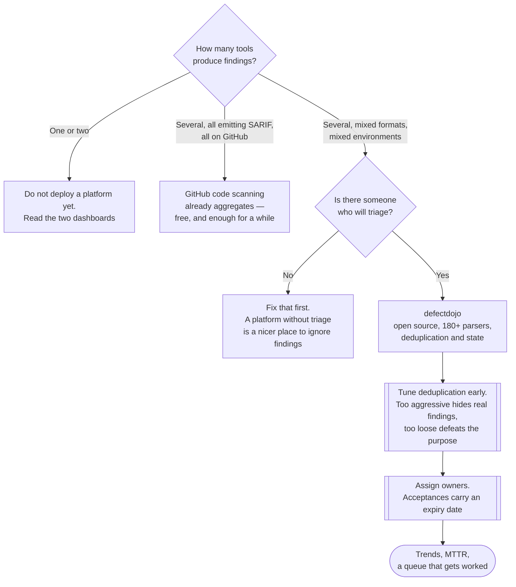

[← Code security](../README.md)

# ASPM

Application Security Posture Management: one place for every finding, deduplicated, with an
owner and a state. Unglamorous, and it is what makes the rest of this tree usable.

Tools covered: [`defectdojo`](defectdojo/README.md)

## Contents

1. [Ten scanners, ten dashboards](#1-ten-scanners-ten-dashboards)
2. [What aggregation actually has to do](#2-what-aggregation-actually-has-to-do)
   - [Deduplication is the hard part](#deduplication-is-the-hard-part)
3. [State, and why a finding needs one](#3-state-and-why-a-finding-needs-one)
4. [Where it sits in the flow](#4-where-it-sits-in-the-flow)
5. [When you do not need this](#5-when-you-do-not-need-this)
6. [Decision tree](#6-decision-tree)
7. [Anti-patterns](#7-anti-patterns)
8. [How this applies to pikakube](#8-how-this-applies-to-pikakube)

---

## 1. Ten scanners, ten dashboards

Adopt the rest of [`../README.md`](../README.md) and you end up with SAST, SCA, secret scanning,
container scanning, DAST and API testing, each producing findings in its own format with its own
severity scale — and the same underlying problem reported by several of them.

The concrete duplication is worse than it sounds. A single vulnerable `log4j-core` in one service
produces:

| Reported by | As |
|---|---|
| SCA in CI | a finding against `pom.xml` |
| Trivy on the image | a finding against the JAR in the layer |
| Trivy Operator in the cluster | a `VulnerabilityReport` for the running pod |
| Policy Reporter | a `PolicyReport` derived from that |
| a registry scanner | a finding against the pushed artefact |

Five reports, one problem, one fix. Without aggregation, five different people look at five
different dashboards and none of them knows whether anyone is acting.

The failure that follows is entirely predictable: **nobody triages anything, because there is no
single list to triage.** The scanners keep working; the programme stops.

## 2. What aggregation actually has to do

Four jobs, and only the first is easy:

| Job | Detail |
|---|---|
| **Ingest** | parse the output of every tool. This is why a platform's *parser list* is the feature that matters most in selection |
| **Deduplicate** | recognise that five reports are one finding |
| **Track state** | a finding is new, triaged, accepted-with-an-expiry, false-positive, or fixed — and the state must survive re-scans |
| **Assign** | a finding with no owner is a finding nobody works |

### Deduplication is the hard part

Naive matching on CVE id fails immediately: the same CVE in two different services is two
problems, and the same CVE in the same service reported by two tools is one.

Workable deduplication keys on some combination of product, component, version, location and
vulnerability id — and the definition has to be tuned per environment, because getting it wrong
fails in both directions:

- **Too aggressive** — genuinely distinct findings collapse into one, and one service's fix
  silently closes another's.
- **Too loose** — the duplicates you deployed the platform to remove are still there.

This is the main operational cost of running an ASPM tool, and it is worth knowing before
adopting one rather than discovering it in month three.

## 3. State, and why a finding needs one

A scanner is stateless. It reports what is true now, every time it runs. That means without an
aggregation layer:

- there is no record that a finding was reviewed and accepted
- there is no record of *why*, or by whom, or until when
- a finding suppressed in one tool's ignore file is invisible in every other tool
- "is this getting better or worse" cannot be answered, because there is no history

The state model that works is small: **new → triaged → (accepted with an expiry | false positive |
in progress) → fixed**, with the acceptance always carrying a date. An acceptance without an
expiry is a decision that will never be revisited.

Trend data is the other thing state buys, and it is the only output of this whole tree that a
non-engineer will read: findings over time, mean time to remediate, and which services are
accumulating rather than clearing.

## 4. Where it sits in the flow

```
SAST · SCA · secrets · DAST · API tests · container scanning
                    ↓  (SARIF, JSON, native formats)
              ASPM platform
                    ↓
   one deduplicated list, with state, owners and trends
                    ↓
        the queue people actually work
```

Everything upstream produces findings. This is the only component that produces **work**.

Two upstream connections worth naming in this repository specifically: Trivy Operator's findings
already reach **Policy Reporter** through the adapter in
[`../../3-container/scan/trivy/polr-adapter/README.md`](../../3-container/scan/trivy/polr-adapter/README.md),
which is aggregation *within the cluster* for Kubernetes-shaped results. ASPM is the layer above
that, covering CI findings, DAST results and everything that never becomes a Kubernetes resource.
The two are complementary, and the cluster-level one is not a substitute.

## 5. When you do not need this

Worth stating, because an ASPM platform is a real deployment with a database and an upgrade path:

- **One or two tools.** Two dashboards is not a crisis. Deploy the aggregation when the tool count
  makes it one
- **Findings already land in one place.** If everything emits SARIF into GitHub code scanning,
  that *is* an aggregation layer — less capable, and free
- **Nobody owns the queue.** An aggregation platform with no triage process is a more sophisticated
  way of not looking at findings. The process is the prerequisite, not the tool

## 6. Decision tree



## 7. Anti-patterns

| Anti-pattern | Why it is bad | What to do instead |
|---|---|---|
| Ten tools, ten dashboards | the same finding many times and no shared state; nobody triages | aggregate |
| Deploying an ASPM platform with no triage process | a more sophisticated way of not looking at findings | agree the process first, then deploy |
| Importing everything with default deduplication | either duplicates persist or distinct findings collapse | tune the deduplication rules per tool |
| Acceptances with no expiry date | permanent decisions nobody revisits, made once under deadline pressure | require an expiry, and re-review on it |
| Findings with no owner | an unassigned finding is not work, it is a record | assign at import, by service or team |
| Reporting counts as the headline metric | it rewards suppressing findings rather than fixing them | mean time to remediate, and trend by severity |
| Aggregating without gating | everything is visible and nothing has to be fixed | a small number of enforced thresholds |
| Treating in-cluster policy reporting as full aggregation | it only sees Kubernetes-shaped results, never CI or DAST | both layers, deliberately |

## 8. How this applies to pikakube

[`defectdojo/README.md`](defectdojo/README.md) has Flux manifests committed — a namespace, a
HelmRepository and a HelmRelease on chart defaults. It is staged rather than in use, and staging
*this* early is a defensible sequencing decision: the aggregation layer is better in place before
the tools that flood it, not after.

The honest counterpoint is section 5. Right now this repository runs **one** finding-producing
tool: Trivy Operator, whose results already reach Policy Reporter through
[`../../3-container/scan/trivy/polr-adapter/README.md`](../../3-container/scan/trivy/polr-adapter/README.md).
One tool does not need an aggregation platform, and DefectDojo is not a small deployment —
chart defaults mean a bundled database, no ingress and no authentication configuration.

So the sequencing that makes sense: **add the tools first, from the priority list in
[`../README.md`](../README.md) — secret scanning, SCA, pipeline auditing — and turn DefectDojo on
when the third one lands.** At that point it has something to deduplicate, and the deduplication
tuning in section 2 becomes work worth doing rather than configuration of an empty system.

---

[← Code security](../README.md)
