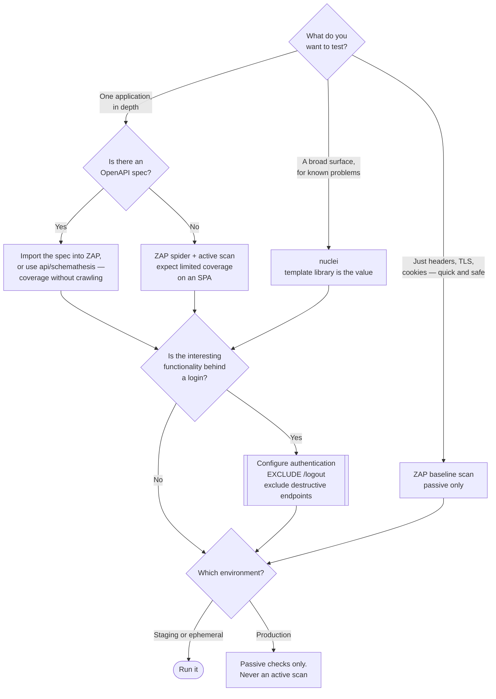

[← Code security](../README.md)

# DAST

Testing the application while it runs, by attacking it. Finds the things that exist only once
code, configuration and deployment are combined.

Tools covered: [`zaproxy`](zaproxy/README.md) · [`nuclei`](nuclei/README.md)

## Contents

1. [What dynamic testing sees that static cannot](#1-what-dynamic-testing-sees-that-static-cannot)
2. [The coverage problem](#2-the-coverage-problem)
3. [Authentication is where DAST projects die](#3-authentication-is-where-dast-projects-die)
4. [Two very different tools](#4-two-very-different-tools)
5. [Where it runs, and where it must not](#5-where-it-runs-and-where-it-must-not)
6. [Decision tree](#6-decision-tree)
7. [Anti-patterns](#7-anti-patterns)
8. [How this applies to pikakube](#8-how-this-applies-to-pikakube)

---

## 1. What dynamic testing sees that static cannot

Dynamic Application Security Testing runs against a **deployed** application. It sends requests
and reasons about the responses, with no access to source code — which is exactly why it finds a
different class of problem:

| Finding | Why static analysis cannot see it |
|---|---|
| Debug mode enabled in production | it is a configuration value, not code |
| `Access-Control-Allow-Origin: *` | set by a gateway, an ingress annotation, or a framework default |
| Missing security headers — HSTS, CSP, `X-Content-Type-Options` | absent things are invisible to code analysis |
| Directory listing, exposed `.git`, `/actuator`, `/debug` endpoints | a web server or framework default nobody chose |
| An expired or misconfigured TLS certificate | infrastructure, not source |
| Authentication bypass through a path the code did not anticipate | emerges from routing plus middleware plus deployment |
| A vulnerable component identified by its response fingerprint | the dependency may not even appear in a manifest |
| Default credentials on an admin panel | shipped by the vendor |

The complementary property matters as much: **a DAST finding is usually real.** The tool observed
an actual response from an actual deployment. Compare that with SAST, where the central question
is always "is this reachable and is it sanitised somewhere else". Fewer findings, higher
confidence.

## 2. The coverage problem

The corresponding weakness, and it is severe:

> **DAST only tests what it reaches.**

A modern application is mostly behind authentication, behind a single-page application that
constructs requests in JavaScript, behind multi-step workflows with state. A spider crawling links
sees the login page and very little else.

What actually improves coverage, in order of effectiveness:

| Approach | Why |
|---|---|
| **Drive it from an API specification** | an OpenAPI document lists every endpoint, its parameters and their types. Nothing has to be discovered — see [`../api/README.md`](../api/README.md) |
| **Replay recorded traffic** | proxy a functional test suite or a real session through the scanner, so it inherits real coverage |
| **Configure authenticated scanning** | see the next section |
| Spidering, traditional and AJAX | the fallback; on an SPA it finds a fraction of the surface |

The first of these is the reason [`../api/README.md`](../api/README.md) exists as a separate
folder. For anything with a contract, contract-driven testing dominates crawling.

## 3. Authentication is where DAST projects die

Nearly all interesting functionality is behind a login, so an unauthenticated scan tests the
marketing pages. Getting authenticated scanning working is the actual work, and the obstacles are
mundane:

- session tokens that expire mid-scan
- CSRF tokens that must be extracted from each response and replayed
- OAuth and OIDC redirect flows the scanner cannot complete
- MFA
- **the scanner logging itself out** by hitting `/logout` during the crawl — the classic failure,
  and the reason exclusion rules are mandatory
- the scanner performing destructive actions with a valid session: deleting records, sending
  emails, triggering payments

Two rules that follow directly: **exclude logout and destructive endpoints explicitly**, and
**never point an authenticated active scan at production**.

## 4. Two very different tools

These are not competitors; they answer different questions.

| | [**ZAP**](zaproxy/README.md) | [**Nuclei**](nuclei/README.md) |
|---|---|---|
| Origin | OWASP (formerly OWASP ZAP, now under the Software Security Project) | ProjectDiscovery |
| Model | an intercepting proxy and full web application scanner | a template engine that sends requests and matches responses |
| Finds | injection, XSS, session handling, headers, application logic | known CVEs, exposed panels, misconfigurations, default credentials, takeovers |
| How it knows what to look for | built-in active and passive scan rules | **the template library** — thousands of community YAML templates |
| Speed | slow — active scanning is thorough and heavy | very fast, massively parallel |
| Best at | a single application, examined in depth | a large surface, checked broadly for known issues |

**The template library is Nuclei's actual product.** The engine is a few thousand lines; the value
is thousands of community-maintained templates encoding "how to detect this specific known
problem", updated within hours of a new CVE being published. Treat it as a subscription to the
community's detection knowledge rather than as a scanner.

The two combine well: Nuclei sweeps everything you expose for known issues, ZAP goes deep on the
application that matters.

## 5. Where it runs, and where it must not

| Environment | Verdict |
|---|---|
| **Staging that resembles production** | the right target. Real configuration, disposable data |
| Ephemeral environment per pull request | ideal if you have it: scan the change in isolation |
| Local, during development | fine for a ZAP baseline scan |
| **Production** | **no.** An active scan sends malicious payloads to a live system with real data. It will create records, trigger workflows, send emails and can cause an outage |

The one production-adjacent exception: **passive** scanning — headers, TLS configuration, cookie
flags — is safe because it only observes. Nuclei templates marked passive, or a ZAP baseline scan,
fall in this category. Anything "active" does not.

Also worth stating plainly: **scanning a system you do not own is an attack**, regardless of
intent. Bug bounty scope, or written authorisation, or do not run it.

## 6. Decision tree

## 7. Anti-patterns

| Anti-pattern | Why it is bad | What to do instead |
|---|---|---|
| Active scanning production | malicious payloads against real data; outages and corrupted records | staging, or an ephemeral environment |
| Unauthenticated scan of an authenticated application | you tested the login page | configure authentication, and verify the session held |
| Not excluding `/logout` | the scanner logs itself out and the rest of the scan is unauthenticated without saying so | exclusion rules, always |
| Relying on the spider for an SPA | requests are built in JavaScript; the crawler sees almost nothing | drive from the API specification |
| Blocking every deploy on DAST results | scans take a long time and findings need interpretation | run on a schedule or per environment, not per commit |
| Treating a clean DAST run as coverage | it only tested what it reached, which is usually a fraction | pair with SAST and SCA |
| Scanning third-party or SaaS endpoints | that is an unauthorised attack on someone else's system | only systems you own or are authorised to test |
| Running Nuclei with every template enabled | thousands of requests, many irrelevant, and rate limits or WAF bans | select template tags relevant to the target |

## 8. How this applies to pikakube

Nothing is deployed, and DAST is correctly placed low in
[`../README.md`](../README.md)'s priority list — it needs a running application, a staging
environment and someone to own the findings, none of which exist here yet.

That said, there is a **Nuclei-shaped opportunity that does not need any of that**. This cluster
exposes a substantial set of infrastructure UIs — Grafana, Airflow, Airbyte, and the platform
components mapped throughout this repository. Those are exactly what Nuclei's templates are best
at: exposed panels, default credentials, known CVEs in well-known software, missing
authentication. Pointing Nuclei at the cluster's own ingress hostnames is a single command and
tests something that genuinely exists, rather than an application that does not.

ZAP becomes relevant when there is an application with an API to test. At that point the better
entry point is not ZAP's spider but the contract:
[`../api/schemathesis/README.md`](../api/schemathesis/README.md), driven from the OpenAPI
specification, which is also the approach documented in
[`docs/api-contract/`](../../../docs/api-contract/README.md).

---

[← Code security](../README.md)
