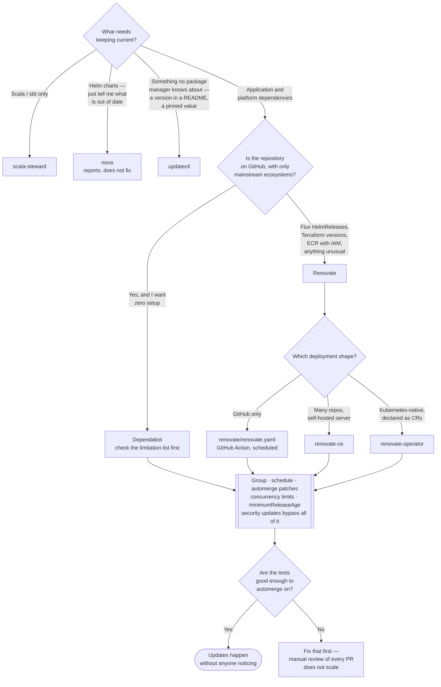

[← Code security](../README.md)

# Dependency updates

Keeping dependencies current. This is the actual remediation for everything SCA reports, and
the fastest way to destroy a team's trust in automation if you get the noise wrong.

Tools covered: [`renovate`](renovate/README.md) · [`dependabot`](dependabot/README.md) ·
[`updatecli`](updatecli/README.md) · [`scala-steward`](scala-steward/README.md) ·
[`nova`](nova/README.md)

## Contents

1. [Why this lives in a security tree](#1-why-this-lives-in-a-security-tree)
2. [The honest problem: noise](#2-the-honest-problem-noise)
   - [What makes it survivable](#what-makes-it-survivable)
3. [The prerequisite nobody wants to hear](#3-the-prerequisite-nobody-wants-to-hear)
4. [The tools](#4-the-tools)
5. [What a platform repository actually needs updating](#5-what-a-platform-repository-actually-needs-updating)
6. [Decision tree](#6-decision-tree)
7. [Anti-patterns](#7-anti-patterns)
8. [How this applies to pikakube](#8-how-this-applies-to-pikakube)

---

## 1. Why this lives in a security tree

[`../sca/README.md`](../sca/README.md) tells you a dependency has a known vulnerability. The fix
is a version bump. That is the entire relationship:

> **SCA is detection. This folder is remediation. A scanner without an update mechanism produces
> a list that grows.**

And the stronger version of the argument: a repository whose dependencies are updated weekly has
fewer vulnerabilities than one that is scanned daily and updated quarterly — because most CVEs
are fixed upstream before anyone maps them to your project. Currency is prevention; scanning is
detection after the fact.

The corollary matters for prioritisation: if you can only do one of the two, **do this one**.

## 2. The honest problem: noise

Turn Renovate or Dependabot on with default settings against a real repository and you get
somewhere between fifteen and sixty pull requests in the first week. What follows is entirely
predictable:

1. Nobody can review forty PRs.
2. They pile up and go stale, then conflict with each other.
3. Someone starts closing them without reading.
4. The bot is muted, or the schedule is set to "never".
5. Six months later the dependencies are older than before it was installed.

**Automated dependency updates fail from volume, not from correctness.** The tool works; the
process around it does not exist.

### What makes it survivable

Six controls, roughly in order of impact:

| Control | Effect |
|---|---|
| **Grouping** | one PR per ecosystem, or per related set — "all Kubernetes client libraries" — instead of one per package. This alone cuts volume by an order of magnitude |
| **Scheduling** | a weekly or monthly window, not continuous. Updates arrive as a batch someone owns rather than a trickle nobody does |
| **Automerge for low-risk updates** | patch and pinned-digest updates, merged automatically when CI is green. The vast majority of updates, handled by nobody |
| **Concurrency limits** | cap open PRs (`prConcurrentLimit`, `prHourlyLimit`). A hard ceiling on how bad it can get |
| **Separate security updates** | vulnerability fixes bypass the schedule and the grouping. They are the ones that matter and they should not queue behind a minor version bump |
| **A stability delay** | wait a few days after a release before proposing it (`minimumReleaseAge`). This is a genuine supply-chain control — it means a compromised package that is yanked within 48 hours never reaches a PR |

The last one deserves emphasis. Several real supply-chain attacks (event-stream,
`ua-parser-js`, various npm account takeovers) were detected and the malicious versions removed
within days. A stability delay converts "we merged it within the hour" into "we never saw it".

## 3. The prerequisite nobody wants to hear

Automated updates require **tests you trust**. Automerge on green CI is only safe if green CI
means something.

A repository with no meaningful test suite cannot automerge, which means every update needs human
review, which means the volume problem is unsolvable, which means the whole thing degrades into
the failure mode above. Teams that get value from Renovate almost always have decent CI first.

If the tests are not there, the honest sequence is: build the tests, then turn on the bot. Not
the other way round.

## 4. The tools

| Tool | Scope | Where it shines | Do not use when | Detail |
|---|---|---|---|---|
| **Renovate** | almost everything: 90+ package managers, Docker tags and digests, Helm charts, Flux `HelmRelease`, Terraform, GitHub Actions, and arbitrary files via regex | **the default.** The most configurable and the only one that is genuinely self-hostable, with real grouping, scheduling and automerge | you want zero configuration and only need GitHub's basics | [→](renovate/README.md) |
| **Dependabot** | GitHub-native, mainstream ecosystems | zero setup on GitHub; security alerts are integrated with the advisory database | anything beyond its supported ecosystems — the recorded limitations are extensive and specific | [→](dependabot/README.md) |
| **updatecli** | anything expressible as source → condition → target | it is **not** a dependency bot: it is a general "keep this value in sync with that value" engine. Version strings in READMEs, pinned versions across repositories, values no package manager knows about | you want dependency updates specifically, with a curated database behind them | [→](updatecli/README.md) |
| **scala-steward** | Scala / sbt only | the Scala ecosystem's own tool, understanding sbt and Scala version compatibility properly | anything not Scala | [→](scala-steward/README.md) |
| **nova** | Helm charts | answers one question — which installed charts are out of date, and which images inside them are | you want it to open PRs; it reports, it does not remediate | [→](nova/README.md) |

**Renovate is the default recommendation** and the gap is wider than it looks. Its coverage of
Flux `HelmRelease`, Docker digests, Helm chart versions and GitHub Actions is exactly what a
GitOps platform repository is made of — and the recorded Dependabot limitations in
[`dependabot/README.md`](dependabot/README.md) are precisely the places where a platform
repository lives.

## 5. What a platform repository actually needs updating

A GitOps repository has no `package-lock.json`. Its dependency graph is a different shape, and
this is what decides which tool fits:

| Thing | Where it appears | Renovate | Dependabot |
|---|---|---|---|
| Helm chart versions | Flux `HelmRelease` `spec.chart.spec.version` | yes | **no** — see the recorded issues |
| Container image tags and digests | HelmRelease values, manifests | yes | limited |
| GitHub Actions versions | `.github/workflows/*.yaml` | yes | yes |
| Terraform providers | `.tf` | yes | yes |
| **Terraform core version** | `required_version`, `.terraform-version` | yes | **no** — recorded issues |
| Private Terraform modules | `.tf` | yes | **PAT only** — recorded issue |
| Private registries with cloud IAM | ECR, GAR | yes | **no** — static credentials only, recorded issue |
| Kustomize, Docker Compose, devbox, arbitrary files | anywhere | yes, via managers and regex | no |

That table is the argument. For this repository — Flux HelmReleases, pinned actions, container
images — Dependabot covers a minority of what needs updating, and Renovate covers effectively all
of it.

## 6. Decision tree

## 7. Anti-patterns

| Anti-pattern | Why it is bad | What to do instead |
|---|---|---|
| Default configuration on a real repository | forty PRs in week one, and the bot is muted by week three | group, schedule and limit concurrency before enabling |
| No automerge for patch updates | humans reviewing patch bumps forever; the queue never clears | automerge patches on green CI |
| Automerge with a weak test suite | you have automated the introduction of breakage | build the tests first |
| Security updates queued behind the normal schedule | the one update that mattered waits for the monthly window | a separate, immediate rule for vulnerability fixes |
| Merging a release the moment it is published | you are the canary for both bugs and compromised packages | `minimumReleaseAge` of a few days |
| Enabling the bot without owning the output | PRs accumulate, conflict and rot, and the repository looks abandoned | one person, one recurring slot |
| Pinning everything and never updating | the eventual upgrade is a migration project instead of a bump | small, frequent, boring updates |
| A personal access token as the bot identity | it carries a human's full access, and it dies with the human | a GitHub App with scoped permissions |

## 8. How this applies to pikakube

This is the only capability in [`../README.md`](../README.md) with substantial committed
material, and the tool chosen is **Renovate** — correctly, given section 5. Three deployment
shapes are present:

| Shape | What is committed | Read |
|---|---|---|
| GitHub Action | `renovate/renovate.yaml` — a workflow running Renovate on a monthly cron | [`renovate/README.md`](renovate/README.md) |
| Self-hosted server | Flux manifests for Mend's Renovate CE | [`renovate/renovate-ce/README.md`](renovate/renovate-ce/README.md) |
| Kubernetes operator | Flux manifests for the community `renovate-operator` | [`renovate/renovate-operator/README.md`](renovate/renovate-operator/README.md) |

**Three shapes staged, one to choose.** They do the same job by different means, and running more
than one against the same repositories produces duplicate pull requests.

The committed workflow is worth reading as an example of doing the surrounding work properly: it
authenticates as a **GitHub App** rather than with a personal access token, sets
`permissions: contents: read` at the top level, and pins every action to a commit SHA with the
version in a trailing comment — exactly what [`../pipeline/zizmor/README.md`](../pipeline/zizmor/README.md)
audits for. What it does not yet have is a committed Renovate configuration
(`renovate.json5` / `.github/renovate.json`), which is where every control in section 2 lives.
The schedule is currently expressed as a monthly cron in the workflow; grouping, automerge,
concurrency limits and `minimumReleaseAge` all belong in that configuration file, and the
home-ops repositories recorded in [`renovate/README.md`](renovate/README.md) are the reference
implementations to copy from.

[`dependabot/README.md`](dependabot/README.md) is worth reading even though Dependabot is not in
use here — it records, with issue links, exactly why it was rejected for this repository's shape.

---

[← Code security](../README.md)
