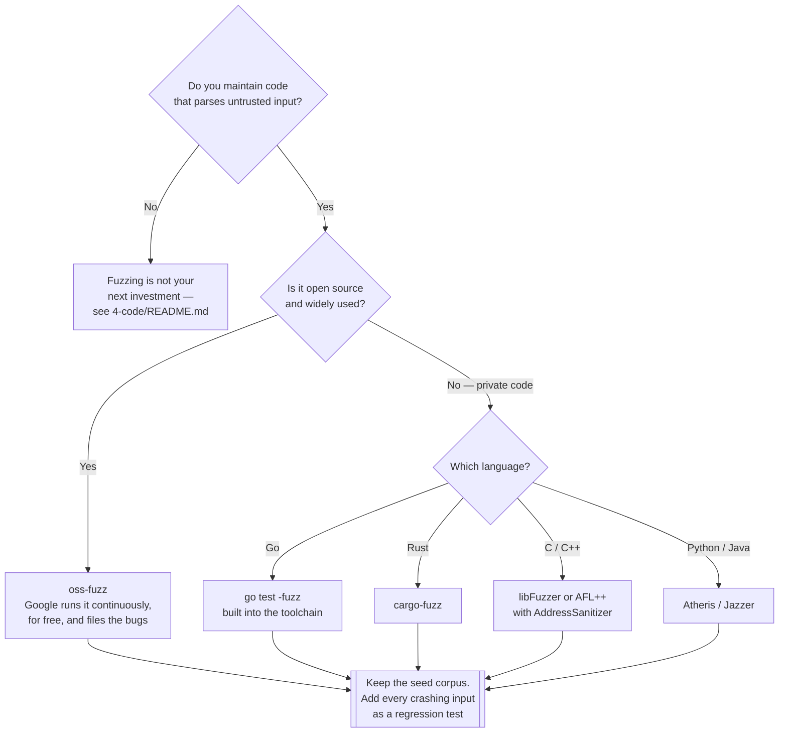

[← Code security](../README.md)

# Fuzzing

Feeding a program malformed input, continuously, and waiting for it to crash. Extremely
effective, and relevant to a narrow set of codebases.

Tools covered: [`oss-fuzz`](oss-fuzz/README.md)

## Contents

1. [What fuzzing is](#1-what-fuzzing-is)
2. [Why coverage guidance changed everything](#2-why-coverage-guidance-changed-everything)
3. [What it is good at, and what it cannot find](#3-what-it-is-good-at-and-what-it-cannot-find)
4. [Who this is actually for](#4-who-this-is-actually-for)
5. [Decision tree](#5-decision-tree)
6. [Anti-patterns](#6-anti-patterns)
7. [How this applies to pikakube](#7-how-this-applies-to-pikakube)

---

## 1. What fuzzing is

A fuzzer calls a function with generated input, over and over, and watches for something to go
wrong — a crash, a hang, a memory error, an assertion failure, an unhandled exception.

The unit of work is a **fuzz target**: a small function that takes a byte array and feeds it to
the code under test.

```c
// the canonical libFuzzer entry point
int LLVMFuzzerTestOneInput(const uint8_t *data, size_t size) {
  parse_the_thing(data, size);   // if this crashes, you have a finding
  return 0;
}
```

The fuzzer supplies `data`, millions of times, and records every input that produces a crash.

Detection is greatly improved by **sanitisers** compiled into the binary — AddressSanitizer for
memory errors, UndefinedBehaviorSanitizer, MemorySanitizer, ThreadSanitizer. Without them a
buffer overflow may not crash at all; with them it fails loudly at the moment it happens.

## 2. Why coverage guidance changed everything

Random input alone is nearly useless: a parser rejects malformed data in the first few bytes and
never reaches the interesting code.

Modern fuzzers are **coverage-guided**. The binary is instrumented so the fuzzer sees which
branches an input reached, and it keeps inputs that reached something new, mutating those
preferentially. The effect is that the fuzzer *learns* the input format well enough to get
deeper — discovering, for a JSON parser, that a `{` gets it further than random bytes, and
building from there.

That single idea is what turned fuzzing from an academic technique into the method that finds
thousands of real vulnerabilities per year in widely used software.

Practical corollaries: a good **seed corpus** (valid example inputs) accelerates it enormously,
and the corpus is a persistent asset that should be kept and reused across runs.

## 3. What it is good at, and what it cannot find

| Finds well | Cannot find |
|---|---|
| Memory corruption — buffer overflows, use-after-free, double-free | authorisation flaws |
| Crashes and unhandled exceptions on malformed input | business logic errors |
| Infinite loops and algorithmic denial of service | injection into a downstream system |
| Integer overflows and off-by-one errors | anything requiring a specific multi-step sequence |
| Parser and deserialisation bugs | configuration problems |

The shape of the target matters more than the language: **anything that parses untrusted input**
is a good candidate. File formats, network protocols, compression, image and media decoding,
cryptographic parsing, serialisation. That is why the technique is associated with C and C++ —
but Go (`go test -fuzz`), Rust (`cargo-fuzz`), Python (Atheris) and Java (Jazzer) all have
coverage-guided fuzzers now, and they find exceptions and hangs rather than memory corruption.

## 4. Who this is actually for

Be direct about the audience, because fuzzing is over-recommended:

| Codebase | Is fuzzing worth it? |
|---|---|
| A library that parses untrusted input, used by others | **yes** — this is the case fuzzing was built for |
| A widely used open-source project | **yes**, and [OSS-Fuzz](oss-fuzz/README.md) will run it for free |
| A memory-unsafe language handling external data | **yes** |
| A business application built from frameworks | rarely — the parsing is in the frameworks, not in your code |
| **A platform repository of YAML manifests** | **no** — there is no code to fuzz |

The honest test: *do you own code that takes bytes from an untrusted source and interprets them?*
If not, the effort belongs elsewhere in [`../README.md`](../README.md).

## 5. Decision tree



## 6. Anti-patterns

| Anti-pattern | Why it is bad | What to do instead |
|---|---|---|
| Fuzzing an application with no parsing code | you are testing the frameworks, badly | invest in SCA and secret scanning instead |
| Fuzzing without sanitisers | a memory error that does not crash is silently missed | build with AddressSanitizer and friends |
| Running a fuzzer for five minutes in CI | coverage-guided fuzzing needs hours to days to get deep | continuous fuzzing, with a corpus that persists |
| Throwing away the corpus between runs | you restart the learning process every time | persist and version the corpus |
| Fixing a crash without adding a regression test | the crashing input is a perfect test case, and it is free | add it to the test suite |
| Treating a fuzzing crash as low severity by default | in a memory-unsafe language it is potentially remote code execution | triage properly; exploitability varies enormously |
| Expecting it to find logic or authorisation bugs | it generates input, it does not reason about intent | DAST, review and tests |

## 7. How this applies to pikakube

**It does not, and that is the correct conclusion.** This repository is Kubernetes manifests,
Helm values and documentation. There is no first-party parser, no library, and no code taking
bytes from an untrusted source — so there is nothing to fuzz.

It is mapped here for completeness, and for one scenario: if this repository ever produces a
first-party tool — a Go controller, a CLI, an admission webhook that parses input — that tool
would be a candidate, and Go's built-in `go test -fuzz` would be the entry point rather than
anything in this folder.

[`oss-fuzz/README.md`](oss-fuzz/README.md) is worth reading for a different reason than adoption:
much of the software this platform runs *is* fuzzed by OSS-Fuzz, and understanding that explains
where a meaningful share of the CVEs reported by
[`../../3-container/scan/README.md`](../../3-container/scan/README.md) actually come from.

---

[← Code security](../README.md)
