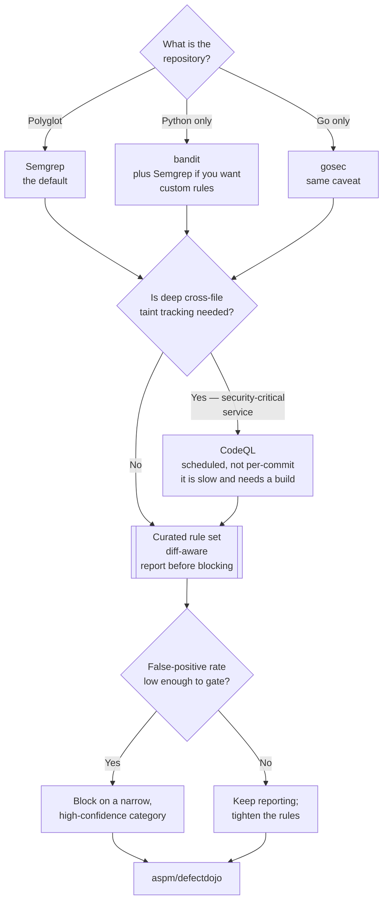

[← Code security](../README.md)

# SAST

Reading source code to find patterns that are exploitable. Fast, cheap to run, and noisy
enough that the rule set matters more than the tool.

Tools covered: [`semgrep`](semgrep/README.md) · [`codeql`](codeql/README.md) ·
[`bandit`](bandit/README.md) · [`gosec`](gosec/README.md) · [`horusec`](horusec/README.md)

## Contents

1. [What SAST is, mechanically](#1-what-sast-is-mechanically)
2. [Pattern matching vs semantic analysis](#2-pattern-matching-vs-semantic-analysis)
3. [The false-positive problem, and what to do about it](#3-the-false-positive-problem-and-what-to-do-about-it)
4. [What SAST cannot find](#4-what-sast-cannot-find)
5. [The tools](#5-the-tools)
6. [The overlap with code quality](#6-the-overlap-with-code-quality)
7. [Decision tree](#7-decision-tree)
8. [Anti-patterns](#8-anti-patterns)
9. [How this applies to pikakube](#9-how-this-applies-to-pikakube)

---

## 1. What SAST is, mechanically

Static Application Security Testing reads source code — without running it — and looks for
constructs known to be dangerous. In practice that means:

| Category | Example finding |
|---|---|
| Injection | string concatenation into a SQL query, a shell command, an LDAP filter |
| Unsafe deserialisation | `pickle.loads` on untrusted input, Java native deserialisation |
| Cryptographic misuse | MD5 for passwords, ECB mode, a hardcoded IV, `Random` instead of `SecureRandom` |
| Hardcoded credentials | an API key in a constant |
| Path traversal | user input reaching a file path |
| Dangerous APIs | `eval`, `exec`, `os.system`, `subprocess` with `shell=True` |
| SSRF | a user-controlled URL passed to an HTTP client |
| Missing controls | disabled TLS verification, permissive CORS in code |

The defining property: **SAST analyses code you wrote**. A vulnerable version of a library you
imported is invisible to it — that is [`../sca/README.md`](../sca/README.md), and it is where
most real vulnerabilities live.

## 2. Pattern matching vs semantic analysis

The tools in this folder are not doing the same amount of work, and the difference explains both
their speed and their accuracy:

| | Pattern matching | Semantic / dataflow analysis |
|---|---|---|
| How | match syntax against rules, with some AST awareness | build a database of the code, then query it across functions and files |
| Answers | "does this line look dangerous?" | "can untrusted input reach this dangerous call?" |
| Speed | seconds | minutes to hours; needs a build |
| False positives | more | fewer, because reachability is actually computed |
| Tools here | Semgrep, bandit, gosec | CodeQL |

The concept underneath the second column is **taint tracking**: mark inputs as untrusted
(sources), mark dangerous operations (sinks), and determine whether data flows from a source to
a sink without passing through a sanitiser. That is what turns "this code calls `exec`" into
"user input from this HTTP handler reaches this `exec`" — a finding worth a developer's
afternoon rather than an argument.

Semgrep occupies a middle position: it is far more than grep (it understands syntax, so
formatting and variable names do not matter) and it has taint mode, but its cross-file
reachability is not CodeQL's.

## 3. The false-positive problem, and what to do about it

SAST's reputation is built on this and it is deserved. A default rule set on a mature codebase
produces hundreds of findings, most of which are not exploitable, and the standard outcome is
that the tool is muted.

What actually works:

| Practice | Why |
|---|---|
| **Curate the rule set.** Start with a small, high-confidence set — injection, deserialisation, hardcoded secrets — not "everything" | signal-to-noise decides whether anyone reads the output |
| **Report before blocking.** Run for weeks in non-blocking mode | you learn the real rate before it becomes an obstacle |
| **Diff-aware scanning.** Only findings introduced by the change under review | a legacy backlog does not block today's work, and new problems still get caught |
| **Block on a narrow category only** | the gate is credible because everything it blocks is real |
| **Triage suppressions in code, with a reason** | `# nosemgrep: rule-id — sanitised at the boundary, see X` is reviewable; a global ignore file is not |

Diff-aware scanning is the practice that changes outcomes most. It converts an unbounded backlog
into a bounded, per-pull-request problem — which is the only form in which developers will engage
with it.

## 4. What SAST cannot find

Worth being explicit, because gaps get assumed away:

- **Vulnerable dependencies** — [`../sca/README.md`](../sca/README.md)
- **Configuration and deployment problems** — debug mode on, permissive CORS at the gateway,
  missing security headers. Only [`../dast/README.md`](../dast/README.md) sees these
- **Business logic flaws** — an authorisation check that is present, correct-looking, and checks
  the wrong thing
- **Anything emerging from composition** — two individually safe services combined unsafely
- **Runtime and infrastructure** — a privileged pod, a public bucket. Different rings entirely

## 5. The tools

| Tool | Scope | Where it shines | Do not use when | Detail |
|---|---|---|---|---|
| **Semgrep** | multi-language | the modern default: fast, rules that read like the code they match, a large community rule library, easy to write custom rules | you need deep cross-file dataflow | [→](semgrep/README.md) |
| **CodeQL** | multi-language, compiled languages especially | far more powerful — a real query language over a code database, with genuine taint tracking. GitHub-native and free for public repositories | speed matters, or the licence terms do not fit; it is slow and requires a build | [→](codeql/README.md) |
| **bandit** | Python only | the Python-specific checks, maintained by PyCQA; trivial to add to an existing Python lint setup | you want one tool across a polyglot repository | [→](bandit/README.md) |
| **gosec** | Go only | the Go-specific checks — error handling, `crypto/rand`, subprocess, file permissions | same | [→](gosec/README.md) |
| **horusec** | orchestrator | runs several tools (including some of the above) behind one CLI and one report | you want direct control over each tool; and see its maintenance status | [→](horusec/README.md) |

**Semgrep is the default recommendation** for a polyglot repository: one tool, one configuration,
one output format, rules anyone can read and modify. **CodeQL** is worth adding where depth pays
for the runtime — a security-critical service, a scheduled scan rather than a per-commit gate,
or a public repository where it is free and integrated.

The language-specific tools are not competitors to Semgrep so much as complements: bandit and
gosec encode idiomatic knowledge of their ecosystem that a general engine's rules cover less
thoroughly. In a single-language repository, starting with the specific tool is often the
cheaper path.

## 6. The overlap with code quality

The same technique — static analysis of source — appears in
[`code-quality/static-analysis/`](../../../software-engineering/code-quality/static-analysis/README.md)
with SonarQube. The distinction is the question, not the method:

| | SAST (here) | Static analysis for quality |
|---|---|---|
| Question | is this **exploitable**? | is this **maintainable**? |
| Finding | SQL injection, unsafe deserialisation | complexity, duplication, dead code, coverage |
| Audience | security, and the developer given a security ticket | the developer, in review |
| Gate | a security gate, narrow and high-confidence | a quality gate, broad |

SonarQube ships security rules and Semgrep ships quality rules, so the tools overlap even where
the folders do not. Running both is normal; expecting either to replace the other is not.

## 7. Decision tree

## 8. Anti-patterns

| Anti-pattern | Why it is bad | What to do instead |
|---|---|---|
| Enabling every rule on day one | hundreds of findings, no owner, and the tool is muted within a fortnight | a small curated set, expanded as the queue clears |
| Blocking merges from the first run | the legacy backlog blocks unrelated work, so someone disables the gate | diff-aware scanning, report first |
| Adopting SAST before SCA | most real vulnerabilities are in dependencies | [`../sca/README.md`](../sca/README.md) first |
| A global ignore file | suppressions with no reason and no reviewer become permanent and invisible | inline suppression with a rule id and a justification |
| Treating a clean SAST run as "the code is secure" | it sees neither dependencies, nor configuration, nor business logic | combine with SCA and DAST |
| Running CodeQL on every commit | build plus analysis is slow enough to make CI unusable | scheduled scans, or on the default branch only |
| Two overlapping SAST tools with no aggregation | the same finding twice, in two formats, triaged by nobody | one tool, or aggregate — [`../aspm/README.md`](../aspm/README.md) |
| Expecting SAST to replace review | it finds patterns; it has no idea what the code is meant to do | review is where logic flaws are caught |

## 9. How this applies to pikakube

Nothing here is deployed. The repository is predominantly YAML manifests, Helm values and
documentation, with comparatively little first-party application code — which genuinely reduces
what SAST has to work on, and is the honest reason it ranks below SCA and secret scanning in
[`../README.md`](../README.md).

Where it does apply, and would apply immediately:

- **Semgrep against the repository's own scripts and any Python** — a small rule set, reporting
  only. Semgrep also has rules for Dockerfiles and Kubernetes manifests, though for the manifest
  half of that Trivy's misconfiguration checks are already the tool of record —
  [`../../3-container/scan/trivy/README.md`](../../3-container/scan/trivy/README.md)
- **bandit** if Python tooling grows enough to warrant something Python-specific
- **CodeQL** is free for public repositories on GitHub and integrates with code scanning; if this
  repository is public, enabling it costs one workflow file and produces results in the security
  tab rather than in a new system

The complementary quality view already has a home at
[`code-quality/static-analysis/`](../../../software-engineering/code-quality/static-analysis/README.md).
Keeping the two separate — exploitability here, maintainability there — is the distinction worth
preserving as either grows.

---

[← Code security](../README.md)
