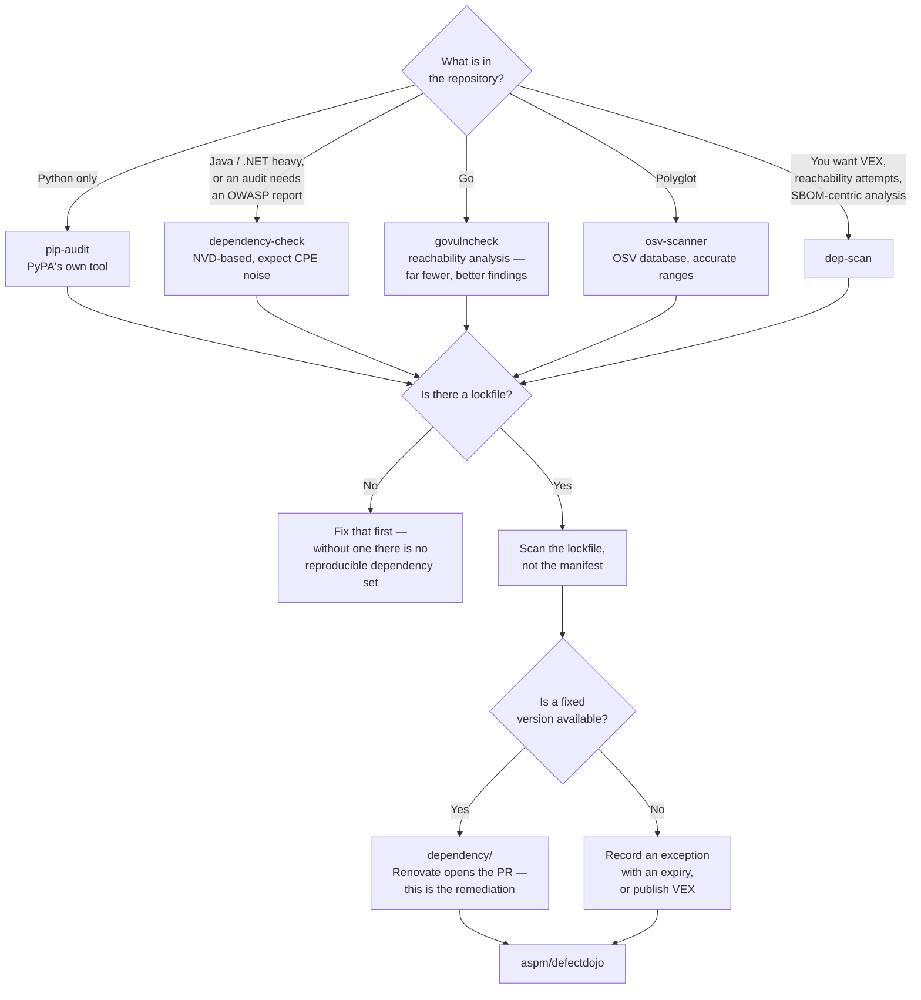

[← Code security](../README.md)

# SCA

Analysing the dependencies rather than the code. This is where most real vulnerabilities are,
and the only category with a mechanical fix.

Tools covered: [`osv-scanner`](osv-scanner/README.md) ·
[`dependency-check`](dependency-check/README.md) · [`dep-scan`](dep-scan/README.md) ·
[`pip-audit`](pip-audit/README.md)

## Contents

1. [SCA is not SAST](#1-sca-is-not-sast)
2. [Why this outranks almost everything else](#2-why-this-outranks-almost-everything-else)
3. [Transitive dependencies are the whole problem](#3-transitive-dependencies-are-the-whole-problem)
4. [Manifest, lockfile or binary — what you scan changes the answer](#4-manifest-lockfile-or-binary--what-you-scan-changes-the-answer)
5. [The databases underneath](#5-the-databases-underneath)
6. [Reachability, and why most findings do not matter](#6-reachability-and-why-most-findings-do-not-matter)
7. [The tools](#7-the-tools)
8. [Decision tree](#8-decision-tree)
9. [Anti-patterns](#9-anti-patterns)
10. [How this applies to pikakube](#10-how-this-applies-to-pikakube)

---

## 1. SCA is not SAST

The two are constantly conflated and they answer different questions:

| | [SAST](../sast/README.md) | **SCA** (this folder) |
|---|---|---|
| Input | your source code | your dependency manifests and lockfiles |
| Technique | analyse code for dangerous patterns | inventory packages, match versions against advisories |
| Finding | "this line concatenates user input into SQL" | "`log4j-core` 2.14.1 has CVE-2021-44228" |
| Ambiguity | high — is it reachable? sanitised? | low — the version is either affected or it is not |
| Fix | a human rewrites code | bump a version |
| Automation | none | almost complete — [`../dependency/README.md`](../dependency/README.md) |

The critical difference is the last two rows. **An SCA finding usually has a known, mechanical
fix**, which is why this capability pays back faster than any other in the tree.

Note also the relationship to container scanning:
[`../../3-container/scan/README.md`](../../3-container/scan/README.md) does the same kind of
matching against **OS packages in an image**. SCA does it against **application dependencies in
the source tree**. Same technique, different inventory, earlier in the lifecycle — and Trivy
happens to do both.

## 2. Why this outranks almost everything else

> **Most vulnerabilities in a typical application are in code nobody at your organisation wrote.**

A service is a modest amount of first-party logic on top of hundreds of transitive packages, and
that tree is where the CVEs are. Log4Shell, event-stream, ua-parser-js, xz-utils — none of them
were bugs in anybody's application.

Three practical consequences:

- **Do SCA before SAST.** More findings that matter, less ambiguity, and a fix path that can be
  automated.
- **The fix is a version bump**, which means [`../dependency/README.md`](../dependency/README.md)
  is not a separate concern. It is the remediation half of this folder.
- **Currency beats scanning.** A codebase whose dependencies are updated weekly has fewer
  findings than one that is scanned daily and never updated. Scanning tells you; updating fixes.

## 3. Transitive dependencies are the whole problem

You declared 20 dependencies. The lockfile resolved 800. The vulnerable one is at depth four,
pulled in by a package you have never heard of, via a package you chose deliberately.

That produces the two hardest questions in this folder:

- **"Why is this here?"** — every good tool answers with a dependency path. `npm ls <pkg>`,
  `mvn dependency:tree`, `pip show`, `go mod why`. Without the path, a finding is unactionable
  because you cannot tell what to change.
- **"Can I even fix it?"** — often you cannot upgrade the vulnerable package directly, because
  its version is pinned by an intermediate. The fix is upgrading the intermediate, or forcing a
  resolution override (`overrides` in npm, `dependencyManagement` in Maven, `resolutions` in
  Yarn) — which is a workaround with its own risk.

## 4. Manifest, lockfile or binary — what you scan changes the answer

| Input | What you learn | Caveat |
|---|---|---|
| **Manifest** (`package.json`, `pyproject.toml`, `pom.xml`) | declared ranges | ranges are not versions; the answer is approximate |
| **Lockfile** (`package-lock.json`, `poetry.lock`, `go.sum`) | exactly what resolves | **this is what to scan.** It is the actual dependency set |
| **Built artefact** (JAR, node_modules, site-packages) | what actually shipped | catches vendored and shaded dependencies that no manifest mentions |
| **SBOM** | a recorded inventory | only as accurate as its generator |

The rule: **scan the lockfile.** A repository with no lockfile has no reproducible dependency
set, and that is a problem to fix before scanning is meaningful.

The one thing lockfiles miss is **shading and vendoring** — a JAR with another library repackaged
inside it, or a Go binary with dependencies compiled in. Only artefact or binary scanning finds
those, which is why container image scanning remains complementary rather than redundant.

## 5. The databases underneath

Every tool here is a matcher on top of a vulnerability database, and the choice of database
explains most of the differences between them:

| Database | Character |
|---|---|
| **OSV** (osv.dev) | open, per-ecosystem, machine-readable version ranges. Aggregates GitHub Advisories, PyPA, RustSec, Go vulndb, and more. Designed for this job |
| **NVD** | comprehensive, authoritative, and CPE-based — matching a CPE string to a package name is imprecise, producing both false positives and misses |
| **GitHub Security Advisories** | good ecosystem coverage, curated, fast to publish |
| Ecosystem-specific (PyPA, RustSec, Go vulndb) | highest quality within their language, narrow by definition |

The CPE problem is the reason NVD-based tools are noisier. A CPE is a product identifier designed
for commercial software; mapping "npm package `express`" onto it is guesswork, and the guesses go
both ways. OSV was built specifically to fix this by keying on ecosystem plus package name plus
version range.

## 6. Reachability, and why most findings do not matter

A CVE in a package you depend on is only a risk if the vulnerable **function** is actually
called. In practice most are not — the vulnerability is in a code path your application never
touches.

Tools are beginning to address this and the results are dramatic where it works:

- **`govulncheck`** (Go) is the best example: it analyses the call graph and reports only
  vulnerabilities reachable from your code. It routinely cuts a list of 40 findings to 2.
- Commercial SCA products offer reachability with varying rigour.
- For most ecosystems it is still immature or absent.

Until it is universal, expect the same problem described in
[`../../3-container/scan/README.md`](../../3-container/scan/README.md): a long list, mostly
irrelevant, and a policy that must be designed so the relevant items are not buried.

## 7. The tools

| Tool | Scope | Database | Where it shines | Detail |
|---|---|---|---|---|
| **osv-scanner** | multi-ecosystem, plus lockfiles, SBOMs and container images | **OSV** | the modern default: accurate ranges, low noise, a single Go binary, from Google | [→](osv-scanner/README.md) |
| **dependency-check** | Java and .NET primarily, others partially | **NVD** (CPE) | the long-standing OWASP tool; the one auditors recognise, and strong on Java | [→](dependency-check/README.md) |
| **dep-scan** | multi-ecosystem, SBOM-centric | OSV and others | richer analysis — reachability attempts, VEX output, container and IaC coverage | [→](dep-scan/README.md) |
| **pip-audit** | **Python only** | PyPA advisory database + OSV | the Python-native tool, from PyPA itself; trivial to add to a Python project | [→](pip-audit/README.md) |

**osv-scanner is the sensible default** for a polyglot repository. **pip-audit** if the repository
is Python. **dependency-check** where Java is dominant or where an OWASP-branded report is the
requirement. **dep-scan** when you want more than matching.

Worth naming even though they are not in this folder: **`govulncheck`** for Go (reachability, as
above), **`npm audit`** / **`yarn audit`** (built in, convenient, noisy), and **Trivy**, which
also scans lockfiles and is already deployed in this repository —
[`../../3-container/scan/trivy/README.md`](../../3-container/scan/trivy/README.md).

## 8. Decision tree

## 9. Anti-patterns

| Anti-pattern | Why it is bad | What to do instead |
|---|---|---|
| Scanning the manifest instead of the lockfile | version ranges are not resolved versions; the result is approximate | scan the lockfile |
| Scanning without automated updating | you produce a growing list of findings with no remediation path | pair with [`../dependency/README.md`](../dependency/README.md) |
| Blocking every build on any CVE | most are unreachable or unfixable, so the gate gets bypassed | gate on fixable high/critical; report the rest |
| Ignoring transitive dependencies because "we did not choose them" | that is where the vulnerabilities are | trace the path, upgrade the intermediate, or override the resolution |
| Adopting SAST first | fewer real findings, more ambiguity, no mechanical fix | SCA first |
| Treating NVD severity as risk | CVSS is a property of the vulnerability, not of your exposure | reachability and context; `govulncheck` where available |
| No lockfile at all | every build resolves differently; scanning cannot mean anything | commit a lockfile |
| Permanent, undated exceptions | never revisited, and the fix eventually exists without anyone noticing | expiry dates on every exception |

## 10. How this applies to pikakube

Nothing here is deployed, but the remediation half already is: **Renovate** is set up in
[`../dependency/renovate/README.md`](../dependency/renovate/README.md). That ordering is unusual
and it is the right way round — keeping dependencies current prevents findings that scanning
would only report.

What this repository actually has to scan is worth being honest about. It is mostly Kubernetes
manifests, Helm values and documentation, so there is little in the way of application lockfiles.
The dependency risk here is a different shape:

| What | Risk | Covered by |
|---|---|---|
| Helm chart versions | an old chart with a vulnerable image | Renovate, plus [`../dependency/nova/README.md`](../dependency/nova/README.md) |
| Container image tags in HelmReleases | the image, not a lockfile | [`../../3-container/scan/README.md`](../../3-container/scan/README.md) — Trivy Operator, already deployed |
| GitHub Actions versions | a compromised or outdated action | Renovate, plus [`../pipeline/zizmor/README.md`](../pipeline/zizmor/README.md) |
| Python or Go tooling, if it grows | ordinary SCA | osv-scanner or pip-audit |

So the practical position: **osv-scanner is the tool to reach for if and when first-party code
with lockfiles appears here.** Until then, the dependency risk in this repository is charts,
images and actions — and all three are already being kept current by Renovate, which is the
better half of the problem.

---

[← Code security](../README.md)
