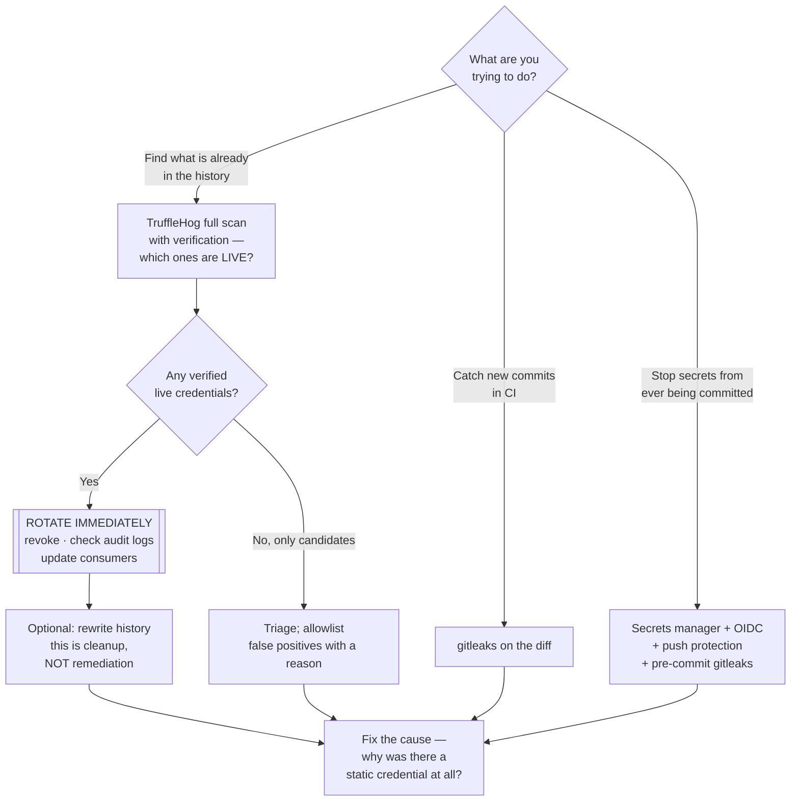

[← Code security](../README.md)

# Secret scanning

Finding credentials committed to Git. The only category in this tree where the fix is not
"change the code" — it is "rotate the credential", and nothing else counts.

Tools covered: [`gitleaks`](gitleaks/README.md) · [`trufflehog`](trufflehog/README.md) ·
[`git-secrets`](git-secrets/README.md)

## Contents

1. [The point everyone gets wrong](#1-the-point-everyone-gets-wrong)
   - [Why history rewriting is not remediation](#why-history-rewriting-is-not-remediation)
2. [Three places to scan, doing three different jobs](#2-three-places-to-scan-doing-three-different-jobs)
3. [Detection: entropy, patterns, and verification](#3-detection-entropy-patterns-and-verification)
4. [The tools](#4-the-tools)
5. [Prevention beats detection](#5-prevention-beats-detection)
6. [The incident runbook](#6-the-incident-runbook)
7. [Decision tree](#7-decision-tree)
8. [Anti-patterns](#8-anti-patterns)
9. [How this applies to pikakube](#9-how-this-applies-to-pikakube)

---

## 1. The point everyone gets wrong

> **A secret committed to Git is compromised from the moment it is pushed. Deleting the commit
> does not undo it.**

This is the single most important sentence in this folder, and the instinct it contradicts —
"quick, remove the commit before anyone sees" — is universal.

Git history is **distributed**. By the time the scanner reports it, the value plausibly exists in:

| Where | Why you cannot clean it |
|---|---|
| Every clone on every developer machine | you do not control those repositories |
| Every fork | forks keep the objects; on GitHub, even after the original commit is deleted, the object can remain reachable through the fork network |
| CI caches and build logs | separate storage, separate retention |
| Mirrors, backups, artefact caches | by design, they preserve what you pushed |
| Your Git host's internal storage | garbage collection is theirs to schedule, not yours |
| **Scrapers**, if the repository was ever public | credentials in public repositories are harvested within **seconds to minutes**, automatically, by systems that exist solely for this |

That last row is not hypothetical. Public-repository scraping for AWS keys, API tokens and
database credentials is fully automated and continuous. The window between push and exploitation
is measured in minutes.

### Why history rewriting is not remediation

Rewriting history with `git filter-repo` or BFG changes **your copy**. It does not reach any of
the rows above, it forces every collaborator to re-clone, and it breaks every existing pull
request and commit reference.

It is worthwhile as **cleanup** — so the secret is not re-discovered in a year and re-triaged, and
so the repository can be made public later. It is not the fix.

**Rotate. Always rotate. Rotate first.**

## 2. Three places to scan, doing three different jobs

These are complementary, not alternatives, and confusing them is why programmes have gaps:

| Where | Catches | Misses | Cost |
|---|---|---|---|
| **Pre-commit hook** | the secret **before it exists in history** — the only place a secret can still be un-leaked | anything from a developer who skipped the hook, or committed with `--no-verify` | fast, local, and trivially bypassable |
| **CI, on the diff** | anything that reached the remote, per push | nothing new, but it is already too late for that value | reliable, enforced, and always after the fact |
| **Full history scan** | secrets committed months or years ago that nobody scanned for | nothing — it is the complete picture | slow; run once at adoption, then periodically |

The sequencing that works: **run a full history scan once** to find out what you already have and
rotate it, then run **pre-commit** for prevention and **CI** for enforcement.

The full history scan is the step teams skip, and it is the one that finds the actually dangerous
material — the AWS key committed in 2021 by someone who has left, still valid, in a repository
nobody has audited.

## 3. Detection: entropy, patterns, and verification

Three techniques, in increasing order of usefulness:

| Technique | How | Weakness |
|---|---|---|
| **Regex patterns** | match known credential shapes — `AKIA…` for AWS, `ghp_…` for GitHub, `-----BEGIN … PRIVATE KEY-----` | only finds formats someone wrote a rule for; misses your internal token format |
| **Entropy** | flag high-randomness strings | catches unknown formats, and also catches every hash, UUID, base64 blob and minified asset. Noisy |
| **Verification** | take the candidate credential and **call the provider's API** to see whether it is live | requires network access and provider support — and it is the technique that changes everything |

Verification deserves emphasis because it inverts the triage problem. Without it, a scan produces
hundreds of candidates and someone has to guess which are real. With it, the output splits into
"verified live credential — this is an incident right now" and "everything else". TruffleHog's
verification against hundreds of providers is the clearest example, and it is the main reason to
choose it for an initial audit.

## 4. The tools

| Tool | Approach | Where it shines | Do not use when | Detail |
|---|---|---|---|---|
| **gitleaks** | regex plus entropy, with a good default rule set | the default: fast, one Go binary, excellent full-history scanning, first-class pre-commit and CI integration, `.gitleaksignore` and inline allowlisting | you need to know which findings are live credentials | [→](gitleaks/README.md) |
| **TruffleHog** | detectors plus **live verification** against provider APIs | the initial audit, and incident response — "which of these are actually valid right now" is the question that matters | you want a purely offline scan, or minimal runtime | [→](trufflehog/README.md) |
| **git-secrets** | regex, in a pre-commit hook | AWS-focused prevention; simple, tiny, and it is where the pattern started. **Effectively unmaintained** — see its page | as your primary scanner today | [→](git-secrets/README.md) |

A workable combination: **gitleaks in pre-commit and CI** for continuous coverage, **TruffleHog
for the one-off full-history audit** and whenever a finding needs verifying. Plus your Git host's
own secret scanning — GitHub's push protection is free, requires no configuration, and catches a
meaningful fraction before the push completes.

## 5. Prevention beats detection

Every finding in this folder represents a process that already failed. The controls that stop
secrets reaching Git at all:

| Control | Effect |
|---|---|
| **A secrets manager, and no secrets in the repository at all** | External Secrets Operator or the Secrets Store CSI Driver, pulling from Vault or a cloud provider — `security/2-cluster/secrets/` |
| **SOPS or age-encrypted files** | encrypted values *can* live in Git safely; that is the whole point of the pattern |
| **Short-lived, federated credentials** | OIDC from CI to the cloud provider means there is no static key to commit. This eliminates the category rather than defending against it |
| **Push protection at the Git host** | GitHub blocks the push when a recognised secret is detected — the only control that acts before the value leaves the machine |
| **`.gitignore` for `.env` and credential files** | crude, and it prevents a large share of real incidents |
| **Pre-commit hooks** | fast local feedback, bypassable, still worth it |

The strongest of these by a distance is the third. A CI pipeline that assumes an OIDC-federated
role has no long-lived credential to leak; the whole class of incident stops being possible.

## 6. The incident runbook

When a real secret is found, in this order, and the order matters:

1. **Rotate the credential.** Before anything else. Before telling anyone, before cleaning
   history, before writing the post-mortem.
2. **Revoke the old value explicitly** where the provider supports it. Rotation without
   revocation leaves the old key valid.
3. **Check for use.** CloudTrail, audit logs, provider access logs — assume it was used until the
   logs say otherwise, particularly if the repository was ever public.
4. **Find every place it was consumed** and update them, or you have caused an outage instead of
   an incident.
5. **Then**, optionally, rewrite history — cleanup, not remediation.
6. **Fix the cause.** Why was a static credential needed at all? Section 5 is usually the answer.

## 7. Decision tree

## 8. Anti-patterns

| Anti-pattern | Why it is bad | What to do instead |
|---|---|---|
| Deleting the commit and considering it handled | the value exists in clones, forks, caches and scrapers | rotate; history rewriting is cleanup only |
| Rotating "later" | public-repository credentials are harvested in minutes | rotate first, investigate second |
| Only scanning new commits | the dangerous material is the key committed three years ago and still valid | full-history scan at adoption |
| Only a pre-commit hook | `--no-verify` exists, and not every developer installs hooks | pair with CI enforcement |
| Ignoring findings because "it is only staging" | staging credentials frequently reach production data, and always reveal structure | rotate anyway |
| A blanket allowlist to silence noise | real findings get silenced along with the noise | targeted allowlist entries with a reason |
| Static cloud keys in CI at all | the whole category is avoidable | OIDC federation to a role |
| Committing an encrypted file and treating it as a secret leak | SOPS/age-encrypted values in Git are the intended pattern | know which is which before triggering an incident |

## 9. How this applies to pikakube

Nothing here is deployed, and this is the **highest-priority gap in
[`../README.md`](../README.md)** — because it is the one failure mode that cannot be fixed
retroactively. Every other finding in this tree can be remediated next sprint. A leaked
credential cannot be un-leaked.

Three steps, in order, each cheap:

1. **A full-history scan, once.** TruffleHog with verification against this repository's entire
   history. It either finds nothing — good, and now you know — or it finds something that needed
   rotating months ago.
2. **gitleaks in pre-commit and in CI.** One hook, one workflow step.
3. **Push protection** at the Git host, which is free and needs no tooling of your own.

Two things specific to this repository are worth checking during the first scan. Its content is
Flux manifests and Helm values, and **Helm values files are a classic place for a credential to be
typed inline** — a database password, a registry credential, an API token in a chart's values.
Second, the manifests here reference AWS IAM roles and account identifiers; the account number
already appears redacted as `xxxxxxx` in
[`../../3-container/scan/trivy/helm/README.md`](../../3-container/scan/trivy/helm/README.md),
which suggests the question has been thought about at least once.

The structural answer sits outside this folder: `security/2-cluster/secrets/` is where the
"credentials never appear in Git in the first place" pattern belongs, and it is a better
investment than any scanner here.

---

[← Code security](../README.md)
