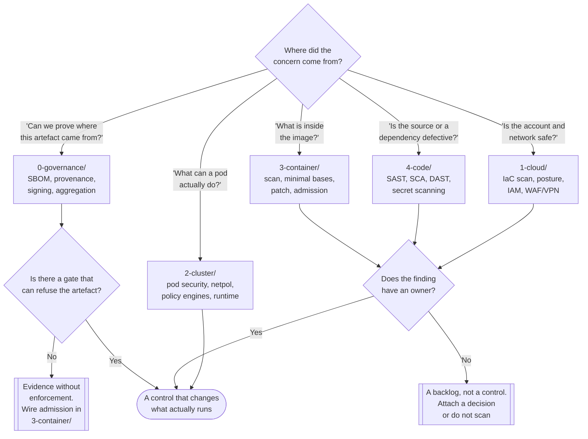

[← infrastructure/](../)

# Security

Five rings around the same workload, ordered from the outside in — the policy that decides
what may run, the account it runs in, the cluster that schedules it, the image it runs from,
and the source it was built from.

Capabilities: [`0-governance/`](0-governance/README.md) · [`1-cloud/`](1-cloud/README.md) ·
[`2-cluster/`](2-cluster/README.md) · [`3-container/`](3-container/README.md) ·
[`4-code/`](4-code/README.md)

## Contents

1. [The ordering — outermost to innermost](#1-the-ordering--outermost-to-innermost)
   - [Why the folders are numbered](#why-the-folders-are-numbered)
   - [The layers](#the-layers)
2. [Defence in depth, stated properly](#2-defence-in-depth-stated-properly)
   - [What each layer catches that the others cannot](#what-each-layer-catches-that-the-others-cannot)
   - [The same tool appears at more than one layer](#the-same-tool-appears-at-more-than-one-layer)
3. [Shift left is a scheduling claim, not a security one](#3-shift-left-is-a-scheduling-claim-not-a-security-one)
4. [Finding vs enforcement](#4-finding-vs-enforcement)
5. [Decision tree](#5-decision-tree)
6. [Anti-patterns](#6-anti-patterns)
7. [Notes](#7-notes)
8. [How this applies to pikakube](#8-how-this-applies-to-pikakube)

---

## 1. The ordering — outermost to innermost

### Why the folders are numbered

The numbers are not a priority list and not a reading order. They are a **position in
space**: each folder is one ring further inside than the one before it.

```
0-governance   the rules, and the provenance of what is about to run
  1-cloud        the account and the network the cluster lives in
    2-cluster      Kubernetes itself — API, workloads, secrets, runtime
      3-container    the image that gets pulled
        4-code         the source it was built from
```

Two properties make this ordering worth keeping:

- **An attacker travels it inwards, and so does a defender's blast radius.** A compromised
  dependency (4) becomes a compromised image (3), which becomes a compromised pod (2),
  which becomes compromised cloud credentials (1). Every ring you place a control on is a
  ring where that chain can stop.
- **Each ring can only see its own concerns.** A SAST scanner cannot know the pod runs
  privileged. An admission controller cannot know the code has a SQL injection. Neither can
  tell you the S3 bucket is public. There is no single layer that covers the others, which
  is the entire argument for having five.

The layer numbered **0** sits outside the infrastructure altogether, on purpose. Governance
is not a thing that runs in a cluster — it is the policy, the supply-chain evidence and the
audit trail that decide whether anything *should* run. It is the only layer whose output is
consumed by all the others.

### The layers

| # | Folder | The question it answers | Runs at | If this layer is missing |
|---|---|---|---|---|
| **0** | [`0-governance/`](0-governance/README.md) | is this artefact what it claims to be, and are we allowed to run it? | build time and continuously | you run software of unknown origin and find out about vulnerabilities from the news |
| **1** | [`1-cloud/`](1-cloud/README.md) | is the account, the IAM and the network around the cluster sane? | provisioning and continuously | the cluster is hardened inside a wide-open VPC with an over-permissive role |
| **2** | [`2-cluster/`](2-cluster/README.md) | who can talk to the API, what may a pod do, and what is happening right now? | admission and runtime | one compromised pod reaches every other pod and the API server |
| **3** | [`3-container/`](3-container/README.md) | what is in the image, and may this specific image run? | build time and admission | you ship a base image with 300 CVEs and no gate stops it |
| **4** | [`4-code/`](4-code/README.md) | is the source itself defective, and are its dependencies? | commit and pull request | the vulnerability was introduced by a human and nothing looked at it |

The contents of each, in one line:

| # | What is inside |
|---|---|
| 0 | supply chain (SBOM, provenance, signing, aggregation, licences), CNAPP, SIEM, compliance baselines, CI runner hardening |
| 1 | IaC scanning, cloud posture scanning, IAM, cloud policies, network edge — WAF, NGFW, IPS, VPN |
| 2 | certificates and PKI, secrets, identity and access, network policies, pod security, admission policy engines, posture (CIS), runtime security, attack-path analysis, audit |
| 3 | image scanning, minimal and hardened base images, image patching, container posture, **admission** — the layer that enforces what 0-governance produced |
| 4 | SAST, SCA, DAST, API testing, secret scanning, dependency updates, fuzzing, CI pipeline linting, ASPM aggregation |

## 2. Defence in depth, stated properly

"Defence in depth" is usually said as *more layers is safer*, which is close to meaningless.
The precise version is:

> **No single control is trusted to be correct, so controls are placed such that the failure
> of any one of them does not by itself produce a breach.**

That has a practical consequence people skip: layers only add depth when they fail
*independently*. Three scanners that all read the same CVE feed are one layer wearing three
hats. A scanner (4-code), a signature check (0-governance enforced at 3-container), and a
runtime syscall monitor (2-cluster) fail for genuinely different reasons — that is depth.

### What each layer catches that the others cannot

| Scenario | Caught only by |
|---|---|
| A dependency is typosquatted and pulled at build time | 4-code SCA, and 0-governance provenance if the build itself was tampered with |
| The base image ships a vulnerable OpenSSL | 3-container scanning |
| The image is legitimate but nobody signed it — someone pushed to the registry directly | 0-governance signing, enforced by 3-container admission |
| A pod requests `hostPID: true` | 2-cluster pod security / policy engine |
| A running container spawns a shell and starts scanning the network | 2-cluster runtime security |
| The node role can read every S3 bucket in the account | 1-cloud IAM and posture |
| A CVE is disclosed six weeks after the image was built and scanned clean | 0-governance aggregation — nothing else re-evaluates a past artefact |

That last row is the one that most platforms genuinely lack, and it is why
[`0-governance/supply-chain/aggregation/`](0-governance/supply-chain/aggregation/README.md)
exists as its own capability rather than as a footnote to scanning.

### The same tool appears at more than one layer

This is deliberate and not duplication. `checkov` appears under `1-cloud/iac/` and under
`2-cluster/manifest-scan/` because scanning Terraform and scanning a Deployment are different
jobs with different rule sets, different owners and different failure modes — the shared
binary is an implementation detail. Classify by **the problem being solved at that ring**,
never by the vendor.

## 3. Shift left is a scheduling claim, not a security one

Moving a check earlier makes it **cheaper**, not stronger. A finding at commit time costs a
developer five minutes; the same finding in production costs an incident. That is a real and
large win, and it is the whole argument for 4-code and 3-container running in CI.

What it is not: a reason to remove the late control. Every early check shares one weakness —
it evaluates the artefact **as it was at build time**, against **the knowledge available at
build time**. Both of those go stale. Runtime security and continuous SBOM monitoring exist
precisely because the early checks were correct when they ran and are no longer.

The honest framing: shift left to reduce cost, keep the right-hand controls to reduce risk.
A platform that only shifted left has optimised its feedback loop and not its security.

## 4. Finding vs enforcement

Almost every tool in this discipline falls into one of two categories, and confusing them is
the most common way a security programme produces a lot of activity and no change in
behaviour.

| | **Finding** | **Enforcement** |
|---|---|---|
| Output | a report, a dashboard, a list | an allow or a deny |
| Examples | Trivy, Semgrep, Prowler, kube-bench, Scorecard | Kyverno, Gatekeeper, admission controllers, network policies |
| Failure mode | ignored | breaks a deploy |
| Value over time | decays as the list grows | constant |

Both are needed. But a finding tool with nobody assigned to its output is theatre, and the
backlog it produces makes the *next* finding harder to see. The rule worth holding: a scanner
is only worth turning on if there is a decision attached to its result — fail the build,
block admission, open a ticket with an owner. Otherwise it is a metric that only goes up.

## 5. Decision tree



## 6. Anti-patterns

| Anti-pattern | Why it is bad | What to do instead |
|---|---|---|
| Scanners everywhere, gates nowhere | produces a growing list that nobody can act on, and the list itself hides the findings that matter | every scanner gets a decision — fail, block, or a ticket with an owner |
| Treating "shift left" as a replacement for runtime controls | build-time checks judge the artefact against yesterday's knowledge; new CVEs and live behaviour are invisible to them | keep runtime security and continuous SBOM monitoring |
| Signing images and never verifying them | a signature nobody checks is a build step that costs time and buys nothing | admission enforcement in [`3-container/`](3-container/README.md) |
| Generating SBOMs and storing them in the build artefact | an SBOM is only useful when something queries it against new disclosures | feed [`aggregation/`](0-governance/supply-chain/aggregation/README.md) |
| Hardening the cluster inside an unhardened account | a permissive node role or an open security group makes 2-cluster work irrelevant | 1-cloud first, or at least in parallel |
| Classifying folders by vendor rather than by problem | one tool spans several rings; a vendor-shaped tree hides which ring is uncovered | classify by the question being answered at that layer |
| Three tools reading the same CVE feed, called "defence in depth" | correlated failure — they are wrong about the same things at the same time | layers that fail independently: static, provenance, runtime |
| `insecureSkipVerify`, `--insecure`, `imagePullPolicy` pinned to a mutable tag | each quietly removes the verification the layer exists to provide | see [`2-cluster/certificates/`](2-cluster/certificates/README.md) and digest pinning |
| Compliance benchmark as the definition of "secure" | CIS is a floor, not a threat model; passing it says nothing about your actual exposure | use benchmarks as a baseline, then reason about your own attack paths |
| Security tooling adopted all at once | ten new dashboards, no owners, and the discipline gets a reputation | one layer at a time, each with an enforcement point before the next is added |

## 7. Notes

Original notes recorded at the root of this discipline, and what each is for:

> <https://github.com/juice-shop/juice-shop>
> <https://github.com/madhuakula/kubernetes-goat>

Two **deliberately vulnerable targets**. OWASP Juice Shop is a web application seeded with
the whole OWASP Top 10 — the standard target for exercising DAST, API scanning and WAF rules
without pointing them at something real. Kubernetes Goat is its cluster-level counterpart: a
set of intentionally misconfigured workloads (privileged pods, exposed dashboards, leaked
secrets, container escapes) used to check that runtime security and policy engines actually
fire. Their value here is validation: a security control that has never produced a true
positive has not been proven to work, and these are how you produce one on purpose.

> <https://github.com/confidential-containers/confidential-containers>
> <https://github.com/ContainerSSH/ContainerSSH>

Two adjacent projects that do not fit cleanly into any of the five rings. **Confidential
Containers** runs workloads inside hardware-backed trusted execution environments (SEV-SNP,
TDX), so the memory of a pod is opaque even to the node's kernel and to the cloud operator —
it defends against the *host*, which is a threat model none of the five layers addresses.
**ContainerSSH** is an SSH server that gives each connection its own ephemeral container
rather than a shell on a shared host; it is a way to give humans access without giving them
a machine, and it belongs near identity and audit rather than near any scanner.

> <https://github.com/OWASP/Top10>
> <https://github.com/OWASP/API-Security>
> <https://github.com/OWASP/CheatSheetSeries>

The reference material behind most of what 4-code checks. The **Top 10** is the risk
taxonomy that SAST and DAST rules are organised around; **API Security** is the separate
Top 10 for APIs, where the dominant risks are authorisation flaws (BOLA, broken function
level authorisation) that generic web scanners are structurally bad at finding; the **Cheat
Sheet Series** is the remediation half — the concrete how-to for each risk. Worth knowing
these are *taxonomies*, not tools: they tell you what to look for and give findings a shared
vocabulary, which is what makes results from different scanners comparable.

## 8. How this applies to pikakube

This is a **mapped discipline with one deep vertical**. The tree covers all five rings and
roughly a hundred tools; the documented depth is concentrated in one place.

**The reference example: [`2-cluster/certificates/`](2-cluster/certificates/README.md).** Seven
READMEs — the capability plus `openssl`, `certbot`, `mkcert`, `step-ca`, `cert-manager` and
`trust-manager`. It is the standard of depth for this discipline: it separates the two
problems everyone conflates (issuance vs trust), explains why a local cluster is necessarily
a private-CA scenario, covers the managed cloud services and their decisive constraint
(non-exportable keys), and records the failure modes rather than the feature lists. When in
doubt about how much detail a folder here deserves, that is the answer.

**What is actually deployed.** Very little of this discipline runs. There are Flux
`HelmRelease` definitions under `0-governance/` for StackRox, ThreatMapper, Dependency-Track
and GUAC — most of them with empty `values:` blocks, which means they are staged rather than
configured. The certificates story is the one with a live artefact: a `mkcert` wildcard for
`*.127.0.0.1.nip.io` loaded into the `ingress-nginx` namespace.

**The gap worth naming.** The supply-chain chain of custody is mapped end to end — SBOM,
provenance, signing, aggregation — and its last link is not wired. Cosign signing is
documented with real commands run against a real image; nothing in
[`3-container/admission/`](3-container/README.md) verifies those signatures at admission
time. Until that gate exists, every step before it is documentation. That is the single
highest-value change available in this discipline, and it is a policy manifest, not a new
platform.

**Ordering for a local cluster.** Ring 1 is mostly not applicable — there is no cloud
account. That makes 0, 2, 3 and 4 the live ones, and it makes the numbering a little
lopsided here, which is fine: the folder documents the solution space, not just what this
cluster runs.

---

[← infrastructure/](../)
