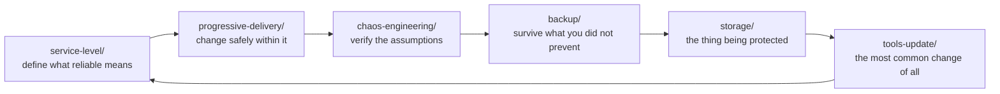

# Site Reliability Engineering

Keeping the platform available, recoverable and safe to change.

## How this folder is organised

One axis: **capability**. Each subfolder answers a distinct question, and a tool is filed by
**where it shines** rather than by everything it can do.

## The map

| Folder | The question it answers |
|---|---|
| [`storage/`](storage/README.md) | where does persistent data live, and what happens when a node dies? |
| [`backup/`](backup/README.md) | can we get it back? |
| [`service-level/`](service-level/README.md) | what does "reliable enough" mean, numerically? |
| [`progressive-delivery/`](progressive-delivery/README.md) | how do we release without betting everything on one deploy? |
| [`chaos-engineering/`](chaos-engineering/README.md) | does resilience work, or do we only believe it does? |
| [`lifecycle-orchestration/`](lifecycle-orchestration/README.md) | how does a change move through environments? |
| [`tools-update/`](tools-update/README.md) | how do we keep the platform current without breaking it? |

## The through-line

These are not seven unrelated concerns. They form one loop:

Read in that order, each folder answers the question the previous one raises:

- **service-level** defines the budget. Without a number, "reliable" is an opinion, and every argument about risk is unresolvable.
- **progressive-delivery** spends that budget deliberately — a canary is an error budget being consumed on purpose, in a controlled way.
- **chaos-engineering** tests whether the resilience you believe in is real. Almost every organisation discovers its backups do not restore during an incident rather than during a drill.
- **backup** is the floor beneath all of it. Prevention fails eventually.
- **storage** is what backup exists to protect, and the layer where "it worked on the node" stops being enough.
- **tools-update** is where most self-inflicted outages actually come from, which is why it is a capability here rather than a chore.

## What is deliberately not here

| Concern | Where |
|---|---|
| Metrics, logs, traces, alerting | [`observability/`](../observability/README.md) |
| Incident response and on-call | [`observability/incident-management/`](../observability/incident-management/README.md) |
| Cost and right-sizing | [`finops/`](../finops/) |
| GitOps delivery mechanics | [`platform-engineering/gitops/`](../platform-engineering/gitops/) |
| Network resilience and failover | [`network/load-balancer/k8gb/`](../network/load-balancer/k8gb/README.md) |

The split with `observability/` is worth stating: that folder **tells you** something is wrong,
this one is about the system being able to **survive** it.

## How this applies to pikakube

**Velero** is the one with real operational depth recorded — including the Strimzi restore
procedure and a list of open issues worth reading before trusting it.

**[`tools-update/`](tools-update/README.md)** is the most transferable artefact in the folder:
a real update procedure with tools classified by upgrade risk, from an actual platform rather
than from a template.

The rest is mapped: a single ephemeral Kind cluster has no SLO to defend, no chaos worth
injecting, and storage that disappears with the cluster.
