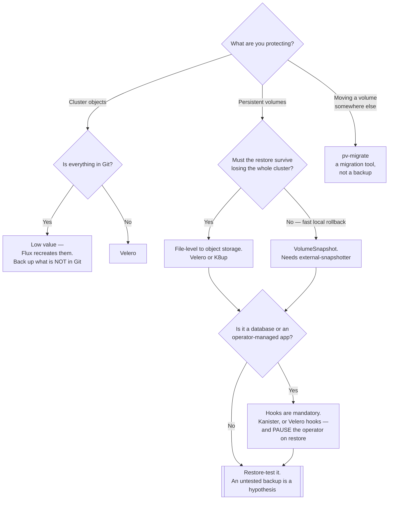

[← Site Reliability Engineering](../README.md)

# Backup

The floor beneath everything else. Prevention fails eventually.

Tools covered: [`velero`](velero/README.md) · [`k10`](k10/README.md) · [`kanister`](kanister/README.md) ·
[`k8up`](k8up/README.md) · [`stash`](stash/README.md) · [`volsync`](volsync/README.md) · [`gemini`](gemini/README.md) ·
[`external-snapshotter`](external-snapshotter/README.md) · [`pv-migrate`](pv-migrate/README.md)

## Contents

1. [What actually needs backing up](#1-what-actually-needs-backing-up)
2. [Two mechanisms, and why it matters](#2-two-mechanisms-and-why-it-matters)
3. [Application consistency is the hard part](#3-application-consistency-is-the-hard-part)
4. [The tools](#4-the-tools)
5. [Decision tree](#5-decision-tree)
6. [Anti-patterns](#6-anti-patterns)
7. [How this applies to pikakube](#7-how-this-applies-to-pikakube)

---

## 1. What actually needs backing up

Three different things, and they are frequently confused:

| What | Where it lives | Recovered by |
|---|---|---|
| **Cluster objects** | etcd — Deployments, Services, ConfigMaps, CRDs | GitOps, mostly. If everything is in Git, this is the least valuable backup you have |
| **Persistent volumes** | the storage layer | the tools in this folder |
| **Application state** | inside a database, mid-transaction | a database-aware backup, not a volume snapshot |

The first row is worth pausing on. In a GitOps repository, backing up Deployments is close to
pointless — Flux recreates them. What is **not** in Git is the data, and that is where the
effort belongs.

The exception: things created outside Git. Secrets generated by an operator, a `PersistentVolumeClaim`
bound to real data, resources a controller created. Those are not reproducible from the
repository, and they are precisely what people discover missing during a restore.

## 2. Two mechanisms, and why it matters

| | Volume snapshot | File-level backup |
|---|---|---|
| How | the storage layer snapshots the volume, via CSI | files are read and copied to object storage |
| Speed | fast — often instantaneous | proportional to data size |
| Portability | usually **tied to the storage provider** | portable anywhere |
| Cross-cluster restore | often not possible | yes |
| Requires | a CSI driver with snapshot support, plus [external-snapshotter](external-snapshotter/README.md) | nothing special |

This decides whether a restore is possible at all in the case people actually care about:
**the cluster is gone**. Snapshots that live in the same storage account as the volume do not
survive losing it.

The rule that follows: **snapshots for speed, file-level for disaster recovery.** Most serious
setups use both, for different scenarios.

## 3. Application consistency is the hard part

A volume snapshot captures bytes on a disk at a moment. For a database that may be a
half-written page and an in-flight transaction — restorable in the sense that it comes back,
and corrupt in the sense that it does not work.

That is what **hooks** exist for: freeze the application, flush to disk, snapshot, unfreeze.
Velero calls them backup hooks; Kanister builds its whole model around them.

For a data platform this is the difference that matters. PostgreSQL, Kafka and Elasticsearch
all need a coordinated action, and a volume snapshot without one is a backup that looks fine
until the day it is needed.

The operator complication, recorded concretely in [velero](velero/README.md): restoring a PVC that an
operator manages means **pausing the operator first**, or it recreates an empty one before the
restore lands.

## 4. The tools

| Tool | Model | Shines when | Do not use when | Detail |
|---|---|---|---|---|
| **Velero** | cluster objects + volumes, snapshot or file-level | **the default** — CNCF, cross-cluster restore, hooks, broad provider support | you need deep per-application logic | [→](velero/README.md) |
| **Kanister** | application-centric blueprints | databases need bespoke, correct backup logic | simple volume backup is enough | [→](kanister/README.md) |
| **K10** | commercial platform (Veeam Kasten) | you want a supported product with a UI and policy management | open source is a requirement | [→](k10/README.md) |
| **K8up** | Restic-based, CRD-driven | you want simple scheduled backups to object storage | cluster-object backup matters too | [→](k8up/README.md) |
| **VolSync** | asynchronous volume replication | **replicating** volumes between clusters, not just backing them up | you want point-in-time restore semantics | [→](volsync/README.md) |
| **Stash** | volume backup by AppsCode | already in that ecosystem | choosing fresh — check its licensing first | [→](stash/README.md) |
| **Gemini** | scheduled VolumeSnapshots, by Fairwinds | you want snapshot scheduling and nothing more | you need off-cluster copies | [→](gemini/README.md) |
| **external-snapshotter** | the CSI snapshot controller | **required infrastructure**, not a choice — snapshots do not work without it | — | [→](external-snapshotter/README.md) |
| **pv-migrate** | one-off volume copy between PVCs | migrating between storage classes or clusters | as a backup tool; it is a migration utility | [→](pv-migrate/README.md) |

**external-snapshotter is not an alternative to the others.** It is the controller that makes
`VolumeSnapshot` work at all, and its absence produces the exact error recorded in
[volsync](volsync/README.md).

## 5. Decision tree

## 6. Anti-patterns

| Anti-pattern | Why it is bad | What to do instead |
|---|---|---|
| Never testing a restore | you discover it does not work during the incident | scheduled restore drills — this is what [chaos-engineering](../chaos-engineering/README.md) is for |
| Snapshots in the same account as the volume | losing the account loses both | off-cluster, off-account copies |
| Volume snapshot of a database with no hook | restores to a corrupt state that looks like a successful backup | freeze/flush hooks, or a database-native dump |
| Restoring a PVC without pausing the operator | it recreates an empty volume before the restore lands | scale the operator to zero first |
| Backing up everything indiscriminately | cost and duration grow until backups stop completing in the window | back up what is not reproducible from Git |
| No documented RTO/RPO | "we have backups" is not a recovery objective | state both, then verify them |
| Retention that never expires | storage grows forever and old backups are never useful | lifecycle policy on the bucket too |

## 7. How this applies to pikakube

**Velero** is the one documented in depth, and its README carries real operational knowledge
rather than links: the **Strimzi restore procedure** — scale `strimzi-cluster-operator` to zero
so it does not recreate the PVC — plus a list of open issues worth reading before depending on
it.

That operator-pause detail generalises to every operator-managed workload, which is why it is
called out in §3 rather than left in one tool's notes.

Nothing is deployed here: a Kind cluster's volumes disappear with the cluster, so there is
nothing whose loss would matter.

---

[← Site Reliability Engineering](../README.md)
