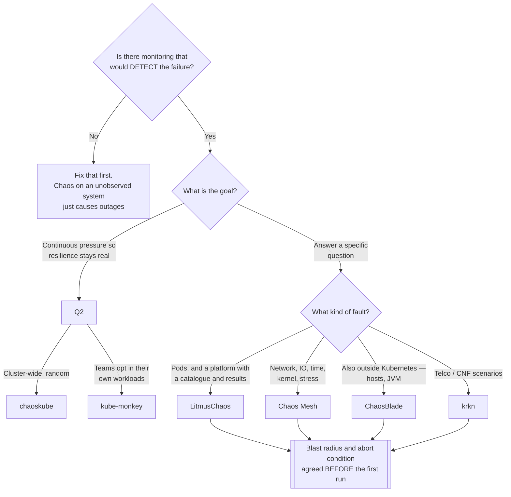

[← Site Reliability Engineering](../README.md)

# Chaos engineering

Finding out whether the resilience you believe in is real.

Tools covered: [`litmus`](litmus/README.md) · [`chaos-mesh`](chaos-mesh/README.md) ·
[`chaosblade`](chaosblade/README.md) · [`krkn`](krkn/README.md) · [`chaoskube`](chaoskube/README.md) ·
[`kubemonkey`](kubemonkey/README.md)

## Contents

1. [The problem it addresses](#1-the-problem-it-addresses)
2. [It is an experiment, not vandalism](#2-it-is-an-experiment-not-vandalism)
3. [What to break, in order](#3-what-to-break-in-order)
4. [The tools](#4-the-tools)
5. [Decision tree](#5-decision-tree)
6. [Anti-patterns](#6-anti-patterns)
7. [How this applies to pikakube](#7-how-this-applies-to-pikakube)

---

## 1. The problem it addresses

Every platform has resilience nobody has tested. Replicas that were never lost, a PodDisruptionBudget
nobody exercised, a failover path written in a runbook and never executed, backups that have
never been restored.

The belief is untested, and the test happens eventually — at 3am, unplanned, with an audience.

Chaos engineering moves that test to a Tuesday afternoon, with the people who understand the
system watching, and with the ability to stop.

The most common finding is not that the system is fragile. It is that the **failure was not
detected** — no alert fired, and the only reason anyone knew is that they caused it.

## 2. It is an experiment, not vandalism

The distinction that separates this from breaking things:

| Step | Meaning |
|---|---|
| **Steady state** | define what healthy looks like, numerically, *before* touching anything |
| **Hypothesis** | "killing one replica will not affect the error rate" — a statement that can be wrong |
| **Blast radius** | one namespace, one deployment, a bounded window |
| **Abort condition** | what makes you stop immediately |
| **Run and observe** | did the hypothesis hold? |
| **Learn** | fix what broke, or fix the fact that nothing noticed |

Without a hypothesis it is not an experiment, because no result can be surprising. Without an
abort condition it is not safe, because there is no agreed way to end it.

## 3. What to break, in order

Start where you are most confident, so early experiments build trust rather than fear:

| Order | Experiment | Usually reveals |
|---|---|---|
| 1 | Kill a pod | whether replicas and probes actually work |
| 2 | Kill a node | PDBs, anti-affinity, and how long rescheduling really takes |
| 3 | Add network latency | timeouts nobody set, and retries that amplify load |
| 4 | Partition the network | split-brain behaviour, and what happens to leader election |
| 5 | Fill a disk | the failure mode nobody has ever seen, and usually the ugliest |
| 6 | **Restore a backup** | the single most valuable experiment in this folder |

Row 6 is not usually filed under chaos engineering, and it should be. An untested backup is a
hypothesis, and this is the discipline for testing hypotheses — see
[`backup/`](../backup/README.md).

## 4. The tools

| Tool | Model | Shines when | Do not use when | Detail |
|---|---|---|---|---|
| **LitmusChaos** | CNCF platform — experiments as CRDs, a hub of prebuilt ones, workflows and a UI | you want a **platform**: scheduled experiments, results, and a catalogue to start from | you only want to kill pods occasionally | [→](litmus/README.md) |
| **Chaos Mesh** | CNCF, CRD-driven, very broad fault types | you need fault injection **beyond pods** — network, IO, time, kernel, stress | a simple pod killer is enough | [→](chaos-mesh/README.md) |
| **ChaosBlade** | Alibaba, CLI plus operator, many fault types | you also want to inject faults **outside** Kubernetes — hosts, JVM, databases | the scope is only Kubernetes | [→](chaosblade/README.md) |
| **krkn** | CNF/telco-oriented chaos, scenario-driven | validating cluster and telco workloads with scripted scenarios | you want CRDs and a UI | [→](krkn/README.md) |
| **chaoskube** | kills random pods on a schedule. That is all | you want continuous, low-effort pod termination to keep resilience honest | you need controlled experiments with hypotheses | [→](chaoskube/README.md) |
| **kube-monkey** | Netflix Chaos Monkey for Kubernetes, opt-in by annotation | teams should **opt in** their own workloads | you need fault types beyond pod termination | [→](kubemonkey/README.md) |

The split worth seeing: **chaoskube and kube-monkey are pod killers**, deliberately trivial.
**Litmus and Chaos Mesh are platforms** where an experiment is a designed thing with a result.
The first pair keeps resilience honest continuously; the second pair answers specific questions.

## 5. Decision tree

The first question is the one that decides whether to do this at all. Chaos engineering on a
system with no observability does not produce learning — it produces an outage you caused.

## 6. Anti-patterns

| Anti-pattern | Why it is bad | What to do instead |
|---|---|---|
| Running chaos before observability works | you break things and learn nothing | alerting first |
| No hypothesis | nothing can be falsified, so nothing is learned | state what you expect, then test it |
| No blast radius or abort condition | an experiment becomes an incident | bound it, and agree how to stop |
| Starting in production | political and technical damage on the first run | staging first, then production with a small radius |
| Chaos without a post-mortem | the finding evaporates | write down what broke and what changed |
| Never testing restores | the least-tested and highest-consequence path stays untested | make it experiment number six |
| Running it and fixing nothing | it becomes theatre with extra risk | the output is a fix, not a report |

## 7. How this applies to pikakube

Not deployed, and honestly a single Kind cluster is a poor place for it: there is no redundancy
to test, so killing a pod proves only that Kubernetes restarts pods.

What does transfer is the **method**, and one specific experiment. The most valuable thing this
folder points at for this repository is not a chaos tool at all — it is **restore-testing
[Velero](../backup/velero/README.md)**, including the Strimzi operator-pause procedure recorded there.

That is the experiment where the belief is strongest and the evidence weakest, which is exactly
where this discipline pays.

---

[← Site Reliability Engineering](../README.md)
