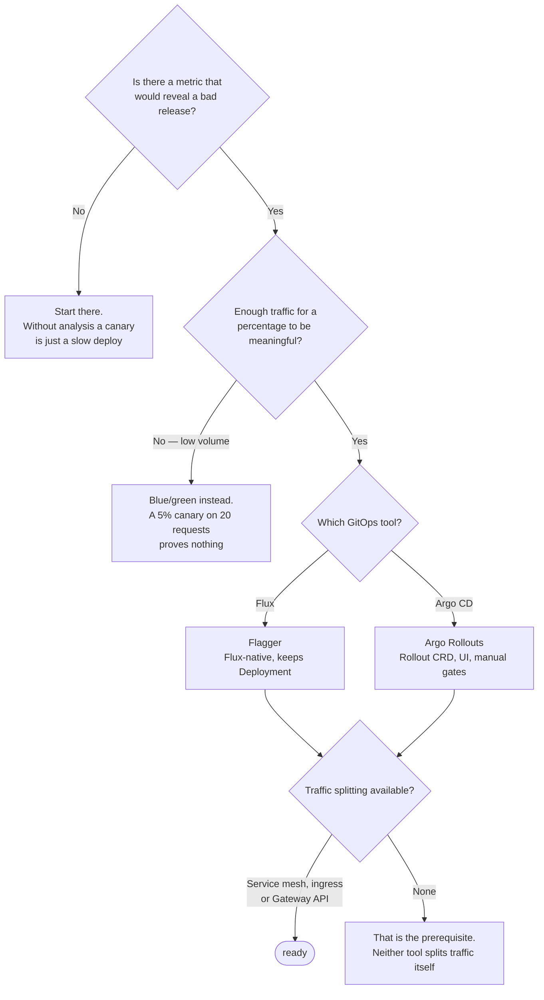

[← Site Reliability Engineering](../README.md)

# Progressive delivery

Releasing without betting everything on one deploy.

Tools covered: [`flagger`](flagger/README.md) · [`argo-rollouts`](argo-rollouts/README.md)

## Contents

1. [Why "deploy and watch" fails](#1-why-deploy-and-watch-fails)
2. [The strategies](#2-the-strategies)
3. [Automated analysis is the whole point](#3-automated-analysis-is-the-whole-point)
4. [The tools](#4-the-tools)
5. [Decision tree](#5-decision-tree)
6. [Anti-patterns](#6-anti-patterns)
7. [How this applies to pikakube](#7-how-this-applies-to-pikakube)

---

## 1. Why "deploy and watch" fails

A rolling update replaces pods gradually, which sounds like a canary and is not. Kubernetes
decides a pod is healthy when the readiness probe passes — it has no idea whether the new
version is returning correct answers, or whether latency doubled.

So the usual process is: deploy, watch a dashboard, and roll back manually if someone notices.
That depends on a human being present, paying attention, and correlating a graph with a release
they may not know happened.

Progressive delivery replaces the human with a **measurement**: shift a small fraction of
traffic, compare metrics against the baseline, and promote or roll back automatically.

The connection to [`service-level/`](../service-level/README.md) is direct — a canary is an
error budget being spent deliberately, in a bounded amount, instead of accidentally.

## 2. The strategies

| Strategy | How | Costs |
|---|---|---|
| **Canary** | a small percentage of traffic to the new version, increasing if metrics hold | needs traffic splitting, and enough traffic for the sample to mean anything |
| **Blue/green** | full parallel environment, switch all at once | double the resources; instant rollback |
| **A/B** | route by header, cookie or user attribute | requires L7 routing; used for product decisions as much as safety |
| **Mirroring** | copy real traffic to the new version, discard responses | the safest test possible — real load, no user impact — but write paths need care |

Mirroring is underused. For a data platform it is the only way to test a new query engine
version against real production queries without any consumer being affected.

## 3. Automated analysis is the whole point

Without automated analysis, a canary is just a slow deploy.

The controller queries a metrics source — Prometheus, Datadog, a custom webhook — during each
step, and compares against thresholds:

| Check | Typical |
|---|---|
| Success rate | above 99% |
| Latency p99 | below the baseline plus a margin |
| Custom | anything queryable — error budget burn, queue depth, business metric |

If the checks pass, traffic increases. If they fail, it rolls back — usually within minutes,
usually before anyone has noticed.

Rollback speed is what actually reduces risk here. The blast radius is bounded by both the
traffic percentage and the time to detection.

## 4. The tools

| Tool | Model | Shines when | Do not use when | Detail |
|---|---|---|---|---|
| **Flagger** | operator that drives an existing Deployment; Flux-native | you run **Flux** and want progressive delivery without changing workload types | you want a UI and manual promotion gates | [→](flagger/README.md) |
| **Argo Rollouts** | replaces `Deployment` with a `Rollout` CRD | you want fine-grained step control, manual gates and a UI; Argo CD is already there | you do not want to change the workload resource type | [→](argo-rollouts/README.md) |

The structural difference matters more than the feature lists:

- **Flagger** leaves your `Deployment` alone and manages the canary around it. Less invasive; the abstraction stays out of the way.
- **Argo Rollouts** asks you to adopt a `Rollout` resource in place of `Deployment`. More control, at the cost of changing every manifest that participates.

Both need a traffic provider — a [service mesh](../../network/service-mesh/README.md), an
[ingress controller](../../network/ingress-controller/README.md), or the
[Gateway API](../../network/gateway-api/README.md).

## 5. Decision tree

## 6. Anti-patterns

| Anti-pattern | Why it is bad | What to do instead |
|---|---|---|
| Canary with no automated analysis | a slow deploy with extra machinery | define metrics and thresholds |
| Canary on low-traffic services | the sample is too small to mean anything | blue/green |
| Analysis on readiness probes only | the probe passes while the version is wrong | success rate and latency |
| Steps too fast to measure | metrics have not stabilised before promotion | give each step a real window |
| No automatic rollback | detection without action is a dashboard | let it roll back on its own |
| Ignoring database migrations | traffic can shift back; a schema change cannot | backwards-compatible migrations, decoupled from the release |

The last row is the one that bites hardest, and neither tool solves it. Rolling back a
Deployment is instant; rolling back a schema is not, so the migration has to be compatible with
both versions.

## 7. How this applies to pikakube

Not deployed. **Flagger is the natural fit** — the repository is Flux-based, and Flagger comes
from the same project, so it works with the existing `Deployment` resources rather than
requiring a different workload type.

The prerequisite is the honest blocker: progressive delivery needs **traffic splitting**, which
means a service mesh or a capable ingress controller, and the cluster currently runs plain
[ingress-nginx](../../network/ingress-controller/ingress-nginx/README.md). That is the piece to solve
before either tool is useful.

Argo Rollouts is mapped with its CLI commands preserved — see its README.

---

[← Site Reliability Engineering](../README.md)
