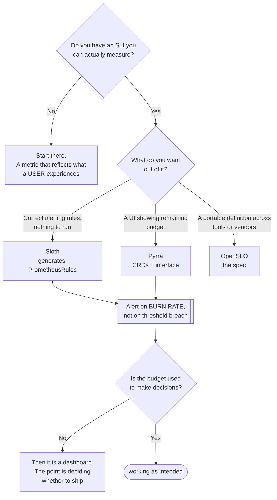

[← Site Reliability Engineering](../README.md)

# Service level

Turning "reliable" from an opinion into a number.

Tools covered: [`sloth`](sloth/README.md) · [`pyrra`](pyrra/README.md) · [`openslo`](openslo/README.md)

## Contents

1. [Why a number changes the conversation](#1-why-a-number-changes-the-conversation)
2. [SLI, SLO, error budget](#2-sli-slo-error-budget)
3. [Multi-window burn-rate alerting](#3-multi-window-burn-rate-alerting)
4. [The tools](#4-the-tools)
5. [Decision tree](#5-decision-tree)
6. [SLOs for a data platform](#6-slos-for-a-data-platform)
7. [Anti-patterns](#7-anti-patterns)
8. [How this applies to pikakube](#8-how-this-applies-to-pikakube)

---

## 1. Why a number changes the conversation

Without an SLO, every discussion about risk is unresolvable. "Is it safe to deploy on Friday?"
has no answer, so it gets settled by seniority or by nerves.

With one, it becomes arithmetic: **how much error budget is left this month?** If the answer is
90%, ship. If it is 2%, the same deploy is a bad idea, and nobody has to argue about it.

That is the actual product of this folder — not dashboards, but a shared basis for deciding
between reliability and speed.

## 2. SLI, SLO, error budget

| Term | What it is | Example |
|---|---|---|
| **SLI** | the measurement | proportion of requests served successfully in under 300ms |
| **SLO** | the target for it | 99.5% over 30 days |
| **Error budget** | what the target permits | 0.5% of 30 days ≈ 3h 39m of failure |
| SLA | a contractual promise, with consequences | usually looser than the internal SLO |

The error budget is the operational one. It converts reliability from a binary into a
**quantity that is spent** — by incidents, by deploys, by maintenance. Once it is framed that
way, a canary release is not caution, it is a controlled purchase.

**100% is the wrong target.** It forbids all change and is unachievable anyway. An SLO that
leaves no budget is a way of saying nothing may ever ship.

## 3. Multi-window burn-rate alerting

The reason SLO tooling exists rather than a threshold alert.

Alerting on "error rate above 1%" fires on a brief spike that consumed nothing, and stays quiet
during a slow degradation that eats the month's budget in three days.

Burn-rate alerting asks a better question: **how fast is the budget being consumed relative to
the window?** Burning at 14× means the 30-day budget is gone in about two days — that is worth
waking someone. Burning at 1.5× is worth a ticket.

Two windows, short and long, are used together so that a genuine problem pages quickly and a
transient blip does not.

This is fiddly to write in PromQL by hand, and generating it correctly is what
[Sloth](sloth/README.md) and [Pyrra](pyrra/README.md) actually do.

## 4. The tools

| Tool | Model | Shines when | Do not use when | Detail |
|---|---|---|---|---|
| **Sloth** | generates Prometheus rules from a simple SLO spec | you want correct burn-rate rules and dashboards, with nothing running in the cluster | you want a UI to explore budgets | [→](sloth/README.md) |
| **Pyrra** | CRDs plus a UI, generating the same kind of rules | you want to **see** remaining budget without building dashboards | you want generation only, with no component | [→](pyrra/README.md) |
| **OpenSLO** | a vendor-neutral **specification**, not a tool | SLOs should be defined once and consumed by different tooling | you need something that runs | [→](openslo/README.md) |

**OpenSLO is a different kind of thing** — a schema, like OpenTelemetry is for telemetry. Worth
knowing because it is what stops SLO definitions from being locked into whichever generator you
picked.

## 5. Decision tree

## 6. SLOs for a data platform

The standard examples are request-based and translate badly to pipelines. What actually
matters here:

| SLI | Measures |
|---|---|
| **Freshness** | is the data no older than *N* minutes? The most user-visible property by far |
| **Completeness** | did the expected volume arrive? |
| **Pipeline success rate** | proportion of runs completing without failure |
| **Query availability** | can Trino, or the warehouse, answer at all |
| Correctness | proportion of records passing validation |

Freshness is the one consumers notice. A dashboard that is silently six hours stale is a worse
outcome than one that is visibly down, and no infrastructure metric reports it.

The cheapest way to measure these is already documented:
[sql-exporter](../../observability/metrics/exporters/sql-exporter/README.md) turns a freshness query
into a Prometheus metric, and everything here works on top of it.

## 7. Anti-patterns

| Anti-pattern | Why it is bad | What to do instead |
|---|---|---|
| An SLO of 100% | forbids change, and is unachievable | pick a target that leaves a usable budget |
| SLOs on infrastructure metrics | CPU and pod restarts are not what a user experiences | measure the user-visible outcome |
| Threshold alerts instead of burn rate | pages on blips, silent during slow degradation | multi-window burn rate |
| An error budget nobody consults | it becomes a dashboard, not a decision input | tie release decisions to it |
| One SLO for the whole platform | it hides which part is failing | per service, per user-facing capability |
| Defining SLOs nobody owns | when the budget is exhausted, nothing happens | an owner, and an agreed response |
| Request-based SLOs on batch pipelines | the model does not fit a DAG run | freshness and completeness instead |

## 8. How this applies to pikakube

Not deployed — a laptop cluster has no reliability to defend and no consumers to disappoint.

The mapping is deliberate though, and the honest note is that **Pyrra is the one to start
with**: "simple and good", per the note in its README, and the UI is what makes an error budget
something people actually look at rather than a rule file nobody opens.

On a real data platform, the first SLO worth writing is **freshness**, not availability.

---

[← Site Reliability Engineering](../README.md)
