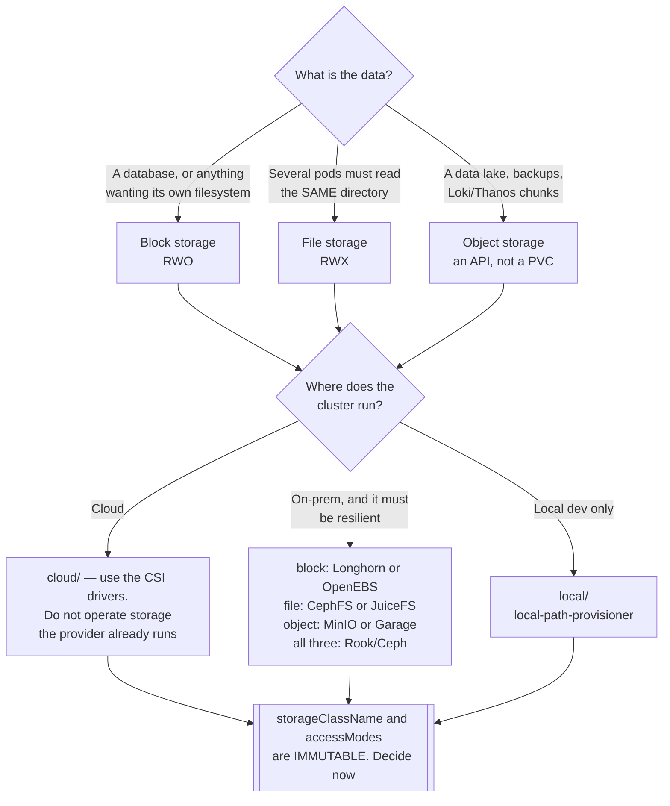

[← Site Reliability Engineering](../README.md)

# Storage

Where persistent data lives, and what happens when the node holding it goes away.

Subfolders: [`block-storage/`](block-storage/README.md) ·
[`file-storage/`](file-storage/README.md) · [`object-storage/`](object-storage/README.md) ·
[`multi-storage/`](multi-storage/README.md) · [`local/`](local/README.md) ·
[`cloud/`](cloud/README.md) · [`on-premisse/`](on-premisse/README.md)

## Contents

1. [The three kinds, and why it matters](#1-the-three-kinds-and-why-it-matters)
2. [Access modes decide the architecture](#2-access-modes-decide-the-architecture)
3. [The immutable fields that trap you](#3-the-immutable-fields-that-trap-you)
4. [Decision tree](#4-decision-tree)
5. [Anti-patterns](#5-anti-patterns)
6. [How this applies to pikakube](#6-how-this-applies-to-pikakube)

---

## 1. The three kinds, and why it matters

| Kind | What it is | Kubernetes sees | Typical use |
|---|---|---|---|
| **Block** | a raw disk, attached to one node | `ReadWriteOnce` PVC | databases — anything that wants a filesystem it controls |
| **File** | a shared filesystem, mounted by many | `ReadWriteMany` PVC | Airflow DAGs, shared config, anything several pods read |
| **Object** | an HTTP API, not a filesystem | **not a PVC at all** | data lakes, backups, Loki and Thanos chunks |

The third row is the one that trips people up: object storage is not mounted. It is an API that
applications call. FUSE drivers that make it look like a filesystem exist, and they lie —
performance and consistency do not match a real filesystem, and using one to run a database is
a reliable way to lose data.

For a data platform the practical split is: **block for databases, object for the lake, file
only when several pods genuinely need the same directory**.

## 2. Access modes decide the architecture

| Mode | Meaning | Reality |
|---|---|---|
| `ReadWriteOnce` (RWO) | one **node** may mount it read-write | what almost all block storage gives you |
| `ReadWriteMany` (RWX) | many nodes, read-write | requires file storage — NFS, CephFS, JuiceFS |
| `ReadOnlyMany` | many nodes, read-only | less common |

The consequence people meet late: an RWO volume **pins the pod to a node**. If that node dies,
the pod cannot start elsewhere until the volume detaches — which can take minutes, and
sometimes needs intervention.

That is why "the pod is stuck in `ContainerCreating` after a node failure" is a storage problem
rather than a scheduling one.

## 3. The immutable fields that trap you

Three PVC properties cannot be changed after creation:

| Field | Consequence |
|---|---|
| `storageClassName` | choosing wrong means creating a new PVC and copying — [pv-migrate](../backup/pv-migrate/README.md) |
| `accessModes` | RWO to RWX is a new volume |
| Shrinking `resources.requests.storage` | expansion is supported, reduction is not |

Getting these right at creation is much cheaper than fixing them later, and "later" is usually
during an incident.

## 4. Decision tree

## 5. Anti-patterns

| Anti-pattern | Why it is bad | What to do instead |
|---|---|---|
| A database on object storage via FUSE | consistency and performance do not match a filesystem; corruption follows | block storage |
| `local-path-provisioner` outside development | data lives on one node's disk and dies with it | a real CSI driver |
| Assuming RWX because the manifest asks for it | most block storage silently cannot provide it, and the pod never binds | check what the storage class actually supports |
| Operating Ceph on a small cluster | a distributed storage system is a large commitment | cloud CSI, or Longhorn for something simpler |
| No `VolumeSnapshotClass` | snapshot-based backup silently does nothing — see [external-snapshotter](../backup/external-snapshotter/README.md) | install it before the backup tool |
| Ignoring `reclaimPolicy` | `Delete` removes the underlying volume when the PVC goes | `Retain` for anything that matters |
| One storage class for everything | databases and log archives have opposite requirements | classes per workload profile |

## 6. How this applies to pikakube

Kind provides `local-path-provisioner` by default, which is correct for a laptop and wrong
everywhere else: data lives on one node's disk and disappears with the cluster.

What the folder maps is the decision for a real cluster, and the split is deliberate —
[`cloud/`](cloud/README.md) for managed CSI drivers, [`on-premisse/`](on-premisse/README.md)
for the self-managed case, which is where this repository's on-premise focus actually lands.

Two honest notes recorded in the tool docs: **MinIO's open-source situation has deteriorated**
and the alternatives evaluated so far are weak, and several object-storage projects here have
documentation that is effectively unusable. Both are in their READMEs rather than glossed over.

---

[← Site Reliability Engineering](../README.md)
